##一些做题函数

1. **to_string()**，可以将数字转换为字符串

2. ```c++
   //对于一些没有限定个数的字符或数字的输入
   #include<sstream>
   string s;
   getline(cin,s);//首先读入字符串
   stringstream ssin(s);//可以自动分割字符串的字符串流(也是一个容器)，将字符串送入stringstream流对象
   int cnt = 0,p;
   while (ssin >> p) stop[cnt ++] = p;//移出字符串流后会自动类型转换
   ```

3. 对于可能爆long long的情况，需要改用更大的范围，如下所示

   ```c++
   using LL=__int128_;
   ```

4. 遍历map的方式

   ```c++
   for(auto it:mp){
       //通过first和second可以获得键值
       auto it.first;
       auto it.second;
   }
   ```


5. 设置小数显示精度

   ```c++
   #include<iomanip>
   cout<<setiosflags(ios::fixed)<<setprecision(2)<<res/n;
   ```


6. 加快cin速度

   ```c++
   ios::sync_with_stdio(0);
   cin.tie(0);
   ```

   

异或运算

a^= b相当于a=a^b，将十进制数字转化为二进制进行运算，相同为0，相异为1，0和任何数异或运算都是原来的那个数。

可以用来判断数组中哪个数字只出现过一次 （通过将所有数与0进行异或运算）


## 快慢指针

1.  单链表中可任意用来寻找“**中点**”，快指针（fast）每一步走两个结点，慢指针（slow）每一步走一个结点。当快指针到达链表末尾时，慢指针应该指向链表最中间的结点.如果是**单数**恰好为中间，如果是**双数**则是中间的**第二个节点**
2. 在查找链表倒数第k个节点时，可以通过先让fast先走k步，再与slow同时运动，让两个指针==保持一个距离==，当fast到达结尾时，那么slow的位置就是倒数第k的位置。
3.  对于**环形链表**，把快慢指针想象成一个追及问题，当两个指针重合时，就代表链表中有**环**


## 前缀和


**二维前缀和：**

对于矩阵区间求和问题，不一定需要最原始的利用矩阵的**顶点坐标**求解。也可以利用**多个一维前缀和相加求解**，s[i,j]表示为前i行第j列的前缀和。因为在题目中，枚举顶点坐标可能需要O(N^4)的时间复杂度，而先通过枚举上下边界，在计算区间内的矩阵和，可能可以将时间复杂度降到O(N ^ 3)。一般是求解区间和满足某个条件的题，然后利用**滑动窗口**求解。

## 差分

**一维差分：**

首先给定一个原数组`a`：`a[1], a[2], a[3],,,,,, a[n];`

然后我们构造一个数组`b` ： `b[1], b[2], b[3],,,,,, b[i];`

使得 `a[i] = b[1] + b[2] + b[3] + ,,,,,, + b[i]`


当想要求解原数组[ l , r ]区间同时加上c，可以通过求解差分数组b，使**b[l]+c，b[r+1]-c**

当除了b[1]以外的所有差分数组都为0时，表示原数组的值全都相等，等于b[1]

**二维差分：**

```c++
//将给定区间的数组都+c的这个操作封装成一个函数,b[]为差分数组，a[]为原数组，也是b[]的前缀和数组
void insert(int x1,int y1,int x2,int y2,int c){
    b[x1][y1]+=c;
    b[x2+1][y1]-=c;
    b[x1][y2+1]-=c;
    b[x2+1][y2+1]+=c;
}
b[i][j] = a[i][j] − a[i − 1][j] − a[i][j − 1] + a[i −1 ][j − 1]//差分数组求解，可以自己推导，很简单的
```


**树上差分**

树上差分和一维差分类似，就是求解树的一条路径上，**点差分**或**边差分**。通常会结合LCA+树的遍历来考察。


**点差分:** 对路径上的点（相当于一维差分的区间）加上或减去一个数。如下图所示，将（S,T）路径上的点都加上或减去一个数。

相当于求解**蓝色区间+红色区间**同时加上或减去一个数

```c++
//与一维类似，只保证区间内的数变化，所以在区间左端加上一个数后，在右端还要减去一个数
d[S]++,d[LCA]--;
//这里是求解红色区间，LCA是包括在红色区间中的，f[LCA][0]是为了获得LCA的父节点，具体LCA笔记。
d[T]++,d[f[LCA][0]]--;
```


**边差分：**边差分是对边进行访问，采用差分策略

为了便于计算，我们可以将边的权重**下移**到点中，这样就是**点差分**的内容了

```c++
//因为把边差分的权重，下移到点后，LCA就没有在要求的区间中了
d[S1]++,d[LCA]--;
d[T1]++,d[LCA]--;
```


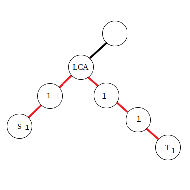

## 二分

对于一些题目，如果正向求解答案有些困难的话，可以试着考虑是否可以二分枚举答案，然后判断是否满足题目所给的条件。

```c++
/*
对于两个模板，首先寻找边界，最后如果check(mid)中边界的变化是r=mid，那么在计算mid的时候不用加1，如果check(mid)边界的变化是l=mid,那么在计算mid的时候需要加1

对于二分的理解：如果某道题可以二分，就能够找到一个条件（一般根据题目要求解的数定义），将答案区间分解成两部分，一部分是满足条件的，另一部分是不满足条件的。例如，对于一个升序的序列，我们要寻找x，所以我们可以将满足条件定义为，<=x的数（因为升序）那么右半部分就是>x，不满足条件，所以根据自定义的条件，x应该位于满足条件的序列中的右边界，利用模板二。
*/
//模板一，用于查找左边界，大于等于目标值的第一个数（满足某个条件的第一个数）
int l=0,r=n-1;
while(l<r){
	int mid=l+r>>1;
	if(check(mid))r=mid;
	else l=mid+1;
} 
//模板二，用于查找右边界，小于等于目标值的最后一个数（满足某个条件的最后一个数）
int l=0,r=n-1;
while(l<r){
	int mid=l+r+1>>1;
	if(check(mid))l=mid;
	else r=mid-1;
} 

```

## 双指针

当遇到双指针**环的问题**的时候，可以**破环成链**，开两倍的数组存储两份相同的数据。

## 数论

###取模运算

1. (a + b) % p = (a % p + b % p) % p 
2. (a - b) % p = (a % p - b % p ) % p 
3. (a \* b) % p = (a % p \* b % p) % p 
4. 除法不可以直接同除，需要用到乘法逆元（还没学hh）

当运算多个数相乘再取模时，可以利用公式3进行运算，先对每个数取模后再计算乘积，这样乘积结果就不会溢出

###约数之和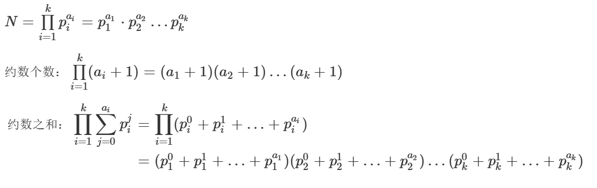


其中pi都是质数，N可以拆成多个**质数幂**相乘，然后把约数之和的每一项拆开，就可以发现是每一种约数（就是从每个括号中选一个，并相乘，就可以得到一种情况的约数），所以约数的个数就是每个括号中**可以选择的数量**的乘积


###排序不等式


总的来说就是，升序和降序的序列，对应位相乘后求和能得到最小值，同为升序或者同为降序能得到和的最大值


### 裴蜀定理   

讲人话：多个数的组合必定是他们gcd最大公约数的倍数

关于最大公约数的定理。

设a1,a2,a3......an为n个整数，d是它们的最大公约数，那么存在整数x1......xn使得x1*a1+x2*a2+...+xn*an=d。

如果其中有任意两个数**互质**，那么存在那么存在整数x1......xn使得x1*a1+x2*a2+...xn*an=1。

###扩展欧几里得算法

**欧几里得算法推导：**


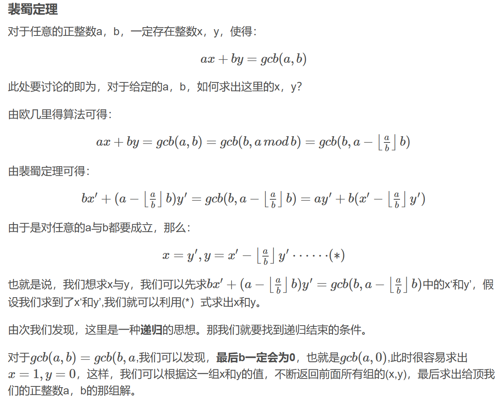


**欧几里得算法代码实现：**

```c++
/*
扩展欧几里得算法就是为了求解：ax+by=m，x,y为未知数，a,b,m为已知数，(a,b)为gcd(a,b)最大公约数
该方程有解等价于：(a,b)|m，也就是说m是a,b最大公约数的倍数。
通过递归的方式求解x,y。递归的边界条件是b=0，表示找到最小公约数为a，那么此时的一组解为x=1,y=0。
然后通过上面的证明，可以逆着推回去，最后求出原始方程ax+by=(a,b)的解
*/
LL exgcd(LL a,LL b,LL& x,LL& y){
	if(!b){
		x=1,y=0;
		return a;
	}
	LL d=exgcd(b,a%b,x,y);
    //这里根据ax+bx=bx+(a%b)y=gcd(a,b)推一下就行
    //可以发现x是上一层求出来的y，而y=x-(a/b)*y
	LL t=y;
	y=x-(a/b)*y;
	x=t;
	return d;
}
/*
求解出特解x0,y0。那么通解x=x0+tb/d，y=y0-ta/d。这里的t是未知数，d是gcd(a,b)。
证明通解成立：
可以把通解代入到ax+by=(a,b)中，最后整理之后，剩下ax0+by0=(a,b)成立。
但是一般题目要求都是求解通解的最小值，另ans=x0,s=b/d，那么最小整数解为(ans%s+s)%s
*/
```

**欧几里得算法应用**

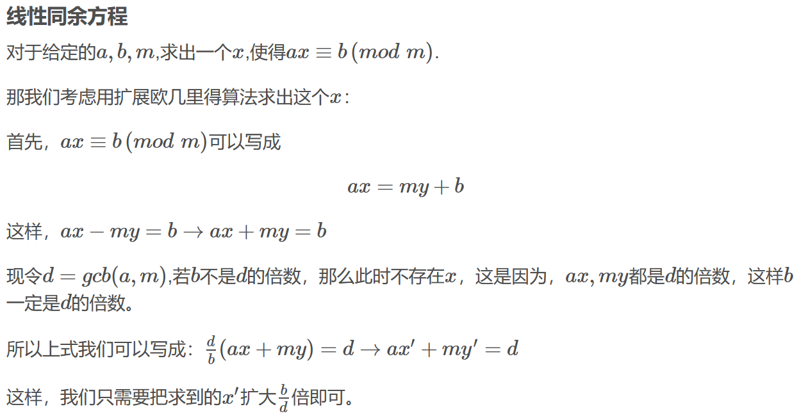


###中国剩余定理

？

### 一些小推论

**引理：**[L/P]**上取整**=[(L+P-1)/P]**下取整**（下取整相当于是c++中的整除/）

**两个质数凑不到的最大整数：**

对任意p,q，且gcd(p,q)=1，则两个数互质，则最大无法表示成 px+qy（x>=0 ,y>=0）的数为 (p-1)(q-1)-1=pq-q-p。

推广到任意多个数，当数字更多时，这个上界必然更小（因为可选的数字变多了）


## 递归

求解等比数列：这是一种常规的求解方式，或者利用公式法

```c++
/*
求解p^0-p^k-1的总和
需要分奇偶讨论
*/
int sum(int p,int k){
	if(k==1)return 1;
	if(k&1)return (sum(p,k-1)+qmi(p,k-1));//奇数
	if(!(k&1))return (1+qmi(p,k/2))*sum(p,k/2);//偶数
}
```


## 快速幂

**能够快速求出a^k mod p 的结果**，在计算mod时需要用到**第3条取模运算**的结论

正常的求幂的算法为O(N)，就是循环指数求解，但是循环次数过多，容易超时。快速幂的思想就是通过降幂的方式，减少指数，增大底数，从而起到减少循环次数的作用（本来的循环次数是n，通过多次指数除以2，底数平方，可以将循环次数降到很低很低），时间复杂度为O(logn)

```c++
/*	
	(a * b) % p = (a % p * b % p) % p  乘积的取模运算
	不断地将k除2降幂，将a底数平方
*/
ll qmi(ll a,ll k,ll p){
	ll res=1;
	while(k){
		//如果是奇数，就更新结果，将指数为1乘到结果上去 
		if(k & 1){
			res=res*a%p;
		}
		b>>=1;//指数除2
		a=(a*a)%p;//底数平方
	}
return res;
}

```


**快速幂求逆元**

在取模的条件下，除以一个数等价于乘以这个数的乘法逆元

**逆元要做的就是把除法的模转换的乘法的模。逆元的充要条件是b和n互质（最大公约数为1）**

当**n为质数**时，可以用快速幂求逆元：
a / b ≡ a * x (mod n)  
两边同乘b可得 a ≡ a * b * x (mod n)
即 1 ≡ b * x (mod n)
**同 b * x ≡ 1 (mod n)**（**称x为b的模n的乘法逆元**）
由**费马小定理**可知，当n为质数时
b ^ (n - 1) ≡ 1 (mod n)
拆一个b出来可得 b * b ^ (n - 2) ≡ 1 (mod n)
故当n为质数时，b的乘法逆元 x = b ^ (n - 2)  （**利用快速幂求解1~n-1之间的逆元**）


## 分解质因数

试除法：时间复杂度为O(logn)~O(根号n)之间

试除法：每个合数都能分解为多个质因数相乘的形式（见数论的公式），合数N最多只有一个大于sqrt(N)质因子，证明：如果有两个大于sqrt(N)，那么相乘就会大于N，证毕。

```c++
for(int j=2;j*j<=a;j++){
/*
a%j==0的判断中j一定是质数，如果j是个合数，那么它能分解成多个质因子相乘的形式，这么多质因子也是a的质因子且都比j小（这些质因子是合数j分解的，所以肯定比j小）。
*/
			if(a%j==0){
				int s=0;
                //计算指数
				while(a%j==0){
					a=a/j;
					s++;
				} 
				cout<<j<<" "<<s<<endl;
			}
		} 
		//a>1表示这是一个大于sqrt(N)的一个质数
		if(a>1){
			cout<<a<<" "<<1<<endl;
		}
```

## 筛素数

**质数定理：**1-n的数之间，质数的个数为n/logn，两种筛的方式不能只筛一个区间必须从2开始


**埃氏筛：**时间复杂度O(nlogn*logn)，思想就是在筛选的时候，只把**质数的倍数**删掉，因为每个合数都能够由**多个质数**或者**两个质数**或者**一个质数一个合数**相乘，不像传统筛法，把每个数的倍数筛掉，这样会造成筛的重复，时间复杂度高

```c++
const int N=1e6+10;
int prime[N];//存质数
int st[N];//判断是否为质数
int cnt;//存质数的个数
for(int i=2;i<=n;i++){
        //没被筛掉
        if(!st[i]){
            prime[cnt++]=i;
           for(int j=i+i;j<=n;j+=i){
               st[j]=true;
           }
        }
        
    }
```

**线性筛：**每个合数只被最小质因子筛一次，感觉还不是很理解，先记一下结论

if(i%primes[j]==0) break; 

//当发现primes[j]是i最小质因子的时候,如果再继续进行的话，
//我们就把 prime[j+1]*i 这个数筛掉了,虽然这个数也是合数，
//但是我们筛掉它的时候并不是用它的最小质因数筛掉的，而是利用 prime[j+1] 和 i 把它删掉的
//这个数的最小质因数其实是prime[j],如果我们不在这里退出循环的话，我们会发现有些数是被重复删除了的。

```c++
 for(int i=2;i<=n;i++){
        //没被筛掉
        if(!st[i])prime[cnt++]=i;
        //线性筛，遍历每个质数
        for(int j=0;primes[j]*i<=n;j++){
            st[i*prime[j]]=true;
            if(i%prime[j]==0)break;//每个数只被最小质因数筛一次
        }
    }
    
```

## 最小公约数

**辗转相除法**

```c++
int gcd(int a,int b){
	if(!b) return a;
    return gcd(b,a%b);
}
```

## 排列组合

根据加法计数原理：


加法计数原理解释：c[a] [b]看作从a个苹果中拿b个苹果的情况，根据容斥原理，可以分为两种情况：1.a个苹果中必拿其中一个苹果的情况。2.a个苹果中不拿其中一个苹果的情况。这样两种情况相加就是从a拿b个苹果的情况。分别对应以上的递推式。

这递推式有点dp的味道了，后者的值的可以根据前者的值算出来。通过这种方式可以降低计算排列组合的时间复杂度。

**递推法求排列组合**

时间复杂度为O(N^2^)

```c++
void init(){
	for(int i=0;i<N;i++){
		for(int j=0;j<=i;j++){
			if(!j)c[i][j]=1;//取零个=1
			else c[i][j]=(c[i-1][j-1]+c[i-1][j])%P;
		}
	}
}
```


**公式法+快速幂求排列组合**

由于递推法需要开二维数组，当要求的组合数太大时，空间会溢出，所以还有一种公式法


```c++
const int P=1e9+7;
int n;
LL fact[N],infact[N];//存阶乘以及阶乘的逆元
//快速幂
LL qmi(LL a,LL b){
	LL res=1;
	while(b){
		if(b & 1)res=res*a % P;
		b=b>>1;
		a=a*a% P;
	}
	return res;
}
//预处理 
void init(){
	fact[0]=1,infact[0]=1;//边界初始值
	for(int i=1;i<N;i++){
		fact[i]=fact[i-1]*i % P;
		infact[i]=infact[i-1]*qmi(i,P-2) % P;
	} 
} 
```

## 字符串

###字符串哈希

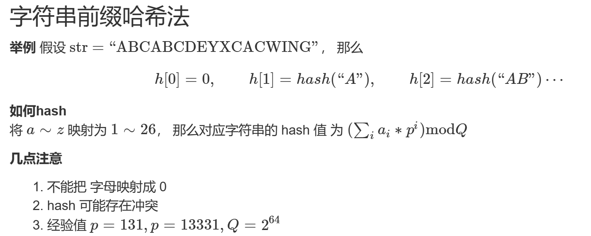

通过求解字符串前缀的哈希值的方式，可以比较字符串内任意字串的相等情况。首先需要把每个字符映射成数字，是什么无所谓（因为字符不好计算哈希值呀），然后类似于计算前缀和的方式，这里是计算h[i]表示前i个字符的哈希值。然后把要计算的每个前缀字符串看作是一个P进制的数（用于求解哈希值的），然后最终结果要映射的0~Q^n-1^的范围内，也就是要mod Q。对于P的经验值为131或者13331，Q一般是2^64^（此算法我们默认哈希不会产生冲突，不像前面的数值哈希会产生冲突）

通过求出的字符串前缀哈希值，可以用于判断字符串中子串的情况，99.99%的情况不会产生冲突（意思是说子串的哈希值不会冲突）。

求解l~r范围内的子串的哈希值，由于每一位都是有权重的，不可以直接通过前缀哈希值相减获得，需要考虑到权值。具体可以自己推，挺简单的（具体见代码）。

```c++
//计算字符串前缀哈希值
//应为求出的哈希值最终结果要映射的0~Q^n-1^的范围内，也就是要mod Q，这里用了一个巧妙的方法，就是用
//unsigned long long（64位）来存储哈希值，溢出后相当于mod 2^64
typedef unsigned long long ULL;
ULL h[N],p[N];//h[N]存字符串前缀哈希值,p[N]用于存P的某次方
const int P=131;//把字符传看作P进制的数
//和前缀和计算类似，这里字符串的下标也从1开始
p[0]=1;
for(int i=1;i<=n;i++){
    h[i]=h[i-1]*P+str[i];
    p[i]=p[i-1]*P;
}
//获得某字符串的哈希值
ULL get(int l,int r){
    return h[r]-h[l-1]*p[r-l+1];
}
```

### KMP

串的模式匹配

1. BF算法(暴力算法)

2. [KMP算法](https://blog.csdn.net/qq_37969433/article/details/82947411)

   ​	求next的算法(关键代码):

```c++
	//求next的过程 默认字符串的下标是从1开始的
	for(int i=2,j=0;i<=n;i++){
		while(j&&p[i]!=p[j+1])j=ne[j];
		if(p[i]==p[j+1])j++;
		ne[i]=j;
	}
	//kmp匹配
	for(int i=1,j=0;i<=m;i++){
		while(j && s[i]!=p[j+1])j=ne[j];
		if(s[i]==p[j+1])j++;
		if(j==n){
			printf("%d",i-n+1);
			j=ne[j];
		}
	} 
```


### Manacher算法（马拉车）

manacher算法用于求解字符串中的**最长回文子串**。时间复杂度为O(N)。

```c++
/*
为了避免在讨论回文子串的时候分奇偶，所以在原字符串中间隔插入'#'，这样可以使得新字符串的长度都为奇数。
s[N]为构造的新字符串。
d[N]数组维护以某个位置为中心的最长回文半径(包括中心)
[l,r]用来维护一个加速盒子(基于回文子串的对称性)，利用先前求过的d值来更新要求的d[i]。
最长回文子串长度=最长回文半径-1
*/
int k=0;
//构造新字符串 
//s[0]='$'作为哨兵，为边界
s[k++]='$',s[k++]='#';
for(int i=0;i<a.size();i++){
	s[k++]=a[i],s[k++]='#';
}
//manacher算法
d[1]=1;
int ans=0;
for(int i=2,l=1,r=1;i<=k-1;i++){
   //加速盒子的左端点就是某个点最长可以覆盖的回文半径
   //如果要求的中点i在加速盒子范围内，基于回文子串的对称性，就可以求解出d[i]=min(d[r-i+l],r-i+1);
    if(i<=r)d[i]=min(d[l+r-i],r-i+1);
    //计算超出加速盒子的部分就需要暴力向两端移动判断一下
    while(s[i-d[i]]==s[i+d[i]])d[i]++;
    //更新加速盒子边界
    if(i+d[i]-1>r)r=i+d[i]-1,l=i-d[i]+1; 
    ans=max(ans,d[i]-1) ;
}
```


**字符串哈希+二分求解最长回文子串**

时间复杂度O(NlogN)

最外层循环依然是**枚举**所有回文子串的中心点（时间复杂度为**O(n)**），内层循环通过二分的方式寻找最大的回文子串半径(包括本身)。注意：这里能用二分是因为答案满足二分的条件，能把集合分为连个部分，一边是满足条件的(是回文子串)，另外一遍是不满足条件的(不是回文子串)，**二分**的时间复杂度为**O(logn)**。判断是否为回文子串可以通过**字符串哈希**的方式，时间复杂度为**O(1)**

```c++
char s[N*2];
int cnt;
int d[N*2];
ULL hl[N*2],hr[N*2];
ULL p[N*2];
//获得字符串的哈希值
ULL get_hash(ULL* h,int l,int r){
	return h[r]-h[l-1]*p[r-l+1];
}
//二分判断条件
bool check(int i,int mid){
	if(get_hash(hl,i-mid+1,i+mid-1)==get_hash(hr,cnt-1-(i+mid-1)+1,cnt-1-(i-mid+1)+1))return true;
	return false;
}
s[cnt++]='$',s[cnt++]='#';
for(int i=0;i<t.size();i++){
    s[cnt++]=t[i],s[cnt++]='#';
}
//正着求字符串hash 
hl[0]=1,p[0]=1;
for(int i=1;i<=cnt-1;i++){
    hl[i]=hl[i-1]*P+s[i];
    p[i]=p[i-1]*P;
}
//逆着求字符串hash
hr[0]=1;
for(int i=1;i<=cnt-1;i++){
    hr[i]=hr[i-1]*P+s[cnt-i];
} 
//枚举中心点 
int res=0;
for(int i=1;i<=cnt-1;i++){
    //二分回文串半径
    int l=1,r=min(i,cnt-i);
    while(l<r){
        int mid=l+r+1>>1;
        if(check(i,mid))l=mid;
        else r=mid-1;
    } 
    d[i]=l;
    res=max(res,d[i]-1);
}
```


## 数据结构

###**并查集**

一种树形的数据结构，近乎O(1)的时间复杂度。

又一次理解了并查集用来维护额外信息的作用，可以用来记录集合中的元素个数，也可以维护节点到根节点之间的距离，可能还有别的，然后在进行路径压缩的时候修改需要维护

的额外信息。

主要构成 pre[]数组、find()、join()

1.可以将两个集合合并

2.询问两个元素是否在一个集合当中

```c++
//pre数组初始化
void Init(int n){
    //每个结点的祖先都是自己
    for(int i=0;i<n;i++){
        pre[i]=i;
    }
}
```


```c++
//pre[x]中存放的是x结点的父节点
//find()函数找到某个结点的根，结点的祖先
int find(int x)					//查找某个结点的父节点
{								
	while(pre[x] != x)			
		x = pre[x];				
	return x;					
}
```

**find()函数优化**：**路径压缩**。就是将所有结点的父节点都改为根结点，这样子查找某个结点的父节点只需要向上查找一次

```c++
int find(int x)     				//查找结点 x的根结点 
{
    if(pre[x]!=x)pre[x]=find(pre[x]);//如果没有找到根节点，就把每一个根节点都赋值给集合中的节点
    return pre[x];//最后返回的时候，每个节点的根节点都会改成同一个值（根节点）。
}
```

```c++
//将两个集合合并
void join(int x,int y)
{
    //找到各自的父节点
   	int fx=find(x);
    int fy=find(y);
    //将fy和fx其中任意一个作为根
    if(fy!=fx) 
        pre[fy]=fx;
}
```

###Trie（字典树）

[Trie]([深度解析Trie（字典树）-CSDN博客](https://blog.csdn.net/raelum/article/details/128885107))，又称字典树或前缀树，常用来存储和查询字符串。假定接下来提到的字符串均由小写字母构成，那么Trie将是一棵 26 叉树。   

Trie存二进制数据或存字符串（以下代码为存二进制数）

```c++
ll a[N];//原始数据
ll son[M][2];//存Trie树
int idx;//Trie树结点下标
//插入Trie树 
//插入的步骤一般不会有变化，就是可能会增加cnt数组来维护字典树的额外信息，比如说经过某个结点的数的个数或者某个数出现的次数。
void insert(int x){
	int p=0;//树指针 
	for(int i=30;i>=0;i--){
		int t=(x >> i) & 1;//获得最高位
		if(!son[p][t]) son[p][t]=++idx;//son[p][t]=0表示根结点没有值为“t”的子结点
		p=son[p][t];
	}
}
//查询某个数
//查询就是遍历已经存在的字典树，完成相应的处理，比如说找到最大异或对，或者判断字符串是否已经出现过
ll query(int x){
	int p=0;
	ll res=0;
	for(int i=30;i>=0;i--){
		int t=(x>>i)&1;
		if(son[p][1-t]){
			res+=(1<<i);
			p=son[p][1-t];
		}else{
			p=son[p][t];
		}
	}
	return res;
}
```


### 树状数组

树状数组本质上就是利用**树结构**来维护“前缀和”，从而把区间查询的时间复杂度降为O(logn)。

**修改**时间复杂度O(logn)，**计算前缀和**之间复杂度O(logn)。

**注意：**

* 单点修改，区间查询。t数组相当于是一个前缀和数组，求和就表示区间的和
* 区间修改，单点查询，t数组相当于是一个差分数组，差分数组求和就表示求解序列中某个元素的值。

对一个序列建立如下所示的树形结构：

1. 每个结点t[x]保存以x为根的子树中叶结点值的和（也就是前缀和1~i中的一部分的和），在计算前缀和时需要多个t数组相加

   如计算sum[7]=t[7]+t[6]+t[4];

2. 每个结点覆盖的长度为lowbit(x)（lowbit(x)：非负整数x在二进制表示下**最低位1以及后面的0**构成的数值）

3. **t[x]结点的父结点为t[x + lowbit(x)]**

4. 树的深度为log2n+1

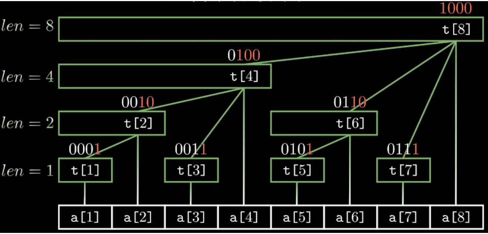

```c++

int lowbit(int x){
    //一个数取反+1=一个数取负
	return x&-x;
}
//单点修改，t数组为前缀和数组
void add(int x,int k){
    //每次修改序列中的一个元素的值时，该元素所在的到根节点的路径上的t[]都需要改变
	for(int i=x;i<=n;i+=lowbit(i)){
		t[i]+=k;
	}
}
//区间修改，t数组为差分数组，需要修改两个子树的值
void add(int l,int r,LL k){
	for(int i=l;i<=n;i+=lowbit(i)){
		t[i]+=k;
	}
	for(int i=r+1;i<=n;i+=lowbit(i)){
		t[i]-=k;
	}
}

//计算前缀和 
int sum(int x){
	int res=0;
	for(int i=x;i>0;i-=lowbit(i)){
		res+=t[i];
	}
	return res;
}
```

### 线段树


**注意：**1 .对于区间修改问题利用线段树来做的时候，首先要确定线段树维护的是怎样的一个区间**(一般都是题目需要求解的答案)**，对于区间的修改的时间复杂度一般为O(1)，因为树的搜索的时间复杂度为O(logn)，一般有O(n)的询问和修改区间的复杂度，最终复杂为O(nlogn)。2.单点修改不需要设置懒标记，区间修改的时候需要设置懒标记。3.一般线段树的数组大小是4倍的节点数量(4*N)

线段树流程(以加乘线段树为例)：

1. 建立线段树，通过递归的方式建立，当l==r时表示到达叶子节点
2. 进行区间修改，递归的边界条件是找到一棵子树的管辖区间是**目标区间的子集**，就可以停止向下寻找，并在这棵子树的根节点进行区间修改（此时只是修改了根节点，根节点的孩子还未修改），然后对根节点**添加懒标记**。在不满足边界条件的区间，如果碰到了有懒标记的节点，就将这个懒标记下发给它的左孩子和有孩子，并将该节点的懒标记清空，该操作就是**pushdown函数**。

```c++
/*
区间修改！！
区间需要懒标记，而单点修改不需要懒标记，找到满足的单点直接修改就可以了
*/
LL a[N],d[M],mul[M],add[M];//mul乘法懒标记，add加法懒标记 
//创建线段树
void build(LL l,LL r,int p){
	mul[p]=1;//初始化乘法懒标记 
	if(l==r){
		d[p]=a[l];
		return;
	}
	LL mid=l+(r-l)/2;
	build(l,mid,p*2);
	build(mid+1,r,p*2+1);
	d[p]=(d[p*2]+d[p*2+1])%mod; 
}
//下压懒标记
void pushdown(LL s,LL t,int p){
	
	//将父节点的懒标记下移到子节点，先乘后加 
	LL mid=s+(t-s)/2;
	d[p*2]=(d[p*2]*mul[p]+add[p]*(mid-s+1))%mod;
	d[p*2+1]=(d[p*2+1]*mul[p]+add[p]*(t-mid))%mod;
	//乘法懒标记
	mul[p*2]*=mul[p],mul[p*2]%=mod;
	mul[p*2+1]*=mul[p],mul[p*2+1]%=mod;
	//加法懒标记，先记住这个计算公式
	add[p*2]=(add[p*2]*mul[p]+add[p])%mod;
	add[p*2+1]=(add[p*2+1]*mul[p]+add[p])%mod;
	add[p]=0,mul[p]=1;
} 
//区间乘 
void range_mul(LL l,LL r,LL k,LL s,LL t,int p){
	if(l<=s && t<=r){
		d[p]=(d[p]*k)%mod;
		mul[p]*=k,mul[p]%=mod;
        //这里还不是很理解，不知道为什么也要同时修改加法懒标记
		add[p]*=k,add[p]%=mod;
		return;
	}
	LL mid=s+(t-s)/2;
	//下压标记
	pushdown(s,t,p); 
	if(mid>=l) range_mul(l,r,k,s,mid,p*2);
	if(mid<r) range_mul(l,r,k,mid+1,t,p*2+1);
	d[p]=(d[p*2]+d[p*2+1])%mod;
} 
//区间加
void range_add(LL l,LL r,LL k,LL s,LL t,int p) {
	
	LL mid=s+(t-s)/2;
	//找到区间的子集，直接修改这个节点，不继续向下修改，并添加懒标记 
	if(l<=s && t<=r){
		d[p]+=k*(t-s+1),d[p]%=mod;
		add[p]+=k,add[p]%=mod;
		return;
	}
	pushdown(s,t,p);
	if(mid>=l) range_add(l,r,k,s,mid,p*2);
	if(mid<r) range_add(l,r,k,mid+1,t,p*2+1);
	//回溯更新上面的节点 
	d[p]=(d[p*2]+d[p*2+1])%mod;
}
//区间求和
LL get_sum(LL l,LL r,LL s,LL t,int p){
	LL mid=s+(t-s)/2;
	if(l<=s && t<=r){
		return d[p];
	}
    //在搜索的路上下压懒标记
	pushdown(s,t,p);
	LL sum=0;
	if(mid>=l) sum+=get_sum(l,r,s,mid,p*2),sum%=mod;
	if(mid<r) sum+=get_sum(l,r,mid+1,t,p*2+1),sum%=mod;
	return sum;
}
```


###数组模拟单链表

```c++
int e[N],ne[N],idx,head=-1;//head为链表的头指针
memset(ne,-1,sizeof ne);//需要对ne数组进行初始化，-1表示指向null
void insert(int x){
    e[idx]=x;//存的数据
    ne[idx]=head;//模拟指针，指向下一个数据
    head=idx++;
   
}
//删除第k个数据,其实删除并没有真正的删除，而是通过修改ne数组（指针指向）来达到删除的目的
void del(int k){
    ne[k]=ne[ne[k]];
}
//遍历链表
void showList(){
    for(int i=head;i!=-1;i=ne[i]){
        //打印语句
    }
}
```


### 单调栈

单点栈和单调队列类似，但是单调栈只在一端进出。

**应用：**找到前一个比它还大（小）的数、找到后一个比它还大（小）的数。以找到前一个比它还小的数为例，需要维护一个单调递增栈，

如果>=栈顶就一直出栈，最后满足条件的就是第一个比它小的数。**注意：**如果找后一个比他还大（小）的数，序列需要从后往前遍历。

```c++
//找到左边第一个比a[i]小的数，相当于维护一个不减单调栈 
for(int i=0;i<n;i++){
    while(hh<=tt && a[stack[tt]]>=a[i])tt--;
    if(hh<=tt){
        l[i]=stack[tt];
    }else l[i]=-1;//注意边界的设置
    stack[++tt]=i;//入栈
}
```


###单调队列

单调队列一般适用于求解一段区间内的最大或最小值（一维滑动窗口问题）。

```c++
//模拟队列
int q[N];
int hh=0,tt=-1;
q[++tt]=x;//入队
hh++;//出队
q[hh];//访问队头元素
hh<=tt;//表示队列不为空
//模拟栈
int stk[N];
int tt=-1;
stk[++tt]=x;//压栈
tt--;//出栈
stk[tt];//访问栈顶
tt>=0;//表示栈不为空

//一维滑动窗口求解
//求解某个序列中k范围内的极小值
void get_min(int a[],int f[],int len){
	//f用来存下k范围内的极值 
	int hh=0,tt=-1;
	for(int i=1;i<=len;i++){
		while(hh<=tt && i-que[hh]+1>k)hh++;
		while(hh<=tt && a[i]<=a[que[tt]])tt--;
		que[++tt]=i;
		f[i]=a[que[hh]];//没有加判断，表示<=k也是合法的， 
	}
} 
//求解某个序列k范围内的极大值 
void get_max(int a[],int f[],int len){
	int hh=0,tt=-1;
	for(int i=1;i<=len;i++){
		while(hh<=tt && i-que[hh]+1>k)hh++;
		while(hh<=tt && a[i]>=a[que[tt]])tt--;
		que[++tt]=i;
		f[i]=a[que[hh]];
	}
}
```


**二维滑动窗口问题**

**先求出每一行的极值，然后在这么多行的极值中再取极值**，这样的结果就是区间中的极值了。

我们要求解的是一个矩阵中的极值。我们可以把它转化为一维的问题，首先求出每一行中区间内的极值，然后再对不同行的同一列的的极值再一次求解多个极值中的极值。这样就能求出区间中的极值。

```c++
//求解每一行的最小值
for(int i=1;i<=n;i++){
    get_min(a[i],min_row[i],m);//第i行区间内的最小值存在minv_row[i]，有m为区间长度
    get_max(a[i],max_row[i],m);
} 
//求解n行中同一列的最小值，也就是区间最小值
int res=1e9;
//对每一列进行判断
for(int i=k;i<=m;i++){
    //先把某列的值取出来
    for(int j=1;j<=n;j++){
        min_col[j]=min_row[j][i];
        max_col[j]=max_row[j][i];
    }
    //求解某列的最小极差
    get_min(min_col,res_min,n);
    get_max(max_col,res_max,n);
    for(int j=k;j<=n;j++) res=min(res,res_max[j]-res_min[j]);//求解极差

} 

```

###邻接表

```c++
int h[N],e[M],w[M],ne[M],idx;//idx为边的序号
void add(int a, int b, int c)   // 添加有向边 u->v, 权重为weight
{
     e[idx] = b,w[idx] = c,ne[idx] = h[a],h[a] = idx ++;
    
}
```


## 搜索

###BFS

**我的理解：**基础的bfs本质上也是动态规划，dist[i,j]表示到达(i,j)转移的最小次数。由于动态规划的无后效性，就是当前状态确定后，不需要管之前的状态转移。bfs是一层一层搜的，搜索的相当于是一个状态，第一个搜到的就是最优的。比如最简单的走迷宫，每个点只会走一次，那么第一次搜到的就是最优的路径，只需要二维st[N] [N]用来避免重复搜索；但是对于有一些点，可能能经过多次，也就是说有多个状态可以到达这个点，那么就需要三维st[N] [N] [K]，K表示的是这点的状态数。那么在搜索的时候，就需要根据该点的不同状态来进行不同方向的搜索（同样这个状态第一次搜到就是最优解）。

对于有些题目，会在转移条件上加上限制，也就是需要我们判断一下到达某个状态，可以从前面的哪些状态转移过来（例如：AcWing1131.拯救大兵瑞恩）。

边权为1的求最短路问题可以用bfs做，因为是一层一层搜的，所以能找到最短路（第一次访问到的就是最短的）

```c++
const int N=110;
int g[N][N];//存图 
int d[N][N];//存每个点到源点的距离 
int n,m;
typedef pair<int,int> PII;
queue<PII> que;
int bfs(){
	int dx[]={-1,1,0,0},dy[]={0,0,-1,1};//上下左右
	que.push(make_pair(0,0));
	memset(d,-1,sizeof d);//初始化距离为-1，表示未经过
	d[0][0]=0;// 初始点为0
	while(!que.empty()){
		PII tmp=que.front();//取出队列中的第一个元素 
		que.pop();
		for(int i=0;i<4;i++){
			int x=tmp.first+dx[i],y=tmp.second+dy[i];
			if(x>=0 && x<n && y>=0 && y<m && d[x][y]==-1 && g[x][y]==0){
				d[x][y]=d[tmp.first][tmp.second]+1;
				que.push(make_pair(x,y));
			}
		}
	}
	return d[n-1][m-1];
	
}
```

**多源bfs**

对于多起点的bfs，可以在一开始将所有起点都加入队列，然后正常进行bfs，就可以得出所有点到起点的最近距离。

这也类似于**多起点的最短路问题**，如果边权不为1，需要利用Dijkstra来做，可以通过构建虚拟源点的方式求解，具体见**最短路笔记**


### 双端队列bfs

头文件：#include<deque> 

常用函数：front()、push_front()、push_back()、pop_front()、pop_back()

双端队列bfs用来解决边权为0或1的最短路问题，相当于是Dijkstra算法的简化版。

**Dijkstra流程：**先把源点放入优先队列，接下来重复以下操作(取出队列中距离源点最近的点—优先队列的队头，用该点更新其它与该点相邻的点的距离，再把更新后的距离放入队列)。每个点在出队的时候就说明从源点到该点的最短距离已经找到，因此要对这个点进行标记，后续计算时忽略该点。

**双端队列bfs流程：**通过类比，利用贪心的思想，优先队列的作用是为了维护一个**单调不减**的队列，每次取出最小的元素表示该元素不会再被其他点所更新（因为所有的边权都是非负数）。由于该图的边权为0或1，可以用**双端队列**来维护一个单调不减的队列，每次取出队头表示该点的最小距离已经找到。

**如何用双端队列维护单调不减的队列呢？**遍历某点的邻边，如果边权为1，表示该点还是有可能会被边权为0的点所更新的，所以将这个点插入到队尾；如果边权为0，表示这个点已经是最小的了（因为bfs是宽搜，最早搜到的点肯定距离源点的距离是最短的），那么就将这个点插入队头。**注意：**取点先取队头，队头的优先级最高，表示不会再被更新了，而队尾插入的数还是有可能会被更新的。


###DFS

**剪枝策略：**在搜索前，提前判断一下这种情况下是否满足条件，不满足就不需要继续往下搜索了，直接return剪枝（不需要到最终出结果在判断，中间过程就可以判断了）。

强调顺序，然后再dfs完回溯后需要**恢复现场**，也就是把有一些标记的点重新清除标记。

```c++
//全排列代码
//t表示填充第t个位置
void dfs(int t){
	
	for(int i=1;i<=n;i++){
		if(!st[i]){
			st[i]=true;
			a[t]=i;//在第t位上填上数 
			dfs(t+1);
			//恢复现场
			st[i]=false;

		}
	}
}
```

### 记忆化搜索


## 拓扑序列

有向无环图一定存在拓扑序列，通过入度为0来判断该点是否可以加入队列。

## 强连通分量

**定义：**在有向图G中，如果两个顶点u，ｖ间有一条从ｕ到ｖ的有向路径，同时还有一条从ｖ到ｕ的有向路径，则称两个顶点强连通。如果有向图G的每两个顶点都强连通，称G是一个强连通图。有向非强连通图的极大强连通子图，称为强连通分量（Strongly Connected Components, SCC）。换句话说，**一个强连通分量中的每两个点可以互相到达，且这个强连通分量所包含的的节点数尽可能大**。


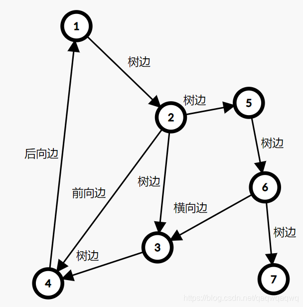

### Tarjan算法

Tarjan算法可以寻找有向图的中强连通分量，将每一个强连通分量缩成一个点，就可以把有向图转化为DAG有向无环图（拓扑图）。

```c++
/*
变量解释：
dfn[N]是dfs序，也就是dfs访问每个结点的开始时间
low[N]，可以理解为某个结点可以通过后向边（back edge）或者横插边（cross edge）回到最开始的时间（回到之前的结点）。相当于形成了环，这棵子树就是一个强连通分量，子树的根结点是最早遍历的点
timestamp表示时间戳，用来给dfn[N]赋值
stk[N]是模拟栈，in_stk[N]标记结点是否已经加入栈中
scc_cnt记录强连通分量的数量，scc[N]记录每个结点所属的强连通分量。
vec[N]用来记录一个强连通分量中结点的数量（可以可无，根据题目要求灵活设置）
*/
int dfn[N],low[N],timestamp;
int stk[N],in_stk[N],top;
int scc_cnt,scc[N];
int vec[N];
void tarjan(int u){
    //初始时结点开始访问的开始时间和可以回到某个结点（有最早开始时间）相同，也就是本身是一个强连通分量。
	dfn[u]=low[u]=++timestamp;
	//入栈 
	stk[++top]=u;
	in_stk[u]=true;
	//遍历邻边
	for(int i=h[u];~i;i=ne[i]){
		int j=e[i];
		if(!dfn[j]){
            //如果还未访问过就继续递归访问
			//tree edge 
			tarjan(j);
            //通过儿子结点的low[j]值来更新low[u]的，因为u->j
			low[u]=min(low[u],low[j]);
		}else if(in_stk[j]){
            //如果碰到已经访问过的结点
			//back edge
			low[u]=min(low[u],low[j]);
		}
	}
	//强连通分量子树的根结点 
    //两个值相等说明是强连通分量这棵子树的根结点（最高的结点）
    
    // 解释一下为什么tarjan完是逆dfs序
    // 假设这里是最高的根节点fa
    // 上面几行中 fa的儿子节点j都已经在它们的递归中走完了下面9行代码
    // 其中就包括 ++scc_cnt 
    // 即递归回溯到高层节点的时候 子节点的scc都求完了
    // 节点越高 scc_id越大
    // 在我们后面想求链路dp的时候又得从更高层往下
    // 所以得for(int i=scc_cnt(根节点所在的scc);i;i--)开始
	if(dfn[u]==low[u]){
		scc_cnt++;
		int ver;
		do{
			ver=stk[top--];//出栈
			scc[ver]=scc_cnt;//保存每个点属于哪个强连通分量 
			vec[scc_cnt]++;//记录每个强连通分量集合 
			in_stk[ver]=false;
		}while(ver!=u);
	} 
}
```


## 最短路

**反向建图：**对于单源求最短路，可以直接使用Dijkstra或者spfa求解即可，对于**多起点单终点**的最短路问题，要计算每个起点到终点的最短距离，可以通过**反向建图**的方式，把起点和终点调换，这样就可以将问题转换为一个起点。

**虚拟源点：**通过建立虚拟源点也可以将多起点转换为从虚拟源点出发的新图。

### Dijkstra

**我的理解：**图论求方案数就有一些DP的影子了。DP前面计算出的子问题的结果，后面基本上不会改变，而且会用到后续的求解中。而DP问题的求解需要求解的问题满足**拓扑序**。而bfs和dijkstra都是满足拓扑序的，以dijkstra为例，每次从优先队列中取出的点，表示已经达到最小值，后续不会再更新，然后用这个点更新邻边。

适用于边权都为非负数

**朴素版Dijkstra算法**

每次找到一个最小值，都会默认到该点的距离已经被更新至最小，所以用st数组进行标记，这也是Dijkstra算法的特点，利用贪心的思想，每次找到最短距离，就将这个点确定下来，不再更新。

```c++
const int N=510;
int g[N][N];
bool st[N];
int dist[N];//记录距离 
int n,m;//n为点的个数，m为边的个数
int dijkstra(){
	
	//初始化距离为最大值 
	memset(dist,0x3f,sizeof dist); 
	dist[1]=0;
	//找到距离的最小值
	for(int i=0;i<n;i++){
		int t=-1;
		for(int j=1;j<=n;j++){
			if(!st[i] && (t==-1 || dist[t]>dist[j]))t=j;//找到距离的最短点 
		}
		st[t]=true; 
		//更新距离最短点到其他点的最短距离
		for(int j=1;j<=n;j++){
			dist[j]=min(dist[j],dist[t]+g[t][j]);
		}
	} 
    //如果是最大值则表示无法到达
	if(dist[n]==0x3f3f3f3f)return -1;
	return dist[n];
}


```

**堆优化版Dijkstra算法**

堆优化版本在查找所有距离中的最小值时，使用的是堆，可以降低时间的复杂度。

```c++
const int N=2e5;
int n,m;
int h[N],e[N],ne[N],w[N],idx;
int dist[N];
bool st[N];
//稀疏图用邻接表 
void add(int a,int b,int c){
	e[idx]=b,w[idx]=c,ne[idx]=h[a],h[a]=idx++;
}
int dijkstra(){
	memset(dist,0x3f,sizeof dist);
	dist[1]=0;
    //用STL自带的优先队列存距离的值
	priority_queue<PII,vector<PII>,greater<PII> > heap;//优先队列-小根堆 
	heap.push(make_pair(0,1));//将第一个点加入堆
	while(!heap.empty()){
		PII t=heap.top();//获得距离中的最小值 
		heap.pop();
		int ver=t.second,distance=t.first;
		if(st[ver])continue;
		st[ver]=true;
        //更新最短距离
		for(int i=h[ver];i!=-1;i=ne[i]){
			int j=e[i];
			if(dist[j]>distance+w[i]){
				dist[j]=distance+w[i];
				heap.push(make_pair(dist[j],j));//将新更新的距离加入堆 
			}
		}
	} 
	if(dist[n]==0x3f3f3f3f) return -1;
	return dist[n];
}
```

### SPFA

SPFA可以用于有**负权边**的单源最短路问题，时间复杂度为O(km)，k一般是很小的常数，最坏情况下k=n,时间复杂度达到O(nm)。如果有**负权回路**的情况，则不能使用SPFA算法，否则会出现死循环。

**算法流程：**因为SPFA是从源点开始，对于有发生松弛的点（就是最短距离发生改变），就会将其加入队列，算法结束的条件是队列为空，如果有负权回路，那么最短距离会永远有发生变化，那么队列中就会一直不为空。

SPFA判断是否存在负环，添加一个cnt数组统计两点之间边的个数（与松弛的次数有关），如果数量>=n，则表示一定存在负环。求最短路时，图中不能有负环，同理求最长路时，图中不能有正环，可以将求解过程替换成求最长路，就可以判断图中是否有正环。

```c++
int dist[N];
bool st[N];//st数组的用法与Dijkstra不同，这里是判断队列中是否会加入重复的点。
int que[N];
int spfa(){
    //初始化距离
    memset(dist,0x3f,sizeof dist);
    dist[1]=0;
    int hh=0,tt=0;
    que[0]=1;//加入队列
    st[1]=true;
    while(hh<=tt){
        int t=que[hh++];//取出
        st[t]=false;
        //更新距离
        for(int i=h[t];i!=-1;i=ne[i]){
            int j=e[i];
            if(dist[j]>dist[t]+w[i]){
                dist[j]=dist[t]+w[i];
                //如果没有在队列中就加入队列
                if(!st[j]){
                    que[++tt]=j;
                    st[j]=true;
                }
            }
        }
    }
    return dist[n];
    
}
```

**SLF优化**：Small Label First策略，顾名思义，小的值放前面。使用STL中的双端队列**deque**容器来实现，在松弛后加入队列前，对要加入队列的点 u，如果 dist[u] 小于队头元素 v 的 dist[v]，将其插入到队头，否则插入到队尾。

```c++
if(dist[j]>dist[t]+w[i]){
    dist[j]=dist[t]+w[i];
    if(!st[j]){
        st[j]=true;
        //与队头元素进行比较，小于队头元素插入到队头，大于队头元素插入到队尾
        if(que.size() && dist[j]<dist[que.front()]){
            que.push_front(j);
        }else que.push_back(j);
    }
}
```

### 差分约束

差分约束就是把**不等式的约束**，求解自变量的最大值或最小值，转化为单源最短路或最长路的求解。

**如何求最大值或最小值，这里的最值指的是每一个变量的最值。**

能够这样子转化是因为该不等式约束刚好和最短路求解中的**松弛操作**对应

**注意：**

1. 对于不同的题目，求解的变量可能并不是直接以xi的形式给出，而是需要自己构造，然后再寻找自己构造的变量的约束，进行最长路或最短路的求解。

2. 在利用最短路求解前，要判断是否存在一个点，能够通过边到所有点，因为这样才有可能是有解的，否则需要加入虚拟源点。然后判断是否有负环。**不能从任意点判断是否有负环，因为从某些点出发可能到达不了负环**

3. 源点需要满足的条件：从源点出发，一定可以走到所有边，因为每一条边表示是的一个约束条件，只有所有边都能走到，才能表示这个约束被考虑到了。如果不存在负环，就说明有解。**找能走到所有边的源点只是为了判断有没有解，正式求解的时候不一定要从这个源点出发！！！**

   

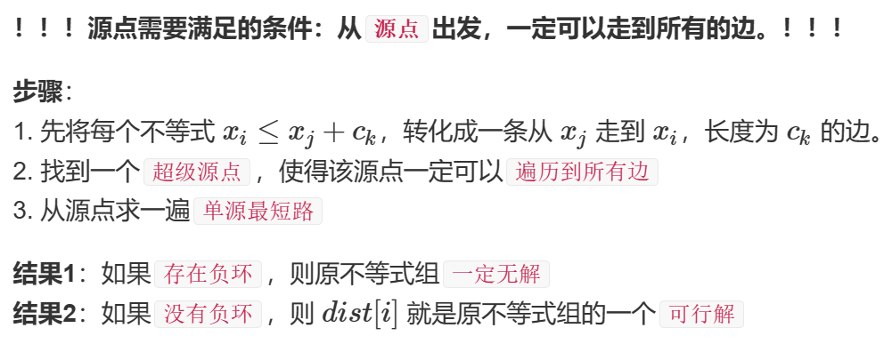


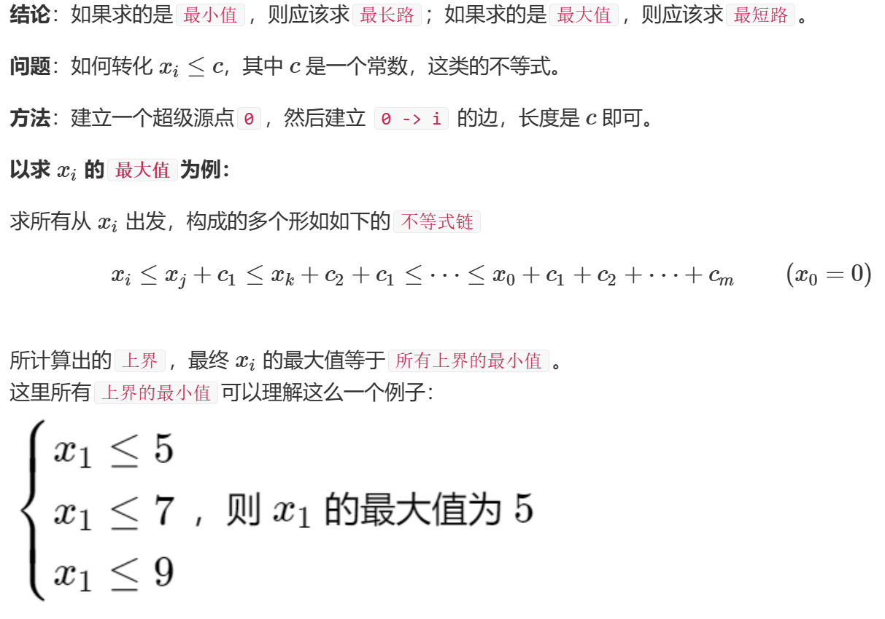


### Floyd

可以处理负权

```c++
const int N=210;
int dist[N][N];
//floyd算法
void floyd(	){
	for(int i=1;i<=n;i++){
		for(int j=1;j<=n;j++){
			for(int k=1;k<=n;k++){
				dist[i][j]=min(dist[i][j],dist[i][k]+dist[k][j]);
			}
		}
	}
}
//dist数组初始化
for(int i=1;i<=n;i++){
    for(int j=1;j<=n;j++){
        if(i==j)dist[i][j]=0;//存在自环直接就删掉
        else dist[i][j]=INF;//初始化为最大值
    }
}
//因为可能存在负权边的情况，所以当两个点之间的距离无解时，可能距离并不是初始化的正无穷，而是会小一点点。
//所以用>INF/2来判断是否是无解。
if(dist[x][y]>INF/2)cout<<"impossible"<<endl; 
		else cout<<dist[x][y]<<endl;
```


## 最小生成树

### prim

**朴素prim算法**

时间复杂度为O(n^2)，可以使用堆优化，和Dijkstra一样用优先队列代替对，优化prim算法时间复杂度为O(mlogn)，适用于稀疏图，但是稀疏图的时候求最小生成树，Kruskal更加实用。

```c++
int prim(){
	int res=0;
	memset(dist,0x3f,sizeof dist);
	//把第一个点加入集合 
	dist[1]=0;
	for(int i=0;i<n;i++){
		
		//找到到集合距离最短的 
		int t=-1;
		for(int j=1;j<=n;j++){
			if(!st[j] && (t==-1 || dist[t]>dist[j]))t=j;
		}
		if(dist[t]==0x3f3f3f3f)return dist[t];
		st[t]=true;
		res+=dist[t];
		//更新点到集合的距离
		for(int j=h[t];~j;j=ne[j]){
			if(dist[e[j]]>w[j]){
				dist[e[j]]=w[j];
			}
		}
	}
	return res;
}
```

**堆优化版prim算法**

```c++
typedef pair<int,int> PII;
const int N=110;
int n;
int map[N][N];
int dist[N];
bool st[N];
int prim(){
	
	int res=0;
	memset(dist,0x3f,sizeof dist);//初始化距离
	//创建优先队列
	priority_queue<PII,vector<PII>,greater<PII> > heap;
	dist[1]=0;
	heap.push(make_pair(0,1));//将第一个点加入优先队列
	while(heap.size()){
		//取出距离的最小值
		PII t=heap.top();
		heap.pop();
		//更新到集合的距离
		int ver=t.second;
		if(st[ver])continue;//因为可能存在一个点被多次加入优先队列的情况，所以如果已经
		st[ver]=true;
		res+=t.first;
		for(int i=1;i<=n;i++){
			if(!st[i]){
				if(dist[i]>map[ver][i]){
					dist[i]=map[ver][i];
					heap.push(make_pair(dist[i],i));
				}
			}
		} 
	} 
	return res;
	
}
```


###Kruskal

**时间复杂度为O(mlogm)**

对边进行判断，首先对每一条边升序进行排序，然后遍历每一条边，加入生成树，如果最后生成树的边数=n-1，则表示生成树存在。

判断新加入的边是否构成环，可以通过**并查集**来维护一个集合。

kruskal算法可以求解多个连通块最小生成树，因为是对边进行操作，每次把边加入最小生成树集合，但是并不能保证最后的最小生成树是个连通图（可能有多个最小生成树），所以最后还需要判断一下最小生成树边的数量cnt和点的数量n的关系，cnt=n-1则表示最后的最小生成树是一个连通图。

```c++
const int N=1e5+10,M=2e5+10;

int n,m;
int res;
struct line{
	int u;//起点 
	int v;//终点 
	int w;//权重 
	//升序排序 
	bool operator < (const line& t){
		return this->w<t.w;
	}
	
}line[M];
int pre[N];
//并查集查找 
int find(int x){
	if(pre[x]!=x) pre[x]=find(pre[x]);
	return pre[x];
}
bool kruskal(){
	int cnt=0;
	//尝试加入每一条边
	for(int i=0;i<m;i++){
		int pa=find(line[i].u);
		int pb=find(line[i].v);
		if(pa!=pb){
			res+=line[i].w;
			pre[pa]=pb;
			cnt++;
		}
		
	} 
	if(cnt<n-1){
		return false;
	}
	return true;
}
```

**严格次小生成树求解**

次小生成树：在最小生成树的基础上，替换掉最小生成树上的边，使得生成树的权重和变成**第二小的**

求解流程：

1. **求解最小生成树**，并将求解出来的最小生成树建图

2. 利用**dfs**求解最小生成树中，点与点之间的路径中，边的权重的最大值和次大值

   ```c++
   void dfs(int u,int father,int max2,int max1,int d2[],int d1[]){
   	d1[u]=max1,d2[u]=max2;
   	for(int i=h[u];~i;i=ne[i]){
   		int j=e[i];
   		if(j==father)continue;
   		int m1=max1,m2=max2;
           //只有严格大于才可以替换
   		if(w[i]>m1){
   			m2=m1;
   			m1=w[i];
   		}else if(w[i]<m1 && w[i]>m2) m2=w[i];
   		dfs(j,u,m2,m1,d2,d1);
   	}
   } 
   ```

3. **遍历非树边**（也就是没有被最小生成树选中的），判断该非树边（x,y,w）是否可以替换最小生成树（u,v）路径上权重最大的边。只有w大于权重最大的边才可以替换，因为这样满足最小生成树的求解过程。**注意：**步骤2之所以还求解次大值的原因，可能存在w与最大边相同的情况，这样就需要替换次大边。**有没有可能w小于最大边，大于次大边的情况呢？**不可能，因为如果存在w小于最大边，而大于次大边，那么w这条边就可以作为最小生成树的一条边，那么就与步骤1求解的最小生成树矛盾了。

   ```c++
   	for(int i=0;i<m;i++){
   		if(edge[i].flag)continue;
   		int u=edge[i].u,v=edge[i].v,w=edge[i].w;
   		if(w>dist1[u][v]){
   			res=min(res,sum-dist1[u][v]+w);
   		}else if(w==dist1[u][v]){
   			res=min(res,sum-dist2[u][v]+w);
   		}
   	} 
   ```

   **利用倍增的思想求解严格次小生成树**

   1. **求解最小生成树**，并将求解出来的最小生成树建图。

   2. 利用倍增的思想，在最近公共祖先求解每个点向上2^j^个单位的父节点时，同时维护向上2^j^个单位的路径上权重的最大值和次大值。这里维护的二进制长度的最大值和次大值

      ```c++
      void dfs(int u,int father,int dist){
      	depth[u]=depth[father]+1;
      	f[u][0]=father;
      	d1[u][0]=dist,d2[u][0]=-INF;
      	for(int i=1;i<=17;i++){
      		int mid=f[u][i-1];//记录中间节点
      		f[u][i]=f[mid][i-1];
      		//把四个极值都取出来，然后遍历找到最大值和次大值 
      		int dist[]={d1[u][i-1],d2[u][i-1],d1[mid][i-1],d2[mid][i-1]};
      		for(int k=0;k<4;k++){
      			int w=dist[k];
      			if(w>d1[u][i]){
      				d2[u][i]=d1[u][i];
      				d1[u][i]=w;
      			}else if(w<d1[u][i] && w>d2[u][i])d2[u][i]=w;
      		}
      	}
      	//遍历邻边
      	for(int i=h[u];~i;i=ne[i]){
      		int j=e[i];
      		if(j==father)continue;
      	dfs(j,u,w[i]);
      	} 
      }
      ```

   

   3. 最后遍历非树边，找lca（最近公共祖先）的时候，同时记录每次跳跃路径上的最大值和次大值。

      ```c++
      int get_lca(int a,int b,int w){
      	if(depth[a]<depth[b]) return get_lca(b,a,w);
      	static int distance[N*2];//路径a,b上所有的最大值和次大值 
      	int cnt=0;
      	for(int i=17;i>=0;i--){
      		if(depth[f[a][i]]>=depth[b]){
      			distance[cnt++]=d1[a][i];
      			distance[cnt++]=d2[a][i];
      			a=f[a][i];
      		}
      	}
      	if(a!=b){
      		for(int i=17;i>=0;i--){
      			if(f[a][i]!=f[b][i]){
      				distance[cnt++]=d1[a][i];
      				distance[cnt++]=d2[a][i];
      				distance[cnt++]=d1[b][i];
      				distance[cnt++]=d2[b][i];
      				a=f[a][i],b=f[b][i];
      			}
      		}
      		distance[cnt++]=d1[a][0];
      		distance[cnt++]=d1[b][0];
      	}
      	
      	//找到最大值和次大值
      	int m1=-INF,m2=-INF;
      	for(int i=0;i<cnt;i++){
      		if(distance[i]>m1){
      			m2=m1;
      			m1=distance[i];
      		}else if(distance[i]<m1 && distance[i]>m2){
      			m2=distance[i];
      		}
      	} 
      	if(w>m1)return w-m1;//非树边权重大于最大值，可以替换
      	if(w>m2)return w-m2;//非树边权重等于最大值，大于次大值，可以用次大值替换
      	return INF;
      }
      ```

      

   

## 最近公共祖先-LCA

**朴素版求解公共祖先**

首先令深度深的一端结点先移动，移动到相同深度后，然后同时往上移动，知道找到相同的结点，即为找到公共祖先。

**时间复杂度:**  时间复杂度为O(nlogn)，如果是链状的二叉树，时间复杂度为O(n^2)

```c++
//获得最近公共祖先 
int get_lca(int a,int b){
	if(dist[a]<dist[b])return get_lca(b,a);
	//将两个点移动至同一个深度
	while(dist[a]>dist[b]) a=f[a];
	//同时向上移动
	while(a!=b){
		a=f[a];
		b=f[b];
	} 
	return a;//返回公共祖先
}
```


[**基于倍增求解公共祖先**]([LCA问题（倍增法）_倍增lca-CSDN博客](https://blog.csdn.net/Q_M_X_D_D_/article/details/89924963?spm=1001.2014.3001.5506))

在朴素版求解中，结点每次都是移动一个单位，时间复杂度高。而基于倍增的思想，每次移动**2^j**个距离单位，所以我们构造了一个f(i)(j)数组，**表示从结点i出发，向上移动2^j所到达的结点编号。**在预处理f数组时，也用到了**动态规划**的思想

```c++
//dfs求解点的深度+倍增求解父节点
//dfs代码少一点，就是可能会有爆栈的风险
void dfs(int u,int father){
	depth[u]=depth[father]+1;
	f[u][0]=father;
	for(int k=1;k<=16;k++)f[u][k]=f[f[u][k-1]][k-1];//倍增计算父节点 
	for(int i=h[u];~i;i=ne[i]){
		int j=e[i];
		if(j==father)continue;
		dfs(j,u);
	}
} 
```


```c++
int n,m;
int dist[N];//深度
int que[N];
int f[N][16]; 
//计算点到根结点的距离 
void bfs(int root){
	memset(dist,0x3f,sizeof dist);
    //在这里有一个技巧，就是将根节点dist[root]=1，dist[0]=0;这样可以完美的避开边界问题，就是在进行LCA时，会出现结点一步走过	 //头的情况，按理说如果走过头，结点不能进行跳跃，如果将dist[root]=0，那么在判断dist[f[a][i]]>=dist[b]时，就会可能成立
    //结点就会进行跳跃（当b是根结点时，dist[root]=0，条件就会成立）。
	dist[root]=1,dist[0]=0;
	int hh=0,tt=0;
	que[0]=root;
	while(hh<=tt){
		int t=que[hh++];
		//遍历临边
		for(int i=h[t];~i;i=ne[i]){
			int j=e[i];
			//cout<<"j"<<j<<endl;
			if(dist[j]>dist[t]+1){
				dist[j]=dist[t]+1;
				que[++tt]=j;//加入队列 
				//p[j]=t;//记录父节点 
				//计算2^k步所能到的结点
                //利用bfs求解深度时，可以顺带预处理f数组，因为每一层的f数组计算只与前几层已经计算过的值有关
                //就比如计算f[j][1]=f[f[j][0]][k-1]，而f[j][0]一定在bfs搜索第一层的时候已经计算出来了。
				f[j][0]=t;//k=0表示走一步 
				for(int k=1;k<=15;k++){
					f[j][k]=f[f[j][k-1]][k-1];
				} 
			}
		} 
	}
}
//获得最近公共祖先
int get_lca(int a,int b){
	if(dist[a]<dist[b])swap(a,b);
	//一个结点往上走，从大到小
	for(int i=15;i>=0;i--){
		if(dist[f[a][i]]>=dist[b])a=f[a][i];
	} 
	if(a==b)return a;
	//同时向上移动
	for(int i=15;i>=0;i--){
        //如果结点不相同，表示最近公共祖先还在上面，可以跳上去。
        //如果结点相同，表示找到公共祖先，但可能不是最近公共祖先，最近公共祖先可能在偏下的位置，所以不需要跳上去。
		if(f[a][i]!=f[b][i]){
			a=f[a][i];
			b=f[b][i];
		}
	} 
    //假设a、b距离lca的层数为10，在i=3时，f[a][i]!=f[b][i]，a和b跳了上去。在i=1时，f[a][i]=f[b][i],表示找到
    //公共祖先，虽然我们肉眼可以知道已经到达最近公共祖先了，但是程序并不知道，程序会认为最近公共祖先可能还在下面的位置
    //所以不需要跳跃上去。在i=0时，f[a][i]!=f[b][i]，a和b跳跃上去，最近公共祖先的距离为1。
    //不管是否能够一次跳跃刚好能到达最近公共祖先，程序总是会在最近公共祖先的前一个位置停下。
	return f[a][0];
}
```


## 二分图

**二分图说人话定义**：图中点通过移动能分成左右两部分，左侧的点只和右侧的点相连，右侧的点只和左侧的点相连。

### 染色法

染色法判断是否为为二分图，时间复杂度O(n + m)

 **染色技巧：**就是给定的一个原题并不是一个二分图，但是我们可以通过加一些判断来隐藏掉一部分边，，然后判断子图是否为二分图。

**dfs染色法**

```c++
bool dfs(int u,int c){
	color[u]=c;
	//给邻边染色
	for(int i=h[u];~i;i=ne[i]){
		int j=e[i];
		if(!color[j]){
			if(!dfs(j,3-c)){
				return false;
			}
		}else{
            //颜色与邻边相同
			if(color[j]==color[u]){
				return false;
			}
		}
	}
	return true;
}
```

**bfs染色法**

```c++
bool bfs(int u,int c){
	color[u]=c;
	int hh=0,tt=0;
	que[0]=make_pair(u,c);
	while(hh<=tt){
		PII t=que[hh++];
		int ver=t.first,col=t.second;
		//遍历邻边加入队列 
		for(int i=h[ver];~i;i=ne[i]){
			int j=e[i];
			if(!color[j]){
				color[j]=3-col;
				que[++tt]=make_pair(j,3-col);//加入队列 
			}else{
                //与邻边颜色相同
				if(color[j]==color[ver]){
					return false;
				}
			}
		}
	}
	return true;
}
```


### 二分图的最大匹配

说人话定义：二分图左右两端的点集，左右点集的点与点之间，每个点只连接一个点（**一对一匹配**）。然后最大匹配就是使一对一匹配的数量最多

**匈牙利算法**

涉及到**递归**的思想，男生2找到自己匹配的女生1，如果这个女生1已经匹配了男生1，那么男生1就要去判断是否有别的女生可以选择，如果有，那么男生2就可以选择女生1，皆大欢喜（这样才有最大匹配）。如果男生1在查找的过程中碰到男生3已经选择的自己心仪的女生，那么男生3就要继续去查找（递归思想）

首先利用要利用匈牙利算法的前提是这个图是一个二分图，且二分图的点集能够区分，许多题目比较隐蔽，不容易看出是一个最大匹配问题，比如Awing372.棋盘覆盖。

```c++
const int N=510,M=1e5+10;
int h[N],e[M],ne[M],idx;
int n1,n2,m;
bool st[N];//每次遍历左端点集的时候，都要初始化st
int match[N];//女生匹配的男生编号（右端匹配的左端编号） 
void add(int a,int b){
	e[idx]=b,ne[idx]=h[a],h[a]=idx++;
}

bool find(int u){
	//遍历邻边
	for(int i=h[u];~i;i=ne[i]){
		int j=e[i];
		if(!st[j]){
			st[j]=true;
			//如果这个女生还没有找到匹配的男生 或者 匹配的男生可以找到新的女生 
			if(match[j]==0 || find(match[j])){
				match[j]=u;
				return true;
			}
		}
	} 
	return false;
}
```


## DP问题

**我的理解：**首先需要确定一个集合f（最重要的部分），每一维表示一个限制，然后可能会有多个状态转移到这个集合，然后对该集合进行分类讨论。

对于每一维的确定，如果是一个集合有**多种状态**的情况需要分类讨论，比如状压DP，那么就要把状态作为某一维。也相当于对集合进行划分，然后对集合的每个部分进行分析，判断可能可以从前面哪些状态转移过来。


###背包DP

对于背包dp，本质上就是排列组合问题，问选择哪些数，使得满足某个条件。

**转化思考方式的优化：**比如要求100精灵球最多能收服多少个精灵，那么可以通过转换一下，表示为收服x个精灵，最少需要多少个精灵球。如果精灵的数量少于精灵球的数量的时候，可以降低时间复杂度

**题型：**

1. 求解体积<=j的最大价值（最小价值），此时物品的体积超过j都是不合法的方案。

2. 求解体积至少为j的最大价值，此时物品的体积超过j也是合法方案，虽然此时j-v<0，但是等价于j-v=0，因为也是相当于体积全部都用掉了。**Acwing.1020潜水员**

3. **求解方案数**f数组的初始化不同（以二维情况为例）
   * 当体积最多是j，f[0,i]=1,0<=i<=m，其余是0
   * 当体积刚好是j，f[0,0]=1，其余是0
   * 当体积至少是j，f[0,0]=1,其余是0
   
4. **求解最大值和最小值**f数组的初始化
   * 体积最多是j，f[i,k]，0<=i<=m,0<=k<=m
   * 体积恰好是j，f[0,0]=0，其余是INF或者-INF
   * 体积至少是j，f[0,0]=0，其余是INF（只会求最小值）
   
5. **求解转移路径**

   只要对比f[i-1，j]和f[i-1，j-v]+w的大小关系就可以知道f[i，j]从哪里转移过来，另外可以从前往后转移，也可以从后往前转移，意思是说可以逆着物品序对f数组进行求解，因为背包DP本质是排列组合问题，所以物品的顺序并不关键。

6. **价值会发生变化的背包DP**，在价值不变的情况下，不管以什么方式枚举物品，最优解都是不变的（与顺序无关）。但是价值一旦会发生变化，物品的枚举顺序就会影响最优解，所以此时需要首先确定物品能够获得最优解的枚举顺序（**一般利用贪心求解**）Awing734.能量石。**从集合的角度理解**，最优解是在所有方案中的最优解，然后所有方案就是指所有选法以及吃的顺序的组合，我们首先利用贪心的思想确定物品的枚举顺序，然后利用DP求解所有选法的最优解。

   

**0/1背包： (物品只能选一次)**

```c++
f[i][j] = max(f[i][j],f[i-1][j-v[i]]+w[i]);//二维
```

```c++
//滚动数组优化，当前行f[i]的状态只与上一行有关，所以可以用一维数组优化
//如果是从小到大,前一行的状态会被新一行的状态覆盖掉,这样使用前面已经求出来的状态就会出错
for(int j = m; j >= v[i]; j--)    //从大到小的重量
            f[j] = max(f[j], f[j - v[i]] + w[i]);//一维
```

**完全背包:(物品可以选无数次)**

完全背包问题也是可以解决组合问题，但是物品可以选无数多次的组合问题，比如货币的金额表示等等

```c++
/*
朴素做法，循环物品的次数，判断是否有最大值，即f[i][j]=max(f[i-1][j],f[i-1][j-v]+w,f[i-1][j-2v]+2w....以此类推)

优化做法：由暴力做法可以的得知f[i][j]的值为多个值取最大值。
我们计算f[i][j-v]=max(f[i-1][j-v],f[i-1][j-2v]+w,f[i-1][j-3v]+2w...以此类推)，可以发现f[i][j]与f[i][j-v]之间的关系，相差了一个w。
f[i][j]=max(f[i-1][j]+f[i][j-v]+w),所以就能推出以下二维转移方程
*/
f[i][j]=f[i-1][j];
if(j>=v[i]) f[i][j]=max(f[i][j],f[i][j-v[i]]+w[i]);	
```

```c++
/*
空间优化，由推出的二维转移方程可知，f[i][j]的值，都是与同层前面求出来的值有关，所以需要从前往后枚举。
与01背包不同，01背包的f[i][j]的值都与前一层求出的有关，所以j不能从大到小遍历，前面求出的新值会把上一层的旧值替换掉。
*/
for(int j = v[i] ; j<=m ;j++)//注意了，这里的j是从小到大枚举，和01背包不一样
    {
            f[j] = max(f[j],f[j-v[i]]+w[i]);//一维
    }
```

**分组背包(同组的物品只能选一个)：**

```c++
/*
朴素做法
f[i][j]表示前i组物品，容量<=j的最大价值。
集合计算，f[i][j]=max{f[i][j],f[i-1][j-v1]+w1,f[i-1][j-v2]+w2....以此类推},循环遍历组中每一种物品被选中的情况。

需要是三重循环，最外层遍历组数，第二层遍历容量，第三层遍历组中的物品
*/

for(int i=1;i<=n;i++){
	int s;
	cin>>s;
    //输入体积和价值
	for(int j=1;j<=s;j++){
		cin>>v[j]>>w[j];
    }
	for(int j=0;j<=m;j++){
		f[i][j]=f[i-1][j];//不选第i组中的物品
		//遍历i组中的每一个物品 
		for(int k=1;k<=s;k++){
			if(j>=v[k]){
				f[i][j]=max(f[i][j],f[i-1][j-v[k]]+w[k]);
			}
		}
	}
}
```

```c++
/*
空间优化:f[i][j]每次计算只与上一层状态有关，所以利用滚动数组，对f[i][j]进行降维
对j（容量）的遍历需要从大到小，从小到达会导致前一层的旧值被新值覆盖
*/
for(int j=m;j>=0;j--){
	//遍历i组中的每一个物品 
	for(int k=1;k<=s;k++){
		if(j>=v[k]){
			f[j]=max(f[j],f[j-v[k]]+w[k]);
		}
	}
}			
```

**多重背包**

一种物品可以放有限次

```c++
/*
暴力做法，枚举物品放置的所有数量情况
时间复杂度O(n*m*s)    n<=100  n表示物品种类，m表示体积，s表示物品的有限个数
*/
for(int i=1;i<=n;i++){
		int v,w,s;
		cin>>v>>w>>s;
	    for(int j=m;j>=v;j--){
            //枚举所有物品放置情况
	        for(int k=0;k<=s && k*v<=j;k++){
	            f[j]=max(f[j],f[j-v*k]+w*k);
	        }
	    }
	}
```

```c++
/*
二进制优化方法：适用于某类物品数量很多的情况，如果物品的个数很少，那么和朴素做法的时间复杂度相近
n<=1000,用暴力做法会超时
对于一种物品可以放置多个，我们可以将多个物品拆成多类物品，比如价值为v，体积为w,个数为s的一类物品，可以拆成(v,w)、(v*2,w*2)、(v*4,w*4)......多类物品，把多重背包问题转化为01背包问题。
对于物品的拆法，不能一个一个拆，这样会超时，我们选择了二进制的拆法，比如10=1+2+4+3，这样拆物品的时间复杂度就降到了O(logn)
时间复杂度：(n*logs*m) s为每类物品的数量
*/
	vector<PII> vec;//把多个物品拆成多种物品 
	for(int i=1;i<=n;i++){
		int v,w,s;
		cin>>v>>w>>s;
        //二进制拆法
		for(int j=1;j<=s;j*=2){
			s-=j;
			vec.push_back(make_pair(j*v,j*w));
		} 
        //最后一个数拆不了，就单独算
		if(s>0) vec.push_back(make_pair(s*v,s*w));
	}
	//转化为01背包问题，每个物品只能选一次
	for(vector<PII>::iterator it=vec.begin();it!=vec.end();it++){
		PII good=*it;
		for(int j=m;j>=good.first;j--){
			f[j]=max(f[j],f[j-good.first]+good.second);
		}
	}
	
```

```c++
/*
单调队列优化。。。还看不明白。先放一放
*/
```


### 线性DP

求解满足一定条件的（最大值或最小值）的数量

**最长上升子序列（LIS，Longest Increasing Subsequence）**

考点：至少能用多少个递增序列或递减序列，能覆盖整个序列的个数。可以利用贪心求解，以递增序列为例，判断某数是加入原有序列还是新建一个序列。用一个数组来维护每个序列结尾的数，将待加入的数x，加入到<=x中最大的那个结尾的序列中去**（直接替换更新）**。因为如果加入到较小的结尾中去，就可能会导致后续的数无法加入到该序列（不符合贪心思想）

```c++
/*
集合：f[i]  以a[i]结尾的最长子序列的长度，
集合计算：在满足a[i]>a[j],可以从f[1...i-1]的任意状态转移过来
*/
f[1]=1;
for(int i=2;i<=n;i++){
	for(int j=i-1;j>=1;j--){
		if(a[i]>a[j])f[i]=max(f[i],f[j]+1);
	}
	if(!f[i])f[i]=1;
}
```


**最长公共子序列（LCS，Longest Common Subsequence）**

```c++
/*
集合f[i][j] A[1~i]和B[1~j]中最长公共子序列的长度
*/
for(int i=1;i<=n;i++){
	for(int j=1;j<=m;j++){
		if(a[i]==b[j])f[i][j]=max(f[i][j],f[i-1][j-1]+1); 
		else f[i][j]=max(f[i-1][j],f[i][j-1]);
			
	}
}
```


**最长公共上升子序列（LCIS，Longest Common Increasing Subsequence）**

```c++
/*
集合：f[i][j]  A[1...i]和B[1...j]中以B[j]结尾的最长公共上升子序列的长度
集合计算：
①当a[i]!=b[j]，a[i]不能加入到最长公共上升子序列中，所以f[i][j]=f[i-1][j]
②当a[i]=b[j]，表示将a[i]加入到最长公共上升子序列中（以b[j]结尾，此时a[i]=b[j]）,这时候对f[i][j]集合重新划分
类似于求解以b[j]结尾的最长上升子序列，当a[i]>b[1...j-1],可以从f[i-1][1...j-1]中任意位置转移过来，需要取最大值。
*/

//朴素做法，O(n^3)
for(int i=1;i<=n;i++){
    for(int j=1;j<=n;j++){
        f[i][j]=f[i-1][j];//不选a[i]加入集合
        if(a[i]==b[j]){
            //遍历b[1...j-1]，当满足递增条件时，确定最长上升子序列从什么位置转移到f[i][j]
            for(int k=0;k<j;k++){
                if(a[i]>b[k])f[i][j]=max(f[i-1][k]+1,f[i][j]);
            }
        } 
    }
}

/*
注意！！这种优化方式还挺常见的，就是通过记录先前统计过的值，来减少一重循环，降低时间复杂度
优化版本
对于最内层循环，找到满足a[i]>b[k],且f[i-1][k]最大的情况。
当a[i]固定时，每循环一次j，都要从1~j-1寻找一次最大值，所以我们可以记录下每一次1~j-1的最大值maxv，在即将求解1~j的最大值时
，需要更新maxv的值，就是在满足a[i]>b[j]的情况下，比较maxv和f[i-1][j]+1的大小来更新maxv
maxv的最小值为1，就是集合中只有一个元素。
*/
for(int i=1;i<=n;i++){
    int maxv=1;//记录满足a[i]>b[k] (k<-[1,j-1]), f[1~j-1]中的最大值
    for(int j=1;j<=n;j++){     
        f[i][j]=f[i-1][j];
        if(a[i]==b[j])f[i][j]=max(f[i][j],maxv);
        if(a[i]>b[j])maxv=max(maxv,f[i-1][j]+1);
    }
}
```

**最长连续子序列**

```c++
/*
集合：f[i] 以a[i]结尾的连续最长子序列的和
集合计算：f[i]=max{f[i-1]+a[i],a[i]}  集合只包含自己一个元素|包含以a[i-1]结尾的最长连续子序列的和f[i-1]+a[i]
*/
```


### 区间DP

```c++
/*
集合：f[i][j]表示在i~j之间的目标值
集合计算：f[i][j]=min(f[i][j],f[i][k]+f[k+1][j])，以k作为分界点
所有的区间dp问题枚举时，第一维通常是枚举区间长度，并且一般 len = 1 时用来初始化，枚举从 len = 2 开始；
第二维枚举起点 i （右端点 j 自动获得，j = i + len - 1）
*/

//石子合并，求合并代价最小问题
//先枚举区间长度
for(int len=2;len<=n;len++){
    //枚举左端点
    for(int i=1;i+len-1<=n;i++){
        int j=i+len-1;
        for(int k=i;k<j;k++){
            f[i][j]=min(f[i][j],f[i][k]+f[k+1][j]+s[j]-s[i-1]);
        }
    }
} 
cout<<f[1][n];
```

###树形DP

**注意：**树形DP不一定要递归的，也可能是和树相关的DP，比如说求解给定节点个数和树的深度，求解树的方案数，这时候f[i] [j]表示为i个节点，高度为j的二叉树的方案数，然后求解过程就是枚举左子树和右子树的节点个数和高度的所有情况，统计方案数。

对于树的问题，大部分都是利用dfs来搜索，进行要明白dfs的具体含义。

对于有些无向边的树，我们无法找到具体根节点的位置，我们可以把任意点当作根节点，在dfs是加入父节点father的信息，避免重复计算。

```c++
/*
对于树形DP，需要用邻接表存储结点之间的关系。然后求解时需要利用递归
集合：f[u][0]表示以u为根节点的子树，不选根结点u的情况，得到的max/min
	 f[u][1]表示以u为根节点的子树，选根节点u的情况,得到的max/min
*/

//没有上司的舞会（父节点和子节点不能同时被选中参加舞会，因为和上司一起吃饭不开心），求解开心度的最大值。
void dfs(int u){
	
	f[u][1]=happy[u];//选中根节点u
    //遍历子树
	for(int i=h[u];~i;i=ne[i]){
		int j=e[i];
		dfs(j);//递归子树 
		f[u][0]+=max(f[j][0],f[j][1]);//不选根节点u
		f[u][1]+=f[j][0];
	} 
}
```


### 数位DP

### 状压DP

状态压缩DP本质上就是用**二进制的方式**表示所有的状态，因为状态总数的阶乘级的，所以适用于n比较小的情况，可以枚举所有的状态进行状态转移。一般需要先预处理合法状态，以及状态与状态之间转移的合法性。

### 概率DP

**DP求期望：**期望通俗的讲就是求一个数出现的平均值。

DP求期望需要用到**期望的可加性**，E(Y)可以求解出所有可能的情况以及对应情况的概率，相乘后相加就是E(Y)。而期望的可加性是利用E(X+Y)=E(X)+E(Y)，这样就可以把一个“大期望”分解为一个个“小期望”，这也是能够转化为DP来做的原因。


## 排序算法


###归并排序  

时间复杂度O(nlogn)    空间复杂度O(n)，稳定排序

就是给定两个有序数组，将两个数组合并在一起升序。

定义一个更大的数组，给定两个指针分别指向两个数组，每次取较小值放入新数组。

```c++
void mergeSort(int a[],int l,int r){
	
	if(l>=r)return;
	int mid=l+r>>1;
    //分离数组
	mergeSort(a,l,mid);
	mergeSort(a,mid+1,r);
	//合并l-r范围内的数组 
	int i=l,j=mid+1,k=0;
	while(i<=mid&&j<=r){
		if(a[i]<a[j])tmp[k++]=a[i++];
		else tmp[k++]=a[j++];
	}
	//将剩余的数直接添加到序列的后面 
	while(i<=mid)tmp[k++]=a[i++];
	while(j<=r)tmp[k++]=a[j++];
	//拷贝到原数组
	k=0;
	for(int i=l;i<=r;i++){
		a[i]=tmp[k++];
	} 
}
```

### 快速排序   

快速排序的思想就是找到一个**基准值**，把序列分成两个部分，左半部分大于等于基准值，右半部分小于等于基准值。

然后对左右部分分别进行递归排序。

最差时间复杂度O(n^2) 和冒泡排序一样，平均时间复杂度 O(n*logn)不稳定排序

```c++
void quickSort(int a[],int l,int r){
	if(l>=r)return;
	int i=l-1,j=r+1;
	//选取基准值
	int std=a[l+r>>1];
	while(i<j){
        //为了考虑边界问题，边界问题有很多，直接找个正确的模板背过即可
		while(a[--j]>std);
		while(a[++i]<std);
		if(i<j)swap(a[i],a[j]);
	}
	quickSort(a,l,j);//对左边排序 
	quickSort(a,j+1,r);//对右边排序 
	
}
```

### 快速选择查找 

快速选择查找就是基于快速排序，**只对包含第k个值的区间排序**，不需要排序整个数组

平均时间复杂度为O(n)，最坏时间复杂度为O(n^2)

```c++
//快速选择排序算法
void sort(int a[],int l,int r){
	
	if(l>=r)return;
	int i=l-1,j=r+1;
	int std=a[l+r>>1];
	while(i<j){
		while(a[--j]>std);
		while(a[++i]<std);
		if(i<j)swap(a[i],a[j]);
	} 
	if(j>=k-1)sort(a,l,j);
	else sort(a,j+1,r);
}
```

### 桶排序

不基于比较的排序算法

通过统计值域内每个数据的个数，然后根据个数排序

```c++
int count[1002];//存放数的个数 这里数的值域是[0,1000]
void bucketSort(int n){
    //统计每个数据的个数
	for(int i=0;i<n;i++){
		count[num[i]]++;
	}
	int cnt=0;
    //值域为[0,1000]
	for(int i=0;i<=1000;i++){
		while(count[i]!=0){
			num[cnt++]=i;//将数填回原数组
			count[i]--;
		}
	}
}
```


###堆排序(升序)   

时间复杂度  O(nlogn)，不稳定排序

空间复杂度 O(1)

```c++
//对某个根节点调整为大根堆
//从上往下进行调整
void adjust_down(int *a,int n,int i){//i是需要调整的根节点的下标
	int father=i;
	int child=i*2+1;
	while(child<n){
        //比较孩子结点的大小，选出较大的那个
		if((child+1)<=n-1&&a[child]<=a[child+1]) ++child;
        //交换父节点和孩子结点，并顺着孩子结点向下继续调整
		if(a[father]<a[child]){
			int temp;
			temp=a[child];
			a[child]=a[father];
			a[father]=temp;
			father=child;
			child=father*2+1;
		}else{
            //一旦不能继续调整就退出循环
			break;
		}
	}
	
}


void heap_sort(int *a,int n){
	//建立大根堆
    //(n-1)/2为从后往前，第一个有孩子的结点
	for(int i=(n-1)/2;i>=0;i--){
		adjust_down(a,n,i);
	} 
	//摘取大顶,与最后一个结点交换 
	for(int i=0;i<n-1;i++){
		int temp=a[0];
		a[0]=a[n-i-1];
		a[n-i-1]=temp;
		adjust_down(a,n-i-1,0);
	} 
}
```


## 杂项

### 01分数规划

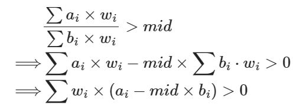

分数规划就是求解形如上图中求和比值的最大值或最小值，一般和图论结合，求解边权和或点权和。

1. 这类问题一般利用二分求解，确定答案的区间，判断答案在二分区间的左半边还是右半边
2. 如上图所示，推导出要求解的公式。
3. 如图，求和之后>0 <=> 图中环的边权和>0 <=> 求解图中是否有正环（求正环/负环 见SPFA）

注意：此类问题最主要是确定如何计算公式推导出的式子，并判断是否满足条件（二分的check函数）。

```c++
//二分示例
/*
一般求解答案都是浮点数，所以while循环的条件需要修改，如果是保留两位小数，差距就是1e-4。一般都是小个2次方
*/
double l=0,r=1010;
while(r-l>1e-4){
    double mid=(l+r)/2;
    if(check(mid))l=mid;//向右移动 
    else r=mid;
}
```


## 获得环形链表相交的节点


1. 利用[快慢指针](##3.快慢指针)求解：获得fast和slow相遇的节点meetNode
2. 利用一个**结论**：两个节点，一个从头结点head出发，一个从meetNode节点出发，两个节点**速度相同**，最后会在环形链表的**相交节点处**（入环的第一个节点）相遇。

```c++
ListNode* fast=head,*slow=head;//定义快慢指针
 while(fast&&fast->next){
    fast=fast->next->next;
    slow=slow->next;
    if(slow==fast){
       ListNode* meetNode=fast;//获得快慢指针相遇的节点
       while(meetNode!=head){//利用结论获得相交的节点处（入环的第一个节点）
           meetNode=meetNode->next;
           head=head->next;
         }
        return meetNode;
    }
 }
```


## 复制带随机指针的链表

[复制带随机指针的链表_leetcode](https://leetcode.cn/problems/copy-list-with-random-pointer/)

1. 先将新拷贝的结点链接在原来结点的**后边**

2. 通过原链表来改变拷贝链表的随机指针  (最关键的一步)

   ` copyNode->random=cur->random->next;//cur是原链表的结点，copyNode是拷贝的结点`

3. 将拷贝链表和原链表还原

  


## Huffman算法(哈夫曼算法)

通过生成**哈夫曼树**(最优二叉树)来进行**哈夫曼编码**

1. 将有权值的叶子结点按照从小到大的顺序排列

2. 取两个最小权值得结点作为新结点得左右孩子，小的为左孩子，大的为右孩子

3. 将新结点加入有序排列，继续重复步骤二

   

Huffman编码的**平均编码长度**计算：

先通过哈夫曼算法构造出最优二叉树后，判断每一个字符的编码长度，最后将**编码长度**乘以每个字符出现的**概率**求和

​	

## 高精度加法

1. 因为输入的数大于long long了，所以就用string先存着；

2. 将string里存的数逆序存入数字数组，这样模拟手工从右往左计算过程。

3. 循环（长的那个数组有多少个数，就循环多少次），两数相加，如果数>10，那就保留各位，十位加到下一个数中。

4. 因为数逆序存入所以要逆序输出。

   ```c++
   string s1,s2;
   int a[250],b[250],c[500];
    
   int main()
   {
   	cin>>s1>>s2;
   	
   	for(int i=0;i<s1.size();i++)  //将s1字符串逆序存入数组a,将s2字符串逆序存入数组b
   	{
   		a[s1.size()-i-1]=s1[i]-'0';  
   	}
   	
   	for(int i=0;i<s2.size();i++)
   	{
   		b[s2.size()-i-1]=s2[i]-'0';
   	}
   	
   	int len=s1.size();
   	if(s2.size()>len)
   	{
   		len=s2.size();
   	}
   	
   	for(int i=0;i<len;i++)
   	{
   		c[i]=a[i]+b[i];
   	}
   	
   	for(int i=0;i<len;i++)   //对进位进行处理
   	{
   		if(c[i]>=10) c[i+1]=c[i+1]+c[i]/10;
   		c[i]=c[i]%10;
   	}
   	
   	if(c[len]!=0) len++;    //如果最高位有进位，那么c[len]还会有值
   	
   	for(int i=len-1;i>=0;i--)
   	{
   		cout<<c[i];
   	}
   	cout<<endl;
   	return 0;
   }
   ```

   

## st表(Sparse Table，**稀疏表**）

st表是一种数据结构，主要用于解决RMQ（区间最大值或最小值） 例如：给你一个数列，求解在一个范围内的数值的最大值或最小值。

主要利用了**倍增**的思想和**动态规划**的思想。


1. 动态规划的**预处理**（以2为倍数增加长度）

   

   

   ```c++
   //由上图得，将要求得一个区间分为两个区间
   //f[j][i]存的是从 j 到 j+2^i-1 范围内的 最大值 ，中间包含2^i个数
   
   for(int i=1;i<=log2(n);i++){    // <<是移位运算符，1<<i相当于2^i
   		for(int j=1;j+(1<<i)-1<=n;j++){
   			f[j][i]=max(f[j][i-1],f[j+(1<<(i-1))][i-1]); 
               												}
   	}
   ```

3. 进行区间查询

   

   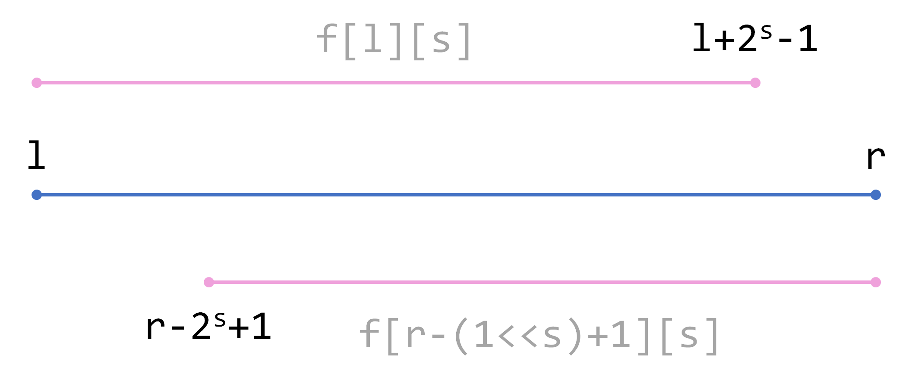

   找到一个值s，使得l+2 ^ s-1，尽可能接近r，r-2 ^ s+1尽可能接近l，两个区间的长度都是2 ^ s

   最后比较两个区间的最大值，取较大的那个

   ```c++
   max(f[l][s],f[r-(1<<s)+1][s]); 
   ```


## 红黑树

特征：

1.**根节点**是黑色的

2.红色结点和黑色结点**交替**

3.任意节点到叶子结点的路径包含**相同数目**的黑色结点  (红黑树中的叶子结点是指**最外部的空结点**)


## 多重邻接表(存储无向图)

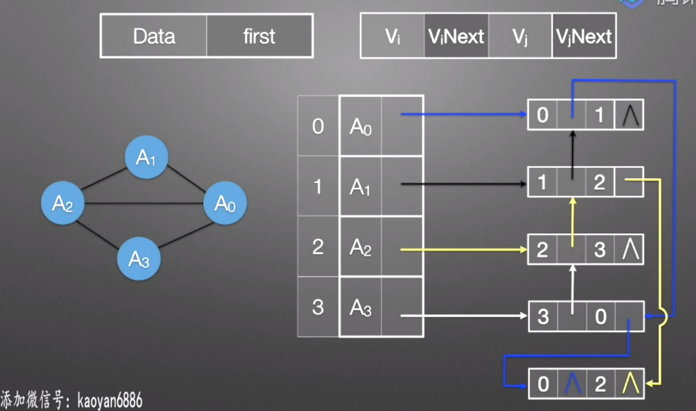

## 十字链表(存储有向图)

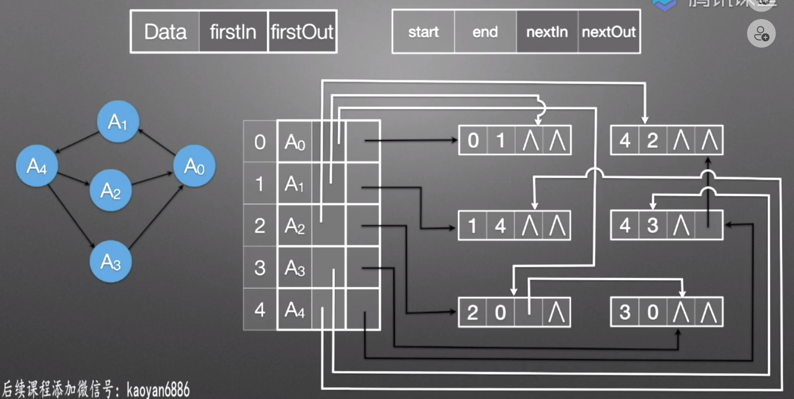


## AOV网(解决拓扑排序问题)---活动赋予顶点

方式：每次选出入度为0的结点

用邻接矩阵  时间复杂度 O(o^2)

用邻接表    时间复杂度  O(n+e)

 

## 哈希表平均查找长度

**成功时：ASL=(所有元素查找成功的比较次数)/元素的个数**

哈希函数为 H(key)=key mod p   （p一般来说是一个质数，**除留余数法**）

**不成功时：ASL=(0到p-1向后查找直到遇到空的比较次数)/p**      (不是除以数组本身大小)


## 全排列问题

深度优先搜索思想DFS :

```c++
int arrange[N];//存全排列的数组 
int exist[N];//判断是否存在 
void createArrange(int k,int n){//k是数组的位置，n是数的个数
	if(k>n){
		showArrange(n);//如果k>n表示所有数组位置都已经赋值，一次全排列情况结束，打印数组
		return;
	}else{
		for(int i=1;i<=n;i++){
			if(!exist[i]){
				arrange[k]=i;//如果有没有被填入数组的数，就填入，然后标记已经选过
				exist[i]=1;
				createArrange(k+1,n);//进入递归
				exist[i]=0;//当递归退出表示一次全排列结束，会返回上一层递归的位置，执行下面的语句,将当前的数标为
                				//还没有选过
				arrange[k]=0;
			}
		}
	}
}
```

**递归情况如图：(以n=3为例)**

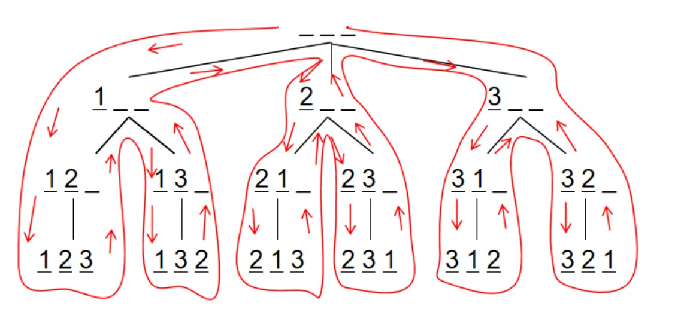


## 遗传算法

遗传算法解决最优化问题的搜索算法

1. 基因编码

   二进制编码   010010011011011110111110

   浮点是编码   1.2 –3.3 – 2.0 –5.4 – 2.7 – 4.3

2. 建立表现型到基因型的映射关系，就是将基因映射到一个区间范围内(有点像解码的过程)

3. 建立适应性函数，衡量物种是否能够存活的标准

4. 选择函数，物种繁殖的概率，一般适应度占比越大，被选择的概率就越大. 使用轮盘赌

5. 遗传变异

   交叉：  **二进制编码**随机交换同一位置的的编码，产生新的个体

   ​		     **浮点数编码**就产生介于父代和母代基因编码值之间的数

   基因突变 ：二进制编码将某些位的基因改变

   ​					浮点是编码就是增加或减少一个小随机数

  ```python
#解决函数求极值问题
# 遗传算法
import numpy as np

DNA_SIZE=8   #编码的位数
POP_SIZE=200 #种族的个数
CROSSVER_RATE=0.9   #交叉的概率
MUTATION_RATE=0.01   #变异的概率
N_GENERATIONS=5000  #迭代的次数
X_BOUND=[-3,3]  # x的取值范围
Y_BOUND=[-3,3]  # y的取值范围

def F(x,y):
    return (x+y)**2+np.sin(y)

# 得到最大适应度
def get_fitness(pop):
    x,y=translateDNA(pop)
    pred=F(x,y)#获得函数值
    return (pred-np.min(pred))+1e-3   #加上个较小值，防止适应度小于零
#将每条二进制编码的基因投影到定义域中
def translateDNA(pop):
    '''
    解码
    :param pop: 种群矩阵，一行表示一个二进制编码的个体（可能解），行数为种群中个体数目
    :return: 返回的x,y 是一个行 为种群大小 列为 1 的矩阵 每一个值代表[-3,3]上x,y的可能取值（十进制数）
    '''
    x_pop=pop[:,1::2]  # pop中的奇数列表示x   对每一个染色体，从奇数列位x，从1开始
    y_pop=pop[:,0::2]  # pop中的偶数列表示y
    #dot函数，获得两个数的乘积   arrange()生成范围内的数
    #-1表示逆序遍历列表
    x=x_pop.dot(2**np.arange(DNA_SIZE)[::-1])/float(2**DNA_SIZE-1)*(X_BOUND[1]-X_BOUND[0])+X_BOUND[0]
    y=y_pop.dot(2**np.arange(DNA_SIZE)[::-1])/float(2**DNA_SIZE-1)*(Y_BOUND[1]-Y_BOUND[0])+Y_BOUND[0]
    return x,y

# population_matrix = np.random.randint(2, size=(POP_SIZE, DNA_SIZE * 2))
# print(len(translateDNA(population_matrix)[0]))

# 交叉、变异
def crossover_and_mutation(pop,CROSSVER_RATE=0.8):
    #定义新的种族
    new_pop=[]
    #对每一挑染色体都进行交叉或变异
    for father in pop:    # 遍历种群中的每一个个体，将该个体作为父亲
        child=father      # 孩子先得到父亲的全部基因（代表一个个体的一个二进制0，1串）
        if np.random.rand() <CROSSVER_RATE:  #产生子代时不是必然发生交叉，而是以一定的概率发生交叉
            mother=pop[np.random.randint(POP_SIZE)]  # 在种群中选择另一个个体作为母亲
            cross_points=np.random.randint(low=0,high=DNA_SIZE*2)  #随机产生交叉的点 0-15
            child[cross_points:]=mother[cross_points:]   #母亲交叉点往后全部给孩子
        mutation(child)
        new_pop.append(child)
    return new_pop

def mutation(child,MUTATION_RATE=0.1):
    if np.random.rand()<MUTATION_RATE:
        mutate_points=np.random.randint(0,DNA_SIZE*2)  # 随机产生一个实数，代表要变异基因的位置
        child[mutate_points]=child[mutate_points]^1    # 和1异或  将变异点位置的二进制反转

def select(pop,fitness):   # 自然选择，优胜劣汰
    #在两百条基因中中随机选出200条，replace=true表示可以有重复，p是每个元素采样的概率，根据适应度所占总适应度得到比例
    #200个中随机一个染色体
    idx=np.random.choice(np.arange(POP_SIZE),size=POP_SIZE,replace=True,p=(fitness)/fitness.sum())
    return pop[idx]

def print_info(pop):
    fitness=get_fitness(pop)
    max_fitness_index=np.argmax(fitness)#返回列表中最大值得索引值
    # print('此时种群',pop)
    # print('max_fitness:',fitness[max_fitness_index])
    x,y=translateDNA(pop)
    # print('最优基因型：',pop[max_fitness_index])
    # print('(x,y):',x[max_fitness_index],y[max_fitness_index])
    print('max_fitness:%s,函数最大值:%s'%(fitness[max_fitness_index],F(x[max_fitness_index],y[max_fitness_index])))

if __name__=='__main__':
    #获得200条长度为16的二进制编码，x,y各占8位
    pop=np.random.randint(2,size=(POP_SIZE,DNA_SIZE*2))
    for i in range(N_GENERATIONS):
        #x,y=translateDNA(pop)
        pop=np.array(crossover_and_mutation(pop))  # 交叉变异获得新的种群
        fitness=get_fitness(pop)  # 得到适应度
        pop=select(pop,fitness)   # 优胜劣汰
        if(i%100==0):
            print('第%s次迭代:'%i)
            print_info(pop)
    print_info(pop)

  ```


## 数学建模算法

梯度下降算法

 决策树模型

梯度提升决策树算法GBDT

随机森林

集成学习思想

正则项函数

非线性多目标规划模型

强监督学习模型

Booting算法

多项式拟合

加法模型

###数据预处理

1. 数据清洗
   * 缺失值
     * 删除法（缺失的太多了）
     * 替换法（用均值或众数）
     * 插值法
       * 牛顿插值法
       * 三次样本插值法
     * 函数拟合（样本数较多）
   * 异常值
     * 正态分布3σ原则 	数值分布在（μ-3σ，μ+3σ）中的概率为99.73%
     * [箱型图法](https://zhuanlan.zhihu.com/p/628585725) 普遍适用
2. 数据变换
   1. 
      * 将不是正态部分->正态分布数据 （开放、取对数、Box-Cox变换）
      
      * 将平稳序列->平稳序列（时间序列
      
      * 对于**成分数据**，约束条件为定和约束，需要对有效数据进行转变，使之累加和为100%
      
      * 中心对数比变换（clr）
      
        
      
   2. 数据规范化
      *  最大最小值归一化
      * 零-均值规范化（原始值-均值）/标准差
      * 小数定标规范化
      
   3. 引入哑变量
   
      所有类别哑变量的回归系数，均表示该哑变量与参照相比之后对因变量的影响。
   
      * **对于无序多分类变量，引入模型时需要转化为哑变量**
      * **对于有序多分类变量，引入模型时需要酌情考虑**，不同的有序分类变量并非严格是等距等比的关系，可以转化为哑变量进行量化
      * **对于连续性变量，进行变量转化时可以考虑设定为哑变量**，比如年龄变化的效应是很微弱的，可以将年龄进行划分，并赋值1、2、3、4，但以上赋值方式是基于一个前提，即年龄与因变量之间存在着一定的**线性关系**。因此，当我们**无法确定**自变量和因变量之间的变化关系，将连续性自变量离散化时，可以考虑进行哑变量转换。离散化分段统计，提高数据区分度
3. 数据分析法
   * 回归分析
   * 插值与拟合（插值是每个点都在函数上，拟合是得到最为接近的具体表达式）
   * 数据降维
     * 主成成分分析（从多个主要成分中找出主要的，让每个成分之间线性无关）
     * 因子分析

### 评价指标

**方差膨胀因子（VIF）**：VIF值代表多重共线性严重程度，用于检验模型是否呈现共线性，即解释变量间存在高度相关的关系（VIF应小于10或者5，严格为5）若VIF出现inf，则说明VIF值无穷大，建议检查共线性，或者使用岭回归。

**P值**：如果该值小于0.05，则说明模型有效；反之则说明模型无效

**OR值（odds ratio）**： 又称 比值比、优势比

OR值大于1，表示该因素是危险因素

OR值小于1，表示该因素是保护因素。

**AUC**（Area Under Curve）被定义为ROC曲线下的面积，下方面积越大，预测效果越好

**R^2^拟合优度**：拟合优度用于评价线性拟合的结果，定义拟合优度**R²**=SSR/SST。拟合优度越接近1，拟合效果越好。

SSR回归平方和、SST总体平方和、SSE误差平方和

**离差平方和（Sum of Squares of Deviations）**是各项与平均项之差的平方的总和

### 正则化

机器学习中经常会在损失函数中加入正则项，称之为[正则化](https://zh.wikipedia.org/zh-cn/正则化_(数学))（Regularize），为了防止模型过拟合而加入额外信息的过程


###回归算法

1. **线性回归**

   * **利用梯度下降法求解**

     ​	y=wx+b   (w,b都是需要求解的变量)

     1. 定义损失函数
     2. 选择起始点 （假设令w=0，b=0）
     3. 计算损失函数的梯度  （分别计算关于w和b的偏导数） 
     4. 按照学习率前进   （按照学习率重新获得新的w和b的值）
     5. 求解当前y的均方误差和上一次的均方误差，如果足够接近则表示已经获得相对正确的值

     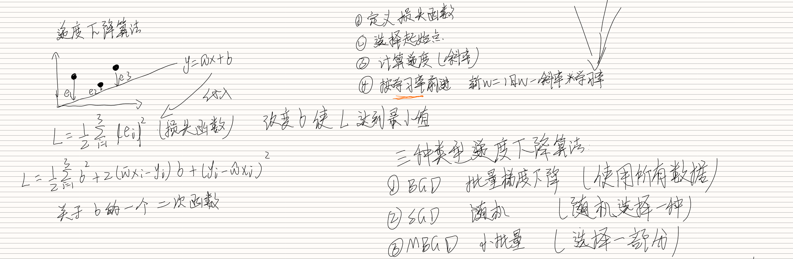

     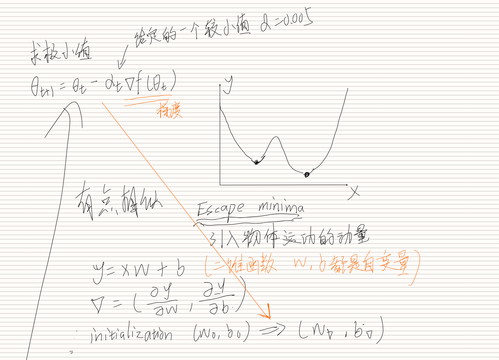

     ```python
     import numpy as np
     import pandas as pd
     from matplotlib import pyplot as plt
     #线性回归利用梯度下降求解
     path = 'D:\\学习\\数学建模\\LinearRegressionTest_data.txt'
     data = pd.read_csv(path, header=None)
     plt.scatter(data[:][0], data[:][1], marker='+')
     data = np.array(data)
     m = data.shape[0]  #获得数组的行数   shape[1]可以获得数组的列数
     theta = np.array([0, 0])    #初始化两个θ的值
     data = np.hstack([np.ones([m, 1]), data])   #将参数的元组水平方向叠加，相当于在所有数据前都加上了 1
     y = data[:,2]  #获得y
     data = data[:,:2]     #获得前面两列的数据
     
     #损失函数
     def cost_function(data, theta, y):
         cost = np.sum((data.dot(theta) - y) ** 2)    #将data和theta两个矩阵相乘
         return cost / (2 * m)
     
     #求得梯度
     def gradient(data, theta, y):
         grad = np.empty(len(theta))   #创建未初始化的数组
         grad[0] = np.sum(data.dot(theta) - y)
         for i in range(1, len(theta)):
             grad[i] = (data.dot(theta) - y).dot(data[:, i])
         return grad
     
     #梯度下降法
     def gradient_descent(data, theta, y, eta):
         while True:
             last_theta = theta
             grad = gradient(data, theta, y)
             theta = theta - eta * grad
             print(theta)
             if abs(cost_function(data, last_theta, y) - cost_function(data, theta, y)) < 1e-15:
                 break
         return theta
     
     
     res = gradient_descent(data, theta, y, 0.00001)
     X = np.arange(3, 25)
     Y = res[0] + res[1] * X
     plt.plot(X, Y, color='r')
     plt.show()
     ```

   * **最小二乘法**(OLS)

     本质上就是直接利用导数求极值的方式直接获得最大值或最小值。与梯度下降法的区别就是，梯度下降法通过每次选择梯度最大的方向前进，不断改变w和b的值，直到达到相对最优解（可能会陷入局部最优解）
     
   
2. **逐步回归**

   逐步回归主要解决的是**多变量共线性问题**，也就是不是线性无关的关系，它是基于变量解释性来进行特征提取的一种回归方法。

   本质上是多元线性回归，逐步回归是一种方法，能降低模型维度，得到满意模型性能

   数据要求：

   1. 需要至少2个自变量，且**自变量之间互相独立**
   2. 自变量与因变量之间存在线性关系，可以通过绘制散点图予以观察
   
   3. **因变量为为连续变量**，自变量为连续型变量或分类变量
   4. 数据具有**方差齐性、无异常值和正态分布**的特点检验方法
   
   5. **自变量间不存在多重共线性**
   
   
   
3. **曲线回归**(多项式回归)

6. **logistic回归分析**

   Logistic回归分析属于非线性回归，研究**因变量为二项分类或多项分类结果与某些影响因素之间关系的一种多重(多元)回归分析方法。**

   构建的**分类器**是一个线性的分类器，其决策边界是一条直线（因为我们只使用了输入特征 x xx 的一次项）。为了得到一个非线性的决策边界，我们可以尝试构建输入特征的**多项式项**来刻画非线性关系。

   

   **[二分类logistic回归分析](https://blog.csdn.net/m0_60862600/article/details/122985622)、和有序Logistic回归分析**

   数据要求:

   1. 要求自变量之间**无多重共线性**

   2. Y为定类数据，X可以是定量数据或定类数据

      

   在线性回归的基础上加上了Sigmoid函数，使之成为分类算法

   分类输出的是离散数据（预测是否通过），回归输出的是连续数据（预测分数）
   分类得到的是决策面，用于对数据集中的数据进行分类；回归得到的是最优拟合线，这个线条可以最好的接近数据的每个点；
   对模型评估指标不一样：如何评估监督分类，通常使用正确率作为指标；回归中通常使用决定系数R平方表示模型评估的好坏，R平方可以表示有多少百分比的y波动被回归线所描述。

   **[多分类Logistic回归分析]((https://blog.csdn.net/m0_60862600/article/details/122986644?ops_request_misc=%7B%22request%5Fid%22%3A%22169234171916800180682340%22%2C%22scm%22%3A%2220140713.130102334..%22%7D&request_id=169234171916800180682340&biz_id=0&utm_medium=distribute.pc_search_result.none-task-blog-2~all~top_click~default-1-122986644-null-null.142^v93^chatsearchT3_2&utm_term=多分类逻辑回归&spm=1018.2226.3001.4187))：**

   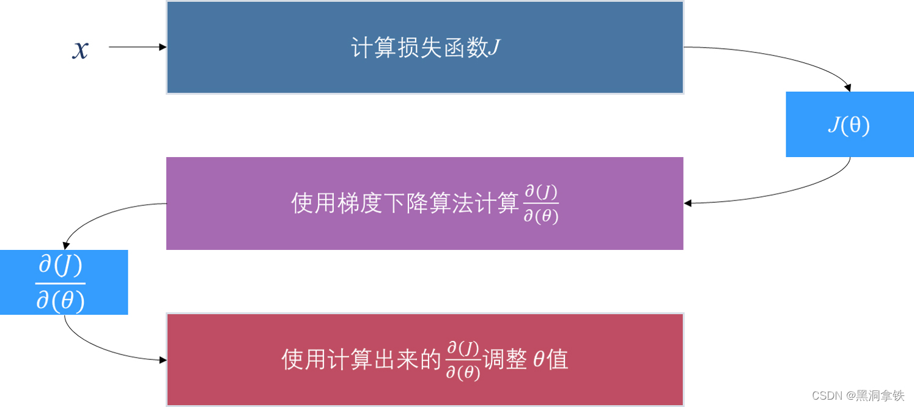

   

   **One-vs-all分类思想：**将每一个类别都单独训练二分类logistic回归模型，对于每个新的输入，使用训练出的分类器**分别计算“样本属于每个类别的概率”**，进而，选择概率值最高的那个类别作为该样本的预测类别。

7. **决策树回归**

   与分类树用基尼指数最小原则不同，对回归树用平方误差最小化准则

8. **随机森林回归**

9. **梯度提升树回归**

10. **保序回归**

11. **L1/2稀疏迭代回归**


### 分类模型

 #### 聚类分析

对样本进行分类称为**Q型聚类**分析，对指标进行分类称为**R型聚类**分析。

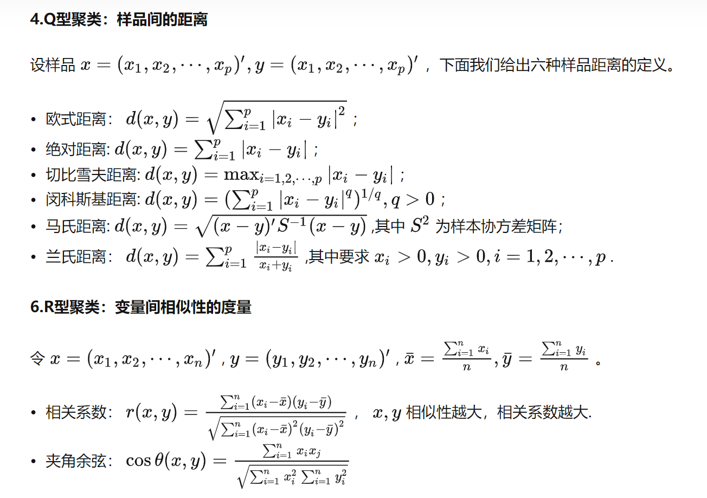

**聚类变量重要性：**在给定数据集上进行聚类时，我们可以尝试**不同的聚类数**，并计算每个聚类数下的**轮廓系数**（聚类结果的评价指标）。轮廓系数是一种衡量聚类结果**紧密度**和**分离度**的指标，取值范围在-1到1之间，数值越接近1表示聚类结果越好。

**簇内不相似度：**计算样本到同簇其它样本的平均距离为𝑎(𝑖)，应尽可能小。

**簇间不相似度**：计算样本𝑖到其它簇的所有样本的平均距离，应尽可能大。

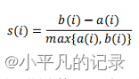


**适用条件：**层次聚类算法对时间和空间需求很大，所以层次适合于小型数据集的聚类

####决策树分类

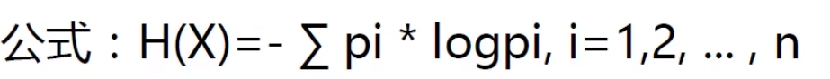

信息熵，衡量集合中的混乱程度，当分类完成后，可以根据集合中熵的值来判断分类的程度，H(X)越大表示集合中越混乱，分类效果越差。

如果是**回归问题**的话，就不同能过类别计算特征的信息熵，而是通过方差，如果基于一个特征分类完后，集合中的值方差很小，表示分类效果不错，值都比较相近。然后对训练模型进行预测的话，可以通过计算集合中的平均值来作为预测值

**ID3：**计算信息增益，适用于每个特征都是**定类变量**，能够计算该特种中每个类别的信息熵，然后加权得到基于该特征分类的信息熵，再计算信息增益。但是如果对于定序或定距或类别比较多的特征，考虑一种极端情况，每个样本是该特征中的一个种类，那么该特征的信息熵计算出来就是0（因为该特征中每个类别的信息熵都是0，都只有一个样本对于这个类别），这就是ID3的缺陷。

**C4.5：**计算信息增益率，解决ID3的问题，考虑某特征的自身熵值。

**CART :**使用Gini系数当作衡量标准，和熵值类似

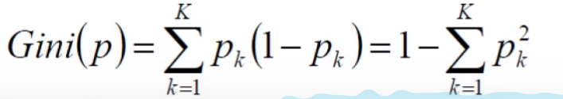


### 集成算法

#### Bagging模型

典型的是随机森林，很多个决策树并行放在一起，数据随机采样来训练模型，树之间不产生干扰。

####Boosting模型

提升算法

#### Stacking模型


### BP神经网络

神经网络输入层到隐含层的第一组权值如何确定？

### 预测与评价方法

  **[评价类问题](https://www.cnblogs.com/haohai9309/p/17204510.html)**对因素规范化前，先对指标（中间型、极小型）进行极大化处理，就是全部转化为极大型指标，在进行归一化或标准化。

| 极大型（效益型）指标 | 越大（多）越好   | 成绩、GDP增速、企业利润  |
| -------------------- | :--------------- | ------------------------ |
| 极小型（成本型）指标 | 越小（少）越好   | 费用、坏品率、污染程度   |
| 中间型指标           | 越接近某个值越好 | 水质量评估时的PH值       |
| 区间型指标           | 落在某个区间最好 | 体温、水中植物性营养物量 |


####**移动平均法(Moving Average)**

用于对**平稳序列**进行预测

* **SMA(简单移动平均)**

  **固定跨越期限**内求**平均值**作为预测值

* **WMA(加权移动平均)**

  加权移动平均给**固定跨越期限**内的每个变量值以不同的权重

* **EMA(指数移动平均）**

  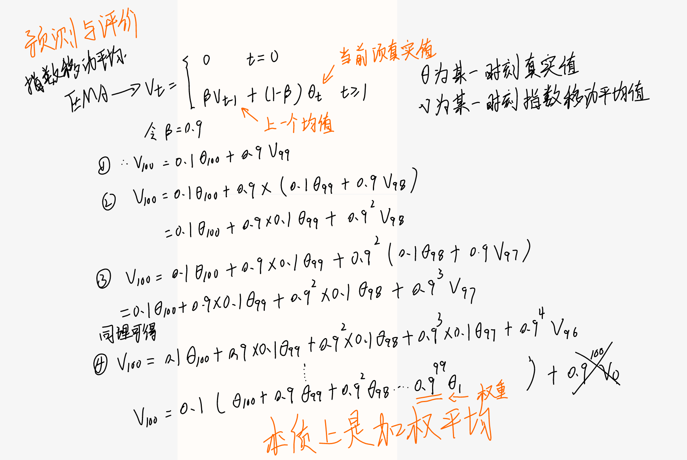

  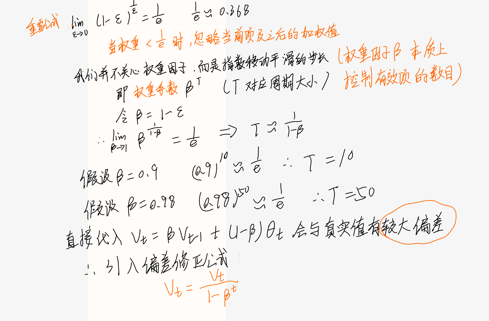

  随着权重因子 β 的增大（β增大，表示先前的指数移动平均占比增大），指数移动平均曲线逐渐变得更加平滑，但同时指数移动平均值的实时性（当前值所占的比重减小，对平均值的影响减弱）也随之变弱。

  ```python
  
  '''
  指数平均和引入偏差修正公式后的指数平均预测对比
  '''
  import matplotlib.pyplot as plt
  import numpy as np
  
  
  def main():
      beta = 0.9    #权重系数
      num_samples = 100   #样本数量
  
      # step 1 generate random seed
      np.random.seed(0)
      raw_tmp= np.random.randint(32, 38, size=num_samples)
      x_index = np.arange(num_samples)
      # raw_tmp = [35, 34, 37, 36, 35, 38, 37, 37, 39, 38, 37]  # temperature
      print(raw_tmp)
  
      # step 2 calculate ema result and do not use correction
      v_ema = []
      v_pre = 0
      for i, t in enumerate(raw_tmp):
          v_t = beta * v_pre + (1-beta) * t
          v_ema.append(v_t)    
          v_pre = v_t   #记录前一个指数移动平均数
      print("v_mea:", v_ema)
  
      # step 3 correct the ema results
      v_ema_corr = []
      for i, t in enumerate(v_ema):
          v_ema_corr.append(t/(1-np.power(beta, i+1)))
      print("v_ema_corr", v_ema_corr)
  
      # step 4 plot ema and correction ema reslut
      plt.plot(x_index, raw_tmp, label='raw_tmp')  # Plot some data on the (implicit) axes.
      plt.plot(x_index, v_ema, label='v_ema')  # etc.
      plt.plot(x_index, v_ema_corr, label='v_ema_corr')
      plt.xlabel('time')
      plt.ylabel('T')
      plt.title("exponential moving average")
      plt.legend()
      plt.savefig('./ema.png')
      plt.show()
  
  
  if __name__ == "__main__":
      main()
  ```

#### 灰色预测模型

基于时间序列的预测


#### 长短期记忆（Long Short Term Memory，LSTM）网络

基于时间序列的预测，可以记住早先时刻的信息，是一种特殊的233模型（RNN，循环神经网络）

模型的自变量为历史数据，因变量未来某时刻的数据。


#### 马尔科夫预测


#### 灰色关联分析

灰色关联分析的基本思想是**根据序列（比如时间序列）**曲线几何形状的相似程度来判断其联系是否紧密。曲线越接近，相应序列之间的关联度就越大，反之就越小。**用于确定各因素对其所在系统里的影响因素（系统作为参考数列）**或者**综合评价，进行优劣排名（标准值作为参考数列）**

**灰色关联度计算方式：**

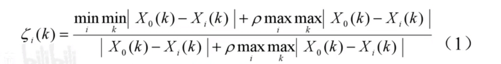

**关联度计算：**每列因素的灰色关联度**求均值**即为某因素的关联度

**指标权重计算：**通过各指标的关联度计算各指标的权重

**评价对象得分计算：**归一化后的指标*权重并求和

####熵权法 

算法步骤：

1. **数据归一化**

   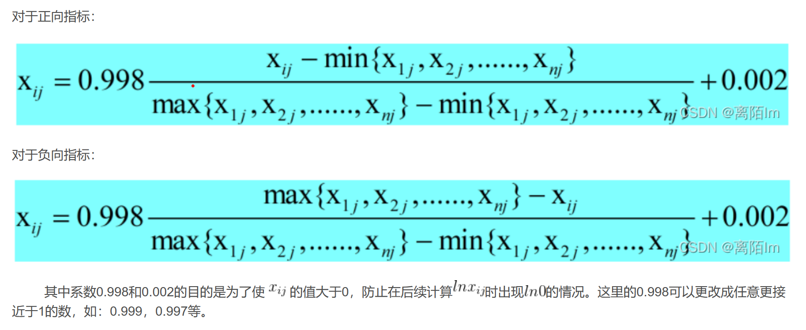

2. **计算第j项指标下第i个方案的指标值比重**

   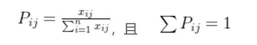

3. **计算第j项指标的信息熵**

   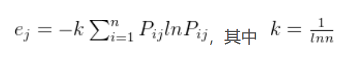

4. **计算各指标的权重**

   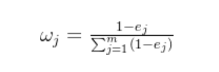

5. **计算评价对象的综合评价值**

   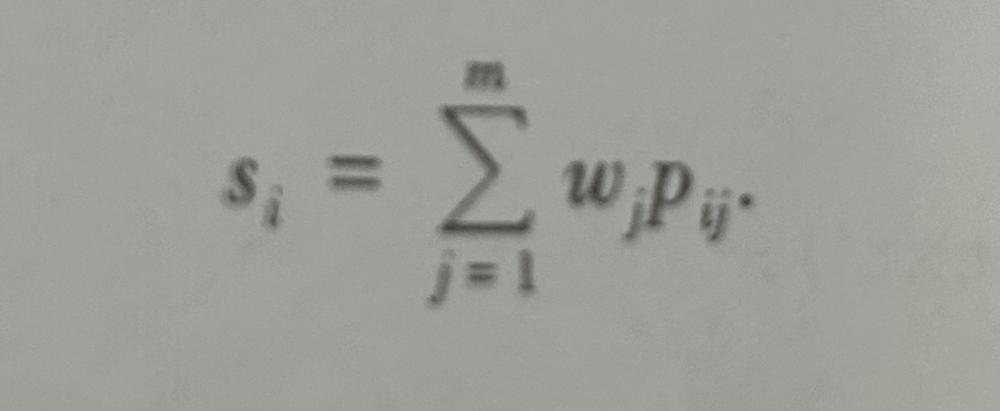

#### 模糊综合评价法

因素集（评价指标集）  U = {u1,u2,…,un}
评语集（评价的结果集） V = {v1,v2,…,vm}
权重集（指标的权重）  A = {a1,a2,…,an}

评判结果集						    B=[b1,b2,...bn]

1. **一级综合模糊评价**

   主要用于考核涉及指标较少

   **评价步骤：**

   1. 确定因素集（考核的指标）

   2. 确定评语集（比如好、较好、中等、较差等评价）

   3. 确定各因素的权重（确定权重的方式可以是熵权法、层次分析法）

   4. 确定模糊综合判断矩阵

      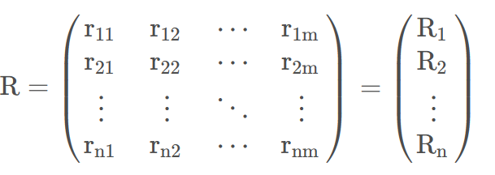

      该矩阵是通过定性分析得出的，每个人对ui指标按照评语集V进行评价，并统计出每个评语所占的比重，获得Ri

   5. 模糊综合评判

      综合评判的结果为     B=A⋅R

      bi的含义是要评价的对象对于评语 i 的**隶属度**，选取隶属程度最大的就是评价对象的评价结果

2. **多层次模糊评价**

   主要用于考核涉及的指标复杂，具有多层次（某个指标可以分为更细的评价指标）

   评价步骤与一级综合模糊评价类似，先对一级指标中的二级指标进行评判，得到的B就是更高层次评价的R（得到的评判结果作为高层次评价的判断矩阵），然后对一级指标重复上述步骤进行评价。

   **例如如下情况**

   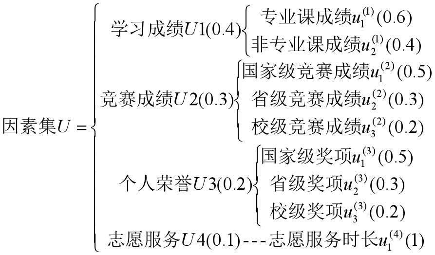
   
   
   
   

#### 数据包络DEA分析法

用于评价效率问题

#### Topsis综合评价方法


### 仿真方法

1. Monte Carlo Method（蒙特卡洛法）

   蒙特卡罗方法又称统计模拟法、**随机抽样技术**，是一种随机模拟方法，多用于求解复杂的多维积分问题

   每次输入都随机选择输入值。由于每个输入很多时候本身就是一个**估计区间**(可能是均匀分布，也可能是正态分布)，因此计算机模型会随机选取每个输入的该区间内的任意值，通过大量成千上万甚至百万次的模拟次数，最终得出一个累计概率分布图
   
   * 取舍采样（rejection sampling）
   * 马尔科夫链MC采样 

2. 元胞自动机


### 差异性分析

Pearson:相关系数：用于衡量两个连续变量之间的线性关系。具有计算简单、解释方便、可比性强等优点，但缺点是对异常值敏感，对非线性关系不敏感。
Spearman: 相关系数：用于衡量两个变量之间的单调关系。它具有不受异常值影响、不要求数据呈正态分布等优点，适用于非线性单调关系的情况，但是可能会忽略掉数据间的差异信息。

Kendall 相关系数：也用于衡量两个变量之间的单调关系。与 Spearman
相关系数相比，它更加稳健，能够有效处理小样本问题，但是计算复杂度较高。

切比雪夫相关系数：用于衡量两个变量之间的距离或差异。它具有不受数据分布和缩放影响的优点，但是对于极端异常值的情况，可能不够稳健。

Eta 相关系数：用于衡量两个分类变量之间的关系。由于是基于卡方检验的效果量，因此具有显著性水平的信息，但是只能处理两个变量之间的关系。

互信息：用于衡量两个变量之间的非线性关系。它比 Pearson
相关系数更加灵活，能够处理多元关系和噪声干扰的情况，但是计算复杂度较高，需要大量的样本数据支持。

综上所述，不同的相关系数适用于不同的数据类型和研究目的，选择合适的方法能够得到更准确的结果。

1. **卡方检验（**观察频率预期频率之间是否存在显著性差异）**类别变量对类别变量**

   **适用于不服从正态分布的数据，两组变量是无序的**

   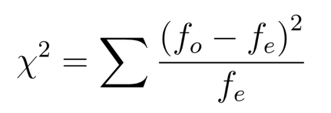

   fo为观测值频数，fe为期望值频数。当计算出的卡方值大于卡方临界值时，就可以拒绝零假设 

   **卡方临界值**通过**自由度**+**α**（显著性水平）查表获得（一般α=0.05）

   * 卡方拟合度检验（单因素卡方检验）

     针对一个类别变量

     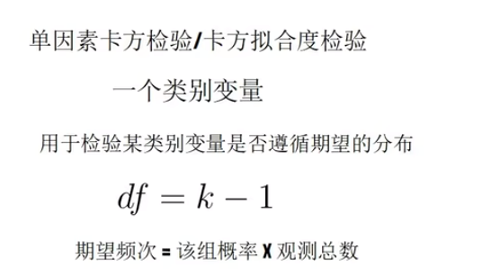

   * 卡方独立性检验（二因素卡方检验）

     针对两个类别变量

     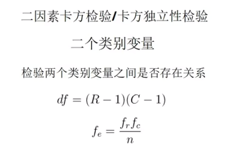

     ​												fr为行观测频数的和，fc为列观测频数的和，n为样本总量

2. **独立样本t检验**

   二分类变量对连续变量

3. **单因素方差分析**

   多分类变量对连续变量

4. **相关型分析**

   连续变量对连续变量

   * **Pearson相关系数**

     Pearson相关系数用于评估两组数据是否符合线性关系，不能用于符合曲线关系的数据

     这种统计方法本身不区分自变量和因变量，

   * **Spearman相关系数**
   
     均为有序分类变量
     
     spearman相关系数适用于不满足线性关系，且不满足正态分布的数据
     
     **可以**认为是**定距变量:**
     
     **Mantel-Haenszel 趋势检验**。该检验也被称为Mantel-Haenszel 卡方检验、Mantel-Haenszel 趋势卡方检验。该检验根据研究者对有序分类变量类别的赋值，判断两个有序分类变量之间的线性趋势。
     
     **不能**认为是定距变量:
     
     Spearman相关又称Spearman秩相关，用于检验至少有一个有序分类变量的关联强度和方向
     


### 敏感性分析

是指从定量分析的角度研究有关因素发生某种变化对**某一个**或**一组关键指标**影响程度的一种不确定分析技术。每个输入的灵敏度用某个数值表示即敏感性指数


