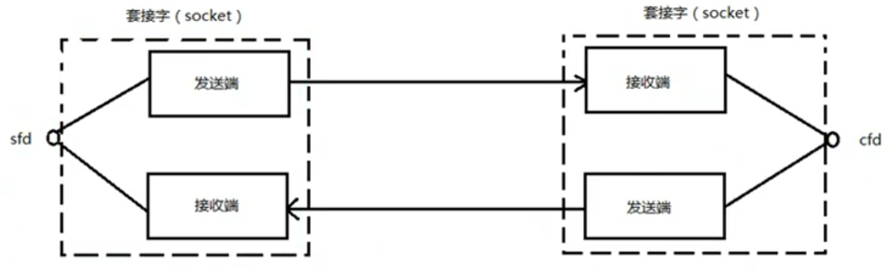
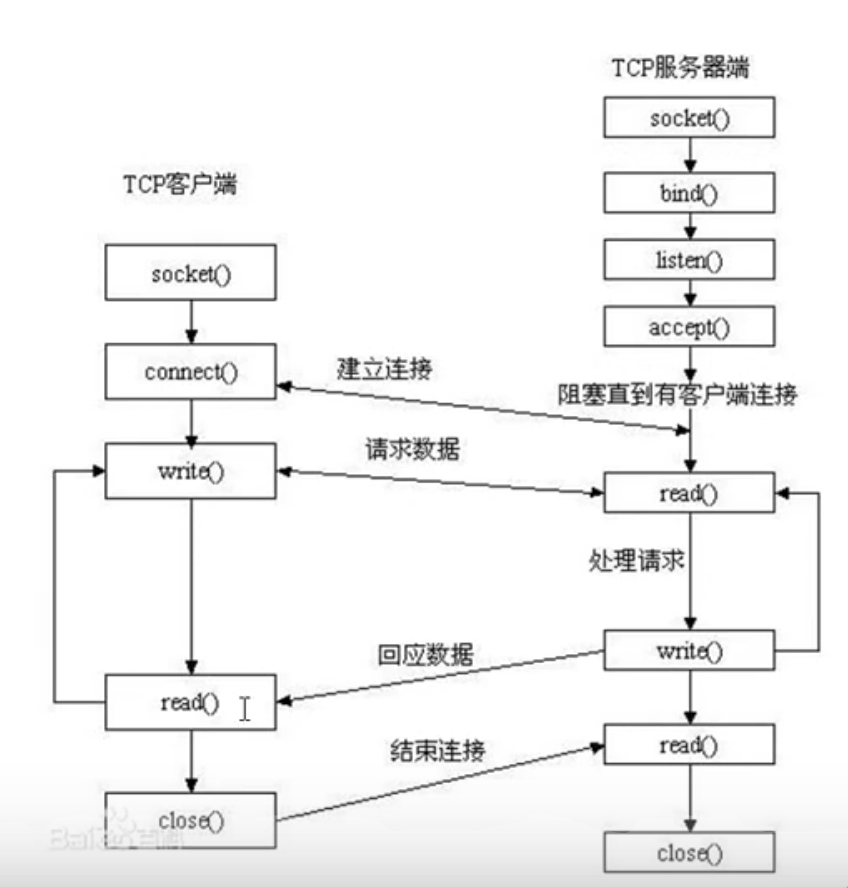

# 网络基础

##分层模型结构

分层模型结构：

OSI七层模型：物、数、网、传、会、表、应

TCP/IP模型：网络接口层、网络层、传输层、应用层

应用层：http、ftp、nfs、ssh、telnet
1
传输层：TCP、UDP、

网络层：IP、ICMP、IGMP

链路层：以太网帧协议、ARP

## 协议

### 以太帧协议

ARP协议：根据IP地址获取MAC地址

### IP协议

TTL：time to live。跳数

源IP/目的IP：32位，4字节

### TCP协议

源/目的端口号：16位

序号：32位

确认号：32位

标志位：6位

窗口大小：16位

## 网络套接字

socket：在通信过程中，socket是成对出现的

一个文件描述符指向一个套接字，该套接字内部由内核借助两个缓冲区实现。




## 半关闭

双方通信中，只有一端关闭通信。 FIN-WAIT2状态（主动关闭端）<---->CLOSE-WAIT状态（被动关闭端）

# Socket编程

## 网络字节序

小端法：高位高地址，低位低地址。

大端法：高位存低地址，低位存在高地址（**网络数据流采用大端字节序**）例如0x1234，高位12存在0号地址，低位34存在一号地址

##sock模型创建流程




##网络编程函数

### 网络套接字函数

**网络字节序**

```c
 #include <arpa/inet.h>
//h表示host，n表示network
uint32_t htonl(uint32_t hostlong);//针对IPv4   本地->网络

uint16_t htons(uint16_t hostshort);//针对端口port

uint32_t ntohl(uint32_t netlong);//本地IPv4

uint16_t ntohs(uint16_t netshort);//针对端口port
```


```c
int inet_pton(int af, const char *src, void *dst);//将IP字符串转化为网络字节序
af:AF_INET、AF_INET6
src：传入参数
dst：传出，转换后的网络字节序IP地址    

const char *inet_ntop(int af, const void *src,char *dst, socklen_t size); //将网络字节序转化为IP字符串
```

sockaddr数据结构

现在sockaddr退化成了(void*)的作用，最后强转成sockaddr_in还是sockaddr_in6，由地址族确定。

可参看`man 7 ip`


`#include<sys/socket.h>`

`int socket(int domain, int type, int protocol)`   创建一个套接字

domain：AF_INET、AF_INET6、AF_UNIX

type：SOCK_STREAM（代表TCP）、SOCK_DGRAM（代表UDP）

protocol：0   根据前面的协议选择

返回值：成功：新套接字对应的文件描述符

​				失败：-1，errno

`#include<arpa/inet.h>`

`int bind(int sockfd, const struct sockaddr *addr,socklen_t addrlen);` 给socket绑定一个地址结构（IP+port）

struct sockaddr_in addr;

addr.sin_family = AF_INET;

addr.sin_port = htol(8888);

addr.sin_addr.s_addr = htol(INADDR_ANY);      //INADDR_ANY取出系统中有效的任意IP地址。二进制类型

addr： (struct sockaddr*)&addr

addrlen：sizeof（addr）  地址结构的大小

返回值：成功：0

​				失败：-1，errno

`int listen(int sockfd, int backlog)`   设置同时与服务器连接的上限数（同时进行三次握手的客户端数量）

backlog：上限数值，最大为128

`int accept(int sockfd, struct sockaddr *addr, socklen_t *addrlen)`  

阻塞等待客户端建立连接，成功后返回一个与客户端成功连接的socket文件描述符

addr：传出参数。成功与服务端建立连接的那个客户端的地址结构

addrlen：传入传出。传入addr的大小，传出客户端addr的实际大小

返回值：成功：能与服务器进行通信的socket对应的文件描述符

​				失败：-1，errno

` int connect(int sockfd, const struct sockaddr *addr,socklen_t addrlen)`   与服务器建立连接

addr：传入参数，服务器的地址结构

返回值：成功：0

​				失败：-1，errno

如果不使用bind绑定客户端地址结构，会采用**隐式绑定**

`read函数返回值`

\>0：实际读到的字节数

=0：已经读到结尾（socket中，对端已经关闭）

-1：应该进一步判断errno的值

​	errno = EAGAIN or EWOULDBLOCK，设置非阻塞方式读，数据没有到达，需要再次读

​	errno = EINTR 慢速系统调用被终端，被异常中断，需要重启

​	errno = ECONNRESET 说明连接被重置，需要close()，移除监听队列

​	errno = “其他情况” 异常


`netstat -apn`  查看网络编程中进程所处的状态。通常结合管道查询指定端口`| grep 8000`


### 端口复用函数

当服务端主动关闭时，会在TIME-WAIT状态持续2MSL(Maximum Segment Lifetime)的时间，来等待对端的ack，此时的端口依然被占用，无法重启服务器（因为端口被占用，无法bind）

`int setsockopt(int sockfd, int level, int optname, const void *optval, socklen_t optlen);`

```c
//一般在地址绑定前设置端口复用
int opt=1;//设置端口复用
int ret = setsockopt(sockfd,SOL_SOCKET,SO_REUSEADDR,(void*)&opt,sizeof(opt));
```

### 半关闭函数

一个套件字有读缓冲区和写缓冲区，通过下面的函数可以控制缓冲区的关闭，一般来说都直接用`close()`来关闭

**`shutdown()`和`close()`的区别：**

如果用多个进程共享一个文件描述符，`shutdown()`不考虑文件描述符的引用计数，直接关闭文件描述符，但是`close()`每一次调用，引用计数会减1，最后减到0后，文件描述符才会被释放。

`int shutdown(int sockfd, int how);`

how：SHUT_RD关读端	SHUT_WR关写端	SHUT_RDWR关读写端

### IO复用

####select

`int select(int nfds, fd_set *readfds, fd_set *writefds, fd_set *exceptfds, struct timeval *timeout);`

参数：

nfds：表示在所有需要监听的文件符中，最大的文件描述符再加1。

fd_set：传入传出参数。传入时是要监听的，传出时实际有事件发生的。读、写、异常的套接字集合，本质上是个位图。

timeout：定时阻塞监控时间。传NULL：永远等下去。传timeval：等待固定时间。传timeval都设置为0：检查描述字后立即返回，轮询

返回值：

返回所有文件描述符集合中，发生读写或异常事件的总个数。

```c
//操作fd_set的函数
void FD_CLR(int fd, fd_set *set);//将某一个文件描述符清除，一般在客户端关闭后移除。
int  FD_ISSET(int fd, fd_set *set);//判断文件描述符是否在集合中
void FD_SET(int fd, fd_set *set);//添加
void FD_ZERO(fd_set *set);//置0
```

####poll

`int poll(struct pollfd *fds, nfds_t nfds, int timeout)`

fds：监听文件描述符的数组

struct pollfd {
               int   fd;         /* 待监听的文件描述符 \*/
               short events;     /* 监听事件：读POLL_IN、写POLLOUT、异常POLL_ERR\*/
               short revents;    /* 传入时，给0。如果满足对应事件，返回非0*/

};

nfds：监听数组的，实际有效监听个数

timeout：>0:超时时长。-1：阻塞等待。0：不阻塞

返回值：返回满足监听事件的文件描述符总个数。

**突破监听事件为1024的限制：**

`cat /proc/sys/fs/file-max`	查看当前计算机所能打开的最大文件的个数，与硬件相关

`ulimit -a`	当前用户下的进程，默认打开文件描述符的个数。缺省为1024

`sudo vi /etc/security/limits.conf` 可以修改当前用户进程可以打开的文件描述符的个数。

示例：`*               soft    nofile          3000`

####epoll

`int epoll_create(int size)`  返回的文件描述符，指向一棵平衡二叉树（红黑树）

size：表示要创建的红黑树，监听节点的数量（仅供内核参考）

`int epoll_ctl(int epfd, int op, int fd, struct epoll_event *event)`	控制红黑树进行操作

epfd：epoll文件描述符

op：对监听红黑树的操作。EPOLL_CTL_ADD添加节点 	EPOLL_CTL_MOD修改节点	EPOLL_CTL_DEL删除节点（取消监听）

fd：待监听的文件描述符

event：struct epoll_event结构体地址。

​	uint32_t     events：EPOLLIN、EPOLLOUT、EPOLLERR

​	epoll_data_t data：

typedef union epoll_data {
               void        *ptr;
               int          fd;   对应监听事件的文件描述符
               uint32_t     u32;
               uint64_t     u64;
} epoll_data_t;


`int epoll_wait(int epfd, struct epoll_event *events,int maxevents, int timeout)`

events：是一个【数组】，传出参数。满足监听条件的结构体（里面包含事件+文件描述符）

maxevents：数组元素的总个数，避免传出参数数量越界

timeout:：

​	-1：阻塞

​	0：不阻塞

​	>0：超时事件

返回值：

​	>0：满足监听的总个数。

​	0：没有满足监听条件的事件

​	-1：errno


**epoll事件模式：**

​	ET模式：边沿触发。如果事件就绪后，没有读完缓冲区，内核也不会再次通知，直到下一次事件触发（也就是客户端又写数据了）

​	`struct epoll_event event `

​	`event.events=EPOLLIN | EPOLLET`

​	LT模式：水平出发（默认采用模式）：事件就绪后，如果没有读完缓冲区，内核会反复通知，也就是说即便客户端没有发新数据，事件也会被触发，epoll_wait()函数也会又返回值。
ET模式是一个高效模式，但是只支持非阻塞模式（设置socket文件描述符未O_NONBLOCK）

```c
//设置ET模式 为非阻塞模式
struct epoll_event event;
event.events = EPOLLIN | EPOLLET;
epoll_ctl(epfd,EPOLL_CTL_ADD,cfd,&event);
int flg=fcntl(cfd,F_GETFL);
flg |=O_NONBLOCK;
fcntl(cfd,F_SETFL,flg);
```

## UDP实现C/S模型

`sendto()`

`recvfrom()`

##TCP实现C/S模型

```c
#include<stdio.h>
#include<string.h>
#include<stdlib.h>
#include<sys/socket.h>
#include<netinet/ip.h>
#include<unistd.h>
#include<arpa/inet.h>
/*客户端发送字符串给服务端*/
void sys_err(const char* str){
    perror(str);
    exit(1);
}
int main(){
    //创建socket
    int clientfd=socket(AF_INET,SOCK_STREAM,0);
    //发起与服务端的连接
    struct sockaddr_in server_addr;
    server_addr.sin_family=AF_INET;
    server_addr.sin_port=htons(6666);
    char* ipv4="0.0.0.0";
    inet_pton(AF_INET,ipv4,&server_addr.sin_addr.s_addr);
    int ret=connect(clientfd,(struct sockaddr*)&server_addr,sizeof(server_addr));
    if(ret==-1)
        sys_err("client connect error");
    int cnt=5;
    char buf[1024];
    char* str="hello";
    while(cnt--){
        printf("---rount-%d-----\n",cnt);
        //向服务端发送数据
        write(clientfd,str,strlen(str));
        //读取服务端发送来的数据
        sleep(1);
        int size=read(clientfd,buf,sizeof(buf));
    //  write(STDOUT_FILENO,buf,size);
        //主动加上字符串结尾\0，否则printf打印字符串会出现异常，因为搜索不到字符串结尾
        buf[size]='\0';
        printf("client receive %s from server! size:%d\n",buf,size);
    }
    //关闭服务端连接
    close(clientfd);
    return 0;
}
```

```c
#include<stdio.h>
#include<stdlib.h>
#include<sys/socket.h>
#include<ctype.h>
#include<unistd.h>
#include<netinet/ip.h>
#include<arpa/inet.h>
/*服务端将字符串转为大写并发送给客户端*/
void sys_err(const char* str){
    perror(str);
    exit(1);
}
int main(){
    //创建socket
    int sockfd = socket(AF_INET,SOCK_STREAM,0);
    //绑定ip+port
    struct sockaddr_in addr;
    addr.sin_family = AF_INET;
    addr.sin_port = htons(6666);
    addr.sin_addr.s_addr=htonl(INADDR_ANY);
    int ret=bind(sockfd,(struct sockaddr*)&addr,sizeof(addr));
    if(ret==-1)
        sys_err("server bind error");
    //打印服务器地址和端口号
    char serve_IP[1024];
    printf("server IP:%s,port:%d\n",
            inet_ntop(AF_INET,&addr.sin_addr.s_addr,serve_IP,sizeof(serve_IP)),
            ntohs(addr.sin_port));
    //设置服务器监听上限
    ret=listen(sockfd,20);
    if(ret==-1)
        sys_err("server listen error");
    //监听客户端连接
    struct sockaddr_in client_addr;
    socklen_t client_addr_len=sizeof(client_addr);
    int serverfd=accept(sockfd,(struct sockaddr*)&client_addr,&client_addr_len);
    if(serverfd==-1)
        sys_err("server accept error");
    //打印客户端ip地址和端口号
    char client_IP[1024];
    printf("client IP:%s,port:%d\n",
            inet_ntop(AF_INET,&client_addr.sin_addr.s_addr,client_IP,sizeof(client_IP)),
                ntohs(client_addr.sin_port));
    int cnt=5;
    char buf[1024];
    while(cnt--){
        //读取客户端内容
        sleep(1);
        int size=read(serverfd,buf,sizeof(buf));
        printf("size = %d\n",size);
        printf("------round%d-----\n",cnt);
        //主动加上字符串结尾\0，否则printf打印字符串会出现异常，因为搜索不到字符串结尾
        buf[size]='\0';
        printf("server receive \"%s\" from client\n",buf);
        //将小写转为大写
        for(int i=0;i<size;i++){
            buf[i]=toupper(buf[i]);
        }
        //发送回客户端
        write(serverfd,buf,size);
        printf("server send \"%s\" to client\n",buf);
    }
    //关闭连接
    close(serverfd);
    close(sockfd);
    return 0;
}
```

##错误处理函数封装

将系统调用+错误处理都封装到自定义的函数中，让代码逻辑性更强。

```c
#ifndef _WRAP_H_
#define _WRAP_H_
#include<stdio.h>
#include<stdlib.h>
#include<sys/socket.h>
#include<ctype.h>
#include<unistd.h>
#include<netinet/ip.h>
#include<arpa/inet.h>

void sys_err(char* str);
int Socket(int domain, int type, int protocol);
int Bind(int sockfd, const struct sockaddr *addr,socklen_t addrlen);
int Listen(int sockfd, int backlog);
int Accept(int sockfd, struct sockaddr *addr, socklen_t *addrlen);

#endif

```

```c
#include "wrap.h"

void sys_err(char* str){

    perror(str);
    exit(1);
}

int Socket(int domain, int type, int protocol){
    int sockfd=socket(domain,type,protocol);
    if(sockfd==-1){
        sys_err("socket error");
        return -1;
    }
    return sockfd;
}
int Bind(int sockfd, const struct sockaddr *addr,socklen_t addrlen){

    int ret=bind(sockfd,addr,addrlen);
    if(ret==-1){
        perror("bind error");
        return -1; 
    }   
    return 0;

}
```

## 本地套接字

`int socket(int domain,int type,int protocol)`

domain : AF_UNIX,AF_LOCAL

type：SOCK_STREAM、SOCK_DGRAM

```c++
//服务端
using namespace std;
#include<iostream>
#include"wrap.h"
#include<sys/un.h>
#define SOCKET_PATH "server.socket"
int main(){

    int lfd=Socket(AF_UNIX,SOCK_STREAM,0);
    //绑定服务端地址结构
    struct sockaddr_un serv_addr;
    serv_addr.sun_family=AF_UNIX;
    strcpy(serv_addr.sun_path,SOCKET_PATH);
    //在创建套接字文件前先删除
    unlink(SOCKET_PATH);
    Bind(lfd,reinterpret_cast<struct sockaddr*>(&serv_addr),sizeof(serv_addr));
    Listen(lfd,128);
    while(1){
        struct sockaddr_un client_addr;
        socklen_t client_addr_len=sizeof(client_addr);
        int cfd=Accept(lfd,reinterpret_cast<struct sockaddr*>(&client_addr),&client_addr_len);
        cout<<"client is connected cfd:"<<cfd<<endl;
        char buf[1024];
        while(1){
            int size=read(cfd,buf,sizeof(buf));
            if(size<0){
                continue;
            }else if(size==0){
                close(cfd);
                break;
            }   
            write(STDOUT_FILENO,buf,size);
            write(cfd,buf,size);
        }   
    }
}
```

```c++
//客户端
using namespace std;
#include<iostream>
#include"wrap.h"
#include<sys/un.h>
#define SOCKET_PATH "client.socket"


int main(){
    
    int cfd=Socket(AF_UNIX,SOCK_STREAM,0);
    struct sockaddr_un client_addr;
    //绑定本地套接字文件
    client_addr.sun_family=AF_UNIX;
    strcpy(client_addr.sun_path,SOCKET_PATH);
    //int len=offsetof(struct sockaddr_un,sun_path)+sizeof(client_addr.sun_path);
    unlink(SOCKET_PATH);
    Bind(cfd,reinterpret_cast<struct sockaddr*>(&client_addr),static_cast<socklen_t>(len));
    //连接服务器
    struct sockaddr_un serv_addr;
    serv_addr.sun_family=AF_UNIX;
    strcpy(serv_addr.sun_path,"./server.socket");//注意这里要填路径，就算是同一个目录下，也要加./
    int ret=connect(cfd,reinterpret_cast<struct sockaddr*>(&serv_addr),sizeof(serv_addr));
    if(ret==-1){
        perror("connect error");
        exit(1);
    }   
    char buf[1024]="hello\n";
    while(1){
            write(cfd,buf,6);
            sleep(2);
            int size=read(cfd,buf,sizeof(buf));
            if(size<0){
                continue;
            }else if(size==0){
                close(cfd);
                break;
            }
            write(STDOUT_FILENO,buf,size);
    }
}
```

## libevent库

 开源、精简、跨平台（Windows、Linux、maxos、unix）、专注于网络通信

## 信号

### error

1. SIGPIPE信号。当客户端向服务端发送完数据后直接关闭客户端，服务器返回消息的时候，客户端会收到SIGPIPE信号。因为TCP是全双工通信，client端调用close，只能关闭发送的通道，依然可以接收数据，如果此时服务端发送数据过来，客户端收到SIGPIPE信号可能会崩溃，所以我们需要忽略SIGPIPE信号。`signal(SIGPIPE, SIG_IGN);`

#高性能服务器


## 多进程并发服务器

```c
#include "wrap.h"
#include<sys/wait.h>
/*多进程并发服务器*/
//父进程监听请求
//子进程建立连接
void wait_child(int signo){
    //注册信号回收子进程
    pid_t pid;
    int status;
    while((pid=wait(&status))!=-1){
        printf("the child process %d is recycled\n",pid);
        if(WIFEXITED(status)){
            printf("the child process exit normally\n");
        }else if(WIFSIGNALED(status)){
            printf("the child process is terminated by signal %d\n",WTERMSIG(status));
        }   
    }   
    
}
int main(){
    //创建监听socket
    int lfd=Socket(AF_INET,SOCK_STREAM,0);
    //绑定ip+port
    struct sockaddr_in addr;
    addr.sin_family=AF_INET;
    addr.sin_port=htons(6666);
    addr.sin_addr.s_addr=htonl(INADDR_ANY);
    Bind(lfd,(struct sockaddr*)&addr,sizeof(addr));
    //设置连接上限
    Listen(lfd,10);
    //注册信号用来回收子进程
    struct sigaction act;
    act.sa_handler=wait_child;
    sigemptyset(&act.sa_mask);
    act.sa_flags=0;
    sigaction(SIGCHLD,&act,NULL);
    while(1){
        struct sockaddr_in client_addr;
        socklen_t client_addr_len=sizeof(client_addr);
        //监听请求
        int serverfd=Accept(lfd,(struct sockaddr*)&client_addr,&client_addr_len);
        //创建子进程
        pid_t pid=fork();
        if(pid<0){
            perror("fork error");
            exit(1);
        }else if(pid==0){
            //子进程不需要用lfd，所以需要关闭	
            close(lfd);
            //读取客户端
            char client_IP[1024];
            printf("client initiates connection--ip:%s,port:%d\n",
                    inet_ntop(AF_INET,(void*)&client_addr.sin_addr.s_addr,client_IP,sizeof(client_IP)),
                    ntohs(client_addr.sin_port));
            char buf[1024];
            while(1){
                int size=read(serverfd,buf,sizeof(buf));
                buf[size]='\0';
                //转大写
                for(int i=0;i<size;i++){
                    buf[i]=toupper(buf[i]);
                }
                //发送回客户端
                write(serverfd,buf,size);
            }
            close(serverfd);
        }
    }
    close(lfd);
    return 0;
}
```

##多线程并发服务器

**Bug1：**

将socket文件描述符传入子线程时，`ret=pthread_create(&tid,&attr,pthread_func,(void*)(long)cfd);`上述这种方式将cfd作为参数传入子线程时，出现当多个客户端同时在对服务器进行读写操作时，此时向其中一个客户端进程发送信号终止，会导致所有客户端进程同时结束，服务端进程也因出现**段错误**被结束。

但是利用`ret=pthread_create(&tid,&attr,pthread_func,(void*)&s_in);`将socket文件描述符通过一个结构体指针的方式传入，就不会造成上述的错误。

**解决方式：**

还未解决！！

```c
#include "wrap.h"
#include<pthread.h>
#include<string.h>
/*多线程并发服务器*/
//主线程监听客户端连接
//子线程执行连接通信

//线程错误提示
void sys_perr(char* str,int num){
    fprintf(stderr,"%s error:%s\n",str,strerror(num));
    exit(1);
}
struct s_info{
    struct sockaddr_in client_addr;
    int cfd;
};
void* pthread_func(void* arg){

    struct s_info* s_in=(struct s_info*)arg;
    struct sockaddr_in addr=s_in->client_addr;
    int cfd=s_in->cfd;
   // int cfd=(long)arg;
    //读取数据
    char buf[1024];
    while(1){
        int size=read(cfd,buf,sizeof(buf));
        if(size==0){
            printf("the client %lu is closing....\n",pthread_self());
            break;
        }   
        buf[size]='\0';
        printf("server receive \"%s\" from client\n",buf);
        //转大写
        for(int i=0;i<size;i++){
            buf[i]=toupper(buf[i]);
        }
        //发送回客户端
        write(cfd,buf,size);
    }
    close(cfd);
    pthread_exit(0);
}
int main(){

    //创建socket
    int lfd=Socket(AF_INET,SOCK_STREAM,0);
    //绑定ip+port
    struct sockaddr_in addr;
    addr.sin_family=AF_INET;
    addr.sin_port=htons(6666);
    addr.sin_addr.s_addr=htonl(INADDR_ANY);
    Bind(lfd,(struct sockaddr*)&addr,sizeof(addr));
    //设置并发最大数量
    Listen(lfd,128);
    int cfd;
    struct sockaddr_in client_addr;
    socklen_t client_addr_len=sizeof(client_addr);
    while(1){

        //监听客户端连接
        cfd=Accept(lfd,(struct sockaddr*)&client_addr,&client_addr_len);
        //打印客户端ip和port
        char clientIP[1024];
        printf("the client has been connected--ip:%s port:%d\n",
                inet_ntop(AF_INET,(void*)&client_addr.sin_addr.s_addr,clientIP,sizeof(clientIP)),
                ntohs(addr.sin_port));
        //创建线程
        pthread_t tid;
        struct s_info s_in;//传入子线程的参数
        s_in.client_addr=client_addr;
        s_in.cfd=cfd;
        //设置线程为分离属性
        pthread_attr_t attr;
        int ret=pthread_attr_init(&attr);//初始化线程属性
        if(ret!=0)
            sys_perr("pthread_attr_init error",ret);
        ret=pthread_attr_setdetachstate(&attr,PTHREAD_CREATE_DETACHED);//设置分离属性
        if(ret!=0)
            sys_perr("pthread_attr_setdetachstate error",ret);
    	ret=pthread_create(&tid,&attr,pthread_func,(void*)&s_in);//创建线程
        //ret=pthread_create(&tid,&attr,pthread_func,(void*)(long)cfd);//创建线程
        if(ret!=0)
            sys_perr("pthread_attr_create error",ret);
        ret=pthread_attr_destroy(&attr);//销毁线程属性
        if(ret!=0)
            sys_perr("pthread_attr_destroy error",ret);

    }
    return 0;
```


##IO复用服务器

### select实现

不再由应用程序自己监听客户端的连接请求，取而代之由内核替应用程序监听，并报告应用程序，然后应用程序执行相应的动作。这样就将服务端进程解放了出来，不需要阻塞等待客户端的请求（**响应模式**）。

**优缺点分析：**

缺点：

1. 监听上限受文件描述符限制，最大1024个 
2. 检测是否有客户端请求时，需要自己添加代码逻辑提高运行效率，提高编码难度，**但是并不意味之性能低**，示例代码中是通过遍历所有文件描述符来判断是否有客户端请求。

优点：

1. 跨平台。win、linux、类Unix.....。跨平台完成文件描述符监听，后面讲的epoll只能用于linux系统中

```c
#include "wrap.h"
#include<math.h>
/*多路IO转接服务器*/
int main(){
	//创建socket
	int lfd=Socket(AF_INET,SOCK_STREAM,0);
	//绑定ip+port
	struct sockaddr_in addr;
	addr.sin_family=AF_INET;
	addr.sin_port=htons(6666);
	addr.sin_addr.s_addr=htonl(INADDR_ANY);
	//设置端口复用
	int opt=1;
	int ret=setsockopt(lfd,SOL_SOCKET,SO_REUSEADDR,(void*)&opt,sizeof(opt));
	Bind(lfd,(struct sockaddr*)&addr,sizeof(addr));
	//设置同时连接上限
	Listen(lfd,128);
	int maxfd=lfd;
	//设置fd_rset集合
	fd_set fd_rset,fd_total;
	FD_ZERO(&fd_total);//清0
	FD_SET(lfd,&fd_total);
	//设置时间间隔
	struct timeval val;
	val.tv_sec=0;
	val.tv_usec=0;
	while(1){
		fd_rset=fd_total;
		//设置多路IO转接
		int cnt=select(maxfd+1,&fd_rset,NULL,NULL,NULL);
		if(cnt<0){
			perror("select error");
			exit(1);
		}
		//大于0表示有请求到来
		if(cnt>0){
			if(FD_ISSET(lfd,&fd_rset)){
				struct sockaddr_in client_fd;
				socklen_t client_fd_len=sizeof(client_fd);
				int cfd=Accept(lfd,(struct sockaddr*)&client_fd,&client_fd_len);
				char clientIP[1024];
				printf("the client is connected--ip:%s port:%d\n",
						inet_ntop(AF_INET,&client_fd.sin_addr.s_addr,clientIP,sizeof(clientIP)),
						ntohs(client_fd.sin_port));
				FD_SET(cfd,&fd_total);//加入需要监听的集合
				if(cfd>maxfd)maxfd=cfd;
				if(cnt==1){
					//表示没有其他请求了
					continue;
				}
			}
			//遍历所有套接字判断是否有请求
			char buf[1024];
			for(int i=lfd+1;i<=maxfd;i++){
				if(FD_ISSET(i,&fd_rset)){
					int size=read(i,buf,sizeof(buf));
					if(size==0){
						//对端已经关闭连接
						FD_CLR(i,&fd_total);
						close(i);
					}else{
						buf[size]='\0';
						printf("server receive %s from client\n",buf);
						//转大写
						for(int k=0;k<size;k++){
							buf[k]=toupper(buf[k]);
						}
						write(i,buf,size);
						//write(STDOUT_FILENO,buf,size);
					}
				}
			}//for
		}//if(cnt>0)	
		else{
			printf("the server receive NULL\n");
		}
	}//while(1)
	return 0;
}
```

### poll实现

**优缺点分析：**

优点：

1. 自带数组结构，可以将监听数据集合和返回事件集合分离
2. 拓展监听上限，超出1024的上线

缺点：

1. 不能跨平台，只能在Linux上用

### epoll实现

优缺点分析：

优点：

1. 高效。
2. 突破1024文件描述符

缺点：

1. 不能跨平台。

```c
#include<stdio.h>
#include<stdlib.h>
#include "wrap.h"

/*epoll实现多路IO复用*/
int main(){

    //建立socket
    int lfd=Socket(AF_INET,SOCK_STREAM,0);
    //绑定ip+port
    struct sockaddr_in addr;
    addr.sin_family=AF_INET;
    addr.sin_port=htons(6666);
    addr.sin_addr.s_addr=htonl(INADDR_ANY);
    Bind(lfd,(struct sockaddr*)&addr,sizeof(addr));
    //设置上限
    Listen(lfd,128);
    //创建epoll红黑树
    int epfd=Epoll_create(128);
    //添加lfd到监听红黑树中
    struct epoll_event event;
    event.events=EPOLLIN;
    event.data.fd=lfd;
    Epoll_ctl(epfd,EPOLL_CTL_ADD,lfd,&event);
    struct epoll_event events[1024];//记录当前监听到的事件
    while(1){
        int n=epoll_wait(epfd,events,1024,0);
        //printf("n:%d\n",n);
        if(n>0){
            //表示监听到事件
            for(int i=0;i<n;i++){
                if(events[i].events & EPOLLIN){
                    int comefd=events[i].data.fd;
                    if(comefd==lfd){
                        //有新的连接请求
                        struct sockaddr_in client_addr;
                        socklen_t client_addr_len=sizeof(client_addr);
                        int cfd=Accept(comefd,(struct sockaddr*)&client_addr,&client_addr_len);
                        //加入到监听红黑树中
                        struct epoll_event cli_event;
                        cli_event.events=EPOLLIN;
                        cli_event.data.fd=cfd;
                        Epoll_ctl(epfd,EPOLL_CTL_ADD,cfd,&cli_event);

                    }else{
                        //客户端发送来数据
                        char buf[1024];
                        int size=read(comefd,buf,sizeof(buf));
                        if(size==0){
                            //表示客户端已经关闭
                            Epoll_ctl(epfd,EPOLL_CTL_DEL,comefd,&events[i]);
                            close(comefd);
                        }else if(size>0){
                            for(int k=0;k<size;k++){
                                buf[k]=toupper(buf[k]);
                            }
                            write(comefd,buf,size);
                        }
                    }
                }
            }//for(i)
        }//if(n>0)
    }//while(1)

    return 0;
}
```

###epoll reactor实现

epoll ET模式+非阻塞忙轮询+void *ptr   (epoll_event中的成员data联合体中的变量-常用的是fd)

不但要监听cfd的读事件（EPOLLIN），还要监听cfd的写事件（EPOLLOUT）。

**代码流程分析**

1. 创建lfd，绑定端口ip等网络编程的初始化操作。创建epfd监听红黑树
2. 将lfd加入红黑树，并绑定acceptconn回调函数，在有EPOLLIN请求时调用。
3. acceptconn被调用时，创建cfd，绑定recvdata回调函数，并加入红黑树，监听EPOLLIN请求。
4. 在recvdata回调函数被调用时，表示已经监听到读请求。将cfd重新绑定回调函数为senddata，将监听模式换为位EPOLLOUT，重新加入监听红黑树。
5. 在senddata回调函数被调用时，表示可以向客户端发送数据，那么重新将cfd绑定回调函数为recvdata，将监听模式换为EPOLLIN，重新加入监听红黑树。

```c
#include <stdio.h>
#include <sys/socket.h>
#include <sys/epoll.h>
#include <arpa/inet.h>
#include <fcntl.h>
#include <unistd.h>
#include <errno.h>
#include <string.h>
#include <stdlib.h>
#include <time.h>

#define MAX_EVENTS 1024 /*监听上限*/
#define BUFLEN  4096    /*缓存区大小*/
#define SERV_PORT 6666  /*端口号*/

void recvdata(int fd,int events,void *arg);
void senddata(int fd,int events,void *arg);

/*描述就绪文件描述符的相关信息*/
struct myevent_s
{
    int fd;             //要监听的文件描述符
    int events;         //对应的监听事件，EPOLLIN和EPLLOUT
    void *arg;          //指向自己结构体指针
    void (*call_back)(int fd,int events,void *arg); //回调函数
    int status;         //是否在监听:1->在红黑树上(监听), 0->不在(不监听)
    char buf[BUFLEN];   
    int len;
    long last_active;   //记录每次加入红黑树 g_efd 的时间值
};

int g_efd;      //全局变量，作为红黑树根
struct myevent_s g_events[MAX_EVENTS+1];    //自定义结构体类型数组. +1-->listen fd


/*
 * 封装一个自定义事件，包括fd，这个fd的回调函数，还有一个额外的参数项
 * 注意：在封装这个事件的时候，为这个事件指明了回调函数，一般来说，一个fd只对一个特定的事件
 * 感兴趣，当这个事件发生的时候，就调用这个回调函数
 */
void eventset(struct myevent_s *ev, int fd, void (*call_back)(int fd,int events,void *arg), void *arg)
{
    ev->fd = fd;
    ev->call_back = call_back;
    ev->events = 0;
    ev->arg = arg;
    ev->status = 0;
    if(ev->len <= 0)
    {
        memset(ev->buf, 0, sizeof(ev->buf));
        ev->len = 0;
    }
    ev->last_active = time(NULL); //调用eventset函数的时间
    return;
}

/* 向 epoll监听的红黑树 添加一个文件描述符 */
void eventadd(int efd, int events, struct myevent_s *ev)
{
    struct epoll_event epv={0, {0}};
    int op = 0;
    epv.data.ptr = ev; // ptr指向一个结构体（之前的epoll模型红黑树上挂载的是文件描述符cfd和lfd，现在是ptr指针）
    epv.events = ev->events = events; //EPOLLIN 或 EPOLLOUT
    if(ev->status == 0)       //status 说明文件描述符是否在红黑树上 0不在，1 在
    {
        op = EPOLL_CTL_ADD; //将其加入红黑树 g_efd, 并将status置1
        ev->status = 1;
    }
    if(epoll_ctl(efd, op, ev->fd, &epv) < 0) // 添加一个节点
        printf("event add failed [fd=%d],events[%d]\n", ev->fd, events);
    else
        printf("event add OK [fd=%d],events[%0X]\n", ev->fd, events);
    return;
}

/* 从epoll 监听的 红黑树中删除一个文件描述符*/ 
void eventdel(int efd,struct myevent_s *ev)
{
    struct epoll_event epv = {0, {0}};
    if(ev->status != 1) //如果fd没有添加到监听树上，就不用删除，直接返回
        return;
    epv.data.ptr = NULL;
    ev->status = 0;
    epoll_ctl(efd, EPOLL_CTL_DEL, ev->fd, &epv);
    return;
}

/*  当有文件描述符就绪, epoll返回, 调用该函数与客户端建立链接 */
void acceptconn(int lfd,int events,void *arg)
{
    struct sockaddr_in cin;
    socklen_t len = sizeof(cin);
    int cfd, i;
    if((cfd = accept(lfd, (struct sockaddr *)&cin, &len)) == -1)
    {
        if(errno != EAGAIN && errno != EINTR)
        {
            sleep(1);
        }
        printf("%s:accept,%s\n",__func__, strerror(errno));
        return;
    }
    do
    {
        for(i = 0; i < MAX_EVENTS; i++) //从全局数组g_events中找一个空闲元素，类似于select中找值为-1的元素
        {
            if(g_events[i].status ==0)
                break;
        }
        if(i == MAX_EVENTS) // 超出连接数上限
        {
            printf("%s: max connect limit[%d]\n", __func__, MAX_EVENTS);
            break;
        }
        int flag = 0;
        if((flag = fcntl(cfd, F_SETFL, O_NONBLOCK)) < 0) //将cfd也设置为非阻塞
        {
            printf("%s: fcntl nonblocking failed, %s\n", __func__, strerror(errno));
            break;
        }
        eventset(&g_events[i], cfd, recvdata, &g_events[i]); //找到合适的节点之后，将其添加到监听树中，并监听读事件
        eventadd(g_efd, EPOLLIN, &g_events[i]);
    }while(0);

    printf("new connect[%s:%d],[time:%ld],pos[%d]",inet_ntoa(cin.sin_addr), ntohs(cin.sin_port), g_events[i].last_active, i);
    return;
}

/*读取客户端发过来的数据的函数*/
void recvdata(int fd, int events, void *arg)
{
    struct myevent_s *ev = (struct myevent_s *)arg;
    int len;

    len = recv(fd, ev->buf, sizeof(ev->buf), 0);    //读取客户端发过来的数据

    eventdel(g_efd, ev);                            //将该节点从红黑树上摘除

    if (len > 0) 
    {
        ev->len = len;
        ev->buf[len] = '\0';                        //手动添加字符串结束标记
        printf("C[%d]:%s\n", fd, ev->buf);                  

        eventset(ev, fd, senddata, ev);             //设置该fd对应的回调函数为senddata    
        eventadd(g_efd, EPOLLOUT, ev);              //将fd加入红黑树g_efd中,监听其写事件    

    } 
    else if (len == 0) 
    {
        close(ev->fd);
        /* ev-g_events 地址相减得到偏移元素位置 */
        printf("[fd=%d] pos[%ld], closed\n", fd, ev-g_events);
    } 
    else 
    {
        close(ev->fd);
        printf("recv[fd=%d] error[%d]:%s\n", fd, errno, strerror(errno));
    }   
    return;
}

/*发送给客户端数据*/
void senddata(int fd, int events, void *arg)
{
    struct myevent_s *ev = (struct myevent_s *)arg;
    int len;

    len = send(fd, ev->buf, ev->len, 0);    //直接将数据回射给客户端

    eventdel(g_efd, ev);                    //从红黑树g_efd中移除

    if (len > 0) 
    {
        printf("send[fd=%d], [%d]%s\n", fd, len, ev->buf);
        eventset(ev, fd, recvdata, ev);     //将该fd的回调函数改为recvdata
        eventadd(g_efd, EPOLLIN, ev);       //重新添加到红黑树上，设为监听读事件
    }
    else 
    {
        close(ev->fd);                      //关闭链接
        printf("send[fd=%d] error %s\n", fd, strerror(errno));
    }
    return ;
}

/*创建 socket, 初始化lfd */

void initlistensocket(int efd, short port)
{
    struct sockaddr_in sin;

    int lfd = socket(AF_INET, SOCK_STREAM, 0);
    fcntl(lfd, F_SETFL, O_NONBLOCK);                //将socket设为非阻塞

    memset(&sin, 0, sizeof(sin));               //bzero(&sin, sizeof(sin))
    sin.sin_family = AF_INET;
    sin.sin_addr.s_addr = INADDR_ANY;
    sin.sin_port = htons(port);

    bind(lfd, (struct sockaddr *)&sin, sizeof(sin));

    listen(lfd, 20);

    /* void eventset(struct myevent_s *ev, int fd, void (*call_back)(int, int, void *), void *arg);  */
    //给文件描述符绑定上回调函数
    eventset(&g_events[MAX_EVENTS], lfd, acceptconn, &g_events[MAX_EVENTS]);    

    /* void eventadd(int efd, int events, struct myevent_s *ev) */
    eventadd(efd, EPOLLIN, &g_events[MAX_EVENTS]);  //将lfd添加到监听树上，监听读事件

    return;
}

int main()
{
    int port=SERV_PORT;

    g_efd = epoll_create(MAX_EVENTS + 1); //创建红黑树,返回给全局 g_efd
    if(g_efd <= 0)
            printf("create efd in %s err %s\n", __func__, strerror(errno));
    
    initlistensocket(g_efd, port); //初始化监听socket
    
    struct epoll_event events[MAX_EVENTS + 1];  //定义这个结构体数组，用来接收epoll_wait传出的满足监听事件的fd结构体
    printf("server running:port[%d]\n", port);

    int checkpos = 0;
    int i;
    while(1)
    {
    /*    long now = time(NULL);
        for(i=0; i < 100; i++, checkpos++)
        {
            if(checkpos == MAX_EVENTS);
                checkpos = 0;
            if(g_events[checkpos].status != 1)
                continue;
            long duration = now -g_events[checkpos].last_active;
            if(duration >= 60)
            {
                close(g_events[checkpos].fd);
                printf("[fd=%d] timeout\n", g_events[checkpos].fd);
                eventdel(g_efd, &g_events[checkpos]);
            }
        } */
        //调用eppoll_wait等待接入的客户端事件,epoll_wait传出的是满足监听条件的那些fd的struct epoll_event类型
        int nfd = epoll_wait(g_efd, events, MAX_EVENTS+1, 1000);
        if (nfd < 0)
        {
            printf("epoll_wait error, exit\n");
            exit(-1);
        }
        for(i = 0; i < nfd; i++)
        {
		    //evtAdd()函数中，添加到监听树中监听事件的时候将myevents_t结构体类型给了ptr指针
            //这里epoll_wait返回的时候，同样会返回对应fd的myevents_t类型的指针
            struct myevent_s *ev = (struct myevent_s *)events[i].data.ptr;
            //如果监听的是读事件，并返回的是读事件
            if((events[i].events & EPOLLIN) &&(ev->events & EPOLLIN))
            {
                ev->call_back(ev->fd, events[i].events, ev->arg);
            }
            //如果监听的是写事件，并返回的是写事件
            if((events[i].events & EPOLLOUT) && (ev->events & EPOLLOUT))
            {
                ev->call_back(ev->fd, events[i].events, ev->arg);
            }
        }
    }
    return 0;
}

```


# MywebServer

1. 服务器
2. epoll
3. http连接处理
4. 线程池
5. 数据库连接池
6. 定时器设置
7. 日志系统

**改进:**

1. 登录或注册时对于用户名包含空格以及特殊字符的判断
2. 还有一个很神奇的问题，就是有时候可以访问网页有时候访问不了（就是连客户请求都没有收到），然后出现段错误（曾经遇到过，后面就没遇到过了）

**第一天：**

实现服务器类、线程池类（还没有实现）、连接类、epoll类，实现最基本的服务器回显功能。

理一下逻辑：服务器类先初始化，创建epoll类并监听listenFd。如果来的是客户端连接请求，就新建立一条客户端连接类，对数据的读取和对业务的处理都是由这个连接类完成的。如果来的是读请求或写请求，就把任务（任务是由一个回调函数构成的）加入到请求队列，由工作线程来处理。HttpConn类非常关键，他是用来连接服务器和线程池的。IO和业务流程都是针对于某一条连接的执行的。

**第二天：** 完善线程池，实现缓冲区类，负责数据的读取和发送

提出疑问：

1. 客户端在关闭的时候，还会向服务器发送一次写请求，但是并没有数据。服务器read的size=0，才会把客户端的连接关闭？
2. 了解一下在头文件中实现类和在源文件实现类有什么区别？
3. ssize_t和size_t有什么区别
4. vector容器resize后，里面的数据会怎么变化

梳理一下缓冲区的执行流程：首先创建缓冲区，用vector容器存数据；接着就是读取数据iovec结构体和readv系统调用配合，读取数据到多个缓冲区，如果数据超出当前剩余可写的空间，就进行扩容或者整理内碎片。然后再将超出的数据写入缓冲区。

**第三天：** 学习http请求处理，数据库连接池

在对POST请求处理时，这里只实现了表单提交账号密码的解析。

理一下http请求处理的逻辑：利用状态机，一开始的状态是读请求行，将请求行的请求方法、请求资源路径、http版本号存下来。接着读请求头，一行一行读，每个请求头是由键值对组成的。读到空行，如果空行后面没有数据，那么表示是GET请求，直接退出状态机，否则是POST请求，解析请求体。我们这里只讨论对**表单提交**的数据进行解析，将每个键值对也解析出来。


提出疑问:

1. 迭代器和指针的区别？
2. POST请求中表单在请求体中的格式？


**第四天**：完成http的请求报文处理以及数据库连接池的创建。

提出疑问：

1. 请求头中connection字段的作用？
2. 信号量初始化每个参数的作用？


解析请求体步骤梳理：首先解析请求体中的键值对。根据登录页面或者注册页面分别处理。


**第五天：**学习http响应报文，并实现代码。解决昨天还剩下几个编译错误.

提出疑问：

1. 用iovec结构体读取或接收数据，len=0是代表对端连接关闭吗？

梳理服务器接收请求到做出响应的流程：

1. 接收到客户端的页面请求时，工作线程读取请求报文，解析请求报文，并且构造响应报文，重新设置监听类型为EPOLLOUT，等待合适的时机发送给客户端。

2. 接收到EPOLLOUT请求后，工作线程发送以及构造的响应报文，因为设置文件描述符是非阻塞模式，可能会出现EAGAIN，这种情况表示客户端的接收缓冲区满了，那么就需要等下一次在发送。

梳理生成响应报文的流程：

响应报文的组成有状态行、响应头、空行、响应体。状态行组成：http版本、状态码、状态消息。响应头组成：Content-Type、Connection、

**第六天**：找bug，服务器正确处理请求并响应.

1. 注意缓冲区的情况和读写指针的移动
2. 浏览器请求连接，总是有时候可以，有时候不可以，然后如果成功了，服务器那边又显示同时有两个连接请求？（还没解决，先放一放）


**第七天：**学习服务器日志系统，并实现

提出疑问：

1. 在类中定义的const类型的变量，只有成员变量能修改吗
2. 为什么要使用va_list？因为写日志类似于printf的用法，每次写的方式不一样，需要我们传入可变参数来构造字符串，而va_list是用来获得可变参数的首地址（接收外部传进来的可变参数），然后利用vsnprintf构造字符串传入缓冲区或者直接写入日志文件。


梳理一下日志系统的实现流程：

​	同时具备同步和异步写日志的功能，对于同步日志，直接调用fputs函数写入日志文件即可，对于异步写，需要实现一个阻塞队列，用来存需要写入日志文件的内容，内容的获取和添加需要满足生产者消费者模型。

​	然后是日志类的实现，单例模式，首先对日志类进行初始化，初始化阻塞队列，写日志子线程线程，创建日志文件。对于写日志，需要获得当前的时间信息，判断是否需要生成新的日志文件继续写，然后开始构造需要写的日志内容，并把内容插入到阻塞队列。然后写日志子线程的作用就是从阻塞队列中取出内容写入日志文件。


**第八天：** 实现定时器模块，关闭超时非活动的连接。


