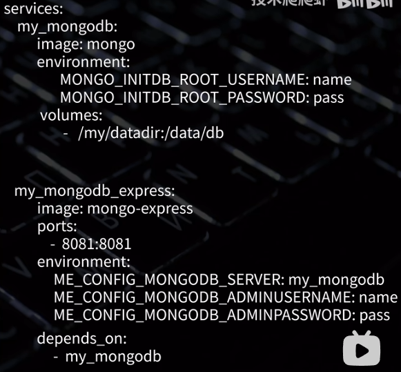

## git

git pull

add . / add 文件名    //提交到缓冲区

git commit -m  "备注"    //提交到本地仓库

git push

git log   查看提交日志

git reflog	查看分支切换的日志

git config --list   //查看git配置

git config user.name 
git config user.email

git config --global http.https://github.com.proxy http://127.0.0.1:7897   设置代理
 git config --global http.https://github.com.proxy http://127.0.0.1:7897

git status  查看本地仓库的提交状态，红色表示修改未添加到暂存区，需要add

git branch   "分支名" 	创建分支

git rebase "分支名"。和git merge类似，这里是改变该分支的基准（根据原理理解）。


**利用SSH从本地创建文件提交至仓库的步骤：**

1. git init 创建本地仓库
2. git add .添加至暂存区
3. git commit -m " " 推送至本地仓库
4. ssh -T git@github.com连接github
5. 复制github仓库中的ssh地址。使用命令 git remote add origin  "ssh地址"    连接至仓库
6. git push -u  feature-branch:remote-feature   本地分支推送至远程分支

**.gitignore文件生效**

当你在本地执行 `git add .` 时，Git 会先检查 `.gitignore` 文件。add之后，git就会对该文件进行追踪。如果想要让git停止追踪，需要清除git的缓存，然后让`.gitignore`文件生效。命令为

```c++
git rm -r --cached MDN_3/data/
git commit -m "Stop tracking data"
```

如果对于已经`commit` 的内容，清理上述的git缓存时没有用的，需要`reset` 命令回到提交之前

```bash
git log # 查看之前提交的hash值

# git add .是将内容提交至暂存区
# 回退到指定提交，保留工作区的更改，但重置暂存区（这是默认行为
git reset --mixed a1b2c3d
# 回退到指定提交，并且保留工作区和暂存区的更改
git reset --soft a1b2c3d
```


**冲突处理：**

对于文本文件的冲突：Git把有冲突的段落标记出来了，上面是HEAD，也就是当前所在的分支，中间是分隔线，下面是另一个分支的内容。选择想要的删掉或留下，然后重新git add。

```c++
# 1. 查看冲突文件
git status
# 2. 手动编辑文件（删除冲突标记，保留需要的代码）
vim conflicted_file.py
# 3. 标记冲突已解决
git add conflicted_file.py
# 4. 完成合并
git commit
```


**git正确开发流程**

正确的git开发流程

**第一步**

在github中创建一个新的仓库，这时候项目是空的，而且只有一个master分支

**第二步**

第一个开发人员进来了，他在本地创建一个develop分支，并且提交到远程

```mipsasm
git branch  develop
git push -u origin develop   //push -u 会同时建立本地分支和远程分支的追踪2关系
```

现在线上就有两个分支master 和 develop 现在这两个分支里面都是空的

**第三步**

一、二步完成后，任何一个参与该项目的开发人员首先要做的就是从develop分支上切一个新分支进行功能开发

```xml
git checkout -b <本地分支名 feature/***> <origin/develop>//如果远程分支存在，但本地没有该分支，通过这种方式创建追踪关系
或者
git fetch origin 远程分支名:本地分支名
git branch --set-upstream-to=origin/远程分支名    本地分支名
```

然后进行开发，开发差不多，想提交一下。

```sql
git status
git add
git commit
```

**第四步**

经过第三步，提交了几次后，感觉差不多了，就可以合并到develop分支

```cpp
git pull origin develop //先拉取develop中的代码，因为有可能别人已经往上提交过代码了
git checkout  develop//切到develop分支
git merge <feature/**>//合并feature/**中的代码到develop中
git push //提交到develop远程分支上
git branch -d feature/** //删除本地的分支
```

**第五步**

某一个开发人员想发布，但是其他人员还在进行开发，先不管别人，他先建立一个新的分支做发布准备

```xml
git checkout -b <本地分支名realse-0.1> <远程分支名develop>//注意这个realse-tagNo分支的功能是对发布的代码进行改善的地方
```

创建这个分支相当于测试环境修改，改好后就需要更新master和develop,然后删除分支

```cpp
git checkout  master//切到master分支
git merge release-0.1//将release分支合到master上
git push//将合完的代码提交到远程master
git checkout develop//切到develop分支
git merge release-01//将release分支上的代码合到develop分支上
git push//合完的代码推送到远程的develop分支
git branch -d release-01//删除本地release分支
```

**第六步**

打tag追踪，这个过程不太了解

```bash
git tag -a -0.1 -m 'xxxxxx'
git push --tags
```

**Git有提供各种勾子（hook），即仓库有事件发生时触发执行的脚本
。可以配置一个勾子，在你push中央仓库的master分支时，自动构建好对外发布**

难道这就是传说中的自动化构建？？？

**第七步**

线上环境发现bug了

```cpp
git checkout -b hotfix/xxx master//从master分支上新建分支
```

然后开始改bug,改完后

```cpp
git checkout master//切回master分支
git merge hotfix/xxx//将改完bug后的代码合并到master
git push
```

改完bug的代码还要合到develop中

```bash
git checkout develop
git merge hotfic/xxx
git push
git branch -d hotfix/xxx
```

## github项目搜索

in:name   star:>100  language:c++

in:readme

## Latex

1. 插入图片

   ```latex
   \begin{figure}[!htbp]
   \centering
       \includegraphics[width=0.8\textwidth]{figures/picture1.png}
   \caption{训练与验证的损失/准确率曲线}
   \label{fig:curves} %可以通过\ref{fig:curves} 来引用
   \end{figure}
   ```


## docker

**镜像：**
- Docker的镜像概念类似于虚拟机里的镜像(比如`.ISO`文件)，是一个只读的模板，一个独立的文件系统，包括运行容器所需的数据，可以用来创建新的容器。

**容器：** 
- Docker容器是由**Docker镜像创建的运行实例**，类似VM虚拟机，支持启动，停止，删除等。
- 每个容器间是相互隔离的，容器中会运行特定的应用，包含特定应用的代码及所需的依赖文件。
- 容器就类似与虚拟机中我们创建好的虚拟机系统,之后我们所有的操作都是在容器中进行的,我们的程序也是运行在容器中。
**对docker操作**

``` bash
# 启动docker
sudo service docker start
# 重启docker
sudo service docker restart
# 停止docker
sudo service docker stop
```

**对镜像基础操作**
```bash
# 获取所有镜像
docker image ls # 或者 docker images
```
|标签|含义|
|--:|:--|
|REPOSITORY|镜像所在的仓库名称|
|TAG|镜像标签|
|IMAGEID|镜像ID|
|CREATED|镜像的创建日期(不是获取该镜像的日期)|
|SIZE|镜像大小|

**加载镜像**
```bash
docker run [可选参数] 镜像名 [向启动容器中传入的命令]
```
常用可选参数	作用
`-i	`表示以《交互模式》运行容器。

`-d	`会创建一个守护式容器在后台运行(这样创建容器后不会自动登录容器)。

`-t`	表示容器启动后会进入其命令行。加入这两个参数后，容器创建就能登录进去。即分配一个伪终端。

`–name`	为创建的容器命名。(默认会随机给名字,不支持中文字符!!!

`-v`	表示目录映射关系(挂载卷)，即宿主机目录:容器中目录。注意:最好做目录映射，在宿主机上做修改，然后共享到容器上。用于数据的持久化，当容器被删除时，宿主机依然存有容器中的文件

`-p`	表示端口映射，即宿主机端口:容器中端口。 比如:-p 8080:80 就是将容器中的80端口,映射到主机中的8080端口
–network=host	表示将主机的网络环境映射到容器中，使容器的网络与主机相同。每个 Docker 容器都有自己的网络连接空间连接到虚拟 LAN。使用此命令则会让容器和主机共享一个网络空间。

`--network` 指定容器加入的子网


**查看容器** 
``` bash
# 查看当前所有正在运行的容器
docker ps
# 查看当前所有的容器
docker ps -a
# 使用过滤器(除了name外,常用的还可以指定id:id= 、所有停止的容器:status=exited,正在运行的容器:status=running 等)
docker ps -f name=指定的名字
# 显示2个上次创建的容器(2可以改变)
docker ps -n 2
# 显示最新创建的容器（包括所有状态）
docker ps -l
# 仅显示ip
docker ps -q
 # 显示容器大小
docker ps -s

# 查看容器信息
docker inspect [容器名/容器id]

# 进入容器内部进行调试，可以修改容器中的内容，比如网页内容
docker exec -it [容器id] /bin/bash
```

**启动和关闭容器**
```bash
# 停止容器 
docker container stop 容器名或容器id 
# 或可简写为 
docker stop 容器名或容器id 
# 强制关闭容器 
docker container kill 容器名或容器id 
# 或可简写为 
docker kill 容器名或容器id
```


**Dockerfile**

```bash
# 创建镜像
docker build -t docker_test .
```

**dockers compose**

使用yml管理多个容器
```bash
# 启动容器
docker compose -f [指定yaml文件名，默认可以不加] up -d 
```



