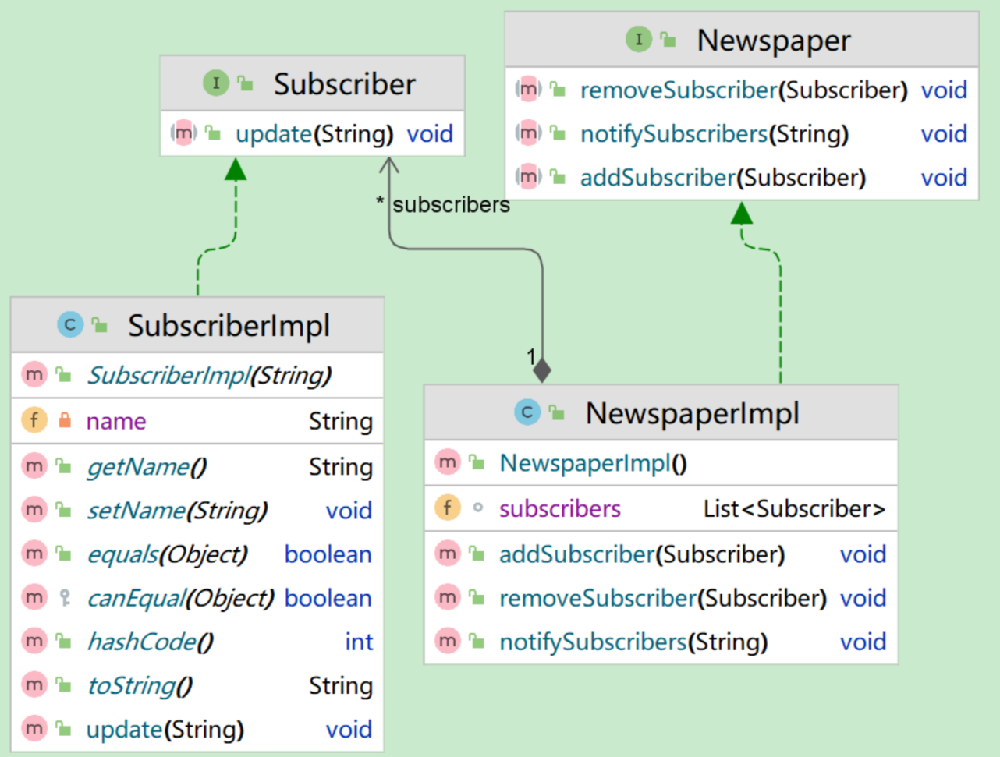

# VScode环境配置

## task.json文件

`tasks.json` 文件负责构建（编译和链接）您的代码

```c++
{   
    "version": "2.0.0",
    "options": {
        "cwd": "${workspaceFolder}/build"
    },
    "tasks": [
        {
            "type": "shell",
            "label": "cmake",
            "command": "cmake",
            "args": [
                ".."
            ]
        },
        {
            "label": "make",
            "group": {
                "kind": "build",
                "isDefault": true
            },
            "command": "make",
            "args": [

            ]
        },
        {
            "label": "Build",
			"dependsOrder": "sequence", // 按列出的顺序执行任务依赖项
            "dependsOn":[
                "cmake",
                "make"
            ]
        }
    ]

}
```


## launch.json文件

`launch.json` 文件负责如何启动和调试您的程序

```c++
{
    // Use IntelliSense to learn about possible attributes.
    // Hover to view descriptions of existing attributes.
    // For more information, visit: https://go.microsoft.com/fwlink/?linkid=830387
    "version": "0.2.0",
    "configurations": [
        {
            "name": "lldb 启动",
            "type": "cppdbg",
            "request": "launch",
            "program": "${workspaceFolder}/bin/rtsp_server", //需要修改，指定可执行文件的位置
            //"cwd": "${fileDirname}"
            //cwd(Current Working Directory/当前工作目录),
            //${fileDirname} 是一个VS Code变量，它代表 您当前打开并激活的那个文件所在的目录。
            //${workspaceFolder} 变量始终代表您在VS Code中打开的项目的根文件夹。
            "cwd": "${workspaceFolder}"   
        }

    
    ]
}
```


#  Makefile

```makefile
#编写makefile文件
ALL:testfile   #ALL 确定最终目标文件
#方式1
testfiles: main.cpp function.cpp
	g++ -o testfiles main.cpp function.cpp

#方式2，在文件中定义宏和变量
CXX = g++
TARGET= testfiles
OBJ = main.o function.o
$(TARGET):$(OBJ)
	$(CXX) -o $(TARGET) $(OBJ)

main.o:main.cpp
	$(CXX) -c main.cpp
function.o:function.cpp
	$(CXX) -c function.cpp

#方式3，对方式2进行修改
#$@: the target file
#$^: all the prerequisites
#$<: the first prerequisites

CXX = g++
TARGET= testfiles
OBJ = main.o function.o
$(TARGET):$(OBJ)
	$(CXX) -o $@ $^

%.o:%.cpp
	$(CXX) -c $^

#方式4，利用PHONY自动清除已经产生的文件，比如.o

CXX = g++
TARGET= testfiles.exe
OBJ = main.o function.o
$(TARGET):$(OBJ)
	$(CXX) -o $@ $^


%.o:%.cpp
	$(CXX) -c $<

.PHONY:clean
clean:
	del *.o $(TARGET)

#方式5，利用自带函数获得文件
CXX = g++
TARGET = testfiles.exe
CFLAGES = -c -Wall  #-Wall展示编译的warning
SRC = $(wildcard ./*.cpp)#wildcard-找到当前路径下所有的.cpp文件
OBJ = $(patsubst %.cpp,%.o,$(SRC))#patsubst-将.cpp文件替换为.o文件
$(TARGET):$(OBJ)
	$(CXX) -o $(TARGET) $(OBJ)
%.o:%.cpp
	$(CXX) $(CFLAGES) $<

.PHONY:clean     #伪目标
clean:  
	del *.o $(TARGET) 

#其他函数
#1.过滤出不以.c结尾的字符串
object=foo.o bar.o baz.c
flitered_objects=$(filter-out %.c $object)
```

`make -f m1` 	指定文件执行make命令，可能有些makefile文件叫xxx.mk，所以需要自己指定

# Cmake

问题：Windows下CMake不能生成makefile的问题

解决方案：可能是由于安装了Visual Studio，也可能是windows10默认，CMake会生成`MSVC`解决方案，在构建目录中检查有 .sln 文件。

指定解决方案是Unix 平台的Makefiles

`cmake .. -G "Unix Makefiles"` （第一次运行cmake时）

```cmake
cmake_minimum_required(VERSION 3.10)
project(main)
add_subdirectory(src)

# 添加编译选项
add_compile_options(-std=c++11 -Wall -g)
# 引入头文件位置
include_directories(${PROJECT_SOURCE_DIR}/../include )
include_directories(/usr/local/protobuf/include) 
# 引入源文件位置
aux_source_directory(. MAIN_SRC)

# 设置可执行文件的生成位置
set(EXECUTABLE_OUTPUT_PATH ${PROJECT_SOURCE_DIR}/../bin)

# 设置静态库路径
set(Protobuf_LIBRARIES "/usr/local/protobuf/lib/libprotobuf.a")
# 生成可执行文件
add_executable(main ${MAIN_SRC})

# 连接静态库
target_link_libraries(main ${Protobuf_LIBRARIES})

```

```cmake
# 查找 pkg-config
# pkg-config 是一个系统工具，用于检索已安装库的编译和链接信息（如头文件路径、库路径和依赖）。
find_package(PkgConfig REQUIRED) 

# 查找 FFmpeg 库
# pkg_check_modules 调用 pkg-config 查找对应的 .pc 文件
# 每个 pkg_check_modules 调用会生成变量，例如：
# ${LIBAVCODEC_LIBRARIES}：链接所需的库（通常是 -lavcodec）。
# ${LIBAVCODEC_INCLUDE_DIRS}：头文件路径（如 /usr/include/libavcodec）
# ${LIBAVCODEC_LDFLAGS}：链接器标志（如 -L/usr/lib -lavcodec）
pkg_check_modules(LIBAVCODEC REQUIRED libavcodec)
pkg_check_modules(LIBAVFORMAT REQUIRED libavformat)
pkg_check_modules(LIBAVDEVICE REQUIRED libavdevice)
pkg_check_modules(LIBAVUTIL REQUIRED libavutil)

# 链接 FFmpeg 库和外部依赖
# 顺序很重要，因为 FFmpeg 库有依赖关系：
# libavdevice 依赖 libavformat。
# libavformat 依赖 libavcodec。
# libavcodec 依赖 libavutil。
# 因此，链接时按此顺序排列避免符号解析问题。
target_link_libraries(streamServer PRIVATE
    ${LIBAVDEVICE_LIBRARIES}
    ${LIBAVFORMAT_LIBRARIES}
    ${LIBAVCODEC_LIBRARIES}
    ${LIBAVUTIL_LIBRARIES}
    -pthread
    -lm
    -lz
)

# 确保静态链接
target_link_options(streamServer PRIVATE ${LIBAVCODEC_LDFLAGS} ${LIBAVFORMAT_LDFLAGS} ${LIBAVDEVICE_LDFLAGS} ${LIBAVUTIL_LDFLAGS})
```


# C++使用静态库

在Linux下使用C++静态库的步骤如下：

编写代码并编译成目标文件（.o），比如**`g++ -c test.cpp -o test.o`**。

然后使用**ar命令**将编译生成的.o文件打包成静态库文件（.a），比如 **`ar rcs libtest.a test.o`**。

ar是一个用于创建、修改和提取归档文件的命令行工具。归档文件是一种将多个文件组合成单个文件的方式，通常用于将多个目标文件组合为一个库文件（如静态库）或者打包多个文件以备份或分发。
r 表示插入新成员（如果原来不存在的话）；
c 表示创建新档案；
s 表示将插入的成员作为符号表保存。
编写使用静态库的代码，并链接静态库，比如 **`g++ -o main main.cpp -L. -ltest`**。

-L. 表示在当前目录搜索库文件；
-lmylib 表示链接名为 libmylib.a 的静态库。
运行可执行程序，比如 ./test。

# 语法

## 类型转换关键字

1. `static_cast`  用于基本数据类型和类层次中的**安全转换**，通常用于类型之间的已知转换，不涉及运行时检查。

2. `dynamic_cast` 主要用于类层次的**下行转换**（父类转换为子类，可能会导致类型未定义），提供运行时类型检查，确保转换安全性，常用于多态环境。出错会返回空指针`nullptr`

3. `const_cast` 用于移除或添加 `const`/`volatile` 修饰符，必须谨慎使用，不能修改真正的常量。

4. `reinterpret_cast` 用于底层的、低级别的强制转换，不进行类型检查，应避免不必要的使用，因其可能导致未定义行为。比如定义回调函数，需要传入`void*` 类型的参数。主要用于将**一个指针类型转换为另一种指针类型**或将**整数转换为指针**。它并不适合用于基本数据类型的转换。

   ```c++
   //uintptr_t是一个足够大的无符号整数类型，足以存放指针值，避免转换时造成数据丢失
   uintptr_t t=static_cast<uintptr_t>(i);
   task.arg=reinterpret_cast<void*>(t);
   //将void* 还原为int 时，也要先转换为uintptr
   ```


## 智能指针

通过`get()`函数可以获得智能指针管理的指针，不会转移所有权，智能指针仍然负责在适当时候释放资源。

### share_ptr

`std::shared_ptr`  shared_ptr顾名思义是多个指针指向一块内存,被管理对象有一个**引用计数**，这个计数记录在每个指针上，几个shared_ptr指向它，这个数字就是几，当没有任何shared_ptr指向它时，引用计数为0，这时，自动释放对象。但是这里会出现一个问题，如下面的代码所示:

```c++
int main(int argc, const char * argv[]) {
    auto p1 = new Test; // 划分堆空间
    std::shared_ptr<Test> sp(p1); // 创建智能指针
    std::shared_ptr<Test> sp2(p1); // 创建另一个智能指针
    return 0;
}
```

这段程序会抛出异常 **double free detected**，此处用了两个智能指针管理同一块内存，因为sp 和sp2不知道彼此的存在，所以也会重复释放，正确的做法是用已经创建的智能指针sp再去初始化sp2，让它们处于同一套内存管理体系。

所以这里就引入了`std::make_shared<T>(args)` 去创建对象，而不是用`new`，这样就可以防止我们去使用原始指针创建多个引用计数体系。

```c++
/*
	C++智能指针与C语言中一种常见技巧“柔性数组成员”（Flexible Array Member）的交互,无法通过make_shared直接与”柔性数组成员“技巧配合使用。
	此时可以自定义删除器: std::shared_ptr 的强大之处不仅在于引用计数，还在于它能通过自定义删除器与各种C风格的资源管理（malloc/free, fopen/fclose 等）无缝集成。这是处理这类问题的标准C++方式。
	
*/
uint8_t* buffer = new uint8_t[totalSize];
//创建shared_ptr，并提供自定义的删除器
rtpPacket = std::shared_ptr<RtpPacket>(
    reinterpret_cast<RtpPacket*>(buffer),
    [buffer](RtpPacket* ptr){
        delete[] buffer;
    }
);
```


### weak_ptr

`weak_ptr` 的作用：解决共享所有权中的悬空指针问题，不增加引用计数。适合在缓存系统和观察者模式中使用。

**观察者模式**中，核心问题是：被观察者（Subject）需要持有观察者（Observer）的引用，但**不能影响观察者的生命周期**。
如果被观察者持有`shared_ptr<Observer>`，会导致观察者无法释放（除非手动解除注册），而`weak_ptr`可以完美解决这一问题。

```c++
// Subject（被观察者）
class Subject {
    std::vector<std::weak_ptr<Observer>> observers; // 关键：用 weak_ptr 持有观察者
public:
    void addObserver(std::shared_ptr<Observer> obs) {
        observers.emplace_back(obs); // 存储弱引用
    }

    void notify() {
        for (auto it = observers.begin(); it != observers.end(); ) {
            if (auto obs = it->lock()) { // 尝试升级为 shared_ptr
                obs->update(); // 通知有效的观察者
                ++it;
            } else {
                it = observers.erase(it); // 自动清理已销毁的观察者
            }
        }
    }
};
```

**缓存系统**场景与观察者模式类似，缓存通常不希望长期持有对象的所有权（否则缓存会阻止对象释放）。使用 `weak_ptr` 可以检查对象是否已被销毁（通过 `lock()` 获取 `shared_ptr`），若对象不存在则重新加载。


## 容器

### vector

`resize(size,value)`  使用resize进行扩容时，元素之间的相对位置并不会发生变化。但是可能为由于**内部内存管理**，会将数据重新复制到一片新开辟的地址空间。

`erase(it)`利用迭代器移除指针中的元素时，如果元素是裸指针，需要手动delete释放内存空间；如果是智能指针，内存会自动管理，无需手动释放。


## 多线程

`std::atomic`  对变量提供原子操作，避免使用`std::mutex`来造成性能开销和复杂性

`std::atomic` 变量不能被拷贝给其他变量，包括临时变量。这是因为 `std::atomic` 的拷贝构造函数被显式删除了，目的是避免拷贝行为带来的线程安全问题。但是可以考虑移动语义`std::move()`来转移所有权

1. **`fetch_add`：**

   - 原子地增加一个值，并返回增加前的值。适合在需要获取旧值的场景。

   ```
   userCount.fetch_add(1);
   ```

2. **`fetch_sub`：**

   - 原子地减少一个值，并返回减少前的值。

   ```
   userCount.fetch_sub(1);
   ```

3. **`store`：**

   - 原子地设置一个新值。这对于直接更新变量是非常有效的。

   ```
   userCount.store(newValue);
   ```

4. **`load`：**

   - 原子地读取当前值。这在需要安全地读取变量时使用。

   ```
   int currentCount = userCount.load();
   ```

5. **`exchange`：**

   - 原子地设置一个新值，并返回旧值。

   ```
   int oldValue = userCount.exchange(newValue);
   ```


`std::unique_lock<std::mutex> locker(pool->mtx);`   

RAII语法的模板类，保证了所有栈对象在声明周期结束时回被销毁，会自动调用`unlock()` 。并且可以显式的调用lock和unlock。如果用到了`std::condition_variable::wait`，则必须用`std::unique_lock`

C++ 的 `std::condition_variable::wait` 有一个重载版本，它接受一个lambda表达式（或任何可调用对象）作为“唤醒条件”。这是处理“虚假唤醒”和“退出”条件的标准方法。

```c++
void ThreadPool::loop(){
    while(true){
        Task task;
        {
            std::unique_lock<std::mutex> locker(mMtx);
            // 线程会一直在此沉睡，直到 "队列不为空" 或 "被通知退出"
            mCon.wait(locker, [this]{
                return !mTaskQueue.empty() || mQuit;
            });
            if(mQuit && mTaskQueue.empty()){
                return;
            }
            task = mTaskQueue.front();
            mTaskQueue.pop();
        }
        task.handleTask();
    }
}
```


## 函数对象包装

\#include\<functional\>

`std::bind() `  当你调用类的成员函数时，**隐式地**会将对象指针（即 `this` 指针）传递给该函数。这使得**成员函数能够访问该对象的成员变量和其他成员函数**。在使用 `std::bind` 或其他类似的方式时，你需要显式提供对象指针，以确保函数能够正确绑定到特定对象上。


`explicit` 关键字在 C++ 中用于防止编译器进行隐式类型转换。它主要应用于构造函数和转换运算符。

```c++
class MyClass {
public:
    explicit MyClass(int value) {
        // 构造函数实现
    }
};
// 没有使用 explicit 时，以下代码会自动转换
MyClass obj = 42; // 隐式转换，会调用 MyClass(int)
// 使用 explicit 时，以下代码会报错
MyClass obj2 = MyClass(42); // 必须显式调用构造函数
```

**占位符的使用：**需显式引入`std::placeholders`命名空间，否则需使用完整名称（如`std::placeholders::_1`）

## 右值引用

`std::move` 将左值转换为右值引用。可以避免不必要的复制操作，特别是当任务对象是较大的或复杂的类型（比如使用了大量资源的对象）时。通过移动，资源的所有权从源对象转移到目标对象，而不是创建一个新副本。

`std::forward<type> task ` 将task进行完美转发，保持其原始的值类别（左值或右值）。这样可以避免不必要的拷贝，提高性能。

**移动语义和完美转发的区别：**

1.  用途不同：std::move用于触发移动语义，将资源的所有权转移；std::forward用于完美转发，保持参数原有的值类别。
2.  转换的条件不同：std::move无条件地将参数转为右值；std::forward根据模板参数的类型有条件地转换（保持原来的左右值属性）。
3. 使用场景不同：std::move通常在需要转移资源的地方使用，比如将对象传递给移动构造函数或移动赋值运算符；std::forward通常在模板函数中转发参数时使用，以保持其原始类型。

## 类

### 类的定义和实现

如果你将类的定义和实现都放在头文件中，那么每次在源文件中包含该头文件时，编译器都会看到类的完整定义和成员函数的实现。这会导致一些特定的问题和影响：

**编译时间变长**：每次包含头文件时，编译器都会重新编译类的实现。如果多个源文件都包含了相同的头文件并实例化了类，类的成员函数会在每个源文件中都被编译，这会导致重复编译，增加编译时间。

**代码重复**：每个包含头文件的源文件都会生成该类的成员函数的实现代码，这可能导致多个目标文件中包含相同的代码，最终在链接阶段可能出现重复符号。

**模板类和内联函数**：有时候类的成员函数是模板函数或者内联函数，它们必须在头文件中定义和实现。模板类成员函数在编译时需要实例化，因此必须在头文件中提供实现。这是一个特定的例外，不一定适用于所有类。

**定义和初始化：** 非静态成员变量的初始化顺序和类中定义的顺序一致，与构造函数的初始化列表顺序无关。

### 类的继承

如果你打算多态地使用这个类，并且通过基类指针来 `delete` 派生类对象，那么基类必须有一个虚析构函数。 否则，将会导致未定义行为，这通常表现为严重的内存泄漏。C++社区有一个非常著名的“黄金法则”： 如果你的类中包含任何 `virtual`（虚）函数，你就应该（必须）为它声明一个 `virtual`（虚）析构函数。

## Const关键字

1. **非静态const成员变量**，需要在类声明阶段通过构造函数初始化。但是在C++11之后，可以直接在类定义阶段初始化，但是在类声明阶段依然可以覆盖。
2. **静态const成员变量**，可以在类声明中直接初始化


## 正则表达式

\#include\<regex\>

`std::regex_match(text,pattern)`

 是C++标准库中用于执行完全匹配的正则表达式函数。它用于判断一个字符串是否**完全与给定的正则表达式模式匹配。**

`std::regex_search(text,pattern)` 

是C++标准库中用于在字符串中搜索匹配的正则表达式模式的函数。与 `std::regex_match` 不同，`std::regex_search` 用于查找字符串中的**部分匹配**，而不是要求整个字符串完全匹配。

`std::regex_replace(text,pattern,replacement)` 

是C++标准库中的函数，用于替换字符串中与正则表达式模式匹配的部分。允许将匹配的文本替换为指定的内容。

`std::smatch` 

是C++标准库中的一个类，用于**存储正则表达式的匹配结果**。它通常用于捕获、存储和访问正则表达式中的匹配子串。

当匹配成功时，`matches[0]` 包含整个匹配的字符串，而 `matches[1]` 包含**捕获组** 1 中的内容。正则表达式一个括号是一个捕获组

```c++
#include <iostream>
#include <regex>
#include <string>
int main() {
    std::string text = "My phone number is (123) 456-7890.";
    std::regex pattern(R"(\(\d{3}\) \d{3}-\d{4})");
    std::smatch matches;
    if (std::regex_search(text, matches, pattern)) {
        std::cout << "Match found: " << matches[0] << std::endl;
        std::cout << "Capture group 1: " << matches[1] << std::endl;
    } else {
        std::cout << "No match found." << std::endl;
    }
    return 0;
}
```


## 函数
### 字符串

#### search

\#include<algorithm>

`std::search`  下面是原型

template< class ForwardIt, class T >

 ForwardIt search( ForwardIt first, ForwardIt last, const T& value );

是一个非常强大的函数，可以帮助你在一个序列中查找一个**单一的元素**或者一个**子序列**。在\<algorithmn\>中

#### strncat

`char *strncat(char *dest, const char *src, size_t n)` 

函数用于将源字符串的最多 `n` 个字符追加到目标字符串的末尾。它的主要作用是连接字符串，且避免目标字符串发生溢出

#### strcspn

`strcspn` 是 C 标准库中的一个函数，用于查找一个字符串中第一次出现指定字符集合中的任何字符的位置。

它返回的是第一个匹配字符的索引位置

`size_t strcspn(const char *s1, const char *s2)`

#### snprintf

`int snprintf(char *str, size_t size, const char *format, ...)` 向指定地址写入指定大小的内容

```c++
snprintf(newFile, LOG_NAME_LEN - 72, "%s/%s%s", path_, tail, suffix_)
```

#### vsprintf

这个函数要搭配`va_list`使用，`va_list` 可以用来接收可变参数（比如printf中的）

```c++
//写入自定义参数
/*
	日志系统的实现的部分代码
	format：传入个格式化字符串（带有什么%s,%d这种的）
	...   ：表示可变参数
	va_list：用来接收可变参数，本质上是个指针
*/
//void Log::Write(int level,const char* format, ...)  
va_list valist;
va_start(valist,format);//利用va_start，靠format的位置来定位可变参数的位置，(format和可变参数之间是有联系的)
int m=vsnprintf(buffer_ptr,buffer_size,format,valist);//写入缓冲区或其他容器
va_end(valist);//利用va_end释放va_list变量
```


#### stringstream

\#include<stringstream>

`stringstream` + `getline` 组合可以对字符串进行分析，在构造时，会创建原始数据的内部副本，所有操作都在副本上进行，原始数据安然无恙。**线程安全**，每个线程都可以创建自己的`stringstream`对象，它们的状态互不干扰。代替`strtok`这种古老危险的C函数

```c++
/*
下面是使用stringstream解析RTSP请求的部分代码
*/

//使用stringstream逐行解析比strtok安全
std::stringstream ss(message);
std::string line;
while(std::getline(ss, line)){
    if(!line.empty() && line.back()=='\r') line.pop_back();
    if(line.find("OPTIONS") == 0 || line.find("DESCRIBE") == 0 ||
        line.find("SETUP") == 0 || line.find("PLAY")==0){
        sscanf(line.c_str(), "%s %s %s", method, url, version);   
    }else if(line.find("CSeq:")==0){
        sscanf(line.c_str(),"CSeq: %d", &CSeq);
    }else if(line.find("Transport:")==0){
        char* p = strstr(line.data(), "client_port=");
        if(p) sscanf(p, "client_port=%d_%d", &clientRTP, &clientRTCP);

    }
}

/*
下面是使用stringstream构造SETUP请求响应的代码
*/
std::stringstream ss;
ss<<"RTSP/1.0 200 OK\r\n";
ss<<"CSeq: "<<CSeq<<"\r\n";
ss<<"Transport: RTP/AVP;unicast;client_port="<<clientRTP<<"-"<<clientRTP+1<<";server_port="<<serverRTPPort_<<"-"<<serverRTCPPort_<<"\r\n";
ss<<"Session: 65535\r\n\r\n";
sendBuf=ss.str();
```


### 系统时间

`localtime(&tSec)` 将转化为当前时间

```c++
time_t timer = time(nullptr);//获得系统时间
struct tm *sysTime = localtime(&timer);//获得当前的时间的结构体
char fileName[LOG_NAME_LEN] = {0};
snprintf(fileName, LOG_NAME_LEN - 1, "%s/%04d_%02d_%02d%s", 
         path_, t.tm_year + 1900, t.tm_mon + 1,t.tm_mday, suffix_);

struct tm {
    int tm_sec;   // 秒 [0, 60] (包含闰秒)
    int tm_min;   // 分 [0, 59]
    int tm_hour;  // 时 [0, 23]
    int tm_mday;  // 一个月中的天数 [1, 31]
    int tm_mon;   // 月份 [0, 11] (0 = 一月)
    int tm_year;  // 自 1900 年以来的年数
    int tm_wday;  // 一周中的天数 [0, 6] (0 = 星期日)
    int tm_yday;  // 一年中的天数 [0, 365]
    int tm_isdst; // 是否是夏令时 (> 0 是, 0 否, < 0 不确定)
};

```


### 文件操作

#### 写文件

`fputs(text, FILE* file);  // 写入字符串`  

` fwrite(&data, sizeof(data), 1, FILE* file);  // 写入二进制数据`


## 预处理

### 内存对齐

在结构体中，编译器会根据平台和数据类型进行内存对齐，以提高访问速度。但有时候，特别是和硬件交互或者需要特定内存布局时，可能需要手动调整对齐方式。

```c++
#pragma pack(push, 1)  // 保存当前对齐规则，并设置对齐为1字节（无填充）
struct MyStruct {
    char a;      // 1字节
    int b;       // 4字节，原本可能因对齐填充到4字节，现在紧密排列
    double c;    // 8字节
};
#pragma pack(pop)       // 恢复之前的对齐规则

// 后续结构体使用默认对齐规则
struct AnotherStruct {
    char a;      // 1字节 + 3字节填充
    int b;       // 4字节
    double c;    // 8字节
};
```


# 设计思想

## RAII机制

RAII（Resource Acquisition Is Initialization），资源获取即初始化。是一种内存管理的机制，用对象管理资源，利用的就是C++构造的对象最终会被对象的析构函数销毁的原则（用对象来管理资源的创建和销毁，如线程池、连接池）。

 

设计模式根据工作的目的，分为创建型模式、结构型模式和行为型模式三类。

创建型模式：**单例模式**、**工厂方法模式**、**抽象工厂模式**、创建者模式、原型模式。

结构型模式：适配器模式、**代理模式**、**装饰器模式**、外观模式、桥接模式、组合模式、享元模式。

行为型模式：策略模式、模板方法模式、**观察者模式**、迭代子模式、**责任链模式**、命令模式、备忘录模式、状态模式、访问者模式、中介者模式、解释器模式。


## 观察者模式

观察者模式通常由两个对象组成：观察者和被观察者。当被观察者状态发生改变时，它会通知所有的观察者对象，使他们能够及时做出响应，所以也被称作“发布-订阅模式”。被观察者会存有观察者列表，当被观察者状态发生变化时，会挨个通知观察者，让观察者做出响应。

下面以**报纸**和**报纸的订阅者**为例，假设你在订阅一份报纸，每天早上送到你门口。你订阅的这份报纸就是被观察者。你和其他的订阅者是观察者。当报纸被送到你门口时，它会自动通知所有的订阅者，让他们知道这份报纸已经到了。



可以发现UML类图中，我们都是继承一个**抽象类**的，这样子可以实例化不同的观察者和被观察者，对不同观察者实现不同的响应方式。

```c++
uint8_t *unpack_dns(uint8_t *src) {   
    char *buf, *dst;    
    int len;    
    buf = dst = malloc(strlen(src) + 1);    
    while((len = *src++) != 0) {        
        while(len--) *dst++ = *src++;       
        *dst++ = '.';   
    }    
    dst[-1] = 0;    
    return buf;
}
```

## 工厂模式

简单工厂模式(Simple Factory Pattern)需要定义一个工厂类，它可以根据参数的不同返回不同类的实例，被创建的实例通常都具有共同的父类。因为在简单工厂模式中用于创建实例的方法是**静态**(static)方法，因此简单工厂模式又被称为静态工厂方法(Static Factory Method)模式，它属于**类创建型模式**。

**使用场景：**

- 工厂类负责创建的对象比较少，由于创建的对象较少，不会造成工厂方法中的业务逻辑太过复杂。
- 客户端只知道传入工厂类的参数，对于如何创建对象并不关心。
- 典型应用：Calendar 类获取日历类对象、JDBC 获取数据库连接、Logback 中的 LoggerFactory 获取 Logger 对象

```java
// Car 接口
public interface Car {
    void drive();
}
// 具体 Car 类
public class Sedan implements Car {
    @Override
    public void drive() {
        System.out.println("Sedan is driving");
    }
}

public class Truck implements Car {
    @Override
    public void drive() {
        System.out.println("Truck is driving");
    }
}
// 工厂类
public class CarFactory {
    public static Car createCar(String type) {
        if ("sedan".equalsIgnoreCase(type)) {
            return new Sedan();
        } else if ("truck".equalsIgnoreCase(type)) {
            return new Truck();
        }
        throw new IllegalArgumentException("Unknown car type: " + type);
    }
}

```

## 策略模式

策略模式，主要指对象有某个行为，但是在不同的场景中，该行为有不同的实现算法。策略模式是**行为模式**之一，它对一系列的算法加以封装，为所有算法定义一个抽象的算法接口，并通过继承该抽象算法接口对所有的算法加以封装和实现，具体的算法选择交由客户端决定（策略）。策略模式主要用来平滑地处理算法的切换。

**使用场景：**

- 策略模式的等级结构定义了一个算法或行为族，恰当使用继承可以把公共的代码移到父类里面，从而避免重复的代码。
- 策略模式将策略的选择逻辑转移到了类中，避免了外部使用多重条件转移语句。

```java
// 策略接口
public interface Strategy {
    double doOperation(double num1, double num2);
}

// 具体策略类
public class Addition implements Strategy {
    @Override
    public double doOperation(double num1, double num2) {
        return num1 + num2;
    }
}

public class Subtraction implements Strategy {
    @Override
    public double doOperation(double num1, double num2) {
        return num1 - num2;
    }
}

public class Multiplication implements Strategy {
    @Override
    public double doOperation(double num1, double num2) {
        return num1 * num2;
    }
}
```


