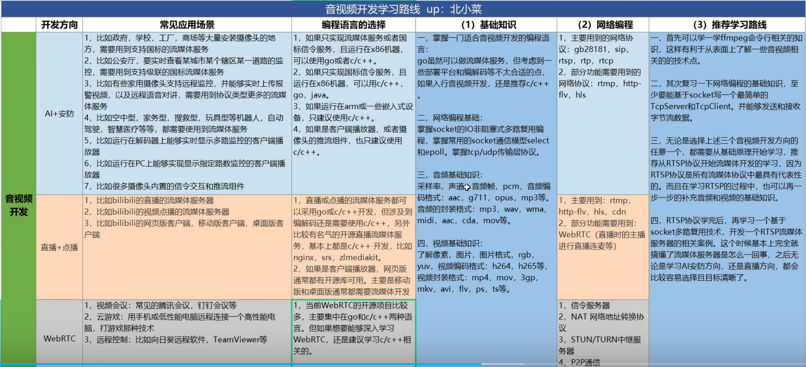
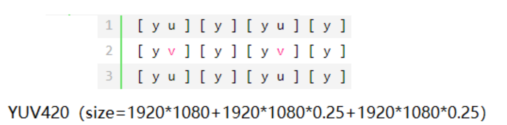
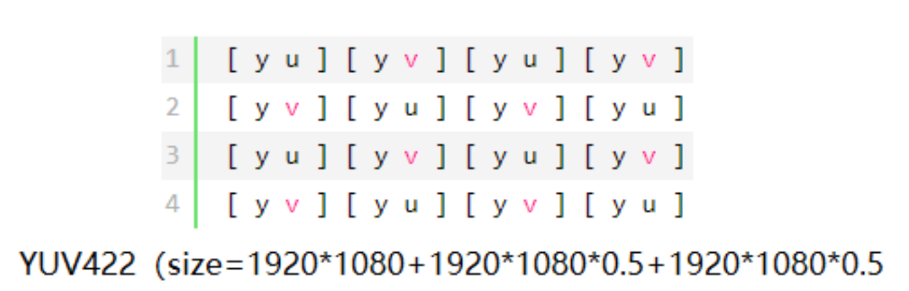
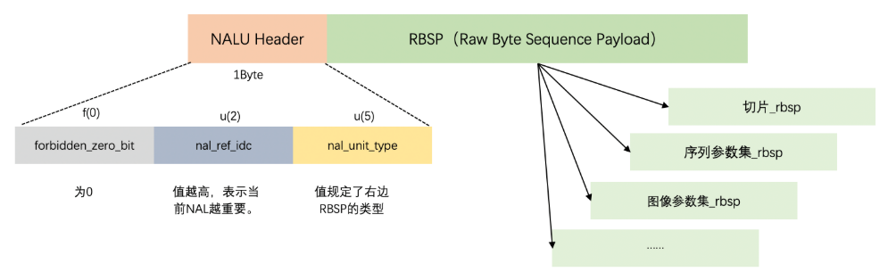
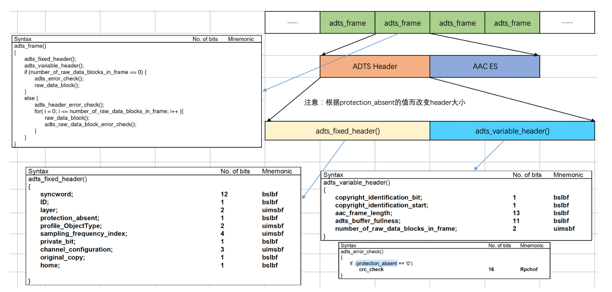
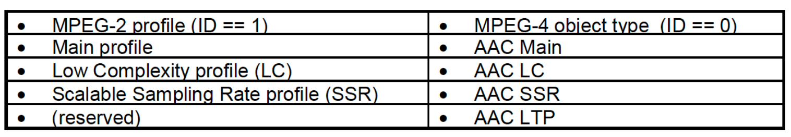
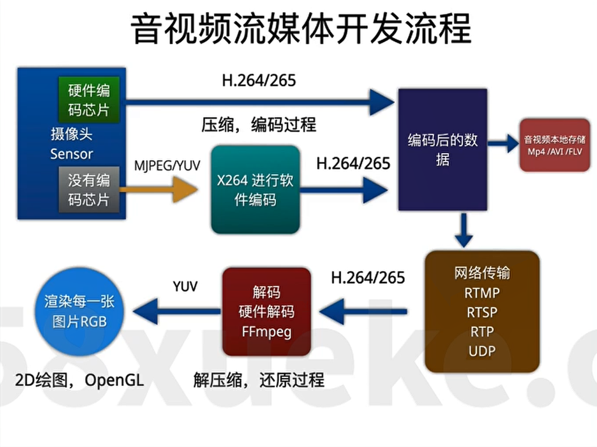
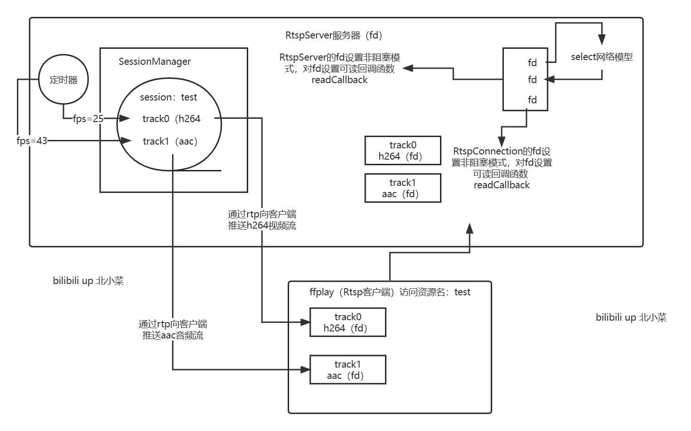
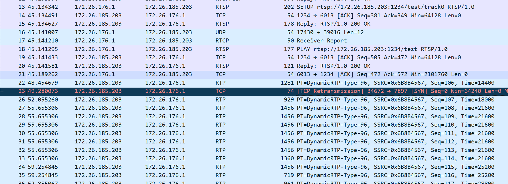

 音视频学习路线




```


## 音视频入门知识

###  图像

#### YUV

Y表示亮度，U/V表示色度

**YUV采样格式** 

主流的采样格式有YUV444、YUV422、YUV420。

YUV444：每1个Y对应一组UV分量，每个像素的三个分量都是 8 bit，也就是1个像素需要3个字节。

YUV420：每2个Y对应一组UV分量，UV 分量是 Y 分量采样的一半，Y 分量和 UV 分量按照 2 : 1 的比例采样。



YUV422：每4个Y对应一组UV分量。



`yuyv422` 是许多摄像头支持的**原始像素格式**，适合高效捕获和处理


**YUV422转化为YUV420**

其中`y u v` 分别都是1个字节的大小，对于YUV422，数据的组织格式是`yu yv yu yv` ，这里`yu` 是一个像素，大小为两字节。

- **Y 分量（亮度）**：
  - YUYV422 和 YUV420P 的 Y 分量采样比例都是 1:1（每个像素一个 Y 值）。
  - 因此，Y 分量保持不变，直接从 YUYV422（格式：`Y0 U0 Y1 V0`）的 `Y0`、`Y1` 逐字节复制到 YUV420P 的 Y 平面（`frame->data[0]`），不丢弃任何数据。
  - 例如，640×480 分辨率，Y 分量大小为 640×480 = 307,200 字节。
- **U 和 V 分量（色度）**：
  - YUYV422：采用 4:2:2 采样，每 2 个像素（水平方向）共享一组 U、V 分量。
    - 数据格式：`Y0 U0 Y1 V0`，每 4 字节表示 2 个像素，U、V 各占 1 字节。
    - 例如，640×480 分辨率，U 和 V 各有 640/2 × 480 = 153,600 个值。
  - YUV420P：采用 4:2:0 采样，每 4 个像素（2×2 块，水平和垂直各 2:1 下采样）共享一组 U、V 分量。
    - U 平面和 V 平面大小为 `(width/2) × (height/2)`。
    - 例如，640×480 分辨率，U 和 V 各有 640/2 × 480/2 = 320×240 = 76,800 个值。
  - 下采样过程：
    - 水平方向：每 2 个像素取 1 个 U、V（从 `Y0 U0 Y1 V0` 中取 U0、V0）。
    - 垂直方向：每 2 行取 1 行 U、V（**通常取偶数行，丢弃奇数行数据**）。
    - 结果：U、V 分量数据量从 YUYV422 的 153,600 减少到 YUV420P 的 76,800，丢弃了一半的色度数据。这种丢弃是正常的，因为 4:2:0 格式通过降低色度分辨率来减少数据量，而人眼对色度变化的敏感度较低，视觉影响较小。

**时间戳设置** 

`time_base` 是 FFmpeg 中用于表示时间单位的结构体（`AVRational`），由分子（`num`）和分母（`den`）组成，表示时间刻度的倒数（秒/刻度）

`AVFrame` 的 `pts` 表示帧的呈现时间，单位是 `AVCodecContext` 的 `time_base`。修改 `frame->pts` 时，必须确保其值与编码器的 `time_base` 匹配。`pts * time_base` 就可以获得某一帧所在的时间。

知道帧率`fps` ，每秒帧的数量，就可以知道每帧所在的时间`1/fps`

`<sys/time.h>` unix系统时间。通过`gettimeofday()` 获得系统经过的毫秒

C++11提出了跨平台的系统时间，`std::chrono::system_clock::time_point` 

**frame字节对齐**

`frame->linesize` 是 `AVFrame` 结构体中的一个数组，用于表示帧中每个平面（plane）的**每行数据的字节大小**

由于内存对齐（例如，某些硬件要求行数据按 16 字节或 32 字节对齐），`linesize` 可能大于实际像素数据所需的字节数。

它用于正确索引帧数据（如 `frame->data[0][i * frame->linesize[0]]` 访问 Y 平面第 i 行的起始地址）

`av_frame_get_buffer(frame, 32); // 分配缓冲区，按 32 字节对齐`

**YUV存储格式** 

◆ packet：打包格式，即先存储一个yuv，再存储下一个yuv；

◆ planar：平面格式，即先存储y平面，再存储u平面，再存储v平面；

◆ semi-planar：先存储y平面，再存储uv平面；

**VLC无法直接打开YUV文件**

- YUV 文件是原始视频数据，通常不包含元信息（分辨率、帧率、像素格式）。
- VLC 需要通过命令行参数（如 `--rawvid-width`、`--rawvid-fps`）显式指定这些信息，否则会报错（出现之前遇到的 “Picture size 0x0 is invalid” 和 “invalid or no framerate specified”）。
- `vlc --demux=rawvid --rawvid-fps=30 --rawvid-width=640 --rawvid-height=480 --rawvid-chroma=I420 ./video.yuv` 指定解封装器、分辨率、帧率、像素格式。

**steam、packet、frame之间的关系**

1. **从** **`stream`** **到** **`packet`**：
   - 每个 `AVPacket` 属于一个 `AVStream`，通过 `AVPacket.stream_index` 指向 `AVFormatContext->streams[stream_index]`。
   - 一个 `AVStream` 对应多个 `AVPacket`，因为一个流（如视频流）包含多个数据包（如每一帧的压缩数据）。
2. **从** **`packet`** **到** **`frame`**：
   - 一个 `AVPacket` 通常包含一个或多个帧的压缩数据（视编码格式而定）。
   - 解码一个 `AVPacket` 可能产生一个或多个 `AVFrame`：
     - **视频**：通常一个 `AVPacket` 解码为一个 `AVFrame`（例如 H.264 的一个 I/P/B 帧）。
     - **音频**：一个 `AVPacket` 可能包含多个音频样本，解码后生成一个 `AVFrame`（包含固定数量的样本，取决于 `AVCodecContext.frame_size`）。
   - 编码时，一个 `AVFrame` 通常编码为一个或多个 `AVPacket`（视编码器和帧类型而定）。
3. **从** **`stream`** **到** **`frame`**：
   - `AVStream` 间接关联 `AVFrame`，因为 `AVFrame` 是从属于该流的 `AVPacket` 解码得来。
   - `AVStream.codecpar` 提供解码/编码所需的参数（如 `codec_id`、`width`、`height`），影响 `AVFrame` 的格式。

#### H.264

H.264 是一种视频压缩编码标准

**视频编码层（Video Coding Layer, VCL）**
视频编码层负责将原始视频数据进行编码，它定义了如何将原始视频数据压缩成更小的格式，VCL使用多种编码工具和技术来实现高效的压缩。

**网络提取层（Network Abstraction Layer, NAL)**
网络提取层负责将视频编码层产生的比特流组织成适合传输和存储的格式。它的主要任务是将编码数据打包成网络抽象层单元（Network Abstraction Layer Unit，NALU），这些单元可以在不同的网络和存储介质上进行传输和存储。

简单的说，视频编码层将原始视频数据压缩编码，网络提取层将压缩编码后的数据打包成NALU（网络抽象层单元）来进行传输或存储。

**IDR帧和I帧的区别**

IDR帧就是I帧，但是I帧不一定是IDR帧。
在一个完整的视频流单元中第一个图像帧是IDR帧，IDR帧是强制刷新帧，在解码过程中，当出现了IDR帧时，要更新sps、pps,原因是防止前面I帧错误，导致sps，pps参考I帧导致无法纠正。

**GOP介绍**

GOP，GOP的全称是Group ofp icture图像组，也就是两个I帧之间的距离，GOP值越大，那么I帧率之间P帧和B帧数量越多，图像画质越精细，如果GOP是120帧，帧率是60，那么两I帧的时间就是120/60=2S。

短GOP：优点是随机访问快、容错性强；缺点是压缩率低，码率高。

长GOP：优点是压缩率高，码率低；缺点是拖动延迟大、容错弱。

| 场景                | 推荐GOP长度  | 原因                             |
| :------------------ | ------------ | :------------------------------- |
| **实时视频通话**    | 0.5~2秒      | 快速恢复网络丢卡顿               |
| **直播流**          | 1~4秒        | 平衡随机访问与带宽               |
| **视频点播（VOD）** | 4~10秒       | 优先压缩效率                     |
| **监控存储**        | 可长达几分钟 | 极端节省存储空间（但牺牲实时性） |

**h264数据、NALU、SPS、PPS、和IDR帧之间的关系**

1. **H.264数据流** 本质上是由一系列 **NALU** 首尾相连组成的。
2. **NALU** 是承载数据的容器。
3. **SPS** 和 **PPS** 是两种至关重要的配置信息（参数集）：
   - 它们分别被封装在 `nal_unit_type = 7` 和 `nal_unit_type = 8` 的 **NALU** 中。
   - 它们提供了解码实际视频帧（如IDR帧）所必需的全局和图像级参数。
   - 没有正确的SPS和PPS，解码器无法解析任何包含视频切片的NALU（包括IDR帧的NALU）。
4. **IDR帧** 是关键帧/随机访问点：
   - 它的图像切片数据被封装在 `nal_unit_type = 5` 的 **NALU** 中。
   - 它需要SPS和PPS提供的信息才能被正确解码。
   - 它的出现强制解码器刷新参考帧缓冲区，实现了随机访问和错误隔离。

**H264的Annex-B和aVCC格式**

- Annex-B: 使用start code分隔NAL(start code为三字节或四字节0x000001或0x00000001);SPS和PPS按流的方式写在头部:
- aVCC: 使用NALU的长度(4字节)分隔NAL;在头部包含extradata(或sequence header)的结构体。(extradata包含分隔的字节数、SPS和PPS)

**H264格式**



| nal_unit_type | NAL 单元和 RBSP 语法结构的内容                               |
| ------------- | ------------------------------------------------------------ |
| 0             | 未指定                                                       |
| 1             | 一个非IDR图像的编码条带 slice_layer_without_partitioning_rbsp( )---P/B帧 |
| 2             | 编码条带数据分割块A slice_data_partition_a_layer_rbsp( )     |
| 3             | 编码条带数据分割块B slice_data_partition_b_layer_rbsp( )     |
| 4             | 编码条带数据分割块C slice_data_partition_c_layer_rbsp( )     |
| 5             | IDR图像的编码条带 slice_layer_without_partitioning_rbsp( )   |
| 6             | 辅助增强信息 (SEI) sei_rbsp( )                               |
| 7             | 序列参数集（SPS） seq_parameter_set_rbsp( )                  |
| 8             | 图像参数集(PPS) pic_parameter_set_rbsp( )                    |
| 9             | 访问单元分隔符 access_unit_delimiter_rbsp( ) --- 一种专门用于标记帧边界的NALU |
| 10            | 序列结尾 end_of_seq_rbsp( )                                  |
| 11            | 流结尾 end_of_stream_rbsp( )                                 |
| 12            | 填充数据 filler_data_rbsp( )                                 |
| 13            | 序列参数集扩展 seq_parameter_set_extension_rbsp( )           |
| 14..18        | 保留                                                         |
| 19            | 未分割的辅助编码图像的编码条带 slice_layer_without_partitioning_rbsp( ) |
| 20..23        | 保留                                                         |
| 24..31        | 未指定                                                       |

### 音频

#### PCM

PCM(Pulse Code Modulation，脉冲编码调制)音频数据是未经压缩的音频采样数据**裸流**，它是由模拟信号经过采样、量化、编码转换成的标准数字音频数据。

**描述PCM数据的6个参数：**

* Sample Rate : 采样频率。8kHz(电话)、44.1kHz(CD)、48kHz(DVD)。

* Sample Size : 量化位数。常见值为8-bit、16-bit。

* Number of Channels : 通道个数。常见的音频有立体声(stereo)和单声道(mono)两种类型，立体声包含左声道和右声道。另外还有环绕立体声等其它不太常用的类型。

* Sign : 表示样本数据是否是有符号位，比如用一字节表示的样本数据，有符号的话表示范围为-128 ~ 127，无符号是0 ~ 255。

* Byte Ordering : 字节序。字节序是little-endian（小端）还是big-endian（大端）。通常均为little-endian。

* Integer Or Floating Point : 整形或浮点型。大多数格式的PCM样本数据使用整形表示，而在一些对精度要求高的应用方面，使用浮点类型表示PCM样本数据。


#### AAC

AAC(Advanced Audio Coding，高级音频编码)是一种声音数据的文件压缩格式。AAC分为ADIF和ADTS两种文件存储格式。

* **ADIF**：Audio Data Interchange Format 音频数据交换格式。这种格式的特征是可以确定的找到这个音频数据的开始，不需进行在音频数据流中间开始的解码，即它的解码必须在明确定义的开始处进行。故这种格式常用在**磁盘文件**中。只有一个统一的头，必须得到所有的数据后解码，适用于本地文件。

* **ADTS**：Audio Data Transport Stream 音频数据传输流。这种格式的特征是每一帧都有头信息，解码可以在这个流中任何位置开始，适合**流媒体**，适用于传输流。一般是1024个采样点作为音频的一帧，一般采样频率为44100KHZ，所以1秒就会有43帧， 而视频一般是25fps，所以它们一般是不对应的，这就是音视频同步的由来。


##### ADTS封装格式

MPEG-4 AAC语法结构

ADTS头部的最短长度为7字节，固定头28bit，可变头28bit，不包含CRC校验（把图中所有的位加起来就能计算出来）



```c++
struct ADTSHeader{
        unsigned int syncword;  //12 bit 同步字 '1111 1111 1111'，说明一个ADTS帧的开始
        unsigned int id;        //1 bit MPEG 标示符， 0 for MPEG-4，1 for MPEG-2
        unsigned int layer;     //2 bit 总是'00'
        unsigned int protectionAbsent;  //1 bit 1表示没有crc，0表示有crc
        unsigned int profile;           //1 bit 表示使用哪个级别的AAC
        unsigned int samplingFreqIndex; //4 bit 表示使用的采样频率
        unsigned int privateBit;        //1 bit
        unsigned int channelCfg; //3 bit 表示声道数
        unsigned int originalCopy;         //1 bit 
        unsigned int home;                  //1 bit 

        /*下面的为改变的参数即每一帧都不同*/
        unsigned int copyrightIdentificationBit;   //1 bit
        unsigned int copyrightIdentificationStart; //1 bit
        unsigned int aacFrameLength;               //13 bit 一个ADTS帧的长度包括ADTS头和AAC原始流
        unsigned int adtsBufferFullness;           //11 bit 0x7FF 说明是码率可变的码流

        /* number_of_raw_data_blocks_in_frame
        * 表示ADTS帧中有number_of_raw_data_blocks_in_frame + 1个AAC原始帧
        * 所以说number_of_raw_data_blocks_in_frame == 0 
        * 表示说ADTS帧中有一个AAC数据块并不是说没有。(一个AAC原始帧包含一段时间内1024个采样及相关数据)
        */
        unsigned int numberOfRawDataBlockInFrame; //2 bit
    };  // ADTS帧头，共7字节
```


`profile_ObjectType` 字段



```c++
MPEG-2 AAC LC 低复杂度规格（Low Complexity） 注：比较简单，没有增益控制，但提高了编码效率，在中等码率的编码效率以及音质方面，都能找到平衡点
MPEG-2 AAC Main 主规格
MPEG-2 AAC SSR 可变采样率规格（Scaleable Sample Rate）
MPEG-4 AAC LC 低复杂度规格（Low Complexity）---现在的手机比较常见的MP4文件中的音频部份就包括了该规格音频文件
MPEG-4 AAC Main 主规格 注：包含了除增益控制之外的全部功能，其音质最好
MPEG-4 AAC SSR 可变采样率规格（Scaleable Sample Rate）
MPEG-4 AAC LTP 长时期预测规格（Long Term Predicition）
MPEG-4 AAC LD 低延迟规格（Low Delay）
MPEG-4 AAC HE 高效率规格（High Efficiency）---这种规格适合用于低码率编码，有Nero ACC 编码器支持
```

---

### 字幕

#### SSA

SSA（SubStation Alpha），是由CS Low（亦称Kotus）创建，比传统字幕格式（如SRT）功能更加先进的字幕文件格式。

该格式字幕的外挂文件以***.ssa**作为后缀。

#### ASS

ASS（Advanced SubStation Alpha），是一种比SSA更为高级的字幕格式, 其实质版本是SSA v4.00+，它是基于SSA 4.00+编码构建的。

ASS的主要变化就是在SSA编写风格的基础上增添更多的特效和指令。

该格式字幕的外挂文件以***.ass**作为后缀。

#### SSA/ASS基本结构

**ini风格：**通过分段（Sections）和键值对（Key-Value Pairs）组织信息

SSA/ASS字幕是一种类ini风格纯文本文件；包含五个section：[Script Info]、[v4+ Styles]、[Events]、[Fonts]、[Graphics]。

* [Script Info]：包含了脚本的头部和总体信息。[Script Info] 必须是 v4 版本脚本的第一行。

* [v4 Styles]：包含了所有样式的定义。每一个被脚本使用的样式都应该在这里定义。ASS 使用 [v4+ Styles]。

* [Events]：包含了所有脚本的事件，有字幕、注释、图片、声音、影像和命令。基本上，所有在屏幕上看到的内容都在这一部分。

  **真正的字幕内容**，规定字幕的出现时间、消失时间、文字内容以及是否包含特效

* [Fonts]：包含了脚本中内嵌字体的信息。

* [Graphics]：包含了脚本中内嵌图片的信息。


---

### 视频封装格式     


#### FLV 


#### TS

根据TS header中的pid字段，可以确定负载是PAT表、PMT表（指明音视频流的PID值）、视频流、音频流。

PAT表的功能就是找PMT表的PID

利用PMT表就能找到音频和视频的PID

---

### 协议

#### RTP

RTP(Real-time Transport Protocol)，实时传输协议。

RTP包由RTP包头+音视频数据组成.RTP默认是采用UDP发送,格式为RTP头++音视频数据,如果要使用TCP,那么需要在RTP头之前再加上四个字节。负责服务端与客户端之间的传输媒体数据。


**NALU在RTP中封装**

由于一个NAL单元的大小可能很小，也可能非常大（例如一个完整的关键帧可能比一个网络包的最大传输单元MTU要大），因此存在不同的封装方式：

- **单一NAL单元模式 (Single NAL Unit Packet)**: 将NALU打包成一个RTP包进行发送
- **聚合包 (Aggregation Packet)**: 如果有多个很小的NAL单元（例如SPS和PPS），为了提高传输效率，可以将它们合并到一个RTP包中发送。
- **分片包 (Fragmentation Unit)**: 如果一个NAL单元非常大（超过了MTU），就需要将其分割成多个片段，然后分别放入不同的RTP包中进行传输。接收端需要根据RTP头中的信息将这些分片重新组装成一个完整的NAL单元。

**SSRC和CSRC介绍**

SSRC (Synchronization Source)

1. SSRC是一个32位的随机值,用于标识每个RTP数据流的来源。
2. 每个参与RTP会话的终端都会分配一个唯一的SSRC值。可用于识别和区分不同的数据流。
3. SSRC值可能会在会话过程中发生变化,例如当终端重新加入会话时。

CSRC (Contributing Source)

1. CSRC用于标识参与混音的数据流。
2. 当一个RTP数据包包含来自多个源的混音音频数据时,该数据包的CSRC列表中会包含所有贡献源的SSRC值。接收端可以根据CSRC列表来确定哪些数据源参与了当前数据包的混音。
3. CSRC列表的长度可以在0到15之间变化。

---


#### RTCP

RTCP(Real-time Transport Control Protocol)，实时传输控制协议。用于在RTP传输过程中，提供一些控制信息


#### RTSP

RTSP(Real Time Streaming Protocol)，实时流协议。

主要发送流媒体数据和控制流媒体的信息，RTSP本身并不发送流媒体数据，而是由RTP/RTCP协议来发送。

RTSP交互过程类似发送HTTP请求,RTSP请求的常用方法:OPTIONS(获取服务端提供的可用方法)DESCRIBE(获取对应会话的媒体数据描述)SETUP(发起建立连接会话请求)PLAY(发起播放请求)TEARDOWN(发起关闭连接会话请求)


#### RTMP

RTMP(Real Time Messaging Protocol)，实时消息传输协议。


#### HLS

HLS(HTTP Live Streaming)，苹果公司提出的基于HTTP的流媒体网络传输协议。

**m3u8文件** 

M3U8 就是一个纯文本文件（，它使用 UTF-8 编码（这就是它名字中 "8" 的由来）。M3U8 文件被巧妙地分为了两种类型：

1. **主播放列表 (master.m3u8)**

   ```
   #EXTM3U
   
   #EXT-X-STREAM-INF:BANDWIDTH=2800000,RESOLUTION=1280x720
   high/stream.m3u8
   
   #EXT-X-STREAM-INF:BANDWIDTH=1400000,RESOLUTION=854x480
   medium/stream.m3u8
   
   #EXT-X-STREAM-INF:BANDWIDTH=800000,RESOLUTION=640x360
   low/stream.m3u8
   ```

   `#EXTM3U`: 必须是文件的第一行，声明这是一个 M3U8 文件。

   `#EXT-X-STREAM-INF`: **核心标签**。它描述了一个可用的“子流”（Stream）。

   - `BANDWIDTH=2800000`: 指明这个流的平均码率（约 2800kbps）。播放器会根据这个值来判断网速是否足够。
   - `RESOLUTION=1280x720`: 指明这个流的分辨率。

   `high/stream.m3u8`: 紧跟在 `#EXT-X-STREAM-INF` 下面，是该清晰度对应的**“媒体播放列表”**的 URL。

2. **媒体播放列表 (Media Playlist)**

   这个文件才是真正包含视频切片列表的文件。主播放列表会指向多个这样的媒体播放列表（每个清晰度一个）

   - 它按顺序列出了一个个具体的媒体切片文件（.ts 文件）的 URL。

   - 它还定义了每个切片的时长。

   - 对于**直播**，这个文件列表会不断在末尾添加新的 `.ts` 文件，并移除旧的，实现“滚动窗口”式的直播。

   - 对于**点播**，这个列表是固定的，并包含一个结束标签

   ```
   #EXTM3U
   #EXT-X-VERSION:3
   #EXT-X-TARGETDURATION:10
   #EXT-X-MEDIA-SEQUENCE:1
   
   #EXTINF:10.000,
   segment1.ts
   #EXTINF:10.000,
   segment2.ts
   #EXTINF:10.000,
   segment3.ts
   ...
   (如果是点播，最后会有一个 #EXT-X-ENDLIST 标签)
   (如果是直播，这个列表会不断更新)
   ```

   `#EXT-X-TARGETDURATION:10`: **非常重要**。它定义了 HLS 流中**单个切片（.ts）的“目标”最大时长**（这里是10秒）。这有助于播放器规划缓冲。

   `#EXT-X-MEDIA-SEQUENCE:1`: 指明当前播放列表的第一个切片的序列号。

   `#EXTINF:10.000,`: 。它定义了**紧跟在它下面的那个媒体文件**的具体时长（这里是10.000秒）。

   `segment1.ts`: 这就是播放器要下载和播放的实际音视频文件（媒体切片）。


**播放器的工作流程**

1. **请求主列表 (Master)：** 播放器首先下载 `master.m3u8`。

2. **选择码率：** 播放器检测当前网速，从主列表中选择一个合适的流（比如网速好，选了 `high/stream.m3u8`）。

3. **请求媒体列表 (Media)：** 播放器下载 `high/stream.m3u8`。

4. **下载与播放切片：** 播放器解析媒体列表，按顺序下载 `segment1.ts`, `segment2.ts`... 并无缝拼接播放。

5. **动态调整：**

   - **直播 (Live)：** 播放器会**定时重新请求** `high/stream.m3u8`，看列表末尾是否增加了新的（如 `segment4.ts`），以下载和播放，实现直播的推进。

   - **ABR (Adaptive Bitrate Streaming，自适应码率）：** 播放器如果在播放 `high` 流时发现网速变慢、开始卡顿了，它就会停止请求 `high/stream.m3u8`，**返回第 2 步**，去请求 `medium/stream.m3u8`，从而无缝切换到中等清晰度。

HTTP-FLV，将RTMP等负载信息携带在HTTP协议之上的码流传输协议。


### FFmpeg库

音频数据的重采样?


#### FFmpeg命令行

##### ffmpeg

**`split` 滤镜**：将视频流拆分为多个子流，便于并行处理。

**`crop` 滤镜**：从输入视频中裁剪指定区域。

**`vflip` 滤镜**：对视频进行垂直翻转。

**`overlay` 滤镜**：将一个视频叠加到另一个视频上，可以通过 `x` 和 `y` 参数指定叠加位置。

`ffmpeg -i test.mp4 -r 25 -f image2 images/image%3d.jpg`： 将视频转换成图片

`ffmpeg -r 25 -f image2 -i images/image%3d.jpg -vcodec libx264 -s 1920*1080 -g 25 -keyint_min 1 -sc_threshold 0 -pix_fmt yuv420p out.mp4` 将图片转换成视频。

`-keyint_min 1` 表示关键帧（IDR帧）间隔，这个选项表示限制IDR帧间隔最小为1帧。`-sc_threshold 0` 禁用场景识别，即禁止自动添加IDR帧。

```c++
/*从MP4文件中提取aac视频流*/
ffmpeg -i test.mp4  -vn -acodec aac test.aac //提取文件中的【唯一】音频流
	-i 表示输入文件 
    -vn disable video / 丢掉视频
    -acodec 设置音频编码格式

ffmpeg -i test.mp4 -map 0:a:1 -c:a copy chinese_audio.aac//提取文件中指定的音频流【多个流】
  	-map 0:a:1: 这是一个流选择器。
        0: 代表第一个输入文件 (因为我们只有一个 -i，所以是 0)。
        a: 代表音频 (audio)。
        1: 代表第二个音频流 (FFmpeg 的索引是从0开始的，所以 a:0 是第一个音频流，a:1 是第二个)。
```


##### ffprobe

**用ffprobe检查文件是否有错误**

`ffprobe -v error -show_streams test.h264` 

`ffprobe -v trace test.h264`  详细分析H264视频数据

```c++
ffprobe version 7.1.1 Copyright (c) 2007-2025 the FFmpeg developers

  built with gcc 11 (Ubuntu 11.4.0-1ubuntu1~22.04)

  configuration: --prefix=/home/zhengyangyu/Packages/ffmpeg-7.1.1/build --enable-static --enable-gpl --enable-libx264 --enable-network --enable-demuxer=rtsp --enable-muxer=rtsp

  libavutil      59. 39.100 / 59. 39.100

  libavcodec     61. 19.101 / 61. 19.101

  libavformat    61.  7.100 / 61.  7.100

  libavdevice    61.  3.100 / 61.  3.100

  libavfilter    10.  4.100 / 10.  4.100

  libswscale      8.  3.100 /  8.  3.100

  libswresample   5.  3.100 /  5.  3.100

  libpostproc    58.  3.100 / 58.  3.100

[AVFormatContext @ 0x55965dc3d540] Opening './video.h264' for reading

[file @ 0x55965dc3ddc0] Setting default whitelist 'file,crypto,data'

Probing h264 score:51 size:2048

Probing mp3 score:1 size:2048

[h264 @ 0x55965dc3d540] Format h264 probed with size=2048 and score=51

[h264 @ 0x55965dc3d540] Before avformat_find_stream_info() pos: 0 bytes read:32768 seeks:0 nb_streams:1

[h264 @ 0x55965dc3ebc0] Decoding VUI

[extract_extradata @ 0x55965dc574c0] nal_unit_type: 7(SPS), nal_ref_idc: 3

[extract_extradata @ 0x55965dc574c0] nal_unit_type: 8(PPS), nal_ref_idc: 3

[extract_extradata @ 0x55965dc574c0] nal_unit_type: 6(SEI), nal_ref_idc: 0

[extract_extradata @ 0x55965dc574c0] nal_unit_type: 5(IDR), nal_ref_idc: 3

[h264 @ 0x55965dc3ebc0] nal_unit_type: 7(SPS), nal_ref_idc: 3

[h264 @ 0x55965dc3ebc0] nal_unit_type: 8(PPS), nal_ref_idc: 3

[h264 @ 0x55965dc3ebc0] nal_unit_type: 6(SEI), nal_ref_idc: 0

[h264 @ 0x55965dc3ebc0] nal_unit_type: 5(IDR), nal_ref_idc: 3

[h264 @ 0x55965dc3ebc0] Decoding VUI

[h264 @ 0x55965dc3ebc0] Format yuv420p chosen by get_format().

[h264 @ 0x55965dc3ebc0] Reinit context to 640x480, pix_fmt: yuv420p

[h264 @ 0x55965dc3ebc0] no picture 

[h264 @ 0x55965dc3d540] All info found

[h264 @ 0x55965dc3d540] stream 0: start_time: NOPTS duration: NOPTS

[h264 @ 0x55965dc3d540] format: start_time: NOPTS duration: NOPTS (estimate from bit rate) bitrate=0 kb/s

[h264 @ 0x55965dc3d540] After avformat_find_stream_info() pos: 103424 bytes read:131072 seeks:0 frames:50

Input #0, h264, from './video.h264':

  Duration: N/A, bitrate: N/A

  Stream #0:0, 50, 1/1200000: Video: h264 (High), 1 reference frame, yuv420p(progressive, left), 640x480, 0/1, 25 fps, 60 tbr, 1200k tbn

[h264 @ 0x55965dc43c00] nal_unit_type: 7(SPS), nal_ref_idc: 3

[h264 @ 0x55965dc43c00] nal_unit_type: 8(PPS), nal_ref_idc: 3

[h264 @ 0x55965dc43c00] Decoding VUI

[AVIOContext @ 0x55965dc461c0] Statistics: 131072 bytes read, 0 seeks

```

 **文件探测与流分析**

- `Probing h264 score:51`: `ffprobe`正在尝试识别文件格式。它给H.264格式打了一个51分的高分，表明匹配度很高。它也探测了MP3，但得分很低（1分）。这确认了该文件是一个 **H.264基本流（elementary stream）**。
- **`[h264 @ ... ] Decoding VUI`**: **VUI (Video Usability Information)** 是H.264码流中的重要元数据，其中包含视频的色彩空间、宽高比等信息。`ffprobe`正在解析这些数据。
- **`nal_unit_type: 7(SPS), nal_ref_idc: 3`**: `ffprobe`正在解析 **NAL单元**。
  - **SPS (Sequence Parameter Set)** (NAL单元类型7): 包含关于整个视频序列的高级信息，如分辨率、帧率、编码等级等。
  - **PPS (Picture Parameter Set)** (NAL单元类型8): 包含应用于一组图片的参数，如熵编码模式和量化参数。
  - **IDR (Instantaneous Decoding Refresh)** (NAL单元类型5): 表示这是一个关键帧，可以独立解码，不依赖于之前的帧。
- **`Reinit context to 640x480, pix_fmt: yuv420p`**: `ffprobe`成功从SPS中解析出视频的分辨率为 **640x480**，像素格式为 **YUV420p**。

**流信息总结**

- **`Input #0, h264, from './video.h264'`**: 这是输入文件的总体信息。格式被确认为`h264`。
- **`Duration: N/A, bitrate: N/A`**: `ffprobe`无法确定总时长和码率。这是H.264基本流的典型特征，因为这种文件格式本身不包含总时长或码率等容器（container）元数据。这些信息通常由MP4或MKV等容器格式提供。
- **`Stream #0:0, 50, 1/1200000: Video: h264 (High), ..., 640x480, ..., 25 fps, 60 tbr, 1200k tbn`**: 这是最重要的部分，提供了详细的视频流信息：
  - **`Stream #0:0`**: 表示这是第一个（也是唯一一个）视频流。
  - **`Video: h264 (High)`**: 视频编码器是H.264，配置文件（profile）是 **High Profile**。
  - **`640x480`**: 视频的分辨率。
  - **`25 fps`**: 每秒25帧，这是视频的帧率。
  - **`1200k tbn`**: 时间基（timebase）是1/1200000秒，用于计算帧时间戳。
  - **`60 tbr`**: **tbr (temporal base rate)**，即实际的帧率。
  - **`1 reference frame`**: 编码时使用了1个参考帧。

```c++
/**查看文件的流信息**/
ffprobe -v error -show_streams -select_streams a your_video.mp4 
    
-v error: 只在发生错误时显示信息，隐藏了 ffprobe 的版本号等无关内容。
-show_streams: 显示流的信息。
-select_streams a:  只选择 (select) 音频 (audio) 流。这是此命令的关键。
```


---

#### FFmpeg编译

`./configure --prefix=$(pwd)/build`

`--prefix` 指定ffmpeg安装位置，默认位置安装在/usr/local目录下

`--enable-static|--enable-shared` 选择编译成静态库还是动态库，只能选一个   

`--enable-gpl` 和`--enable-libx264` 一般同时启用

FFmpeg 的 RTSP 支持是内置在 `libavformat` 中，并通过 `--enable-network` 自动启用，而无需显式指定 `--enable-protocol=rtsp`


#### FFmpeg头文件

##### libavformat

**AVFormatContext**

是 FFmpeg 中用于管理输入/输出格式的结构体，保存了视频设备的上下文信息（如输入格式、流信息等）。

**AVDictionary**

 是FFmpeg 中用于传递键值对配置参数的结构体。


##### libavcodec

**avcodec_register_all**

函数在 FFmpeg 的较新版本中已经被弃用（deprecated），从 FFmpeg 4.0 开始，FFmpeg 引入了新的模块化设计，移除了对 `avcodec_register_all()` 的强制依赖。编解码器的注册现在是按需加载 或 自动完成，不再需要显式调用此函数。调用 `avcodec_find_decoder()`、`avcodec_find_encoder()` 或其他相关函数时，FFmpeg 会自动初始化和注册所需的编解码器。


**AVPacket**

头文件:`libavcodec/packet.h`

`av_packet_unref(packet)` 释放packet的引用计数，如果引用计数为零，会重置pakcet->data和pakcet->size中的值。

`av_packet_free(&packet)` 内部会调用`av_packet_unref` 同时释放结构体占用的空间，一般在最后使用pakcet的位置调用。


##### libavutil

**AVFrame**

头文件:`libavutil/frame.h`

`av_frame_alloc()` 为frame分配空间，结构体本身的内存，但是不分配数据缓冲区（frame->data和frame->buf指向的内存）。

`av_frame_get_buffer` 为frame分配数据缓冲区，根据不同的YUV格式计算的。


### SDL库


### pacman命令

1. **查询 云端仓库是否有某个软件**

```
pacman -Ss sdl
```

`-Ss` 后面是 正则表达式字符串

2. **查看云端软件的具体信息**

```
pacman -Si mingw-w64-x86_64-SDL2
```

3. **安装一个软件**

```
pacman -S mingw-w64-x86_64-SDL2
```

4. **查询一个软件是否安装**

```
pacman -Qs mingw-w64-x86_64-SDL2
```

5. **查询本地已安装软件的具体信息**

```
pacman -Qi mingw-w64-x86_64-SDL2
```

6. **查询本地已安装软件包所包含文件的列表**

```
pacman -Ql mingw-w64-x86_64-SDL2
```

7. **删除一个软件**

```
pacman -R mingw-w64-x86_64-SDL2
```

8. **查看某个包是否缺少文件**

```
pacman -Qk mingw-w64-x86_64-SDL2
```

## 学习项目

### Linux多用户流媒体并发服务器开发

**设计思路**

1. 对于客户端是否关闭，服务端很难发觉，一般会让客户端定时发送心跳包给服务端。但是在之前的实现中，服务端都是send或recv函数判断客户端是否关闭的，当返回值ret==0表示客户端以及关闭了，但是这种方式不太准确，因为客户端可能并没有调用close，而是由于网络过于拥塞。（**心跳包很重要**）
2. 对于ffmpeg中一些需要用指定API才能释放空间的结构体或对象，如`AVFormatContext、AVCodecContext、AVFrame、AVPacket` ，有以下两种方式管理内存：
   - 利用智能指针管理内存空间，需要自定义删除器。
   - 利用RAII机制管理内存空间，相当于是智能指针的复杂实现。RAII 通过将资源的生命周期绑定到对象的生命周期，确保资源在对象析构时自动释放，非常适合 FFmpeg 结构体的管理
3. 单个服务器视频转发设计
   - 每个客户端连接启用一个发送线程来发送数据包。
   - 每条客户端连接配置一个缓存队列，负责缓存需要发送的数据包。
4. 大规模可伸缩架构
   - 主从架构，主服务器负责管理从服务器（视频服务器），分配从服务器给请求的客户端。
   - 从服务器定期发送自身状态给主服务器。
5. 高性能服务器
   - 写高性能流媒体服务器，UDP主要用来做音视频传输。就意味着我们要自己实现一套UDP丢包重传，拥塞控制，分包，组包这些操作
   - 写视频服务器，TCP并不是没有用，利用TCP可靠性的特点。我们利用TCP来传命令。
   - 结合TCP+UDP各自的优劣来做流媒体开发。
6. 在服务器发送数据时，都会先发送包头（包头一般会包括数据的类型，数据的大小），再发送数据（客户端根据包头的元数据，再读取指定大小的数据）
7. 目的是实现将ffmpeg编码得到的h264发送给客户端。当前问题是，服务器模块和视频采集模块需要并行，服务器线程会阻塞在epoll_wait等待客户端连接，视频采集模块不断的采集视频数据。
   - 三个线程：视频数据采集线程、数据分配线程（将采集的数据分配到客户端连接的数据队列中）、数据发送线程（将客户端连接中的数据队列发送给客户端）
   - 互斥访问的资源：1.全局队列：视频采集线程和数据发送线程互斥访问。2. 客户端连接列表：服务器监听线程和数据分配线程呼出访问。3. 客户端连接中的数据队列，数据分配线程和发送线程互斥访问。

**音视频流媒体开发流程**



`cheese -d /dev/video0` 	Ubuntu下需要指定视频文件，直接使用`cheese`会报错

### 封装MP4程序

**注意事项：**

1. 封装mp4和写播放器是相反的流程

2. 初始化AVCodecContext，我们需要H264 IDR帧（I帧）里面的视频关键信息SPS PPS。

3. ffmpeg在macOS上的链接问题，ffmpeg在macOS依赖于系统自带的库和框架，许多和音视频相关。尤其是FFmpeg3.x之后，编译的静态库就会依赖于macOS的各种系统框架。无论你使用cmake还是Qt qmake，都会依赖这些系统框架。所以需要在cmakelist或qt中另外添加这些库的依赖。

   ```c++
   QMAKE_LFLAGS += -framework QuartzCore
   SET(APPLE_FRAMEWORKS "-framework QuartzCore")
   ```

4. H264解析NALU（重点要学）

5. 将解析出来的帧交给ffmepg去处理，利用ffmpeg写视频数据。

6. 需要计算每一帧的时间戳。

7. 需要查看ffmpeg编译选项，来确保可以封装mp4。`avcodec_configuration()`  

### RTSP服务器

1. 编译Live555服务器源码，注意要在config.linux文件的编译选项中加上`-std=c++20`
2. 制作自己的live555开发库，制作开发库的重要理念，作用范围仅限于自己的项目。不要sudo make install 到系统文件夹下面去。
3. 从linux上采集H264数据
4. 使用live555库创建RTSPServer
5. 使用RTSPServer将Linux采集的H264数据发送出来，使用VLC观看。

**使用live555注意事项**

1. `libssl-dev apt-get install libssl-dev -ssl -lcrypto`
2. 链接live555库的时候出错。主要是在一些平台上，比如安卓，Linux上对库链接的顺序有一定的要求，尤其是静态库。


#### RTSP请求解析

##### DESCRIBE响应解析

```c++
bool RTSPServer::HandleDESCRIBE(char* sendBuf, const int CSeq, const char* url){
    char sdp[500]; //SDP
    char localIp[100];
    sscanf(url, "rtsp://%[^:]:", localIp);
    sprintf(sdp, "v=0\r\n"
        "o=- 9%ld 1 IN IP4 %s\r\n"
        "t=0 0\r\n"
        "a=control:*\r\n"
        "m=video 0 RTP/AVP 96\r\n"
        "a=rtpmap:96 H264/90000\r\n"
        "a=control:track0\r\n",
        time(NULL), localIp);
    sprintf(sendBuf, "RTSP/1.0 200 OK\r\n"
        "CSeq: %d\r\n"
        "Content-Base: %s\r\n"
        "Content-type: application/sdp\r\n"
        "Content-length: %ld\r\n\r\n"
        "%s",
        CSeq, 
        url,
        strlen(sdp),
        sdp);
    return true;
}
```

`Content-Base: %s`

- **含义**: 内容基准URL。
- **作用**: 它为SDP内容中的**相对URL**提供了一个基础路径。在下面的SDP中，你会看到 `a=control:track0`，这是一个相对路径。客户端会把 `Content-Base` 的值（即完整的请求URL）和 `track0` 拼接起来，形成一个完整的URL（例如 `rtsp://192.168.1.10/track0`）。后续的 `SETUP` 请求就会发往这个拼接后的URL。

```c++
sprintf(sdp, "v=0\r\n"
    "o=- 9%ld 1 IN IP4 %s\r\n"
    "t=0 0\r\n"
    "a=control:*\r\n"
    "m=video 0 RTP/AVP 96\r\n"
    "a=rtpmap:96 H264/90000\r\n"
    "a=control:track0\r\n",
    time(NULL), localIp);
```

`v=0`

- **含义**: **协议版本 (Protocol Version)**。目前SDP的版本就是0。

`o=- 9%ld 1 IN IP4 %s`

- **含义**: **所有者/创建者和会话标识符 (Owner/Creator and Session Identifier)**。
- `o`: 代表 "owner"。
- `-`: 用户名 (这里未使用)。
- `9%ld`: 会话ID，代码中用当前时间戳生成，用于唯一标识一个会话。
- `1`: 会话版本，如果会话信息发生改变，版本号会增加。
- `IN IP4 %s`: 网络类型为 `IN` (Internet)，地址类型为 `IP4` (IPv4)，地址是服务器的IP地址 (`localIp`)。
- **总结**: 这行提供了会话的唯一标识信息。

`t=0 0`

- **含义**: **会话活动时间 (Time the session is active)**。
- `t=0 0` 表示这个会话没有预设的开始和结束时间，即**永久有效**。对于直播或点播流媒体来说，这是标准设置。

`a=control:*`

- **含义**: **会话级控制属性 (Session-level Control Attribute)**。
- `*` 表示对整个会话的控制请求（例如 `TEARDOWN`）可以发送到 `Content-Base` 指定的URL。

`m=video 0 RTP/AVP 96`

- **含义**: **媒体描述 (Media Description)**。这是最核心的行之一。
- `m`: 代表 "media"。
- `video`: 媒体类型是**视频**。
- `0`: 传输端口。在这里写 `0` 是一个占位符，因为在RTSP中，实际的传输端口是在后续的 `SETUP` 命令中由客户端指定的。
- `RTP/AVP`: 传输协议。表示使用 **RTP** (实时传输协议) 和 **AVP** (音视频配置文件)，通常意味着通过UDP传输。
- `96`: **负载类型 (Payload Type)**。这是一个数字标识，范围 96-127 是为动态负载类型保留的。它像一个**标签**，将这一行与下面的 `rtpmap` 属性关联起来，下面那行会解释96的含义

`a=rtpmap:96 H264/90000`

- **含义**: **负载类型映射 (RTP Map Attribute)**。
- `a=rtpmap`: 表示这是一个RTP映射属性。
- `96`: 对应上面 `m=` 行的负载类型标签。
- `H264`: **编码格式**。这行明确告诉客户端，负载类型为96的数据流是 **H.264** 编码的视频。
- `90000`: **时钟频率 (Clock Rate)**。H.264视频流标准时钟频率是90000Hz，用于计算RTP包的时间戳，对同步播放至关重要。

`a=control:track0`

- **含义**: **媒体级控制属性 (Media-level Control Attribute)**。
- 这指定了控制**这个特定视频轨道**的URL。
- `track0` 是一个相对路径，客户端会将其与 `Content-Base` 结合，形成 `rtsp://<server_ip>/track0`。下一步，客户端就会向这个地址发送 `SETUP` 请求，来建立视频流的传输通道。

##### PLAY响应解析

```c++
sprintf(result, "RTSP/1.0 200 OK\r\n"
    "CSeq: %d\r\n"
    "Range: npt=0.000-\r\n"
    "Session: 66334873; timeout=10\r\n\r\n",
    cseq);
```

`Range: npt=0.000-`

- **含义**: 播放范围 (Range)。
- **作用**: 这是`PLAY`响应中一个非常重要的头。它告诉客户端媒体将从哪个时间点开始播放。
- `npt`: 代表 **"Normal Play Time" (正常播放时间)**，通常单位是秒。这是一种表示媒体绝对时间线的方式。
- `0.000-`: 表示从**第0秒（即媒体的开头）开始播放**，一直播放到**流的结束**（末尾的 `-` 代表不设定的结束点）。
- **场景**: 如果客户端想要从视频的第30秒开始播放（拖动进度条），它可以在`PLAY`请求中加入`Range: npt=30.0-`。服务器如果支持，就会在响应中确认这个范围，并从第30秒开始传输数据。

`Session: 66334873; timeout=10`

- **含义**: 会话信息 (Session)。
- **作用**: 这个头用于标识和管理当前的流媒体会话。
- `66334873`: 这是**会话ID**。这个ID是在客户端发送`SETUP`请求后，由服务器创建并返回给客户端的。之后，客户端在每次发送`PLAY`, `PAUSE`, `TEARDOWN`等命令时都必须带上这个ID，服务器则通过这个ID来识别是哪个会话。

#### RTP头定义

```c++
 /*
  *    0                   1                   2                   3
  *    7 6 5 4 3 2 1 0|7 6 5 4 3 2 1 0|7 6 5 4 3 2 1 0|7 6 5 4 3 2 1 0
  *   +-+-+-+-+-+-+-+-+-+-+-+-+-+-+-+-+-+-+-+-+-+-+-+-+-+-+-+-+-+-+-+-+
  *   |V=2|P|X|  CC   |M|     PT      |       sequence number         |
  *   +-+-+-+-+-+-+-+-+-+-+-+-+-+-+-+-+-+-+-+-+-+-+-+-+-+-+-+-+-+-+-+-+
  *   |                           timestamp                           |
  *   +-+-+-+-+-+-+-+-+-+-+-+-+-+-+-+-+-+-+-+-+-+-+-+-+-+-+-+-+-+-+-+-+
  *   |           synchronization source (SSRC) identifier            |
  *   +=+=+=+=+=+=+=+=+=+=+=+=+=+=+=+=+=+=+=+=+=+=+=+=+=+=+=+=+=+=+=+=+
  *   |            contributing source (CSRC) identifiers             |
  *   :                             ....                              :
  *   +-+-+-+-+-+-+-+-+-+-+-+-+-+-+-+-+-+-+-+-+-+-+-+-+-+-+-+-+-+-+-+-+
  *
  */
/*定义方式1，按照位域方式定义*/
struct RtpHeader{
    /*byte 0*/
    uint8_t csrcLen : 4;        // csrc计数器
    uint8_t extension : 1;      // 是否有扩展报头
    uint8_t padding : 1;        // 填充标志，用于包对齐
    uint8_t version : 2;        // RTP协议版本号 当前版本号为2
    /*byte 1*/
    uint8_t payLoadType : 7;    // 有效载荷类型，如GSM音频 JPEM图像
    uint8_t marker : 1;         // 最后一个分片位，标记位，用来指示一帧视频的结束
    /*byte 2-3*/
    uint16_t seq;               // 序列号,每发送一个序列号+1
    /*byte 4-7*/
    uint32_t timestamp;         // 时间戳，接受者用来计算延迟和延迟抖动
    /*byte 8-11*/
    uint32_t ssrc;              // 同步信源标识符
    /*
        标准RTP Header存在0-15个特约信源csrc标识符
        每个csrc标识符占32位，可以有0-15个。
    */
};

/*定义方式2，不按照位域定义，手动对字节进行赋值*/
#pragma pack(push, 1) //来确保编译器不会添加任何填充字节
struct RtpHeader{
    //byte_0 version, padding, extension, csrcLen
    uint8_t firstByte;
    //byte_1 marker, payLoadType
    uint8_t secondByte;
    
    uint16_t seq;
    uint32_t timestamp;
    uint32_t ssrc;
};
#pragma pack(pop) //恢复默认的对齐方式
```

**位域定义：**通过这种方式来定义结构体，在对单字节的特定位进行赋值的时，可以直接对成员进行赋值，填充的到字节的什么位置完全由编译器进行，**代码当前的定义方式，就是默认编译器是从低字节开始填充，也就是说我们定义的顺序，就是填充的顺序**，当我们给`version`直接赋值2，那么编译器就会自然将高2位填充为2。这也就导致了不确定性，因为不是所有的编译器都是从低位开始填充的，对于从高位开始填充的编译器，那么`version` 就会被填充到低2位，这就会导致接收端如果按照协议就无法正确解析RTP包。

**手动定义：**就是在赋值阶段，不是直接把值赋值给结构体中的成员，而是手动排列该值在单字节中的位置。例如`rtpPacket->rtpHeader.firstByte = (version<<6) | (padding<<5) | (extension<<4) | csrclen;`  因为在代码的具体实现中，是直接发送结构体的内存的，所以需要确保编译器不会添加任何填充字节（填充了就匹配不上协议了），需要添加`#pragma pack(push, 1)`和`#pragma pack(pop)` 对。还有一种方式，就是**“手动序列化法”**，不管结构体是否有填充，在发送前自己手动重新构造一个纯净的缓冲区（没有包含任何填充字符，完美符合协议的字节流），然后进行发送，这种方法会更加专业和可靠。

**视频卡顿的原因：**

1. **RTP包发送时间不精确**，一个视频帧(Frame) 可能由一个或多个NALU组成。**当前代码的逻辑**是每发送一个NALU就等待40ms，而正确的逻辑应该是发送完一整帧的所有NALU后，再等待40ms。
2. **RTP包头中有一个“Marker bit”（M位）**，它的作用是向客户端标记一个数据单元的结束。在视频流中，它应该在一帧的最后一个RTP包上被设置为 `1`。**当前的代码逻辑**中，marker初始化为0，之后就没有修改过，客户端只能依赖时间戳的变化。
3. **H264文件读取逻辑**不健壮，**当前的代码逻辑中**，它每次都读取一个固定大小的块 (`FRAME_BUFFER_SIZE`)。如果一个NALU本身就超过了这个大小，您的解析就会出错，导致发送一个不完整的NALU。

#### H264分片封包

```c++
   0                   1                   2                   3
   0 1 2 3 4 5 6 7 8 9 0 1 2 3 4 5 6 7 8 9 0 1 2 3 4 5 6 7 8 9 0 1
  +-+-+-+-+-+-+-+-+-+-+-+-+-+-+-+-+-+-+-+-+-+-+-+-+-+-+-+-+-+-+-+-+
  | FU indicator  |   FU header   |                               |
  +-+-+-+-+-+-+-+-+-+-+-+-+-+-+-+-+                               |
  |                                                               |
  |                         FU payload                            |
  |                                                               |
  |                               +-+-+-+-+-+-+-+-+-+-+-+-+-+-+-+-+
  |                               :...OPTIONAL RTP padding        |
  +-+-+-+-+-+-+-+-+-+-+-+-+-+-+-+-+-+-+-+-+-+-+-+-+-+-+-+-+-+-+-+-+

```

与单一封包不一样的是，**|F|NRI|type|**变成了**|FU indicator|FU header|**。其实，**|FU indicator|**就是**|F|NRI|type|**，**|F|NRI|type|** 中的 type 如表所示

| 序号 | 类型   | 解释             |
| ---- | ------ | ---------------- |
| 24   | STAP-A | 单一时间的组合包 |
| 25   | STAP-B | 单一时间的组合包 |
| 26   | MTAP16 | 多个时间的组合包 |
| 27   | MTAP24 | 多个时间的组合包 |
| 28   | FU-A   | 分片的单元       |
| 29   | FU-B   | 分片的单元       |

额外增加了**|FU header|**用于标识当前分片的状态，如下所示：

```c+
  +---------------+
  |0|1|2|3|4|5|6|7|
  +-+-+-+-+-+-+-+-+
  |S|E|R|  Type   |
  +---------------+
```

- S，为1表示分片的开始；
- E，为1表示分片的结束；
- R，保留位；
- Type就是NALU头中的Type，取1-23值。

#### AAC封装成RTP包

RTP负载常用的有两种方式，第一种是 单个NAL单元封包(Single NAL Unit Packet)；第二种是 分片单元(Fragmentation Unit) 。因为一帧ADTS帧一般小于 MTU(网络最大传输单元1500字节)，所以对于AAC的RTP封包只需要采用 单个NAL单元封包(Single NAL Unit Packet) 即可。

但并不是直接将 **ADTS 帧去掉ADTS头之后的数据** 作为RTP负载，AAC的RTP负载最开始有4个字节，用来描述负载中包含了多少音频帧以及每一帧的大小，其基本结构如下

- **AU-headers-length (16位)**: 首先是一个16位的字段，它指明了紧随其后的所有 “AU-Header” 的总长度（以比特 bit 为单位）(不是AU-Header的个数，是长度！！1个AU-Header有16bit长)。

- **AU-Header(s) (可变长)**: 接着是一个或多个 “AU-Header”。每个 AU-Header 描述一帧音频，它由两部分组成：

  - **AU-size (可变长)**: 当前音频帧的长度。它的位数由SDP中的`sizelength`参数决定（在这里是13位）。

  - **AU-index (可变长)**: 当前音频帧的索引。它的位数由SDP中的 `indexlength` 参数决定（在这里是3位）。

    ```c++
    /*代码中服务器返回的简易SDP构造*/
    sprintf(sdp, "v=0\r\n"
        "o=- 9%ld 1 IN IP4 %s\r\n"
        "t=0 0\r\n"
        "a=control:*\r\n"
        "m=audio 0 RTP/AVP 97\r\n"
        "a=rtpmap:97 mpeg4-generic/44100/2\r\n"
        //定义ADTS头的格式，客户端可以立即配置好解码器，无需等待解析第一个音视频
        "a=fmtp:97 profile-level-id=1;mode=AAC-hbr;sizelength=13;indexlength=3;indexdeltalength=3;config=1240;\r\n"
    
        //"a=fmtp:97 SizeLength=13;\r\n"
        "a=control:track0\r\n",
        time(NULL), localIp);
    ```

  在这个场景下，RTP包中只有一个音频帧，所以只有一个“AU-Header”，因此“AU-Header”的长度为16bit（13bit+3bit）。如下图所示：


#### 基于TCP同时传输H264和AAC

1. Desrcibe请求返回的SDP中，要同时包含音频流信息和视频流信息。
2. SETUP请求不需要RTP和RTCP的UDP连接通道，因为TCP版的RTP传输，都是使用同一个TCP连接通道，所以发送RTP数据和RTCP数据包时，需要加一些分隔符。且SETUP请求和响应都没有端口号，而是被替换成`interleaved=0-1` ,表示`streamid` ,标识RTP的`streamid=0`；RTCP的`streamid=1`；
3. 构造线程同时传输H264和AAC，并修改RTP打包逻辑

**基于TCP传输的RTP包封装格式**


| 字节           | 描述                                       |
| -------------- | ------------------------------------------ |
| 第一个字节     | 字符`'$'`，表示这个包是RTP包 或 RTCP包     |
| 第二个字节     | 通道号channel，用于区分RTP包 或 RTCP包     |
| 第三、四个字节 | 表示RTP包的大小 (RTP header + RTP Payload) |

其中第二个字节的通道`channel`是在`SETUP`请求响应中的制定的，来确定哪个通道发RTP数据哪个通道发RTCP数据。不同的`track`对应着不同的流（视频流或者音频流）`SETUP` 响应构造如下所示

```c++
if(trackNum == 0){
    ss<<"RTSP/1.0 200 OK\r\n";
    ss<<"CSeq: "<<CSeq<<"\r\n";
    ss<<"Transport: RTP/AVP/TCP;unicast;interleaved=0-1"<<"\r\n"; //0通道发RTP 1通道发RTCP
    ss<<"Session: 65535\r\n\r\n";
    sendBuf=ss.str();
}else if(trackNum == 1){
    ss<<"RTSP/1.0 200 OK\r\n";
    ss<<"CSeq: "<<CSeq<<"\r\n";
    ss<<"Transport: RTP/AVP/TCP;unicast;interleaved=2-3"<<"\r\n";//2通道发RTP 1通道发RTCP
    ss<<"Session: 65535\r\n\r\n";
    sendBuf=ss.str();
}
```

`track`对应得是视频流还是音频流，是在`describe`请求响应中的`SDP`制定的，`SDP` 构造如下

```c++
sprintf(sdp, "v=0\r\n"
        "o=- 9%ld 1 IN IP4 %s\r\n"
        "t=0 0\r\n"
        "a=control:*\r\n"
        "m=video 0 RTP/AVP/TCP 96\r\n"
        "a=rtpmap:96 H264/90000\r\n"
        "a=control:track0\r\n"   // track0为视频流
        "m=audio 1 RTP/AVP/TCP 97\r\n"
        "a=rtpmap:97 mpeg4-generic/44100/2\r\n"
        "a=fmtp:97 profile-level-id=1;mode=AAC-hbr;sizelength=13;indexlength=3;indexdeltalength=3;config=1210;\r\n"
        "a=control:track1\r\n",   //track1为音频流
        time(nullptr), localIp);
```

#### 高性能RTSP服务器源码解读

1. 主线无非是1. rtsp指令应答 2.读文件，打包rtp，往外发流，最重要搞清这个数据包传递涉及到哪些buffer，3.source、sink如何传递这些buffer 4. 多个ffplay连进来，每个NALU如何同时发给多个ffplay。
2. 建议是先看看源代码里面的调度器里面**定时器逻辑**和**事件调度器逻辑**，再看视频就理解了，这个服务器是一个非阻塞的异步服务器，是以事件驱动的，只有发生了事件（比如收到客户端请求）后才开始启动，大概的逻辑其实就是接受请求并解析-建立连接_发送相应数据，按着这个数据后再看其实逻辑还是很清晰的。



**复现流程：**

1. 实现事件调度器和调度模型的基本框架，能够添加事件和监听文件描述符。
2. 实现服务器监听客户端，并创建RtspConnection的逻辑。
   - 断开连接的回调函数设置。该回调函数会把“断开连接”这类触发事件添加到事件管理器中。
   - 触发事件的回调函数是循环遍历“断开连接列表”，从“连接列表”中删除这条连接。
3. 实现处理RTSP请求解析以及构造响应的逻辑（RtspConnection的回调函数）
   - 实现UDP传输逻辑（首先实现UDP传输）
   - 实现TCP传输逻辑
4. 在linux环境下，实现RTP包的构造并发送的逻辑。（先跑通H264）
   1. 创建定时器事件，并绑定事件的回调函数（大体上是从MedieSource中取数据，然后发数据）。
   2. 在Sink中实现Rtp包的构造逻辑，并调用MedieSession中定义的回调函数（沟通Sink和MedieSession的桥梁，添加Sink的时候绑定回调函数）。
   3. 底层再调用RtpInstance，对Rtp包进行发送（基于UDP或者基于TCP）。
   4. 实现定时器管理器，对定时器事件进行管理。
5. 接下来补充AAC资源的发送
   1. DESCRIBE响应发送的SDP
   2. SETUP响应建立连接
   3. 实现AAC的打包发送逻辑

6. 实现TCP传输逻辑
7. 实现多播逻辑 
8. 补充windows环境下的部分差异代码。
   - 创建监听描述符差异。
   - 关闭监听描述符差异。
   - 设置文件描述符为非阻塞以及设置文件描述符执行时关闭。
   - 地址结构差异.
   - 发送数据的API有差异
   - window环境下来执行定时器事件
   - windows下获取系统时间

##### 一些代码片段记录

```c++
/*
处理RTSP请求的时候，为什么要先判断一下是不是基于Tcp，RTSP请求不都是TCP，只有RTP包的时候才需要区分

mIsRtpOverTcp变量会在 RTSP 的 SETUP 请求处理阶段被设置。当客户端在 SETUP 请求的 Transport 头中指定了 interleaved 方式时，服务器就会将这个标志设为 true。
如果这个标志是 false，意味着 RTP 数据将通过独立的 UDP 端口传输。那么这个 TCP 连接上收到的所有数据都必然是 RTSP 控制命令，代码会直接跳到第 4 步去解析。
如果这个标志是 true，则意味着客户端和服务器协商好了，RTP/RTCP 包也会通过这个 TCP 连接发送。此时，服务器就需要一种方法来区分收到的到底是 RTSP 命令还是 RTP/RTCP 数据。
*/
void RtspConnection::handleReadBytes(){
    if(mIsRtpOverTcp){
        if(mReadBuffer.peek()[0] == '$'){
            return;
        }
    }
   	/*下面省略解析RTSP请求的代码*/
}
```

**RtpInstance作用：**

1. **封装网络传输方式**

这是它最重要的职责。在一个RTSP会话中，RTP包主要有两种发送方式，这个类对两种方式都进行了完美的处理：

- **RTP over UDP**：这是最标准、最高效的方式。`RtpInstance` 会保存目标客户端的IP和端口，然后使用标准的UDP套接字（`sockets::sendto`）来发送数据包。
- **RTP over TCP (交错模式)**：当客户端和服务器之间有防火墙阻止UDP通信时，这是一种备选方案。在这种模式下，RTP包需要被包裹在一个特殊的4字节头部中，然后通过已建立的RTSP控制连接（TCP）发送出去。`send` 方法中的 `case RTP_OVER_TCP` 分支做的就是这件事——在发送数据前，构建那个必需的头部（`$`、通道号、包长度）。

------

2. **提供简洁的接口 (抽象)** 

服务器的其他部分代码不需要用大量的 `if/else` 来判断当前会话是UDP还是TCP传输。它只需要在会话建立时创建一次正确类型的 `RtpInstance` 实例（通过 `createNewOverUdp` 或 `createNewOverTcp` 工厂方法），之后就一直调用同一个 `rtpInstance->send()` 方法。这使得主逻辑代码更清晰，也更易于维护。

---

3. **管理会话状态** 

每一个 `RtpInstance` 对象都对应一个客户端的一路媒体流（比如视频流或音频流）。它持有该媒体流所需的所有状态信息，例如：

- **套接字** 文件描述符 (`mSockfd`)。
- **传输类型** (`mRtpType`)。
- UDP模式下的**目标地址** (`mDestAddr`) 或 TCP模式下的**通道ID** (`mRtpChannel`)。
- 一个会话ID和存活标志位，用于帮助服务器管理会话的生命周期。

---

4. **负责资源管理 (RAII)** 

它的析构函数 `~RtpInstance()` 会自动调用 `sockets::close(mSockfd)`。这是一个很好的编程实践（称为 **RAII**，资源获取即初始化），它能确保当 `RtpInstance` 对象被销毁时，其占有的网络套接字能被正确关闭，从而防止资源泄漏。

**RtpInstance和RtspConnecion之间的关系：**`RtspConnection` 是管理者：它负责与客户端进行“对话”（RTSP信令交互），理解客户端的意图，并根据这些意图来创建和管理数据通道。`RtpInstance` 是执行者：它是一个纯粹的“数据管道”，不关心任何“对话”的细节。它的唯一任务就是高效地将媒体数据（RTP包）发送出去。

**详细交互流程：**

1. 客户端连接

   - 一个客户端（如VLC）与服务器建立TCP连接。

   - 服务器创建一个`RtspConnection`对象来专门处理这个客户端的所有后续通信。此时，`RtpInstance`还不存在。

2. 客户端发送 `SETUP` 命令

   - 客户端发送一个`SETUP`请求，这个请求中最重要的部分是`Transport`头。它告诉服务器：“我希望你用UDP的5004端口给我发视频，用5005端口给我发RTCP报告。

   - `RtspConnection`对象接收并解析这个`SETUP`命令。

   - `RtspConnection`根据解析出的信息（UDP、目标IP、目标端口），创建一个`RtpInstance`对象和一个`RtcpInstance`对象。

   - 从此，`RtspConnection`对象就持有或拥有了这两个新创建的`RtpInstance`和`RtcpInstance`。

3. 客户端发送 `PLAY` 命令

   - 客户端发送`PLAY`请求。

   - `RtspConnection`接收到这个命令，它将服务器的内部状态切换到“播放中”。

   - 然后，服务器的媒体源（比如`H264FileMediaSource`）开始读取H.264文件，并把它打包成一个个`RtpPacket`。

   - 对于每一个`RtpPacket`，主逻辑会通过`RtspConnection`找到它所持有的那个`RtpInstance`，然后调用`rtpInstance->send(packet)`。

   - `RtpInstance`忠实地执行命令，将数据包通过UDP发送给客户端。

4. 客户端发送 `TEARDOWN` 命令

   - 客户端决定结束播放，发送`TEARDOWN`请求。

   - `RtspConnection`接收到命令。

   - 它首先会销毁它之前创建的`RtpInstance`和`RtcpInstance`对象。这个销毁过程会自动关闭UDP套接字，释放网络资源。

   - 最后，`RtspConnection`对象本身也会被销毁，TCP连接关闭，整个会话结束。
   
   
   
   “Pimpl”思想？

### RTSP客户端

**RTP-Info？**

`RTP-Info` 通过服务端的PLAY请求响应发送，响应中看到的`seq`和`rtptime`是服务器即将发送的第一个RTP包的RTP头部对应的两个字段的值，头部通常包含一个或多个由逗号分隔的流信息，每个流的信息主要由以下几个参数构成：

1. **`url`**
   - **作用**：标识这个信息是关于哪个媒体流的。
   - **解释**：一个 RTSP 会话可能同时控制多个流（例如，一个视频流和一个音频流）。`url` 参数就是用来指明这条 `RTP-Info` 描述的是哪个具体的流（通常对应 SDP 文件中的 `control` 属性）。
2. **`seq`**
   - **作用**：指定RTP包的**初始序列号 (Initial Sequence Number)**。
   - **解释**：服务器会告诉客户端，它将要发送的第一个RTP包的序列号是什么。例如 `seq=12345`。客户端收到数据时，就知道应该从序列号为 12345 的包开始处理。这对于客户端检测丢包和重排序至关重要。
3. **`rtptime`**
   - **作用**：指定与 `seq` 对应的 **RTP时间戳 (RTP Timestamp)**。
   - **解释**：这可能是 `RTP-Info` 中最重要的参数。它告诉客户端，序列号为 `seq` 的那个RTP包所对应的“媒体时间”是多少。客户端使用这个时间戳来正确地同步音视频（例如，确保音频和视频画面对齐），以及将媒体流与播放时间轴对齐。


对于H264，`a=fmtp` 属性在SDP中是哪里获得的

**RtpLibrary库解析RTP包？**

`ireader/media-server` 是一个在 GitHub 上的开源项目，由用户 `ireader` 开发。它是一个功能非常全面的流媒体服务器和媒体库，主要使用 C 和 C++ 语言编写。这个项目的核心目标是提供一套完整的、支持多种协议和格式的媒体处理解决方案。从其项目描述和代码结构来看，它不仅仅是一个单一的服务器，更像是一个媒体库的集合，用于构建各种媒体应用。`ireader/media-server` 项目通过一系列的子库（lib）提供了广泛的媒体功能：

- **广泛的协议支持**：
  - **RTSP (librtsp)**: 支持 RTSP 客户端和服务端，用于实时流媒体传输。
  - **RTP/RTCP (librtp)**: 实时传输协议，用于音视频数据的传输，支持多种编解码器（如 H.264, H.265, AAC, Opus 等）的打包。
  - **RTMP (librtmp)**: 支持 RTMP 客户端（推流/拉流）和服务端。
  - **HLS (libhls)**: 支持生成 HLS (HTTP Live Streaming) 的 m3u8 播放列表和 TS/fMP4 切片。
  - **MPEG-DASH (libdash)**: 支持生成 MPEG-DASH (Dynamic Adaptive Streaming over HTTP) 的 MPD 文件。
  - **HTTP (libhttp)**: 基于 `ireader/sdk` 库，提供底层的 HTTP 客户端和服务器功能。
- **多样的容器格式支持**：
  - **MPEG-TS/PS (libmpeg)**: 支持 MPEG-2 传输流（TS）和节目流（PS）的读写。
  - **FLV (libflv)**: 支持 FLV (Flash Video) 文件的读写以及编解码器（如 H.264, AAC）的处理。
  - **MP4/fMP4 (libmov)**: 支持 ISO/IEC 14496-12 (MP4) 文件的读写，以及分片 MP4 (fMP4) 的写入。
  - **MKV / WebM**: 项目也列出了对这些格式的支持。


jitter是什么？

## BUG记录

### RTSP服务器BUG记录

**问题1：** 实现服务器给客户端循环发送字符串，每次都需要触发EPOLLOUT，需要在每次发送后手动添加EPOLLOUT监听`epoller_->modEvent(fd, EPOLLOUT);` 但是却出现发送一条字符串之后，出现段错误，程序崩溃。

**解决方式：** 通过使用valgrind，来初步确定无效内存访问的位置，如下所示，问题出在`getEventFd()`调用了`getConnectionFd()`函数。

```c++
==24104== Invalid read of size 4
==24104==    at 0x41B3C88: StreamClientConnection::getConnectionFd() (in /home/zhengyangyu/MyStudy/code/StreamingServer/StreamServer/bin/streamServer)
==24104==    by 0x41B171C: Epoller::getEventFd(int) (in /home/zhengyangyu/MyStudy/code/StreamingServer/StreamServer/bin/streamServer)
==24104==    by 0x41B4D45: StreamServer::Start() (in /home/zhengyangyu/MyStudy/code/StreamingServer/StreamServer/bin/streamServer)
==24104==    by 0x41BC0A3: StreamServerController::StreamServerController() (in /home/zhengyangyu/MyStudy/code/StreamingServer/StreamServer/bin/streamServer)
==24104==    by 0x41BC60F: main (in /home/zhengyangyu/MyStudy/code/StreamingServer/StreamServer/bin/streamServer)
==24104==  Address 0x5 is not stack'd, malloc'd or (recently) free'd
```

```c++
int Epoller::getEventFd(int id){
    assert(id < MAXEVAENTS);
    return ((StreamClientConnection*)events_[id].data.ptr)->getConnectionFd();
}
bool Epoller::modEvent(int fd, uint32_t events){
    struct epoll_event event;
    event.events = events | EPOLLET | EPOLLIN; //修改事件为读 + ET模式 + EPOLLOUT
    event.data.fd = fd;
    int ret = epoll_ctl(epfd_, EPOLL_CTL_MOD, conn->getConnectionFd(), &event);
    if(ret == 0) return true;
    else return false;
}
```

是通过`struct epoll_event` 中的`data.ptr` 来访问资源的，但是在`modeEvent()` 函数中，却重新给`data.fd` 赋值，因为`epoll_data`是一个联合体，所以就导致原先赋值`data.ptr` 被覆盖了。

**问题2：** 服务器的视频采集模块将收集到的packet发送到全局队列，并由数据分配线程将全局队列中的packet发送到客户端的发送队列中，再由客户端连接的发送线程发送给对应客户端。但是出现每次发送给客户端的packet->size=0，收集模块的packet->size是正常的。 

**解决方式：** 在视频采集模块调用回调函数将packet发送到全局队列时，直接传递的是原始的packet，但是这个packet在视频采集模块是反复利用的，会不断地覆盖packet->data中的数据。这就存在数据发送线程在发送数据时，packet中的数据已经被覆盖或者清空了，所以在传的时候，需要传入一个深拷贝。

```c++
//调用回调函数将packet包发送到全局队列
AVPacket* copyPacket = av_packet_clone(packet);//创建一个完全独立的副本
if(packetCallback_){
    packetCallback_(copyPacket); 
}
```

**问题3：** 对于每个h264编码好的packet，想要利用下述代码判断是SPS、PPS、还是IDR帧。但是却发现从来没有检测到SPS和PPS。

```c++
if(packet->size > 0){
    //写入packet前，判断NALU类型（H.264的NALU类型由第一个字节的低5位决定）
    uint8_t nalu_type = packet->data[0] & 0x1F;
    if(nalu_type == 7){ //关键帧
        std::cout<<"writing sps"<<std::endl;
    }else if(nalu_type == 8){
        std::cout<<"writing pps"<<std::endl;
    }else{
        std::cout<<"other frame"<<std::endl;
    }
    //写入NALU分割符
    static const uint8_t nalu_start_code[] = {0, 0, 0, 1};
    fwrite(nalu_start_code, 1, sizeof(nalu_start_code), outFile);
    //写入NALU数据
    fwrite(reinterpret_cast<char*>(packet->data), 1, packet->size, outFile);
    fflush(outFile);//立刻写入文件
}
```

**解决方法：** 利用`ffprobe -v trace ./video.h264`  详细分析H264视频数据，发现ffprobe是可以找到SPS和PPS的，但是为什么程序却没有检测到呢？因为该文件不是标准的h264流，对于标准h264码流，是由一系列 NALU (Network Abstraction Layer Unit) 组成，每个 NALU 都是一个独立的单元。常见的 NALU 类型包括：SPS (Sequence Parameter Set)：类型为 7。PPS (Picture Parameter Set)：类型为 8。IDR (Instantaneous Decoding Refresh)：类型为 5，通常是视频的关键帧。非IDR帧（P帧或B帧）：类型为 1 或其他。但是对于许多的H264编码器（例如程序选用的libx264），默认设置下，**IDR 帧的 NALU 里面会包含 SPS 和 PPS 的数据**，而不是作为独立的NALU传输。**如果想要获得SPS和PPS**，在初始化编解码器时，从 **`AVCodecContext`** 中获取 **`extradata`**。这个 **`extradata`** 字段通常包含了 SPS 和 PPS 的数据（已经是NALU，不需要再加开始码）。你可以在开始写入文件之前，先将这些 `extradata` 数据写入文件，然后再进入循环写入视频帧。这样可以确保文件开头就有 SPS 和 PPS，方便播放器解析。

**问题4：**H264数据已经打包成RTP包发送给客户端了，但是VLC依然没有播放视频数据。

1. SDP描述信息不完整或错误，，缺少H264流最关键的信息：SPS和PPS。
2. RTP时间戳没有正确增长，VLC会认为所有收到的数据都属于第一帧，因此只会显示一个静止画面（通常是黑屏）。
3. 发送速率不正确，根据帧率来判断发送速率，对于一个正常的视频（例如25fps），您需要在1秒内发送完25帧的所有NALU。每帧之间的间隔应该是 `1000ms / 25 = 40ms`

**解决方式：**

1. 首先调整RTP包的发送速度，根据25fps来计算，每帧的间隔为40ms。

2. 通过wireshark抓包，分析RTP包，发现RTP包头中的ssrc字段异常，包之间交替变化，而正常应该是固定值0x88923423，通过AI分析代码，发现是下述代码的问题

   ```c++
   int size = recv(clientfd, readBuf, sizeof(readBuf), 0);
   readBuf[size] = '\0';
   ```

   当size达到256，也就是readBuf的最大容量，`readBuf[size] = '\0'` 会造成缓冲区溢出。发生越界写时，会破坏紧邻readBuf内存区域的其他变量，极有可能，被破坏的就是 `rtpPacketManager` 对象，导致ssrc字段被修改,所以需要修改成`sizeof(readBuf) -1`

3. 最主要的问题是在分片NALU模式的时候，拼接FU indicator、FU header和NALU数据的代码

   ```c++
   memcpy(fullPayload.data()+2, naluBuffer.data()+startPos+i*RTP_MAX_PKT_SIZE, RTP_MAX_PKT_SIZE);
   ```

    `naluBuffer.data()+startPos+i*RTP_MAX_PKT_SIZE`其中`+startPos`表示将指针移动到NALU Header的位置，但是分片模式已经不需要NALU Header的内容了，而是构造了新的FU indicator、FU header。所以需要改成`naluBuffer.data()+startPos+1+i*RTP_MAX_PKT_SIZE`

**问题5：**服务端给VLC客户端推流，但是VLC客户端没有反应，利用wireshark抓包，发现服务端的RTP包并没有成功发送。

**解决方式：**通过print大法，最终发现是发送的clientIP错误，不知道是什么原因被覆盖成部分`sdp`中的内容。最终发现，是`describe` 响应阶段，出现越内存写，导致内存污染。主要原因是`sendBuf[256]` ，开辟的栈空间太小，导致`describe`响应内容超过在栈上声明的内存，出现越位写，而越位的栈空间正好是`clientIP` 的内存，导致内存被污染。

```c++
/*原始实现
sendBuf[2044]，可能会有越位读写的风险
*/
sprintf(sendBuf, "RTSP/1.0 200 OK\r\n"
    "CSeq: %d\r\n"
    "Content-Base: %s\r\n"
    "Content-type: application/sdp\r\n"
    "Content-length: %ld\r\n\r\n"
    "%s",
    CSeq, 
    url,
    strlen(sdp),
    sdp);
/*
稳健实现方案
*/
std::stringstream ss;
ss<<"RTSP/1.0 200 OK\r\n";
ss<<"CSeq: "<<CSeq<<"\r\n";
ss<<"Content-Base: "<<url<<"\r\n";
ss<<"Content-type: application/sdp\r\n";
ss<<"Content-length: "<<strlen(sdp)<<"\r\n\r\n";
ss<<sdp;
sendBuf = ss.str();
```

问题六：在服务器对RTSP请求构造响应时，`PLAY`响应的`CSeq` 没有被正确解析，还是沿用`SETUP`的值，导致客户端发现异常，无法继续播放AAC音频。

**解决方法：**通过分析，这应该是发生了**TCP粘包**，客户端（ffplay）发送 `SETUP` 后，会立刻发送 `PLAY`。这两个命令在网络中经常会“粘”在一起，你的 `recv` 函数可能**一次性**就把两个命令的数据都读到了 `readBuf` 里。而原始代码的逻辑是默认每一次的缓冲区中只有一个完整请求。而发生上述这种情况的原因可能是`strtok` 成功解析了`SETUP`和`CSeq: 3`，然后因为某些原因（比如`recv`的数据不完整）**没有**成功解析出`PLAY`的`CSeq: 4`，但**成功**把`method`更新为了`"PLAY"`。由于`CSeq`变量没有被重置，它就带着旧值`3`进入了`HandlePLAY`的处理流程。

所以正确的代码应该能处理多个请求同时被接收到的情况，代码如下

```c++
std::string requestBuffer; // 创建一个持久请求缓冲区，用于处理TCP粘包
int clientRTP, clientRTCP;
while(true){
    int size = recv(clientfd, readBuf, sizeof(readBuf)-1, 0);
    printf(">>>>>>>>>>>>>>>>>>>>>>>>>>>>>>>>>>>>>>>>>>>>>\n");
    printf("%s readBuf = %s \n",__FUNCTION__,readBuf);
    if(size<0){
        if(errno == EAGAIN || errno == EWOULDBLOCK){
            std::cout<<"recv later"<<std::endl;
            continue;
        }else{
            std::cout<<"client close"<<std::endl;
            flag = false;
            break;
        }
    }else{
        requestBuffer.append(readBuf, size); // 将新数据追加到缓冲区
        //在循环中处理缓冲区里所有的完整消息
        while(true){
            //查找RTSP消息的结束标志\r\n\r\n
            size_t msgEndPos = requestBuffer.find("\r\n\r\n");
            if(msgEndPos == std::string::npos){
                //没有完整消息了，跳出内循环，等待下一次recv
                break;
            }

            std::string message = requestBuffer.substr(0, msgEndPos+4); //提取完整的消息
            requestBuffer.erase(0,msgEndPos+4);
            //开始处理当前消息
            char method[16]={0};
            char url[128]={0};
            char version[16]={0};
            int CSeq = 0;
            //使用stringstream逐行解析比strtok安全
            std::stringstream ss(message);
            std::string line;
            while(std::getline(ss, line)){
                if(!line.empty() && line.back()=='\r') line.pop_back();
                if(line.find("OPTIONS") == 0 || line.find("DESCRIBE") == 0 ||
                    line.find("SETUP") == 0 || line.find("PLAY")==0){
                    sscanf(line.c_str(), "%s %s %s", method, url, version);   
                }else if(line.find("CSeq:")==0){
                    sscanf(line.c_str(),"CSeq: %d", &CSeq);
                }else if(line.find("Transport:")==0){
                    char* p = strstr(line.data(), "client_port=");
                    if(p) sscanf(p, "client_port=%d_%d", &clientRTP, &clientRTCP);

                }
            }
             /*
            下面省略构造响应的逻辑
            */
	}	
        

 }      
```

**问题6：**

```c++
/usr/bin/ld: CMakeFiles/rtspserver.dir/Live/TcpConnection.cpp.o: warning: relocation against `_ZTV13TcpConnection' in read-only section `.text'
/usr/bin/ld: CMakeFiles/rtspserver.dir/Live/RtspConnection.cpp.o:(.data.rel.ro._ZTI14RtspConnection[_ZTI14RtspConnection]+0x10): undefined reference to `typeinfo for TcpConnection'
/usr/bin/ld: CMakeFiles/rtspserver.dir/Live/TcpConnection.cpp.o: in function `TcpConnection::TcpConnection(UsageEnvironment*, int)':
/home/yuzy/code/MyRtspServer/Live/TcpConnection.cpp:7:(.text+0x374): undefined reference to `vtable for TcpConnection'
/usr/bin/ld: CMakeFiles/rtspserver.dir/Live/TcpConnection.cpp.o: in function `TcpConnection::~TcpConnection()':
/home/yuzy/code/MyRtspServer/Live/TcpConnection.cpp:19:(.text+0x65e): undefined reference to `vtable for TcpConnection'
/usr/bin/ld: warning: creating DT_TEXTREL in a PIE
collect2: error: ld returned 1 exit status
make[2]: *** [CMakeFiles/rtspserver.dir/build.make:289: /home/yuzy/code/MyRtspServer/bin/rtspserver] Error 1
make[1]: *** [CMakeFiles/Makefile2:83: CMakeFiles/rtspserver.dir/all] Error 2
make: *** [Makefile:91: all] Error 2
```

**解决方案：**这个链接错误的根本原因是：链接器 (ld) 找不到 `TcpConnection` 类的虚函数表 (vtable) 和相关的类型信息 (typeinfo) 的定义。有三种可能性会出现链接器找不到虚函数表的情况：

1. 只声明的虚函数，但是没有实现。
2. 尝试实例化一个抽象类（包含纯虚函数）
3. 纯虚析构函数没有函数体，一般纯虚函数不需要有函数体，但是因为派生类的析构函数在执行完毕后，会调用基类的析构函数。如果基类的纯虚析构函数没有函数体，链接时就会找不到它的定义。

**问题7：** wireshark已经看到向客户端发送的帧数据，但是客户端不播放。

通过wireshark抓包发现，确实是存在如果客户端连接速度太迟，错过服务器发送SPS和PPS包，那就接收不到了（因为当前的实现逻辑就是服务器不断从队列中取帧进行发送，如果没有客户端连接，这一帧相当于就被丢弃了）



**解决方案：**通过对比源码，实现逻辑没有问题，因为实现的逻辑是直播服务器，就是源源不断发送或丢弃。后来发现是发送速度设置错了`runEvery(90000/mFps)` 。修改成正确的为`runEvery(1000/mFps)` 


## 数据库

### 向量数据库

**总结：**向量数据库存非结构化数据的向量表示。比如图像、语音、文本这类数据，通过嵌入模型将其转化为嵌入向量后，再存入向量数据库。通常在RAG中，将用户的提问与向量数据库中的向量进行相似度检索来找出与之相关的数据。更适合模糊查询


## 开发工具

###  mp4Info

### Valgrind

```c++
==24104== Memcheck, a memory error detector
==24104== Copyright (C) 2002-2024, and GNU GPL'd, by Julian Seward et al.
==24104== Using Valgrind-3.25.1 and LibVEX; rerun with -h for copyright info
==24104== Command: ./bin/streamServer
==24104== 
MAXEVENTS: 1024
events_ size: 0x7d17dd0
server IP:127.0.0.1,port:6666
StreamServer running
client ip: 127.0.0.1
client port: 6666
listenFd addEvent successful
client ip: 127.0.0.1
client port: 58340
==24104== Invalid read of size 4
==24104==    at 0x41B3C88: StreamClientConnection::getConnectionFd() (in /home/zhengyangyu/MyStudy/code/StreamingServer/StreamServer/bin/streamServer)
==24104==    by 0x41B171C: Epoller::getEventFd(int) (in /home/zhengyangyu/MyStudy/code/StreamingServer/StreamServer/bin/streamServer)
==24104==    by 0x41B4D45: StreamServer::Start() (in /home/zhengyangyu/MyStudy/code/StreamingServer/StreamServer/bin/streamServer)
==24104==    by 0x41BC0A3: StreamServerController::StreamServerController() (in /home/zhengyangyu/MyStudy/code/StreamingServer/StreamServer/bin/streamServer)
==24104==    by 0x41BC60F: main (in /home/zhengyangyu/MyStudy/code/StreamingServer/StreamServer/bin/streamServer)
==24104==  Address 0x5 is not stack'd, malloc'd or (recently) free'd
==24104== 
==24104== 
==24104== Process terminating with default action of signal 11 (SIGSEGV)
==24104==  Access not within mapped region at address 0x5
==24104==    at 0x41B3C88: StreamClientConnection::getConnectionFd() (in /home/zhengyangyu/MyStudy/code/StreamingServer/StreamServer/bin/streamServer)
==24104==    by 0x41B171C: Epoller::getEventFd(int) (in /home/zhengyangyu/MyStudy/code/StreamingServer/StreamServer/bin/streamServer)
==24104==    by 0x41B4D45: StreamServer::Start() (in /home/zhengyangyu/MyStudy/code/StreamingServer/StreamServer/bin/streamServer)
==24104==    by 0x41BC0A3: StreamServerController::StreamServerController() (in /home/zhengyangyu/MyStudy/code/StreamingServer/StreamServer/bin/streamServer)
==24104==    by 0x41BC60F: main (in /home/zhengyangyu/MyStudy/code/StreamingServer/StreamServer/bin/streamServer)
==24104==  If you believe this happened as a result of a stack
==24104==  overflow in your program's main thread (unlikely but
==24104==  possible), you can try to increase the size of the
==24104==  main thread stack using the --main-stacksize= flag.
==24104==  The main thread stack size used in this run was 8388608.
==24104== 
==24104== HEAP SUMMARY:
==24104==     in use at exit: 92,680 bytes in 42 blocks
==24104==   total heap usage: 43 allocs, 1 frees, 92,712 bytes allocated
==24104== 
==24104== LEAK SUMMARY:
==24104==    definitely lost: 0 bytes in 0 blocks
==24104==    indirectly lost: 0 bytes in 0 blocks
==24104==      possibly lost: 2,880 bytes in 10 blocks
==24104==    still reachable: 89,800 bytes in 32 blocks
==24104==         suppressed: 0 bytes in 0 blocks
==24104== Rerun with --leak-check=full to see details of leaked memory
==24104== 
==24104== For lists of detected and suppressed errors, rerun with: -s
==24104== ERROR SUMMARY: 1 errors from 1 contexts (suppressed: 0 from 0)
```

### Wireshark


### VS Studio使用

`study1.vcxproj` 是一个 XML 格式的文件，里面定义了如何编译和链接你的项目

`study1.vcxproj.filters` 是一个 XML 文件，主要作用是组织你在 Visual Studio 的“解决方案资源管理器”（Solution Explorer）中看到的文件结构**。**这个文件不影响实际的编译过程，它只影响文件在 IDE（集成开发环境）中的显示方式。

`study1.vcxproj.user`  从文件名中的 `.user` 就可以看出，它保存的是特定于某个用户、某台计算机的个性化设置。

## 就业相关

### 就业分析

#### 2025年C++就业分析

C++后端岗位继续缩减（C++面进去，可能转go）

搜广推 C++后台 pdd、百度、快手、字节

安全后端：360、奇安信、深信服、绿盟

数据库内核

工业软件

存储开发、长鑫存储（学历长、华五）

自驾


### 音视频就业方向

1. 视频剪辑SDK。
1. 学习Qt OpenGL的同学，工作中专注做OpenGL方向开发， 是有必要学习一下游戏引擎的。 UE Unity3d cocos2dx(H5)本身不太好选择。 如果想做移动手机，AR方向，unity3d是最好的选择。 做PC 3A游戏开发选择UE。 Godot开源免费，可以看作开源版本的Unity3d，类似windows vs linux。也是非常友好的。如果你想深入游戏引擎源代码是最好的选择。 另外国内cocos2dx 在手机小游戏方向也是非常优秀的。3D领域如果你要把全流程打通，需要学习的软件非常多。雕刻建模材质贴图骨骼动画后期 blender/zbrush substancepainter GIMP 都要学习，至少要知道整个流程如何跑的。

### 音视频招聘企业


万兴科技、影石、声网

互联网厂：字节的抖音、西瓜视频、剪映、b站、快手、小红书

以嵌入式为载体：海康、大华、华为海思、影石、云鲸智能

手机厂或者运营商厂

游戏厂：云游戏实时音视频研发工程师（现在游戏需要放到云端去运行）

### 大佬的经验

1. 服务器框架就是一些网络库比如libuv、libevent、asio。客户端编码库就是ffmpeg的libav系列，流媒体协议就是rtmp、rtsp、hls这些，实时通信就是WebRTC。


