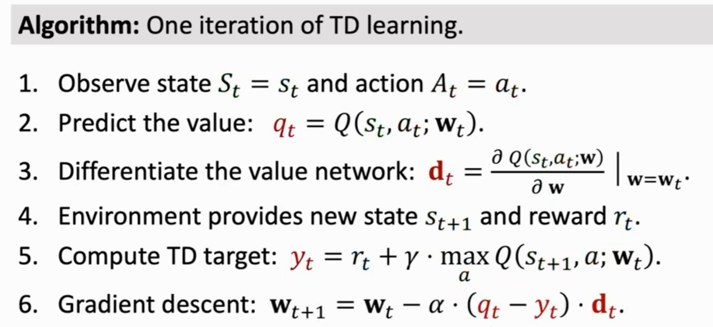
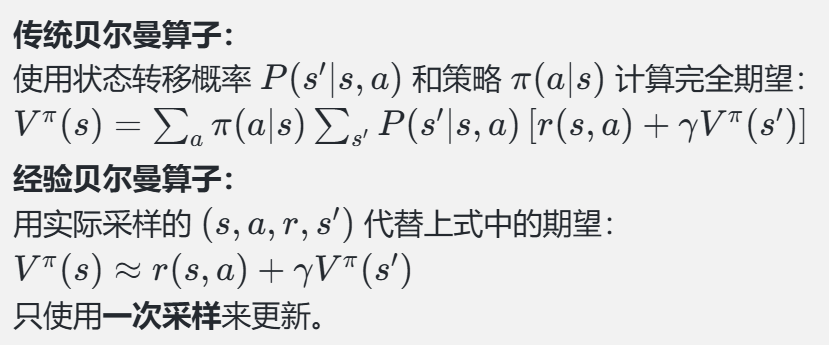
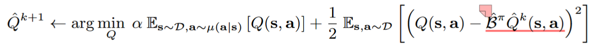
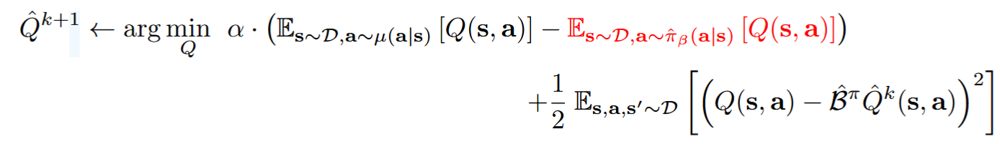
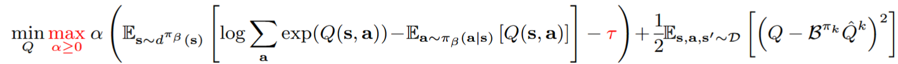

**顶刊顶会：** ICML、ICLR、NeurIPS、AAAI、IJCAI 

**强化学习的随机性来源**

1. Action have randomness

   动作随机性，通过policy function可以得出在当前状态下，指向某个动作的概率    Π(action|state) = ?

2. State transitions have randomness

   状态转移具有随机性，假设Agent做出了向上跳的动作，environment就会根据当前的状态和动作，得出下一个状态的概率

   p(S'|s, a) = ?

**基本概念**


 

**Value-Based Reinforcement Learning**

Deep Q-Network（DQN）

就是用神经网络近似Q^*^函数

如何训练DQN？

利用Temporal Difference（TD） Learning  训练DQN 




**Policy-Based Reinforcement Learning**

 

**Actor-Critic Method**


**疑问？**

这些公式为了消掉某个变量，都是对该变量进行求期望？

Action value function对Ut求期望，通过policy函数和状态转移函数进行action和state的期望来消掉随机变量。

OpenAI Gym?

随机性被期望消除？

梯度下降？

卷积层，变成特征向量？全连接层？

无偏估计？

难道Ut的观测值ut，本质上都可以当多U~Π~，V~Π~，Q^*^吗


TD-Learning算法的表格是怎么来的？

链式法则的求偏导，涉及到后向传播？

kl散度，衡量距离？

梯度投影算法求最优化问题？


**深度学习**

前向传播？

## 算法

### 在线强化学习

#### DDPG

深度**确定性**策略梯度（deep deterministic policy gradient，DDPG）,属于Actor-Critic算法。目标函数就是Q函数，然后用TD算法更新Q函数参数，用对目标函数关于θ求梯度，更新策略函数参数吗


**算法流程如下**


#### SAC 

SAC (Soft Actor Critic) 算法，一种基于最大熵的无模型的深度强化学习算法

**重参数化：** 对于连续动作空间的环境，SAC算法的策略输出高斯分布的均值和标准差，但是根据高斯分布来采样动作是不可导的，所以需要用到**重参数化技巧**（reparameterization trick），重参数化的做法是先从一个单位高斯分布采样，再把采样值乘以标准差后加上均值。这样就可以认为是从策略高斯分布采样，并且这样对于策略函数是可导的。

**算法流程如下**


**网络更新公式**

**Critic: Q网络损失函数**


```python
# 连续动作-更新两个Q网络
td_target = self.calc_target(rewards, next_states, dones)
critic_1_loss = torch.mean(
    F.mse_loss(self.critic_1(states, actions), td_target.detach()))
critic_2_loss = torch.mean(
    F.mse_loss(self.critic_2(states, actions), td_target.detach()))
self.critic_1_optimizer.zero_grad()
critic_1_loss.backward()
self.critic_1_optimizer.step()
self.critic_2_optimizer.zero_grad()
critic_2_loss.backward()
self.critic_2_optimizer.step()
```

**Actor: 策略网络损失函数**

相当于是最大化V~Π~ (s~t~)，取符号就是损失函数，梯度下降更新参数。这里是利用**重参数化**技巧采样动作


```python
# 连续动作-更新策略网络
new_actions, log_prob = self.actor(states)
entropy = -log_prob
q1_value = self.critic_1(states, new_actions)
q2_value = self.critic_2(states, new_actions)
actor_loss = torch.mean(-self.log_alpha.exp() * entropy -
                        torch.min(q1_value, q2_value))
self.actor_optimizer.zero_grad()
actor_loss.backward()
self.actor_optimizer.step()
```


**熵正则项系数损失函数**


```python
# 更新alpha值
alpha_loss = torch.mean(
    (entropy - self.target_entropy).detach() * self.log_alpha.exp())
self.log_alpha_optimizer.zero_grad()
alpha_loss.backward()
self.log_alpha_optimizer.step()
```


### 离线强化学习

#### TD3+BC

1. 作者为了尽可能的让两个动作接近添加了一个正则项 (π(s)−a) 以及 λ 

$$
\pi=\operatorname*{argmax}_{\pi}\mathbb{E}_{s\sim\mathcal{D}}[Q(s,\pi(s))]\to\pi=\operatorname*{argmax}_{\pi}\mathbb{E}_{(s,a)\sim\mathcal{D}}\left[\lambda Q(s,\pi(s))-(\pi(s)-a)^{2}\right]
$$


#### CQL

CQL(R)中max(μ)是怎么推出来的？为什么要取最大化的策略μ，而不是直接令μ=Πk，原文说这样可以减少计算量。那如果是令μ-Πk，是要怎么计算的呢？

CQL(H)(Lagrange)中引入τ来利用双梯度下降法更新α？

对于离散动作，论文基于QR-DQN实现？对于连续动作，论文基于SAC实现？

论文论证了Safe Policy Improvement Guarantees怎么理解？





**Naive regularizer**

这部分讨论了使用简单的正则化器时，Q 函数会被约束在一个统一的下界上。正则化器的效果是让 Q 函数的**所有值**被限制在某个统一的下界上，这种方法对 Q 值施加了**全局的保守约束**，它对所有 (s,a)强制施加相同的约束，而没有区分哪些点更需要严格保守估计。这可能导致对实际策略价值（policy value）的评估不足




**改进Naive regularizer**

Naive regularizer过于粗糙，没有保证哪个点更需要严格保守估计，引入Q-Value maximization term，对于数据集内的(s,a)，我们并不需要对其保守估计。




**gap-expanding property of the CQL update operator**

**耦合效应(coupling effects)：** Q函数近似器（Q-function approximator）中不同状态之间通过参数共享而产生的相互影响。这些效应源于在函数近似中，Q值的计算不是完全独立的，而是由同一个函数或模型（例如神经网络）生成，这会导致不同状态的Q值之间产生交互。在**高熵分布**(high-entropy)（如均匀分布）就会减轻coupling effects的影响，因为算法会更均匀的访问状态-动作空间，防止某些区域访问不足导致局部的误差


**CQL(R)**

对于不同的R(μ)正则项的选择，推导出不同的CQL变体


**CQL(H)** 


**CQL-Lagrange**

实际代码实现的Q函数的损失函数，通过双梯度下降(dual gradient-descent)来更新α，通过引入τ来自动更新α




#### IQL

CQL和TD3+BC是多步动态规划？

去了解一下行为克隆？

advantage weighted regression 方法取提取策略，这种方法的目标函数和行为克隆很像？

clipped double Q-learning？

极大似然估计问题？

最大似然准则下的监督学习？

clip exponentiated advantages?

**值函数的损失函数**


```python
"""
QF Loss
"""
q1_pred = self.qf1(obs, actions)
q2_pred = self.qf2(obs, actions)
target_vf_pred = self.vf(next_obs).detach()

q_target = self.reward_scale * rewards + (1. - terminals) * self.discount * target_vf_pred
q_target = q_target.detach()
qf1_loss = self.qf_criterion(q1_pred, q_target)
qf2_loss = self.qf_criterion(q2_pred, q_target)

"""
VF Loss
 """
q_pred = torch.min(
    self.target_qf1(obs, actions),
    self.target_qf2(obs, actions),
).detach() # 这里取较小值作为q的预测值
vf_pred = self.vf(obs)
vf_err = vf_pred - q_pred
vf_sign = (vf_err > 0).float()
vf_weight = (1 - vf_sign) * self.quantile + vf_sign * (1 - self.quantile)
vf_loss = (vf_weight * (vf_err ** 2)).mean()
```


**抽取策略**


```python

"""
Policy Loss
"""
policy_logpp = dist.log_prob(actions)

adv = q_pred - vf_pred # 计算优势值
exp_adv = torch.exp(adv / self.beta) # 除以beta，图片公式有点问题
if self.clip_score is not None: #Clip Exponentiated Advantages 一种常用的技巧，避免权重过大
    exp_adv = torch.clamp(exp_adv, max=self.clip_score)

weights = exp_adv[:, 0].detach()
policy_loss = (-policy_logpp * weights).mean()
```


#### AWR

 **AWR（Advantage-Weighted Regression）** AWR 的目标是通过软更新方式，用行为策略（Behavior Policy）生成的数据来优化目标策略（Target Policy）。它的更新方法基于加权最大化策略的对数概率，权重由 **优势函数**（Advantage Function）决定。

可以作为policy的损失函数，目标是最大化优势函数和对数似然。优势函数衡量动作 *a* 相对于平均回报的优势，对数似然衡量policy在数据集中选择动作a的概率。

- *λ*→+∞：完全忽略数据分布，仅优化优势函数（类似 Greedy 算法）。
- *λ*→0：退化为行为克隆（Behavior Cloning），仅拟合数据分布

**加权损失函数**
$$
\mathcal{L}(\theta)=-\sum_{(s,a)}\lambda\cdot A(s,a)\cdot\log\pi_\theta(a|s).
$$


#### EDAC

梯度回传怎么理解，好抽象？

特征向量对应的特征值？

采样方差矩阵sample variance matric？

**SAC-N**算法在SAC的clipped double Q-learning（两个Q网络取较小值），拓展为N个Q网络取较小值，能够提升性能。但是过多的N网络，会导致计算的效率低下，且存在结构性冗余，所以**EDAC**希望能够较小N的数量。文章证明了，SAC-N算法效果好的原因，是因为随着N的增加，Q值的多样性，导致Q值得方差增大，对OOD的惩罚力度增大。


### RS


#### DORL

Matthew Effect？马太效应，“强者愈强，弱者愈弱”

filter bubble issue？

推荐系统基于模型，都是建立一个reward model的吗？

用户的indicator feature是什么？可以理解为用户特征，比如基本信息、最近点击率、停留时间等等

Embedding（嵌入层）是什么？ 是一种将离散数据（如 ID、单词）转化为连续向量的技术，用于降低维度并捕捉语义关系。Embedding 向量是可训练的，能够通过任务目标（如点击率预测）自适应优化。

Sequential Recommendation和Interactive Recommendation有什么区别吗？

提到得quit mechanism

DeepFM用来做什么的，这是一个通用的模型吗？

特征维度和实体维度是什么？

负采样是什么？就是生成user-item没有交互过的数据

特征列、目标列和行动列分别对应着什么？

曝光效应(exposure effect)？是指用户对某个物品的兴趣或行为可能会受到该物品在推荐列表中出现频率的影响。也就是论文中提到的Metthew Effect马太效应。是为了在训练数据集中考虑物品在推荐列表中出现频率对用户行为的影响。

1. 首先通过实验展示了之前的方法导致的马太效应会伤害用户的满意程度，用户的一系列点击率会降低
1. DORL在MOPO的reward基础上增加了熵鼓励项。k阶熵(**k-order Entrypy**)，假设k为3，把长度为3的子序列作为模式，并统计每个模式后紧跟项出现的频率，来计算熵值，熵值越大，说明后面的紧跟项的种类数量多。

**代码流程：**

首先需要利用已有数据集，训练一个基于DeepFM的user model，这个模型同时会得到用户特征和item特征的嵌入表示。

然后可以开始训练policy，需要先建立一个state tracker，相当于是一个状态转移函数，能够根据当前状态和动作获得下一个状态。接着就是OnPolicy训练策略

#### DeepFM

**FM模型可以建模1阶特征**：

- **1阶特征**：通常指的是模型中每个特征独立存在的情况，即每个特征对目标变量的影响是线性的。在FM模型中，1阶特征就是模型直接学习每个单独特征对结果的贡献，比如某个用户是否点击了某个广告，或者某个商品是否被购买。

  在FM模型中，1阶特征通常是直接由特征的权重决定的。

**FM模型通过隐向量点积建模2阶特征**：

- **2阶特征**：指的是特征之间的交互作用，即多个特征的联合影响。例如，用户和广告之间的交互行为，这个交互不仅仅取决于用户本身或者广告本身，还取决于用户和广告的组合情况。

  在FM模型中，2阶特征的表示是通过学习隐向量（通常是低维度的向量表示）来实现的。每个特征（例如用户、广告等）都有一个隐向量，FM模型通过计算特征隐向量之间的 **点积** 来捕捉特征之间的交互效应。点积的结果表示了特征之间的交互强度。

**隐向量和嵌入层的区别**

- **隐向量**：通过矩阵分解等方法得到，用于捕捉特征间的交互和关系，通常用于通过内积计算相似度（如推荐系统中的用户和物品之间的匹配度）。
- **嵌入层**：通过神经网络得到，用于将离散的类别特征转化为低维表示，嵌入向量通常作为神经网络的输入，进一步经过网络的处理来进行预测。它并不直接用于计算相似度，而是通过神经网络的后续层来学习特征之间的复杂关系。

**矩阵分解模型**

是推荐系统中一种常见的技术，特别适用于基于协同过滤（Collaborative Filtering）的方法。矩阵分解的目标是将一个大且稀疏的矩阵分解为多个较小的矩阵，通过这些矩阵的乘积来预测用户的偏好或评分。已知评分矩阵R，包含用户对物品的评分，目标是将R分解为两个低秩矩阵P和Q

- **P矩阵**（用户矩阵）：其维度通常是用户数 m 和特征维度 k，每一行表示用户的隐向量（latent vector）。
- **Q矩阵**（物品矩阵）：其维度通常是物品数 n和特征维度 k，每一行表示物品的隐向量。

定义损失函数，一般是均方误差MSE
$$
L=\sum_{(i,j)\in R_{known}}(r_{ij}-p_i\cdot q_{j}^{T})+\lambda(\|P\|^2+\|Q\|^2)
$$

其中，rij 是已知的评分，pi是用户 i 的隐向量，qj是物品 j的隐向量，λ是正则化参数，用于避免过拟合。

一旦训练完成，就可以用P和Q矩阵的乘积来预测未评分的评分


#### ROLeR

1. 重新构造求解reward的方式，从一开始依赖user model的准确性来求解；改成利用用户的静态特征和动态特征（历史交互数据），进行KNN聚类，将选出的k个距离最近的用户，默认他们具有相似的爱好以及相似的反馈，然后reward的平均值作为奖励。


#### OCEAN

1. 选择不确定性程度低于阈值的动作-状态对进行探索。
2. 选择加入高斯噪声后，低于阈值的动作-状态对进行探索


#### Diffusion Model


#### Diffusion-QL

In most prior work, the policy is a Gaussian distribution with mean and diagonal covariance specified by the output of a neural network？训练的policy都是服从对角高斯分布？通过神经网络建模policy分布，得到分布的均值以及协方差矩阵，采样得到动作。

Diffusion Model学习策略更加expressive，能学习到多模态的分布。所以Diffusion Model主要就是学习一个noise predictor，然后就可以生成基于状态生成动作，主要利用离线数据集来训练Diffusion Model，采样transition，在该论文中，Diffusion Model（policy）和Q网络同时进行训练。

1. 把Diffusion Model作为policy生成新的动作
2. 但是单纯扩散模型生成动作还属于behavior-cloning，于是在policy的损失函数中又加上了regularization（使得生成的动作a的Q值要大）

$$
a^{i-1}\mid a^i=\frac{\boldsymbol{a}^i}{\sqrt{\alpha_i}}-\frac{\beta_i}{\sqrt{\alpha_i(1-\bar{\alpha}_i)}}\epsilon_\theta(a^i,s,i)+\sqrt{\beta_i}\epsilon,\epsilon\sim\mathcal{N}(\boldsymbol{0},\boldsymbol{I}),\mathrm{for~}i=N,\ldots,1.\quad(1)
$$

$$
\mathcal{L}_d(\theta)=\mathbb{E}_{i\sim\mathcal{U},\boldsymbol{\epsilon}\sim\mathcal{N}(0,\boldsymbol{I}),(\boldsymbol{s},\boldsymbol{a})\sim\mathcal{D}}\left[||\epsilon-\epsilon_\theta(\sqrt{\bar{\alpha}_i}\boldsymbol{a}+\sqrt{1-\bar{\alpha}_i}\boldsymbol{\epsilon},\boldsymbol{s},i)||^2\right],\quad(2)
$$

$$
\pi=\arg\min_{\pi_\theta}\mathcal{L}(\theta)=\mathcal{L}_d(\theta)+\mathcal{L}_q(\theta)=\mathcal{L}_d(\theta)-\alpha\cdot\mathbb{E}_{\boldsymbol{s}\sim\mathcal{D},\boldsymbol{a}^0\sim\pi_\theta}\left[Q_\phi(s,a^0)\right].\quad\mathrm{(3)}
$$

$$
\mathbb{E}_{(\boldsymbol{s}_t,\boldsymbol{a}_t,\boldsymbol{s}_{t+1})\sim\mathcal{D},\boldsymbol{a}_{t+1}^0\sim\pi_{\theta^{\prime}}}\left[\left|\left|\left(r(s_t,\boldsymbol{a}_t)+\gamma\min_{i=1,2}Q_{\phi_i^{\prime}}(s_{t+1},\boldsymbol{a}_{t+1}^0)\right)-Q_{\phi_i}(s_t,\boldsymbol{a}_t)\right|\right|^2\right].\quad(4)
$$


**扩散模型具体实现：**

假设模型预测的噪声为 ϵθ，预测的 x~0~为：由**前向过程**的公式反推得到
$$
x_\mathrm{recon}=\frac{x_t-\sqrt{1-\bar{\alpha}_t}\epsilon_\theta}{\sqrt{\bar{\alpha}_t}}
$$
代入后验均值公式：
$$
\tilde{\mu}_t=\frac{\sqrt{\bar{\alpha}_{t-1}}\beta_t}{1-\bar\alpha_t}x_\mathrm{recon}+\frac{\sqrt{\alpha_t}(1-\bar\alpha_{t-1})}{1-\bar\alpha_t}x_t
$$
最后化简得，可以发现和Diffusion Model论文中的逆向过程公式一致，只是本论文将其拆分为两个部分进行计算。所就是说，通过预测x0+后验均值公式，就可以获得后验分布的均值，然后就可以计算x~t-1~
$$
\tilde{\mu}_t=\frac{x_t}{\sqrt{\alpha_t}}-\frac{\beta_t}{\sqrt{\alpha_t(1-\bar{\alpha}_t)}}\epsilon_\theta
$$

#### Dyndiffusion


### 基础知识

##### 泰勒公式

$$
f(x)=f(a)+\frac{f^{\prime}(a)}{1!}(x-a)+\frac{f^{(2)}(a)}{2!}(x-a)^2+\cdots+\frac{f^{(n)}(a)}{n!}(x-a)^n+R_n(x)
$$

其中的多项式称为函数在*a* 处的**泰勒展开式**，剩余的R~n~(x) 是泰勒公式的余项，是(x−a)^n^ 的高阶无穷小。

##### LogSumExp算子

LogSumExp 是平滑最大值近似的原因在于它的公式结构可以看作对 **最大值操作 (max⁡)** 的一种连续化形式
$$
LogSumExp(x1,x2,..,x_n)=log(\sum_{i=1}^{n}{e^x})
$$
假设x~k~ =max(x1,x2,....xn)，且x~k~ 与其他值相差较大时，我们可以近似
$$
\sum_{i=1}^{n}({e^{x_i}}){\approx}e^{x_k}
$$
所以
$$
LogSumExp(x_1,x_2,..,x_n)=log(\sum_{i=1}^{n}{e^{x_i}}){\approx}\log(e^{x_k}){\approx}{x_k}
$$

##### softmax

softmax是一种激活函数，可以将一个数值向量归一化为一个概率分布向量，且各个概率之和为1。Softmax层常常和交叉熵损失函数一起结合使用。	
$$
Softmax(x)=\frac{e^{x_i}}{\sum_ie^{x_i}}
$$


##### 激活函数

**GELU**


##### 拉格朗日乘子法

是一种数学优化方法，在有约束条件下找到函数的极值


##### 非对称最小二乘法

**Asymmetric Least Squares (ALS)** 的核心思想是：对于正误差（实际值高于预测值）和负误差（实际值低于预测值），从而对模型的偏态进行调整，使得模型更关注误差的一侧（正或负）

ALS目标函数定义如下
$$
\min_\beta\sum_i{w_i}.(y_i-f(x_i;\beta))^2
$$
其中，w~i~ 是非对称权重，通常定义为（实际值-预测值），当alpha更接近于1，那么对低估的惩罚的权重大，对高估的权重小，那么最终的结果会偏向于高估，也就是实际值小于预测值
$$
w_i=\left\{
		\begin{array}{**lr**}
		\alpha,\qquad if\ y_i-f(x_i;\beta)\geq0\\
		1-\alpha,\  if\ y_i-f(x_i;\beta)<0
		\end{array}
\right.
$$


##### 占用度量

在强化学习中，"占用度量"通常指的是在一个特定状态下，某个动作被执行的频率或持续时间。这可以用来衡量在agent与environment交互的过程中，agent对于不同动作的选择**偏好程度**。占用度量是考虑长期下，状态-动作对出现的分布情况，也就是DORL论文中提到的折扣概率分布。在推荐系统中，为了提高整体收益，一般要选择状态-动作对出现频率高的。

$$
\rho^\pi(s,a)=(1-\gamma)\pi(a|s)\sum_{t=0}^\infty\gamma^tP(s_t=s|\pi)
$$
然后下面的公式来衡量推荐系统的长期收益
$$
\eta_M(\pi)=\mathbb{E}_{(s,a)\sim\rho_T^\pi}[r(s,a)]
$$


##### Clipped Double Q-Learning 

用于解决传统 Q-learning 方法中的 **过估计偏差（overestimation bias）** 问题。它是 Double Q-Learning 的一种变体，主要通过取较小的 Q 值来进一步抑制估计偏差。SAC算法中计算TD Target的时候用到了这种方式


##### Clip Exponentiated Advantages

是一种在强化学习中常用的技巧，。它主要出现在基于加权回归或软策略优化的方法中，例如 **Advantage-Weighted Regression (AWR)** 或 **Soft Actor-Critic (SAC)**。


##### 求导

出现在标量函数对向量求导时（如梯度），结果是向量。在机器学习和优化中，默认x是列向量

出现在向量函数对向量求导时（如 Hessian，二阶导），结果是矩阵

##### 内积（Inner Product）

内积（也称为点积）是线性代数中的一个基本概念，涉及两个向量的特殊乘法形式，其结果是一个标量。**对应的位置相乘再相加** 。也可以衡量两个向量或矩阵的相似程度，

**内积的方差计算公式**

$$
Var(Z)=Var(a^Tb)=b^T{\cdot}Cov(a){\cdot}b
$$


##### 外积（Cross Product）


##### 协方差

协方差是用来衡量两个随机变量之间的线性相关性（linear correlation）的度量。对于两个随机变量 X 和 Y，协方差定义为：
$$
Cov(X,Y)=E[(X-E[X])(Y-E[Y])]
$$

**对角协方差（Diagonal Covariance）**：协方差矩阵的非对角元素为0，假设动作各维度之间相互独立。

##### 二范数（||.||~2~）

二范数是向量q的欧几里得长度，定义为：
$$
||\bar{q}||_2=\sqrt{\sum_{i=1}^{n}q{_i}{^2}}
$$


##### 矩阵迹（trace）

矩阵的迹（trace）定义为矩阵对角线元素的和，即：
$$
Tr(A)=\sum_{i=1}^nA_{ii}
$$
对于一个协方差矩阵，矩阵对角线上的元素的和就是变量的**总方差** ，也就是矩阵的迹。协方差矩阵是半正定矩阵，其特征值λ（一个矩阵会有多个特征值）均为负，矩阵的迹等于所有特征值的和，也就是元素的总方差。


##### 自回归编码

**自回归编码（Autoregressive Encoding）** 是一种用于序列数据建模和生成的编码方式，常见于自然语言处理（NLP）、时间序列预测、语音信号处理等领域。它以递归的方式，逐步生成序列中的每个元素，同时使用先前生成的元素作为输入来预测下一个元素。


##### Soft-label kNN

原始kNN的改进版，每个样本点的类别预测不再是一个固定的值，而是一个**概率分布**，更适合在模糊决策场景中应用。


##### KL散度

$$
KL(P||Q)=\sum p(x)\log\frac{p(x)}{q(x)}=-\sum p(x)\log(q(x))+\sum p(x)\log(p(x))=H(P,Q)-H(P)
$$

最后得到的第一项称作P和Q的交叉熵（cross entropy），后面一项就是熵。

##### 最大均值差异MMD

Maximum Mean Discrepancy：
$$
\mathrm{MMD}^2(P,Q)=\mathbb{E}_{x,x^{\prime}\sim P}[k(x,x^{\prime})]+\mathbb{E}_{y,y^{\prime}\sim Q}[k(y,y^{\prime})]-2\mathbb{E}_{x\sim P,y\sim Q}[k(x,y)]
$$
k为核函数，MMD值为0，当且仅当P=Q

##### 多模态分布

 Multimodal Distribution：指具有多个“峰值”（也叫“模式”）的概率分布。在统计学中，一个“模式”指的是数据的集中区域，即数据出现频率较高的区域。如果一个分布有多个不同的峰，这些峰就是分布的不同模式。例如，测量来自多个不同群体的结果，每个群体可能具有不同的分布特点，导致整体数据的分布具有多个峰。


##### dropout rate

丢弃率，常规的**dropout rate**指在训练过程中随机“关闭”神经元的比例，用于防止模型过拟合。例如，若设置dropout rate为0.3，则每次训练时每个神经元有30%的概率被临时丢弃，剩余70%的神经元会通过缩放（如除以0.7）保持输出的期望值稳定。这一机制通过引入随机性增强模型泛化能力，是深度学习中最常用的正则化技术之一。


##### 逆强化学习（IRL）

逆强化学习（Inverse Reinforcement Learning）：在强化学习中，学习到一个最优的策略，需要有一个奖励函数（离线强化学习是一个例外，它是从数据集中学习），但是奖励函数得到呢？对于有包含奖励的数据集，可以利用神经网络，以监督学习的方式拟合数据集来学习奖励函数；但是对于数据集中没有包含奖励，则需要利用逆强化学习的方法，从数据集中提取奖励函数，但是需要要求**专家数据集**。


##### Hesse Matrix

黑塞矩阵，一个由多变量实值函数的所有二阶偏导数组成的方阵。


MLPD、Diffuser、CondDiffuser

$$
l(D,P)=E _{(s,a,s')∼D}[logD(s,a,s′)]+E _{(s,a)∼D,s′ ∼P(⋅∣s,a)}[log(1−D(s,a,s′))]
$$

##### DCG

Discount Cumulative Gain是一种常用的信息检索和推荐系统中的评价指标，用来衡量一个搜索结果列表中内容的相关性排序质量。相关性越高，排名越靠前，越重要，得分也越高。

因为DCG的绝对值很难直接比较不同的排序，所以一般用NDCG（Normalized DCG）
$$
NDCG=\frac{DCG}{IDCG}
$$
其中IDCG是理想情况下（最好的排序）能得到的最大DCG值。

##### 重要性采样

Normalized Capped Importance Sampling (NCIS) 是一种用来在离线策略评估（Off-policy Evaluation, OPE）中估计一个新策略（目标策略）的性能的方法。它是 重要性采样（Importance Sampling, IS）的一种改进形式，解决原始 IS 方法高方差和不稳定的问题。

标准IS的估计方式是：
$$
\mathbb{E}_{\pi}[r]=\mathbb{E}_{\pi_b}[w\cdot r],其中w=\frac{\pi(a|s)}{\pi_b(a|s)}
$$


Normalization（归一化后）：
$$
NCIS=\frac{\sum_iw_c^ir_i}{\sum_iw_c^i}
$$

重要性采样的作用：**将对一个“难以采样的目标分布”的期望估计，转换为对一个“可以采样的行为分布”的期望估计**
$$
\mathbb{E}_{x\sim p(x)}[f(x)]=\mathbb{E}_{x \sim q(x)}[\frac{p(x)}{q(x)}f(x)]
$$
其中p(x)是目标分布（想估计的期望，但不能采样），q(x)是行为分布（可以从中采样），两个的比值就是重要性权重。

拿**PPO算法**为例，当前策略要优化的目标是
$$
\mathbb{E}_{(s,a)\sim\pi_{\theta}} = [\log(\pi_{\theta}(a|s))A_t]
$$
但是数据是从旧策略采集过来的，我们无法直接对当前策略进行采样。（所谓的采样就是策略与环境进行交互，得到一批训练数据，我么总不可能拿当前策略的采样数据来训练当前策略）。所以我们只能用旧策略的，然后用重要性采样矫正分布差异。另外**on-policy** 算法采样的数据本来就是当前策略的，不需要重要性采样。**off-policy** 则必须用重要性采样校正采样分布与目标策略之间的偏差。**系数另外的理解方式：** 如果当前策略选择某动作的概率要大于旧策略的，那么比值就会大于1，策略会倾向于学习这个动作，如果比值小于1，策略就会倾向于减少选择这个动作，PPO引入裁剪的目的就是为了避免这个比值过大或过小，造成学习不稳定。
$$
\mathbb{E}_{(s,a)\sim \pi_{old}}=[\frac{\pi_{\theta}(s,a)}{\pi_{old}(s,a)}\log\pi_{\theta}(s,a)A_t]
$$


##### 广义优势函数估计

GAE（Generalized Advantage Estimation），用来估计优势函数。它的设计目标是解决**策略梯度中高方差的问题**，同时尽量不引入太大的偏差。核心思想是：不要只使用一步 TD 误差，而是将多个不同步长的 TD 误差加权平均，形成一个优势估计序列。
$$
A_t^{\mathrm{GAE}(\gamma,\lambda)}=\delta_t+\gamma\lambda\delta_{t+1}+(\gamma\lambda)^2\delta_{t+2}+\ldots
$$
其中delta是TD误差，gamma是折扣系数，lambda用于调节偏差和方差。lambda等于0表示只使用单步TD误差，lambda等于1表示使用一整条轨迹的TD误差。


##### 对比学习

对比学习（Contrastive Learning）是一种机器学习范式，其核心思想是通过学习将相似的数据点在表示空间中拉近，同时将不相似的数据点推远，从而学习到有意义的、判别性的**数据表示**（representations）。本质上是学习到一个编码器，能够将复杂高维的数据转化为低维的嵌入向量

**主要组成部分**

1. **数据增强（Data Augmentation）：** 这是对比学习中生成“正样本对”的关键。对于给定的一个数据点（例如一张图片），通过应用不同的随机变换（如随机裁剪、翻转、颜色抖动、高斯模糊等），可以生成该数据点的多个视图，这些视图被视为彼此的“正样本”。
2. **编码器（Encoder）：** 一个神经网络（如ResNet、Transformer等），用于将原始数据（图片、文本、序列等）映射到低维的表示空间，生成其向量表示（embeddings）。
3. **相似度度量（Similarity Metric）：** 用于衡量表示空间中两个向量之间的相似度，通常使用余弦相似度（Cosine Similarity）。
4. **对比损失函数（Contrastive Loss Function）：** 这是驱动模型学习的核心。最常见的损失函数是 **InfoNCE Loss**（Information Noise-Contrastive Estimation Loss）。

##### 二元交叉熵

二元交叉熵（Binary Cross-Entropy，BCE）是**用于二分类问题的一种常用损失函数**。它衡量的是模型预测的概率分布与真实标签的概率分布之间的差异。对于一个包含N个样本的批量，通常会计算所有样本的平均损失。
$$
L=-\frac{1}{N}\sum_{i=1}^{N}[y_i\log(\hat{y}_i)+(1-y_i)\log(1-\hat{y}_i)]
$$
​	其中yi是真实值，y_hat是预测值。

##### 线性代数

**正交矩阵：** 一个方阵 Q 被称为正交矩阵，如果它的所有列向量（或所有行向量）构成一个标准正交基。标准正交的意思是任意两个不同的列向量之间都是互相垂直的，且每一个列向量自身的长度（范数）都为 1。最重要的性质是

1. 逆矩阵等于转置矩阵。
2. 如果你用一个正交矩阵 Q去乘以一个向量 x，得到的新向量 Qx 的长度和原向量 x 完全相同。

##### 因果推断

**后门准则（Back-Door Criterion）**

存在“混杂变量”（Confounder）Z。混杂变量Z是同时影响“原因X”和“结果Y”的共同原因，它会打开一条从 X 到 Y 的“后门路径"，造成 X 和 Y 之间的虚假关联。也就是Z->X、Z->Y，会影响X->Y因果效应的计算。但是如果**Z是可观测的**（Identifiability），就可以使用后门调整公式来计算因果效应：


​	公式的含义是在Z的每个区取值下z，分别计算X对Y的影响，然后根据Z的分布进行加权平均。

**前门准则（Back-Door Criterion）**

当前门准则出场时，通常意味着情况更复杂：**混杂变量Z无法被观测到**，导致后门路径无法被关闭。前门准则的思想是，把一个复杂的因果问题分解成两个更简单的、不受混杂影响的子问题。

**举例：**来研究“吸烟（X）”与“肺癌（Y）”的关系。

可能存在某种“基因缺陷（U）”，它既让人更容易吸烟上瘾（U → X），也让人更容易得肺癌（U → Y）。这个基因我们无法测量，所以后门被堵死了。但我们知道吸烟导致肺癌的**核心机制（Mechanism）**：吸烟会在肺部产生“焦油沉积（M）”，而焦油沉积会导致肺癌。这个“焦油沉积”M 就是我们的中介变量。

**第一步：计算 X 对 M 的因果效应**。吸烟（X）和焦油沉积（M）之间的关系是纯粹的，不受基因（U）的直接影响。所以 `P(M | do(X))` 可以直接用观测到的 `P(M | X)` 来估计。

**第二步：计算 M 对 Y 的因果效应**。在这一步，X 成了 M 和 Y 之间的混杂因子（M ← X → Y ← U），所以我们需要控制 X 来阻断这条后门路径。


**干预（Intervention）**

##### 扩散模型

EDM

**预处理网络$$D$$ 的结构如下**
$$
D(\mathbf{x}, \sigma) = c_{\text{skip}}(\sigma)\mathbf{x} + c_{\text{out}}(\sigma) F(c_{\text{in}}(\sigma)\mathbf{x}, c_{\text{noise}}(\sigma))
$$
其中：$\mathbf{x}$ 是带噪声的输入。 $\sigma$ 是当前的噪声水平，$F$ 是核心的神经网络（代码中的 `self.net`）， $c_{...}(\sigma)$ 是一系列与噪声水平 $\sigma$ 相关的缩放函数，它们对于在所有噪声尺度上稳定训练至关重要。`c_in(sigma)`: 对网络的输入进行缩放，`c_noise(sigma)`: 将噪声水平 $\sigma$ 编码成一个时间步嵌入向量，`c_skip(sigma)`: 实现了一个跳跃连接，将原始的带噪输入按比例直接加到最终输出上，`c_out(sigma)`: 对神经网络 $F$ 的输出进行缩放。

**训练过程：**EDM的训练过程非常直接和高效。它不像传统扩散模型那样需要模拟一个完整的加噪链，而是对每个训练样本执行一次独立的加噪和去噪预测。 对于一个干净的训练样本 $\mathbf{x}_0$，训练步骤如下：

1. **随机采样噪声水平 $\sigma$**: 从一个 对数正态分布（Log-Normal Distribution） 中随机采样一个噪声水平 $\sigma$。这种分布使得模型能更关注于低噪声水平的细节，这对于生成高质量样本至关重要。
2. **构造带噪样本**: 通过向干净样本添加高斯噪声来构造训练数据：$\mathbf{x} = \mathbf{x}_0 + \sigma \cdot \mathbf{n}$，其中 $\mathbf{n} \sim \mathcal{N}(0, I)$。
3. **网络预测**: 将带噪样本 $\mathbf{x}$ 和噪声水平 $\sigma$ 输入到预处理网络 $D$ 中，得到去噪预测值 $D(\mathbf{x}, \sigma)$。
4. **计算损失**: 损失函数是预测值与原始干净样本 $\mathbf{x}_0$ 之间的**加权均方误差（Weighted MSE）**

去噪网络$$F$$的结构是怎么样的，条件是怎么加上去的？

`T,D = self.event_shape` 其中的T和D是什么维度


**采样过程：**采样是从纯噪声生成新数据的过程。我们将这个过程看作是数值求解从高噪声到零噪声的ODE。代码中使用的是一个带随机性的**2阶Heun求解器**，它比标准的欧拉法更精确，能用更少的步数生成高质量的样本。

1. **生成采样时间表**: `sample_schedule()` 函数根据预设的 `sigma_max`, `sigma_min` 和 `rho` 参数，生成一个从高到低的噪声水平序列 $\{\sigma_0, \sigma_1, ..., \sigma_N\}$。`rho` 参数控制了步长的分布，使得步长在噪声较小的区域更密集，以保证生成细节的精细度。
2. **初始化**: 从一个标准正态分布中采样初始噪声，并乘以最大的噪声水平 $\sigma_{max}$（即 `sigmas[0]`）：$\mathbf{x}_0 \sim \mathcal{N}(0, \sigma_0^2 \mathbf{I})$。
3. **迭代去噪**: 在时间表上从 $\sigma_i$ 迭代到 $\sigma_{i+1}$
   - **增加随机性 (Stochasticity)**：为了让采样器更好地探索数据空间、避免卡在局部，可以引入一个小的扰动。通过 `gamma` 和 `S_churn` 等参数控制，将当前样本 $\mathbf{x}_i$ 变成一个噪声稍高的 $\mathbf{x}'_i$。
   - **预测步 (Predictor Step)**：首先，在当前点 $\mathbf{x}'_i$ 处计算去噪方向。这通过调用 **`score_fn()`**（或直接计算 `(x - D(x, sigma)) / sigma`）得到。然后，像欧拉法一样，沿着这个方向完整地走一步，到达一个临时的下一个点 $\mathbf{x}_{\text{temp}}$。
   - **校正步 (Corrector Step)**：为了提高精度，Heun方法会在这个**临时的**下一个点 $\mathbf{x}_{\text{temp}}$ 处，**再次**评估去噪方向。
   - **最终更新**: 将预测步和校正步得到的两个方向进行**平均**，然后用这个更精确的平均方向来更新当前样本，得到 $\mathbf{x}_{i+1}$。


##### Verbal RL

Verbal RL 是一种将**自然语言反馈**整合到强化学习（RL）循环中的方法。

在传统的强化学习中，智能体（Agent）通过与环境交互来学习。当它做出一个动作后，环境会给它一个**数值奖励**。智能体的目标是最大化这个累积的数值奖励。

而在 Verbal RL 中，反馈**不仅仅是一个数字，而是自然语言**（比如一段批评、一句建议或一段自我反思）。这种语言反馈为智能体提供了更丰富、更具体、更具有指导性的信息，告诉它“为什么”做错了以及“如何”改进。


### pytorch

- 如果所有参与运算的Tensor都在**GPU**上，结果会保留在GPU。

- 如果所有参与运算的Tensor都在**CPU**上，结果会保留在CPU。
- **混合设备运算会直接报错**（如CPU+GPU）。

```python
import torch

# 示例1：GPU上的运算结果仍在GPU
device = torch.device("cuda:0" if torch.cuda.is_available() else "cpu")
a = torch.randn(3, 3).to(device)  # GPU
b = torch.randn(3, 3).to(device)  # GPU
c = a + b  # 结果c在GPU上

# 示例2：强制将结果移动到CPU
c_cpu = c.cpu()  # 显式移动到CPU

# 示例3：混合设备会报错
d = torch.randn(3, 3)  # CPU
e = d + a  # 报错：d在CPU，a在GPU
```

**自动微分计算图**

1. 梯度追踪机制
   - `observations`或`actions`张量是通过带有`requires_grad=True`的操作产生的（例如来自神经网络输出）
   - 这些张量仍处于**自动微分计算图**中，保留着梯度计算所需的信息
2. numpy转换冲突
   - `.numpy()`方法会尝试将张量数据转换为NumPy数组，但NumPy无法处理梯度信息
   - 直接转换会导致梯度计算链路断裂，因此PyTorch强制要求先分离张量   **.detach()**
3. 中断梯度追踪的方式
   - `with torch.no_grad():` 在该语句块下变量的计算不参与反向传播的计算图中。
   - `x.detach()` 让某一步变量操作不参与反向传播，会返回一个新变量
   - `x.requires_grad_(False)` 永久关闭某个变量的梯度追踪，但必须是在叶子节点的变量，否则会报错。


**矩阵乘法**

1. 矩阵乘法：`torch.matmul(A,B) or A@B` 
2. 点乘：`torch.dot(A,B)`
3. 对应元素相乘：`A*B 或 torch.mul(A,B)`

**交换维度**

为了匹配某些矩阵惩罚的维度需求，经常会需要交换张量的维度。比如在Transformer中需要计算Q、K、V矩阵，需要匹配维度。

```python
scores = torch.matmul(query, key.transpose(-2, -1))/math.sqrt(d_k)
```

1. `transpose(dim0, dim1)`：只交换两个维度。

2. `permute(dim0, dim1, dim2, ...)`：可以重新排列所有维度。
3. `X.T` 在二维中，交换维度等效于转置矩阵。

**压缩维度**

1. `flatten()` 把**多维张量展平成一维向量**，也可以自定义在哪两个维度之间展平。
2. `squeeze()` **去除所有为1的维度**（默认），或者指定某个为1的维度。`unsqueeze(dim)` 在某个维度上增加维度
3. `view() or reshape()` **任意改变张量的形状**，更灵活但需要你知道目标形状。

**自定义参数**

`self.log_std = nn.Parameter(torch.zeros(act_dim, dtype=torch.float32))`

在 `nn.Module` 的子类中，任何被赋值为 `nn.Parameter` 实例的属性都会被 PyTorch 自动识别为模型的可学习参数。

**conda环境**

`conda env create -f environment.yml `使用yml创建conda环境

`conda remove --name <环境名> --all` 删除conda环境

`conda list -e > requirements.txt` 导出依赖

**广播机制**

**对齐维度**： PyTorch 会从两个张量的**尾部**（最右侧）开始比较它们的维度。如果一个张量的维度较少，它会在**头部**（最左侧）“虚拟地”添加大小为 1 的维度，直到两个张量的维度数量相同。

- `position`: `(max_len, 1)` (2 个维度)
- `div_term`: `(d_model / 2)` (1 个维度)

PyTorch 会在 `div_term` 的左侧添加一个维度，使其变为 `(1, d_model / 2)`。 现在我们比较：

- `position`: `(max_len, 1)`
- `div_term`: `(1, d_model / 2)`

**逐维比较**： PyTorch 逐个比较对齐后的维度大小。必须满足以下两个条件之一：

- a) 两个维度的大小**相等**。
- b) 其中一个维度的大小为 **1**。（为1就会进行拉伸或复制，以匹配另一个张量）

### python语法

**\**的作用**

当在函数定义中使用`**param`（如`def func(**kwargs)`），表示该参数会**收集所有传入的关键字参数**，并将其存储为一个字典（`dict`）。

当在函数调用时使用`**`（如`func(**dict)`），表示将字典**拆解为关键字参数**传递。


***的作用**

*是参数解包操作符，可以在函数调用中将列表中的元素逐个展开，例如在构造神经网络时，可以`self.net = nn.Sequential(*layers)`


**popen函数**

popen是subprocess模块中的一个函数，用于在子进程中执行命令。


**命名规范**

1. 普通函数：无下划线或单下划线分隔
2. 单下划线开头：_function_name。提示开发者函数是内部使用，模块不会被import导入
3. 双下划线开头和结尾：__init\_\_ 。定义类内置行为（如初始化、运算符重载等），或者是系统保留，这类方法由 Python 解释器自动调用，开发者不应自定义类似名称的函数。


**map函数**
`map(func, iterable)` 将func函数依次应用到iterable的每个元素上，返回一个迭代器。这里的iterable可以是一个列表


**函数传值**

1. **不可变对象** (Immutable) ，会创建新对象，外部对象不受影响

- **类型**：`int`, `float`, `str`, `tuple`, `frozenset`

2. **可变对象** (Mutable)，可变对象的内容可以直接被修改

- **类型**：`list`, `dict`, `set`, 自定义对象

**传递的永远是引用**：Python不会自动创建副本。**强制传递副本**：需显式使用 `copy()` 或 `deepcopy()`


**类继承和包装器（Wrapper）**

**类继承** 是面向对象编程中的核心特性之一，它允许你创建一个新类（子类），并通过继承一个已有类（父类）的属性和方法来扩展或修改该类的行为。

**环境包装器** 是一种设计模式，它通过将原始对象或类包装在另一个对象或类中，来为原始对象添加额外的功能。包装器并不修改原始类的结构，而是通过组合（**Composition**）原始类和在其外部提供额外功能来增强行为。


**instantiate方法**

`instantiate` 是 **Hydra** 库中一个极其强大的核心功能，它的主要作用是：自动读取你的 `.yaml` 配置文件，并根据配置为你创建（即“实例化”）一个Python对象。

1. 在配置文件中定义蓝图

   ```yaml
   model:
     _target_: my_project.MyModel  # 告诉Hydra要创建这个类的实例
     layers: 32                    # MyModel.__init__的参数
     dim: 256                      # MyModel.__init__的参数
   
   optimizer:
     _target_: torch.optim.Adam     # 告诉Hydra要创建这个类的实例
     lr: 0.001
     betas: [0.9, 0.999]
   ```

2. 在python代码中实例化

   ```python
   from hydra.utils import instantiate
   from hydra import initialize, compose
   # 1. 加载配置 (和以前一样)
   with initialize(config_path="./config"):
   	cfg = compose(config_name="transformer.yaml")
   # 2. 自动创建实例
   # Hydra会查找 _target_，导入它，并把其他键作为参数传给__init__
   model = instantiate(cfg.model)
   optimizer = instantiate(cfg.optimizer, params=model.parameters()) 
   # (这里我们额外传入了 model.parameters)
   ```


**装饰器**

`@dataclass` 是一个自动代码生成器

1. 读取你在**类级别**声明的所有变量（如 `device: str = "cuda:0"`）。

2. 在**后台自动为你生成**一个 `__init__` 方法。

```python
@dataclass
class TrainConfig:
    # 1. 这里是“类级别”的声明
    device: str = "cuda:0" 
    env: str = "halfcheetah-medium-v2"
    seed: int = 0
    # ...

    # 2. 这里是“方法”内部
    def __post_init__(self):
        # 3. 在方法内部，必须使用 self 来访问实例
        self.name = f"{self.name}-{self.env}-{str(uuid.uuid4())[:4]}"
```


### 强化学习环境配置

#### mjrl

直接用pip安装是有问题的，需要从github下载源码，然后`pip install .` 。注意：对于不同的conda环境，都需要重新安装一次。


#### D4R


 $\vec{p}_{\text{true}}$

$\vec{p}$

$\vec{p}_{\text{true}}$

$\mu(x)$

$\sigma(x)$

$Loss = -\log \mathcal{N}(y \mid \mu(x), \sigma^2(x))$
