**强化学习的随机性来源**

1. Action have randomness

   动作随机性，通过policy function可以得出在当前状态下，指向某个动作的概率    Π(action|state) = ?

2. State transitions have randomness

   状态转移具有随机性，假设Agent做出了向上跳的动作，environment就会根据当前的状态和动作，得出下一个状态的概率

   p(S'|s, a) = ?

**基本概念**


 

**Value-Based Reinforcement Learning**

Deep Q-Network（DQN）

就是用神经网络近似Q^*^函数

如何训练DQN？

利用Temporal Difference（TD） Learning  训练DQN 


**Policy-Based Reinforcement Learning**

 

**Actor-Critic Method**


**疑问？**

这些公式为了消掉某个变量，都是对该变量进行求期望？

Action value function对Ut求期望，通过policy函数和状态转移函数进行action和state的期望来消掉随机变量。

OpenAI Gym?

随机性被期望消除？

梯度下降？

卷积层，变成特征向量？全连接层？

无偏估计？

难道Ut的观测值ut，本质上都可以当多U~Π~，V~Π~，Q^*^吗


TD-Learning算法的表格是怎么来的？

链式法则的求偏导，涉及到后向传播？

kl散度，衡量距离？

梯度投影算法求最优化问题？


**深度学习**

前向传播？

## 算法

### 在线强化学习

#### DDPG

深度**确定性**策略梯度（deep deterministic policy gradient，DDPG）,属于Actor-Critic算法。目标函数就是Q函数，然后用TD算法更新Q函数参数，用对目标函数关于θ求梯度，更新策略函数参数吗


**算法流程如下**

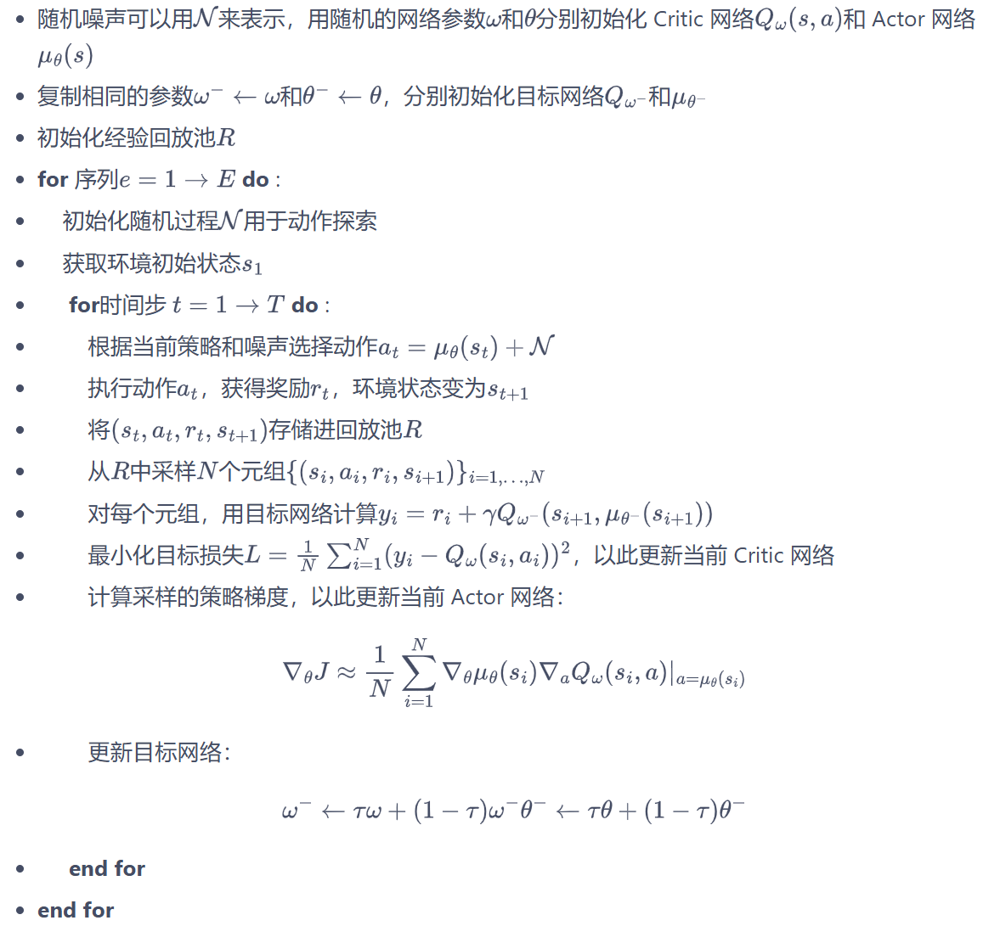

#### SAC 

 SAC (Soft Actor Critic) 算法，一种基于最大熵的无模型的深度强化学习算法

**重参数化：** 对于连续动作空间的环境，SAC算法的策略输出高斯分布的均值和标准差，但是根据高斯分布来采样动作是不可导的，所以需要用到**重参数化技巧**（reparameterization trick），重参数化的做法是先从一个单位高斯分布采样，再把采样值乘以标准差后加上均值。这样就可以认为是从策略高斯分布采样，并且这样对于策略函数是可导的。

**算法流程如下**

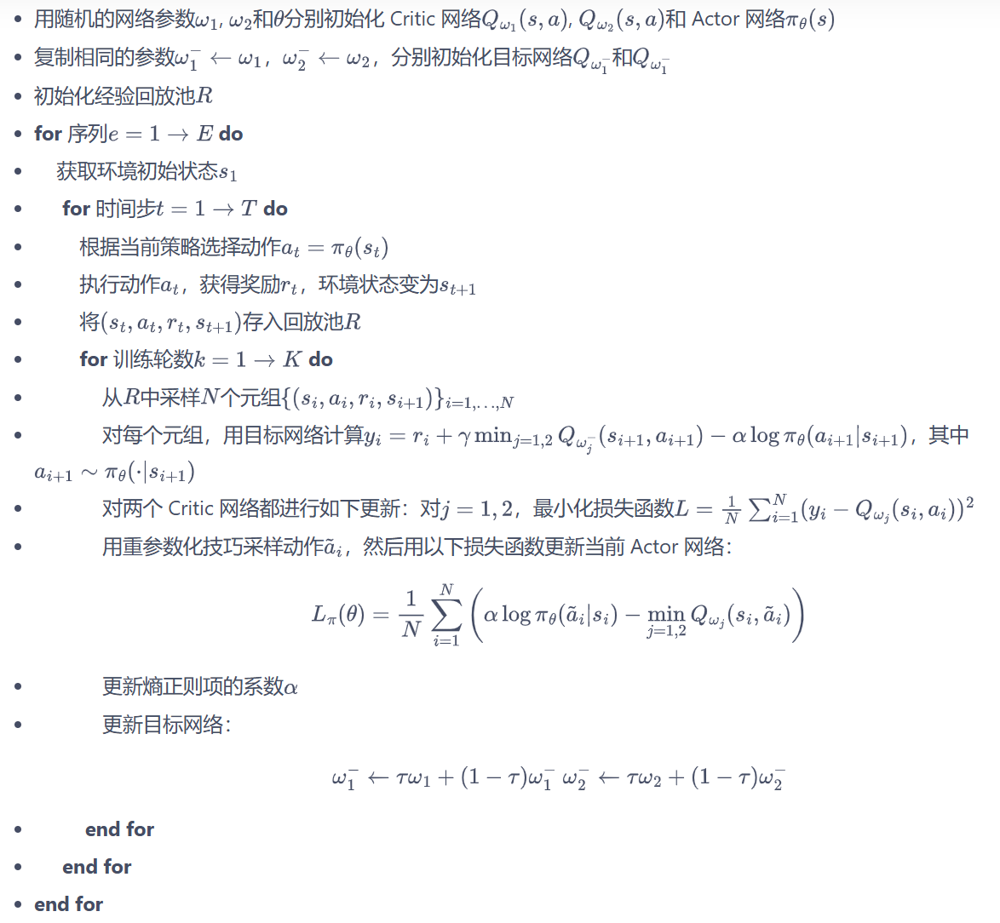

**网络更新公式**

**Critic: Q网络损失函数**

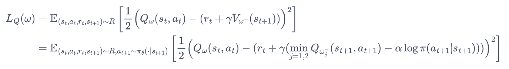

```python
# 连续动作-更新两个Q网络
td_target = self.calc_target(rewards, next_states, dones)
critic_1_loss = torch.mean(
    F.mse_loss(self.critic_1(states, actions), td_target.detach()))
critic_2_loss = torch.mean(
    F.mse_loss(self.critic_2(states, actions), td_target.detach()))
self.critic_1_optimizer.zero_grad()
critic_1_loss.backward()
self.critic_1_optimizer.step()
self.critic_2_optimizer.zero_grad()
critic_2_loss.backward()
self.critic_2_optimizer.step()
```


**Actor: 策略网络损失函数**

相当于是最大化V~Π~ (s~t~)，取符号就是损失函数，梯度下降更新参数。这里是利用**重参数化**技巧采样动作

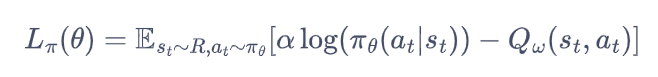

```python
# 连续动作-更新策略网络
new_actions, log_prob = self.actor(states)
entropy = -log_prob
q1_value = self.critic_1(states, new_actions)
q2_value = self.critic_2(states, new_actions)
actor_loss = torch.mean(-self.log_alpha.exp() * entropy -
                        torch.min(q1_value, q2_value))
self.actor_optimizer.zero_grad()
actor_loss.backward()
self.actor_optimizer.step()
```


**熵正则项系数损失函数**

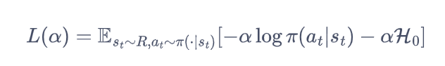

```python
# 更新alpha值
alpha_loss = torch.mean(
    (entropy - self.target_entropy).detach() * self.log_alpha.exp())
self.log_alpha_optimizer.zero_grad()
alpha_loss.backward()
self.log_alpha_optimizer.step()
```


### 离线强化学习


#### CQL

CQL(R)中max(μ)是怎么推出来的？为什么要取最大化的策略μ，而不是直接令μ=Πk，原文说这样可以减少计算量。那如果是令μ-Πk，是要怎么计算的呢？

CQL(H)(Lagrange)中引入τ来利用双梯度下降法更新α？

对于离散动作，论文基于QR-DQN实现？对于连续动作，论文基于SAC实现？

论文论证了Safe Policy Improvement Guarantees怎么理解？


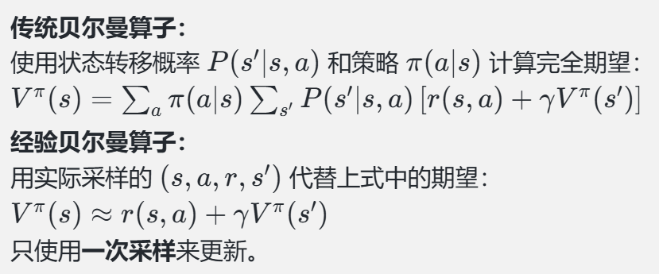


**Naive regularizer**

这部分讨论了使用简单的正则化器时，Q 函数会被约束在一个统一的下界上。正则化器的效果是让 Q 函数的**所有值**被限制在某个统一的下界上，这种方法对 Q 值施加了**全局的保守约束**，它对所有 (s,a)强制施加相同的约束，而没有区分哪些点更需要严格保守估计。这可能导致对实际策略价值（policy value）的评估不足

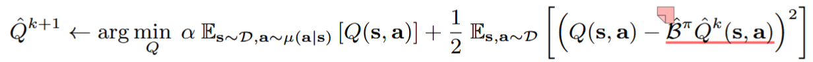


**改进Naive regularizer**

Naive regularizer过于粗糙，没有保证哪个点更需要严格保守估计，引入Q-Value maximization term，对于数据集内的(s,a)，我们并不需要对其保守估计。

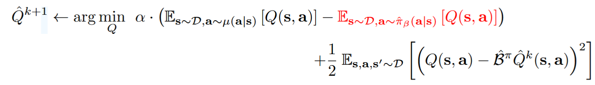


**gap-expanding property of the CQL update operator**

**耦合效应(coupling effects)：** Q函数近似器（Q-function approximator）中不同状态之间通过参数共享而产生的相互影响。这些效应源于在函数近似中，Q值的计算不是完全独立的，而是由同一个函数或模型（例如神经网络）生成，这会导致不同状态的Q值之间产生交互。在**高熵分布**(high-entropy)（如均匀分布）就会减轻coupling effects的影响，因为算法会更均匀的访问状态-动作空间，防止某些区域访问不足导致局部的误差


**CQL(R)**

对于不同的R(μ)正则项的选择，推导出不同的CQL变体

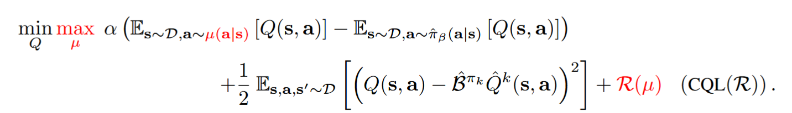

**CQL(H)** 

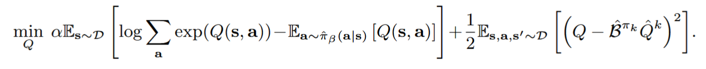

**CQL-Lagrange**

实际代码实现的Q函数的损失函数，通过双梯度下降(dual gradient-descent)来更新α，通过引入τ来自动更新α

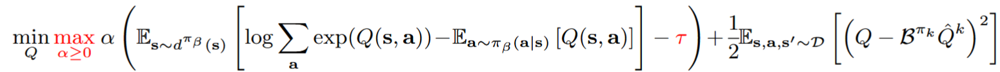


#### IQL

CQL和TD3+BC是多步动态规划？

去了解一下行为克隆？

advantage weighted regression 方法取提取策略，这种方法的目标函数和行为克隆很像？

clipped double Q-learning？

极大似然估计问题？

最大似然准则下的监督学习？

clip exponentiated advantages?

**值函数的损失函数**

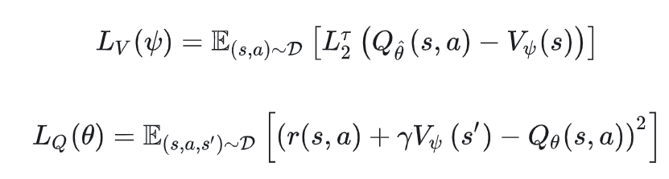

```python
"""
QF Loss
"""
q1_pred = self.qf1(obs, actions)
q2_pred = self.qf2(obs, actions)
target_vf_pred = self.vf(next_obs).detach()

q_target = self.reward_scale * rewards + (1. - terminals) * self.discount * target_vf_pred
q_target = q_target.detach()
qf1_loss = self.qf_criterion(q1_pred, q_target)
qf2_loss = self.qf_criterion(q2_pred, q_target)

"""
VF Loss
 """
q_pred = torch.min(
    self.target_qf1(obs, actions),
    self.target_qf2(obs, actions),
).detach() # 这里取较小值作为q的预测值
vf_pred = self.vf(obs)
vf_err = vf_pred - q_pred
vf_sign = (vf_err > 0).float()
vf_weight = (1 - vf_sign) * self.quantile + vf_sign * (1 - self.quantile)
vf_loss = (vf_weight * (vf_err ** 2)).mean()
```


**抽取策略**

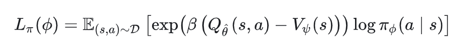

```python

"""
Policy Loss
"""
policy_logpp = dist.log_prob(actions)

adv = q_pred - vf_pred # 计算优势值
exp_adv = torch.exp(adv / self.beta) # 除以beta，图片公式有点问题
if self.clip_score is not None: #Clip Exponentiated Advantages 一种常用的技巧，避免权重过大
    exp_adv = torch.clamp(exp_adv, max=self.clip_score)

weights = exp_adv[:, 0].detach()
policy_loss = (-policy_logpp * weights).mean()
```


#### AWE

 **AWR（Advantage-Weighted Regression）** AWR 的目标是通过软更新方式，用行为策略（Behavior Policy）生成的数据来优化目标策略（Target Policy）。它的更新方法基于加权最大化策略的对数概率，权重由 **优势函数**（Advantage Function）决定


#### EDAC

梯度回传怎么理解，好抽象？

特征向量对应的特征值？

采样方差矩阵sample variance matric？

**SAC-N**算法在SAC的clipped double Q-learning（两个Q网络取较小值），拓展为N个Q网络取较小值，能够提升性能。但是过多的N网络，会导致计算的效率低下，且存在结构性冗余，所以**EDAC**希望能够较小N的数量。文章证明了，SAC-N算法效果好的原因，是因为随着N的增加，Q值的多样性，导致Q值得方差增大，对OOD的惩罚力度增大。


#### 基础知识

##### LogSumExp算子

LogSumExp 是平滑最大值近似的原因在于它的公式结构可以看作对 **最大值操作 (max⁡)** 的一种连续化形式
$$
LogSumExp(x1,x2,..,x_n)=log(\sum_{i=1}^{n}{e^x})
$$
假设x~k~ =max(x1,x2,....xn)，且x~k~ 与其他值相差较大时，我们可以近似
$$
\sum_{i=1}^{n}({e^{x_i}}){\approx}e^{x_k}
$$
所以
$$
LogSumExp(x_1,x_2,..,x_n)=log(\sum_{i=1}^{n}{e^{x_i}}){\approx}\log(e^{x_k}){\approx}{x_k}
$$


##### softmax

$$
Softmax(x)=\frac{e^{x_i}}{\sum_ie^{x_i}}
$$


##### 拉格朗日乘子法

是一种数学优化方法，在有约束条件下找到函数的极值


##### 非对称最小二乘法

**Asymmetric Least Squares (ALS)** 的核心思想是：对于正误差（实际值高于预测值）和负误差（实际值低于预测值），从而对模型的偏态进行调整，使得模型更关注误差的一侧（正或负）

ALS目标函数定义如下
$$
\min_\beta\sum_i{w_i}.(y_i-f(x_i;\beta))^2
$$
其中，w~i~ 是非对称权重，通常定义为（实际值-预测值），当alpha更接近于1，那么对低估的惩罚的权重大，对高估的权重小，那么最终的结果会偏向于高估，也就是实际值小于预测值
$$
w_i=\left\{
		\begin{array}{**lr**}
		\alpha,\qquad if\ y_i-f(x_i;\beta)\geq0\\
		1-\alpha,\  if\ y_i-f(x_i;\beta)<0
		\end{array}
\right.
$$


##### 占用度量

在强化学习中，"占用度量"通常指的是在一个特定状态下，某个动作被执行的频率或持续时间。这可以用来衡量在agent与environment交互的过程中，agent对于不同动作的选择**偏好程度**


##### Clipped Double Q-Learning 

用于解决传统 Q-learning 方法中的 **过估计偏差（overestimation bias）** 问题。它是 Double Q-Learning 的一种变体，主要通过取较小的 Q 值来进一步抑制估计偏差。SAC算法中计算TD Target的时候用到了这种方式


##### Clip Exponentiated Advantages

是一种在强化学习中常用的技巧，。它主要出现在基于加权回归或软策略优化的方法中，例如 **Advantage-Weighted Regression (AWR)** 或 **Soft Actor-Critic (SAC)**。


##### 内积（Inner Product）

内积（也称为点积）是线性代数中的一个基本概念，涉及两个向量的特殊乘法形式，其结果是一个标量。**对应的位置相乘再相加** 。也可以衡量两个向量或矩阵的相似程度，

**内积的方差计算公式**


$$
Var(Z)=Var(a^Tb)=b^T{\cdot}Cov(a){\cdot}b
$$


##### 外积（Cross Product）


##### 协方差

协方差是用来衡量两个随机变量之间的线性相关性（linear correlation）的度量。对于两个随机变量 X 和 Y，协方差定义为：
$$
Cov(X,Y)=E[(X-E[X])(Y-E[Y])]
$$


##### 二范数（||.||~2~）

二范数是向量q的欧几里得长度，定义为：
$$
||\bar{q}||_2=\sqrt{\sum_{i=1}^{n}q{_i}{^2}}
$$


##### 矩阵迹（trace）

矩阵的迹（trace）定义为矩阵对角线元素的和，即：
$$
Tr(A)=\sum_{i=1}^nA_{ii}
$$
对于一个协方差矩阵，矩阵对角线上的元素的和就是变量的**总方差** ，也就是矩阵的迹。协方差矩阵是半正定矩阵，其特征值λ（一个矩阵会有多个特征值）均为负，矩阵的迹等于所有特征值的和，也就是元素的总方差。


## Pytorch

### tensor

####  max

`values, indices = tensor.max(dim)`	返回指定维度上的最大值和对应的索引。


