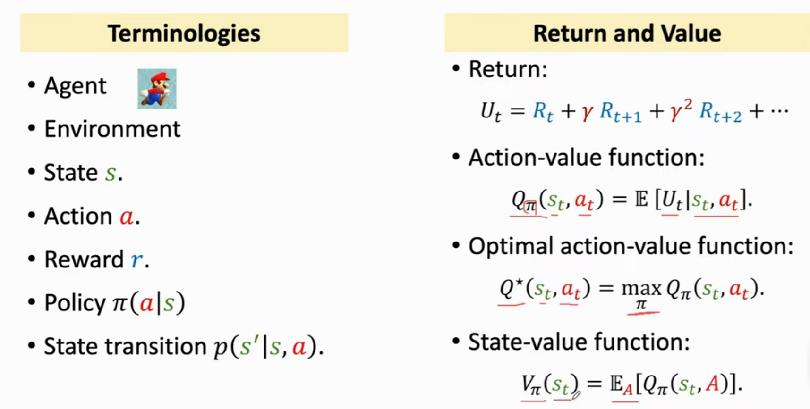
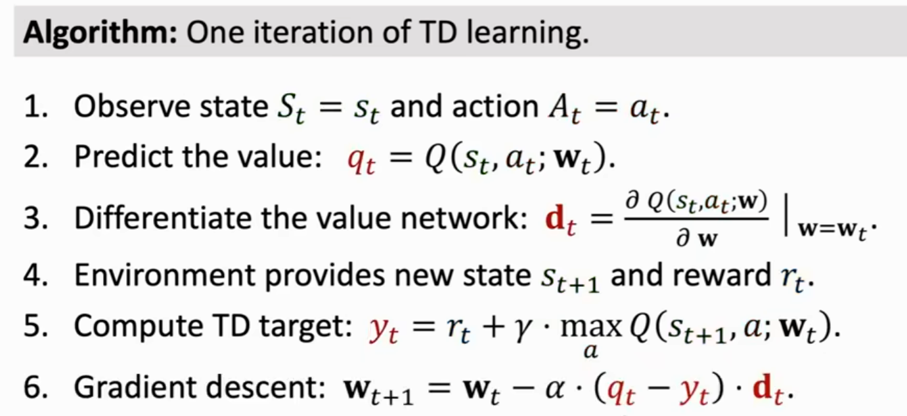
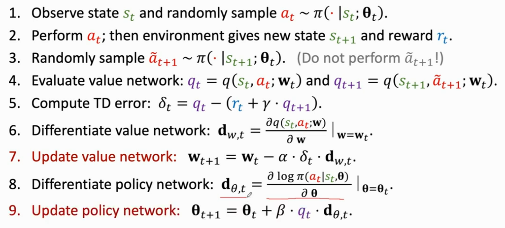

**强化学习的随机性来源**

1. Action have randomness

   动作随机性，通过policy function可以得出在当前状态下，指向某个动作的概率    Π(action|state) = ?

2. State transitions have randomness

   状态转移具有随机性，假设Agent做出了向上跳的动作，environment就会根据当前的状态和动作，得出下一个状态的概率

   p(S'|s, a) = ?

**基本概念**

 

**Value-Based Reinforcement Learning**

Deep Q-Network（DQN）

就是用神经网络近似Q^*^函数

如何训练DQN？

利用Temporal Difference（TD） Learning  训练DQN 

**Policy-Based Reinforcement Learning**

 

**Actor-Critic Method**

**疑问？**

这些公式为了消掉某个变量，都是对该变量进行求期望？

Action value function对Ut求期望，通过policy函数和状态转移函数进行action和state的期望来消掉随机变量。

OpenAI Gym?

随机性被期望消除？

梯度下降？

卷积层，变成特征向量？全连接层？

无偏估计？

难道Ut的观测值ut，本质上都可以当多U~Π~，V~Π~，Q^*^吗

TD-Learning算法的表格是怎么来的？