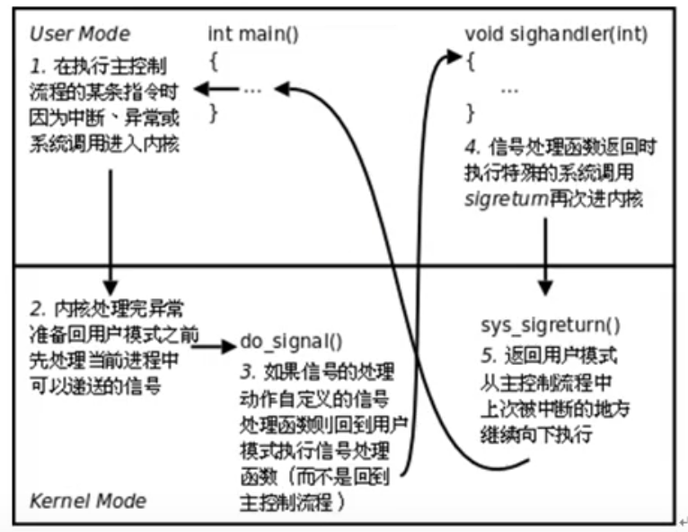

## Makefile

```makefile
#编写makefile文件
ALL:testfile   #ALL 确定最终目标文件
#方式1
testfiles: main.cpp function.cpp
	g++ -o testfiles main.cpp function.cpp

#方式2，在文件中定义宏和变量
CXX = g++
TARGET= testfiles
OBJ = main.o function.o
$(TARGET):$(OBJ)
	$(CXX) -o $(TARGET) $(OBJ)

main.o:main.cpp
	$(CXX) -c main.cpp
function.o:function.cpp
	$(CXX) -c function.cpp

#方式3，对方式2进行修改
#$@: the target file
#$^: all the prerequisites
#$<: the first prerequisites

CXX = g++
TARGET= testfiles
OBJ = main.o function.o
$(TARGET):$(OBJ)
	$(CXX) -o $@ $^

%.o:%.cpp
	$(CXX) -c $^

#方式4，利用PHONY自动清除已经产生的文件，比如.o

CXX = g++
TARGET= testfiles.exe
OBJ = main.o function.o
$(TARGET):$(OBJ)
	$(CXX) -o $@ $^


%.o:%.cpp
	$(CXX) -c $<

.PHONY:clean
clean:
	del *.o $(TARGET)

#方式5，利用自带函数获得文件
CXX = g++
TARGET = testfiles.exe
CFLAGES = -c -Wall  #-Wall展示编译的warning
SRC = $(wildcard ./*.cpp)#wildcard-找到当前路径下所有的.cpp文件
OBJ = $(patsubst %.cpp,%.o,$(SRC))#patsubst-将.cpp文件替换为.o文件
$(TARGET):$(OBJ)
	$(CXX) -o $(TARGET) $(OBJ)
%.o:%.cpp
	$(CXX) $(CFLAGES) $<

.PHONY:clean     #伪目标
clean:  
	del *.o $(TARGET) 

#其他函数
#1.过滤出不以.c结尾的字符串
object=foo.o bar.o baz.c
flitered_objects=$(filter-out %.c $object)
```

`make -f m1` 	指定文件执行make命令，可能有些makefile文件叫xxx.mk，所以需要自己指定

## Cmake

问题：Windows下CMake不能生成makefile的问题

解决方案：可能是由于安装了Visual Studio，也可能是windows10默认，CMake会生成`MSVC`解决方案，在构建目录中检查有 .sln 文件。

指定解决方案是Unix 平台的Makefiles

`cmake .. -G "Unix Makefiles"` （第一次运行cmake时）

```cmake
#方式1
cmake_minimum_required(VERSION 3.10)  #确定cmake最低需求的版本

project(Hello)   #构建的可执行文件的名称

##当有大量源文件时，可以利用aux_source_directory来获得指定目录下所有的源文件，并存到一个DIR_SRCS变量中
##aux_source_directory (<dir> <variable>)
aux_source_directory(./src DIR_SRCS)

#当头文件和源文件不在同一个文件夹下，需要指出.h的位置
include_directories(./include)

#第一个参数是可执行文件的名称，第二个参数是源文件
add_executable(Hello ${DIR_SRCS})  
```


## C++使用静态库

在Linux下使用C++静态库的步骤如下：

编写代码并编译成目标文件（.o），比如**`g++ -c test.cpp -o test.o`**。

然后使用**ar命令**将编译生成的.o文件打包成静态库文件（.a），比如 **`ar rcs libtest.a test.o`**。

ar是一个用于创建、修改和提取归档文件的命令行工具。归档文件是一种将多个文件组合成单个文件的方式，通常用于将多个目标文件组合为一个库文件（如静态库）或者打包多个文件以备份或分发。
r 表示插入新成员（如果原来不存在的话）；
c 表示创建新档案；
s 表示将插入的成员作为符号表保存。
编写使用静态库的代码，并链接静态库，比如 **`g++ -o main main.cpp -L. -ltest`**。

-L. 表示在当前目录搜索库文件；
-lmylib 表示链接名为 libmylib.a 的静态库。
运行可执行程序，比如 ./test。

## Linux系统编程

### Linux常用指令

`more `读文件分屏显示（空格翻页）

`sudo apt-get install`：安装

`ln -s  file  file.s`：创建名字叫file.s的软连接（相当于windows下的快捷方式）文件保存的是路径，如果想要创建的软连接在任意移动，需要使用绝对路径创建。

`ln  file  file.hard`	：创建硬链接（ls -l中可以看到硬链接计数），操作系统给每个文件赋予inode，相同inode文件存在时，彼此同步，在删除时，只是改变硬链接计数，减为0时，inode结点被释放。

`stat  fileName`  :查看文件的相关属性

`chmod -u+x file.c`：a表示所有人	u表示当前用户    g表示组内其他用户	o表示不在组内的其他用户   +/-增加或删除权限	rwx权限

`chown newUser fileName` ：修改文件所属用户

`chgrp 	userGroup fileName` :修改文件所属组

`find ./balaba  -maxdepth 1 -type 'l'` :查找文件   l为软连接类型  

-type表示以文件类型查找 

-name表示以名称查找。

-maxdepth 1 表示搜索的深度，设置为1避免深入其他文件夹搜索。  

-size  +20M  -size  -50M按照文件大小范围搜索

| -xargs  与-exec作用类似，将结果集执行某一指定命令。当结果集过大时，可以进行分片映射

**注意：**xarg默认以空格分隔结果集，如果查询的文件名中有空格，就会被错误解析（文件名被分开成多个），需要加上`-print0`，将结果集用null分隔

`find  ./ -type f  -exec ls -l {} \; ` 利用`-exec或-ok`命令，将前一个语句的结果，接着执行后面的语句。`{}`是指定语法，将搜索结果放到大括号中，`;`表示语句的结束，`\`表示转义字符。

**进程管理**

`grep -r  'copy'  ./` 搜索指定目录下文件中的内容    `-r`表示递归搜索目录

`ps aux | grep  'kernel`'    `ps`搜索当前执行的进程，得到的结果集，结合 `| `管道命令在执行 `grep` 可以搜索包含指定名称的进程

`ps ajx`  查看pid  ppid  gid  sid

`env` 查看系统环境变量

`top` 文字版任务管理器

**软件安装**

`apt-get install` 安装软件      `sudo apt-get update` 更新软件资源列表到本地，更新了才能安装软件

`sudo apt-get remove` 卸载

`sudo dpkg -i  安装包名称.deb`  通过安装包安装软件（离线下载）

`sudo aptitude show 软件名` 和apt-get作用相同，但是它可以查看软件是否安装


**压缩包管理**

`tar -zcvf 压缩包名 压缩材料`   使用gzip方式进行压缩     `tar -jcvf .. .. `   使用bzip2方式压缩   

解压缩只需要将参数中的`c`改成`x`

`zip -r 压缩包名(.zip) 压缩材料`         `unzip  压缩包名(.zip)`  可以与window操作系统下的文件互通，都有.zip


**网络管理**

`ifconfig`  查看ip


**其他命令**

`alias pg='ps aux | grep'` 给命令起别名

`umask 522` 指定用户创建的文件掩码。对于一个文件的权限有rwx rwx rwx（三个一组），对应的数字为421421421（777），设置掩码表示把对应的文件权限去掉，如522，那么就是把第一组rx，第二组w，第三组w的权限去掉，变成-w- r-x r-x。而操作系统默认刚创建的文件没有x（也就是没有执行能力）,所以最终结果为-w- r-- r--

  


**Vim**

**编辑模式**

|     按键     |                  功能                  |
| :----------: | :------------------------------------: |
|      i       |         光标位置当前处插入文字         |
|      I       |          光标所在行首插入文字          |
|   o(字母)    |       光标下一行插入文字（新行）       |
|   O(字母)    |       光标上一行插入文字（新行）       |
|      a       |          光标位置右边插入文字          |
|      A       |          光标所在行尾插入文字          |
|      s       | 删除光标后边的字符，从光标当前位置插入 |
|      S       |     删除光标所在当前行，从行首插入     |
|  :sp 文件名  |              添加横向分屏              |
| :vsp  文件名 |              添加纵向分屏              |
|   ctrl + w   |                切换分屏                |

**移动**

| **按键** |             **功能**             |
| :------: | :------------------------------: |
| Ctrl + f |         向前滚动一个屏幕         |
| Ctrl + b |         向后滚动一个屏幕         |
|    gg    |         到文件第一行行首         |
| G(大写)  | 到文件最后一行行首，G必须为大写  |
| mG或mgg  |      到指定行，m为目标行数       |
| 0(数字)  | 光标移到到行首（第一个字符位置） |

**删除**

| **按键** |                           **功能**                           |
| :------: | :----------------------------------------------------------: |
|   [n]x   |                     删除光标后 n 个字符                      |
|   [n]X   |                     删除光标前 n 个字符                      |
|    D     |                删除光标所在开始到此行尾的字符                |
|  [n]dd   | 删除从当前行开始的 n 行（准确来讲，是剪切，剪切不粘贴即为删除） |
|    dG    |              删除光标所在开始到文件尾的所有字符              |

**复制粘贴**

| **按键** |           **功能**           |
| :------: | :--------------------------: |
|  [n]yy   |   复制从当前行开始的 n 行    |
|    p     | 把粘贴板上的内容插入到当前行 |

**查找**

| **按键** |                  **功能**                  |
| :------: | :----------------------------------------: |
| /字符串  | 从当前光标位置向下查找（n，N查找内容切换） |
| ?字符串  | 从当前光标位置向上查找（n，N查找内容切换） |

**可视模式**

| **按键**  |                           **功能**                           |
| :-------: | :----------------------------------------------------------: |
|     v     | 按字符移动，选中文本，可配合h、j、k、l选择内容，使用d删除，使用y复制 |
| Shift + v | 行选（以行为单位）选中文本，可配合h、j、k、l选择内容，使用d删除，使用y复制 |
| Ctrl + v  | 列选 选中文本，可配合h、j、k、l选择内容，使用d删除，使用y复制 |

**撤销**

| **按键** |      **功能**      |
| :------: | :----------------: |
|    u     |        撤销        |
|  ctrl-r  | 反撤销（撤销撤销） |


---


**gcc编译**

预处理：展开宏、头文件、替换条件编译、删除注释空行空白（hello.i）  `gcc -E`

编译：检查语法规范（hello.s）  `gcc -S` 

汇编：将汇编指令翻译成机器指令（hello.o）   `gcc -c`

链接：数据段合并、数据地址回填（a.out）`gcc 无参数` 

编译阶段消耗的时间和系统资源最多！

`gcc -I./include -o hello` 当头文件和源文件不在同一个目录下，需要指定头文件目录

`-g` 编译时添加调试语句。主要支持gdb调试

`-Wall` 显示警告

 `-D`  向程序中动态注册宏定义

`-l` 指定动态库名

`-L` 指定动态库路径

**制作静态库**

`ar rcs lib库名.a  add.o sub.o div.o`  规定静态库名称以`lib`开头`.a`结尾

`gcc test.c lib库名.a -o a.out` 将静态库编译到可执行文件中

**制作动态库**

`gcc  -c test.c -o test.o -fPIC`  将.c生成 .o（生成与位置无关的代码）

`gcc -shared  -o lib库名.so  add.o sub.o`  制作动态库

`gcc test.c -o a.out -lmymath -L ./lib`编译可执行程序时，指定所使用的动态库。`-l指定库名` `-L`指定库路径

`ldd a.out`  该命令可以查看可执行文件动态加载了哪些动态库

==注意：会出错！！==

**原因：**这两个没有关系。链接器：工作于链接阶段，工作时需要`-l 和-L `。动态链接器：工作于程序运行阶段，工作时需要提供动态库所在目录位置。一般去固定地方寻找动态库，所以我们需要将自己的动态库放到对应位置。命令：`export  LD_LIBRARY_PATH=动态库路径`（修改是临时的！每次重启终端就无效了）。**永久修改方式：**需要写入终端配置文件，家目录下的隐藏文件`.bashrc` 写入`export LD LIBRARY_PATH=动态库路径` 保存后`source .bashrc`让配置生效。


**gdb调试工具**

`gcc -g` 使用该参数编译可执行文件，得到调试表

`list ` 简写为`l` 列出源码，根据源码指定行号设置断点

`break/b 20`  在20行设置断点    

`run/r` 运行程序

`next/n` 下一条指令，会越过函数

`step/s` 下一条指令，进入函数

`print/p 变量名` 查看变量的值

`continue` 继续执行断点后续指令

`quit` 退出当前调试


`start` 不加断点，一步一步执行看看

`finish` 结束当前函数

`set args` 设置main函数命令行参数

`run 字串1 字串2...` 设置main函数命令行参数

`info b` 查看断点信息

`b 20 if i=6` 设置条件断点

`ptype i` 查看变量类型，一般查看自定义类型。

`backtrace/bt` 查看栈帧调用（函数调用）的层级关系

`frame 1` 根据栈帧编号，切换栈帧。一般和bt结合使用

 `display` 设置跟踪变量，把每次都把变量值打印出来。  

`undisplay  1` 根据变量编号删除跟踪变量。

gdb进去之后直接run，可以直接找到段错误的位置，终于有点用了！！

### 自己实现Linux指令

#### 递归遍历目录

```c
#include<stdio.h>
#include<dirent.h>
#include<stdlib.h>
#include<string.h>
#include<sys/stat.h>
void get_file(char* path){
	DIR *curDir=opendir(path);	
	if(curDir==NULL){
		perror("curDir open fail\n");
		exit(1);
	}
	//遍历目录项
	struct dirent *entry;
	while((entry=readdir(curDir))!=NULL){
		
		if(strcmp(entry->d_name,".")==0 || strcmp(entry->d_name,"..")==0)
			continue;
		char newpath[256];
		//构建新路径
		sprintf(newpath,"%s/%s",path,entry->d_name);
		printf("newpath:%s\n",newpath);
		//获得当前文件的属性
		if(entry->d_type!=DT_DIR){
			//不是目录，打印名称，以及文件大小
			//获得文件属性
			struct stat buf;
			lstat(newpath,&buf);
			printf("filepath:%s\t\t-file_size:%ld\n",newpath,buf.st_size);
		}else{		
			//当前是目录，递归求解
			get_file(newpath);
		}
	}
	closedir(curDir);
}
//递归遍历目录,并同时显示文件的大小
int main(int arg,char* args[]){
	//打开当前目录
	//递归求解
	get_file(args[1]);
	return 0;
}
```


### 文件IO


==open()==  创建文件时，指定文件访问权限。权限同时受umask影响。**文件权限=mode & ~mask**

**int open(char *pathname, int flags)**

参数：

​	pathname:文件路径

​	flags:文件打开方式    	O_RDONLY|O_WRONLY|O_RDWR  

返回值：

​	成功：打开文件所得到的**文件描述符**（整数）

​	失败：返回-1，设置errno

**int open(char *pathname, int flags, mode_t mode) **      #include<unistd.h>

参数：	

​	pathname:文件路径    

​	flags:文件打开方式    	 #include<fcntl.h>

​		O_RDONLY|O_WRONLY|O_RDWR      O_TRUNC(将文件清空)|O_CREAT(如果文件不存在就创建文件)

​	mode:参数3指定的前提，参数2指定了 O_CREAT    取8进制数，用来描述文件权

==close()==

**int close(int id)**

错误处理函数：与errno相关

​	char \***strerror**(int errnum)  ：用来将错误号码转化为错误文本

​	void perror(const char* s)

​				perror("open error")   传入出错的表述就可以了


==read()==

​	ssize_t read(int fd, void *buf, size_t count)

参数：

​	fd：文件描述符,本质上是指针

​	buf：缓冲区

​	count：缓冲区的大小

返回值：

​	0：读到文件末尾

​	成功：读到的字节数

​	失败：-1 设置errno

​	-1：并且errorno==EAGAIN或EWOULDBLOCK，说明并不是读取失败，而是read以非阻塞方式在读设备文件（网络文件），并且文件无数据。

==write()==

​	ssize_t write(int fd, const void *buf, size_t count)

参数：

​	fd：文件描述符

​	buf：缓冲区

​	count：数据大小

返回值：

​	成功：写入的字节数

​	失败：-1，设置errno

==文件描述符==

PCB进程控制块：本质结构体

成员：文件描述符表

0：STDIN_FILENO     1：STDOUT_FILENO    2：STDERR_FILENO

==阻塞、非阻塞==    是设备文件、网络文件的属性

产生阻塞的场景：读设备文件、读网络文件（读常规网络无阻塞概念）

/dev/tty   ——终端文件

open("/dev/tty",O_RDRW|O_NONBLOCK)   	——设置/dev/tty为非阻塞状态，默认为阻塞。


==fcntl==     可以直接设置文件状态，不需要open

​	`int flags=fcntl(fd,F_GETFL)`

​	获取文件状态：F_GETFL

​	设置文件状态：F_SETFL

`int newfd = fcntl(fd1,F_DUPFD,0);//0被占用(数字用来指定文件描述符号)，fcntl使用文件描述符表中可用的最小文件描述符`

​	文件重定向：F_DUPFD。返回一个新的文件描述符


==lseek==  ：用来改变当前文件指针位置

off_t	lseek(int fd,	off_t offset,	int whence)

参数：

​	whence：起始偏移位置，SEEK_SET/SEEK_CUR/SEEK_END

返回值：

​	成功：较起始位置偏移量

​	失败：-1，errorno

应用场景：1. “读”和“写”使用同一个偏移位置。

​					2. 使用lseek获取文件大小。`lseek(fd,0,SEEK_END)`

​					3. 拓展文件大小，要想真正拓展，必须引起IO操作。

​					4. truncate ：拓展文件大小   `int ret=truncate("filename",250)`


传入参数：

1. 指针作为函数参数。
2. 通常有const关键字修饰。
3. 指针指向有效区，在函数内部做读操作。

传出参数：

1. 指针作为函数参数。
2. 在函数调用之前，指针指向的空间可以无意义，但必须有效。
3. 指针指向的区域，在函数内部，做写操作。
4. 函数调用结束后充当函数返回值。

传入传出参数：`strtok`

1. 指针作为函数参数
2. 在函数调用之前，指针指向的空间有实际意义
3. 在函数内部，先做读操作，后做写操作
4. 作为函数返回值


==stat()==：获得文件的属性  #include<sys/stat.h>  

​	int stat(const char* path, struct stat *buf)

​	参数：

​		path：文件路径

​		buf：（传出参数，存放文件属性）

​	返回值：

​		成功：0

​		失败：-1 errno

stat会穿透**符号链接**，lstat不能穿透符号链接。

获取文件访问权限：buf.st_mode

获得文件大小：buf.st_size

等等具体看man page


### 文件系统

inode：本质为结构体，存储文件的属性信息。创建硬链接相当于是FCB的索引指针指向相同的索引节点(inode)


### 目录操作


==opendir==

​	DIR *opendir(const char *name);

​	返回值：

​		成功：返回目录结构体指针

​		失败：null

==readdir==

​	struct dirent *readdir(DIR *drip);

​	返回值：

​		成功：返回目录项

==closedir==


**重定向**

==dup==：拷贝一个新的文件描述符用来访问文件

​	int dup(int oldfd);

​		oldfd：已有文件描述符

​		返回：新文件描述符

==dup2==：与dup功能类似，不同的是dup2指定newfd，把oldfd拷贝给newfd。而dup返回的新文件描述符是操作系统生成的（一般为最小未使用的数）

​	int dup2(int oldfd,int newfd);


### 进程

#### 进程控制

MMU：内存管理单元，负责虚拟内存与物理内存的映射。在cpu内部。

PCB进程控制块：

```c++
1. 进程id。
2. 进程状态：初始、就绪、运行、挂起、终止
3. 文件描述符表
4. 进程工作目录位置（进程在不同目录下执行的结果也会不同，如ls命令）
5. 信号相关信息资源
6. 用户id和组id
```

​	

==fork==：创建子进程

​	pid_t	fork(void)

​	父进程返回子进程pid，子进程返回0。

​	getpid()获得进程id、getppid()获得父进程id


**父子进程相同的部分：**

​	刚fork后，data段、text代码段、堆、栈、环境变量、全局变量、宿主目录位置、进程工作目录位置、信号处理方式

**父子进程不同的部分：**

​	进程id、返回值、各自的父进程、进程创建时间、定时器、未决信号集

**父子进程共享的部分：**

​	父子进程之间遵循**读时共享写时复制**的原则，节省内存开销。如果父进程要修改一个全局变量，会复制一份再修改，那么子进程读的时候，这个全局变量还是父进程修改前的值。所以**父子进程不共享全局变量**

​	文件描述符、mmap映射区


**父子进程的gdb调试**

``(gdb) set  follow-fork-mode  child/parent ``   设置gdb的跟踪模式，是跟踪父进程还是跟踪子进程


#### exec函数族

exec函数族一般规律

l（list）：命令行参数列表

p（path）：搜索file时使用path变量

v（vector）：使用命令行参数数组

e（environment）：使用环境变量数组，不使用进程原有的环境变量，设置新加载程序运行的环境变量。

int   execl(path, char* arg);

int   execlp(file, char* arg);


#### 回收进程

**一次调用只能回收一个子进程！！**，孙子进程也回收不了

pid_t wait(int *status)     status是传出参数

1. 父进程阻塞等待子进程退出
2. 回收子进程残留资源
3. 获取子进程结束状态(退出原因)


所有异常终止的进程都是由信号终止。


pid_t waitpid(pid_t pid, int* status, int options)

​	返回值：

​		>0：表示成功回收进程pid

​		  0：函数调用时，参3指定了WNOHANG，并且没有子进程结束。

​          -1：失败，errno

​	参数：

​		pid：指定回收的子进程pid

​				>0：待回收的子进程pid

​				-1：任意子进程

​		

​		options：WNOHANG 指定回收方式，非阻塞。	

​	返回值：

​		>0：表成功回收的子进程pid

​		0：函数调用，参数3 指定WNOHANG，并且没有子进程结束

​		-1：失败，errno


#### 进程通信

管道：简单

信号：开销小

mmap映射：非血缘关系进程间

socket（本地套接字）：稳定


**管道：**

内核借助环形队列机制，使用内核缓冲区实现

是一个伪文件，管道中的数据只能一次读取，数据在管道中只能单向流动。局限性：自己写不能自己读，数据不可以反复读，半双工通信，血缘关系进程间可用。

int pipe(int fd[2]);：创建，并打开管道。

参数：fd[0]：读端。

​			fd[1]：写端。

返回值：成功：0

​				失败：-1，errno


管道的读写行为：

读管道：

  1. 管道有数据，read返回实际读到的字节数。

  2. 管道无数据。1)无写端，read返回0（类似读到文件末尾）

     ​                       2)有写端，read阻塞等待。

写管道：

1. 无读端，异常终止。(SIGPIPE导致的)

2. 有读端，1) 管道已满，阻塞等待

   ​				2)管道未满，返回写出的字节数

```c
#include<stdio.h>
#include<stdlib.h>
#include<unistd.h>
//执行ls | wc -l命令
//父进程执行ls  管道写端
//子进程执行wc -l  管道读端
int main(){
     //创建管道
     int fd[2];
     int ret=pipe(fd);
     if(ret==-1){
         perror("pipeline creation failed\n");
         exit(0);
     }
    pid_t pid=fork();
     if(pid==0){
         //子进程
         close(fd[1]);
        dup2(fd[0],STDIN_FILENO);
         execlp("wc","wc","-l",NULL);
         close(fd[0]);
     }else if(pid>0){
         //父进程
         close(fd[0]);
         dup2(fd[1],STDOUT_FILENO);
         execlp("ls","ls",NULL);
         sleep(1);
         close(fd[1]);
    }
 

    return 0;
 }                                  
```

```c
#include<stdio.h>
#include<stdlib.h>
#include<unistd.h>
#include<sys/wait.h>
/*使用管道实现兄弟进程通信
  兄：ls
  弟：wc -l*/
int main(){

    int fd[2],i;
    int ret=pipe(fd);
    if(ret==-1){
        perror("pipe creation failed\n");
        exit(1);
    }
    for(i=0;i<2;i++){

        pid_t pid=fork();
        if(pid==0)
            break;
                    
    }
    //回收进程
    pid_t rec_process;
    if(i==2){
        /*
        	只有形成单向的通路管道正确读写，因为是兄弟进程之间的通信，所以需要关闭父进程的管道读写端。	
        */
        close(fd[0]);
        close(fd[1]);
        while((rec_process=waitpid(-1,NULL,0))!=-1){
            
            if(rec_process>0){
                printf("the %d process is recycled\n",rec_process);
            }
        }
        printf("the father process is over\n");
    }else if(i==0){
        //兄进程
        close(fd[0]);
        dup2(fd[1],STDOUT_FILENO);
        execlp("ls","ls",NULL);


    }else if(i==1){
        //弟进程
        close(fd[1]);
        dup2(fd[0],STDIN_FILENO);
        execlp("wc","wc","-l",NULL);
    }

    return 0;
}

```


`ulimit -a` ：可以查看各种缓冲区大小

`mkfifo`创建有名管道

fifo管道：

适用于无血缘关系进程间通

**mmap映射：** void *mmap(void *addr, size_t length, int prot, int flags, int fd, off_t offset);    创建共享内存映射。

​	参数：

​		addr：指定映射区首地址，通常传NULL，表示让系统自动分配

​		length：共享内存映射区的大小(<=文件的实际大小)

​		prot：共享内存映射区的读写属性。PROT_READ、PROT_WRITE

​		flags：标注共享内存的共享属性。是否是共享的，MAP_SHARED/MAP_PRIVATE(对内存映射区的修改不会对磁盘进行修改)

​		fd：用于创建共享内存映射区的那个文件的文件描述符（将磁盘上的文件映射到内存）

​		offset：偏移位置，4k的整数倍。默认为0，表示映射文件全部。(MMU映射的最小单位是4k)

​	返回值：

​		成功：映射区的首地址

​		失败：

int munmap(void *addr, size_t length);		释放映射区

​	addr：mmap的返回值

​	length：映射区的大小

使用注意事项：

1. 用于创建映射区的大小为0，实际指定映射区非0，出总线错误
2. 创建映射区大小为0，实际映射区也为0，出现无效参数错误
3. 用于创建映射区的文件读写属性为，只读，映射区为读写，出现无效参数错误
4. 创建映射区，需要read权限。mmap的读写权限，应该<=文件的open权限。f只写(PROT_WRITE)不行
5. 映射区访问为MAP_PRIVATE时，不会对磁盘文件造成修改，只修改内存映射区


mmap父子进程间通信

MAP_PRIVATE：父子进程独占映射区

MPA_SHARED：父子进程共享映射区

	1. 父进程先创建映射区。
	2. 指定MAP_SHARED权限
	3. fork创建子进程，一个进程读，一个进程写

无血缘关系进程间mmap通信

	1. 两个进程同时打开一个文件创建映射区。
	2. 指定flags为MAP_SHARED
	3. 一个进程写入，另一个进程写出


**mmap匿名映射区**

int ulink(const char *pathname)  删除文件。让文件具备删除条件，当文件被关闭，且没有被任何进程使用时，会被删除。

在创建完映射区后就可以删除文件了。

或者mmap()设置flags为MAP_ANONYMOUS。

`p=mmap(NULL,40,PROT_READ|PROT_WRITE,MAP_SHARED|MAP_ANONYMOUS,-1,0)`


#### 守护进程

daemon进程，通常运行于操作系统后台，一般不与用户直接交互，周期性的等待某个时间的发生

不受用户登录注销影响。通常采用以d结尾的命名方式

**创建守护进程模型**

1. 创建子进程，父进程退出。父进程不能创建会话，因为父进程是组长。
2. 在子进程中创建新会话，`setsid()`
3. 改变当前目录位置，`chdir()`，防止占用可卸载的文件系统（比如u盘，运行着突然被拔掉）
4. 重设文件权限掩码，`umask()`，放置继承的文件创建屏蔽字拒绝某些权限
5. 关闭/重定向文件描述符。
6. 守护进程业务逻辑

```c
#include<stdio.h>
#include<stdlib.h>
#include<unistd.h>
#include<sys/stat.h>
#include<fcntl.h>
/*创建守护进程*/
void sys_err(const char* err){
    perror(err);
    exit(1);
}

int main(){

    //创建子进程，父进程退出
    pid_t pid=fork();
    if(pid>0)
        exit(0);

    //子进程中创建新会话
    pid_t sid=setsid();
    if(sid==-1)
        sys_err("setsid error");
    //改变工作目录位置
    int ret=chdir("/home/yuzy");
    if(ret==-1)
        sys_err("chdir error");

    //重设文件掩码
    umask(0022);
    //重定向 0、1、2文件描述符
    close(STDIN_FILENO);
    //因为文件描述符0被关闭，所以这里的fd=0
    int fd=open("/dev/null",O_RDWR);
    dup2(fd,STDOUT_FILENO);
    dup2(fd,STDERR_FILENO);

    while(1);//模拟守护进程业务

    return 0;
}
```


### 线程

进程：有独立的进程地址空间，有独立的pcb

线程：有独立的pcb，但没有独立的地址空间

`ps -Lf 进程id`    --->获得进程的线程号 LWP，给cpu执行的最小单位。和线程id不是一个东西

**线程共享资源**

1. 文件描述符表
2. 每种信号的处理方式
3. 当前的工作目录
4. 用户ID和组ID
5. 内存地址空间（.text/.data/.bss/heap/共享库）
6. 线程共享全局变量！但是父子进程之间不共享，读时共享写时复制

**线程非共享资源**

1. 线程id
2. 处理器现场和栈指针（内核栈）
3. 独立的栈空间（用户空间栈）
4. errno变量（全局变量）
5. 信号屏蔽字
6. 调度优先级

#### 线程创建

`pthread_t pthread_self()`  获得线程id,在进程地址空间内部标识线程的身份，和LWP不一样。

`void* pthread_create(pthread_t *thread, const pthread_attr_t *attr,`

`void *(*start_routine)(void *),void* arg)`    创建子线程。

参1：传出参数，表示新创建的子线程的线程id

参2：线程属性，NULL表示使用默认属性

参3：子线程回调函数，创建成功，pthread_create函数返回时，该函数会被自动调用

参4：参3回调函数的参数，没有传NULL。

```c
#include<stdio.h>
#include<stdlib.h>
#include<pthread.h>
#include<unistd.h>

/*创建子线程*/
void sys_err(const char* str){
    perror(str);
    exit(1);
}
//子线程回调函数
void* pthread_func(void *arg){

    printf("pthread:pid = %d,tid = %lu\n",getpid(),pthread_self());
    return NULL;
}
int main(){


    pthread_t tid;
    //创建子线程
    int ret=pthread_create(&tid,NULL,pthread_func,NULL);
    if(ret==-1)
        sys_err("pthread_create error");

    printf("main: the pid = %d,the tid = %lu\n",getpid(),pthread_self());
    sleep(1);
    return 0;
}
```


```c
#include<stdio.h>
#include<stdlib.h>
#include<pthread.h>
#include<unistd.h>
#define N 5
/*循环创建多个子线程*/
void sys_err(const char* str){
    perror(str);
    exit(1);
}
//子线程回调函数
void* pthread_func(void *arg){

    printf("the %dth pthread:pid = %d,tid = %lu\n",(int)(long)arg,getpid(),pthread_self());
    return NULL;
}
int main(){


    pthread_t tid;
    int i;
    //创建子线程
    for(i=0;i<N;i++){
		//这里传递的是i，而不是i的地址，避免主线程修改i，子线程打印会出现错误
        /*整数和指针的大小不一定相同，因此直接转换可能存在平台相关的风险。
        在 64 位系统上，void* 通常是 64 位宽，而 int 是 32 位宽。
        转换时必须小心，因为可能会出现数据丢失或未定义行为。*/
        int ret=pthread_create(&tid,NULL,pthread_func,(void*)(long)i);
        if(ret==-1)
            perror("pthread_create error");
    }   
    printf("main is over\n");
    sleep(1);
    return 0;
}


```

#### 线程退出

`exit(0)`  退出进程

`return`  返回函数调用者的位置

`void pthread_exit(void *retval)` 退出当前线程

retval：退出值，无退出值时为NULL。

`int pthread_cancel(pthread_t thread)`  

杀死线程，需要到达一个取消点，也就是说杀死线程是需要条件的，只有当线程进入内核的时候（当调用系统调用或者库函数的时候），才能成功杀死线程。

`void pthread_testcancel(void)` 

如何子线程中没有到达取消点，可以使用该函数，在程序中手动添加取消点。成功被`pthread_cancel`杀死的线程返回-1。

```c
int main(){
     //所以上述循环创建多个子线程中，为了防止进程退出，sleep(1)来延长主进程的时间，来让主线程打印。
    sleep(1);
    //这里可以换成pthread_exit()函数来让主线程退出，不影响子线程的运行
    pthread_exit(0);
}
```

####线程回收

兄弟线程之间是可以相互回收的

`int pthread_join(pthread_t thread, void **retval)`   回收子线程，并获得子线程的返回值

```c
#include<stdio.h>
#include<stdlib.h>
#include<pthread.h>
#include<unistd.h>
#include<string.h>
/*利用pthread_join()函数回收子线程，并获得子线程的返回值*/
void sys_err(const char* str){
    perror(str);
    exit(1);
}
//定义结构体
typedef struct thread{
    int var;
    char str[256];
}thrd;
//子线程回调函数
void* pthread_func(void *arg){
    //局部变量不可以作为返回值，需要开辟地址
    thrd *tval;
    tval = malloc(sizeof(thrd));
    tval->var=100;
    strcpy(tval->str,"hello thread");

    return (void*)tval;
}

int main(){


    pthread_t tid;
    //创建子线程
    int ret=pthread_create(&tid,NULL,pthread_func,NULL);
    if(ret==-1)
        sys_err("pthread_create error");
    thrd* retval;//记录子线程的返回值
    pthread_join(tid,(void**)&retval);
    printf("the %lu thread is over---var = %d,str = %s\n",tid,retval->var,retval->str);
    //退出主线程
    pthread_exit(NULL);
}

```

```c
#include<stdio.h>
#include<stdlib.h>
#include<pthread.h>
#include<unistd.h>
#define N 5
/*循环创建多个子线程,并循环回收子进程*/
void sys_err(const char* str){
    perror(str);
    exit(1);
}
//子线程回调函数
void* pthread_func(void *arg){

    unsigned long* ret;
    ret=malloc(sizeof(unsigned long));
    *ret=pthread_self();
    printf("the %dth pthread:pid = %d,tid = %lu\n",(int)(long)arg,getpid(),pthread_self());
    return (void*)ret;
}
int main(){


    pthread_t tid[N];
    int i;
    //创建子线程
    for(i=0;i<N;i++){

        int ret=pthread_create(&tid[i],NULL,pthread_func,(void*)(long)i);
        if(ret==-1)
            perror("pthread_create error");
    }   
    //循环回收所有的子线程
    unsigned long* retval;
    for(i=0;i<N;i++){
        int ret=pthread_join(tid[i],(void**)&retval);
        if(ret==-1)
            sys_err("pthread_join error");
        printf("the pthread %lu is recycled\n",*retval);
    }
    printf("main is over\n");
    pthread_exit(NULL);
    return 0;
}
```

#### 线程分离

`int pthread_detach(pthread_t thread)` 将指定线程进行分离，回收不需要通过主线程，会自动进行回收pcb

成功：0

失败：errno

在`pthread_create` 函数中的`pthread_attr_t *attr` 参数可以直接设置线程的创建属性为**分离属性**，就不需要先创建线程再调用`pthread_detach`分离线程。

 `int pthread_attr_init(pthread_attr_t *attr)`  初始化pthread_attr_t变量
 `int pthread_attr_destroy(pthread_attr_t *attr)`   销毁pthread_attr_t变量

` int pthread_attr_setdetachstate(pthread_attr_t *attr, int detachstate)`   设置pthread_attr_t属性

detachstate：PTHREAD_CREATE_DETACHED  设置分离属性（还有其他属性见man page）

```c
#include<stdio.h>
#include<string.h>
#include<stdlib.h>
#include<pthread.h>
/*线程分离*/

void* child_thread(void* arg){

    printf("the thread %lu is executing\n",pthread_self());
    return NULL;
}
int main(){
    int ret;
    // contruct thread attribute
    pthread_attr_t attr;
    ret=pthread_attr_init(&attr);//init attribute
    if(ret!=0){
        fprintf(stderr,"pthread_init error:%s\n",strerror(ret));
        exit(1);
    }   
    ret=pthread_attr_setdetachstate(&attr,PTHREAD_CREATE_DETACHED);//set detach attribute

    if(ret!=0){
        fprintf(stderr,"pthread_attr_setdetachstate error:%s\n",strerror(ret));
        exit(1);
    }   
    //create thread
    pthread_t ti
    ret=pthread_create(&tid,&attr,child_thread,NULL);
    if(ret!=0){
    
        fprintf(stderr,"pthread_create error:%s\n",strerror(ret));
        exit(1);
    } 
     //destroy attr
	ret=pthread_attr_destroy(&attr);
	if(ret!=0){
		fprintf(stderr,"pthread_attr_destroy error:%s\n",strerror(ret));
		exit(1);
	}

    // recycle child thread
    ret=pthread_join(tid,NULL);
    if(ret!=0){
        fprintf(stderr,"pthread_join error:%s\n",strerror(ret));
        exit(1);
    }
    pthread_exit(NULL);
}
```


#### 线程错误提示

与进程的`perror()`函数不同，在线程中不能通过这种方式进行错误打印，而是通过如下方式

`fprintf(stderr,"phthread_detach error：%s\n",strerror(errnum))`  

其中`strerror(errnum)`函数通过传入线程相关函数的返回值，来返回对应的错误情况.

#### 线程同步

restrict关键字：被该关键字限定的指针变量所指向的内存，必须由本指针完成（就是不能用其他指针）

**互斥锁**

`int pthread_mutex_init(pthread_mutex_t *restrict mutex,const pthread_mutexattr_t *restrict attr)`   初始化锁

pthread_mutex_t mutex = PTHREAD_MUTEX_INITIALIZER      静态初始化锁

`int pthread_mutex_destroy(pthread_mutex_t *mutex)`    销毁锁

`int pthread_mutex_lock(pthread_mutex_t *mutex)`	上锁，上锁不成功会阻塞线程
`int pthread_mutex_trylock(pthread_mutex_t *mutex)`	 上锁，上锁不成功会结束线程
`int pthread_mutex_unlock(pthread_mutex_t *mutex)`		解锁

**读写锁：**

	1. 锁只有一把
	2. 读共享，写独占
	3. 写锁优先级高	

`int pthread_rwlock_init(pthread_rwlock_t *restrict rwlock,const pthread_rwlockattr_t *restrict attr)`    初始化锁

pthread_mutex_t mutex = PTHREAD_RWLOCK_INITIALIZER      静态初始化锁

`int pthread_rwlock_destroy(pthread_rwlock_t *rwlock)`    销毁读写锁

`int pthread_rwlock_rdlock(pthread_rwlock_t *rwlock)`   上读锁
`int pthread_rwlock_tryrdlock(pthread_rwlock_t *rwlock)` 

`int pthread_rwlock_wrlock(pthread_rwlock_t *rwlock)`  上读锁

`int pthread_rwlock_unlock(pthread_rwlock_t *rwlock)`    解锁


**条件变量**

本身不是锁，通常配合mutex使用

```c
#include<stdio.h>
#include<stdlib.h>
#include<pthread.h>
#include<unistd.h>
#include<string.h>
#define N 1024
/*生产者和消费者*/
void sys_err(const char* str,int ret){

    fprintf(stderr,"%s:%s\n",str,strerror(ret));
    exit(1);
}
//定义链表节点
struct Node{
    struct Node* next;
    int num;
};
struct Node* head;//头指针
//定义互斥锁和信号量
pthread_mutex_t mutex;//互斥量
pthread_cond_t empty,full;//条件变量
void* producer(void* arg){
    while(1){
        pthread_mutex_lock(&mutex);
        //生产产品
        struct Node* product=(struct Node*)malloc(sizeof(struct Node));
        product->num=rand()%100;
        product->next=NULL;
        //头插加入链表
        product->next=head;
        head=product;
        printf("----producer is producing %d\n",product->num);
        pthread_cond_signal(&empty);
        pthread_mutex_unlock(&mutex);
        sleep(rand()%5);
    }
    return NULL;
}
void* consumer(void* arg){
    while(1){
        pthread_mutex_lock(&mutex);
        while(head==NULL){
            //该函数在阻塞时会同时释放掉锁，并等待条件变量的唤醒
            pthread_cond_wait(&empty,&mutex);
        }
        //消费产品
        struct Node* product=head;
        head=head->next;
        printf("consumer is consuming %d\n",product->num);
        free(product);
        pthread_mutex_unlock(&mutex);
        sleep(rand()%5);
    }
}
int main(){
    int ret;
    //初始化互斥锁和信号量
    ret=pthread_mutex_init(&mutex,NULL);
    if(ret!=0)
        sys_err("mutex_init error",ret);
    pthread_cond_init(&empty,NULL);
    pthread_cond_init(&full,NULL);
    //创建生产者线程
    pthread_t produce,consume;
    ret=pthread_create(&produce,NULL,producer,NULL);
    if(ret!=0)
        sys_err("producer create error",ret);
    //创建消费者线程
    ret=pthread_create(&consume,NULL,consumer,NULL);
    if(ret!=0)
        sys_err("consumer create error",ret);
    //回收子线程
    pthread_join(produce,NULL);
    pthread_join(consume,NULL);
    //销毁互斥锁和信号量
//  ret=pthread_mutex_destroy(&mutex);
    if(ret!=0)
        sys_err("mutex_destroy error",ret);
  	pthread_cond_destroy(&empty);
	pthread_cond_destroy(&full);
    //结束主线程
    pthread_exit(NULL);
    return 0;
}
```


**信号量**

应用于线程、进程间同步

（semaphore）相当于初始化值为N的互斥量，可以同时访问共享数据区的线程数量

`sem_t sem`   

`int sem_init(sem_t *sem, int pshared, unsigned int value)`

sem：信号量

pshared：0：用于线程间同步

​                  1：用于进程间同步

value：N值，指定同时访问的线程数

`sem_destroy(sem_t *sem)`

`sem_wait(sem_t *sem)`  一次调用--操作，当信号量为0，再次--就会阻塞（对比pthread_mutex_lock）

`sem_post()`  一次调用++，（对比pthread_mutex_unlock）

```c
#include<stdio.h>
#include<stdlib.h>
#include<pthread.h>
#include<unistd.h>
#include<string.h>
#include<semaphore.h>
#define N 10
/*生产者和消费者-利用信号量实现*/
void sys_err(const char* str,int ret){

    fprintf(stderr,"%s:%s\n",str,strerror(ret));
    exit(1);
}
int goods[N],hh,tt;
sem_t empty,full;//empty空格子的数量，full物品的数量
void* producer(void* arg){

    while(1){
        sem_wait(&empty);
        goods[tt]=rand()%100+1;
        printf("-----the producer produce %d\n",goods[tt]);
        tt=(tt+1)%N;
        sem_post(&full);
        sleep(rand()%3);
    }   
    return NULL;
}
void* consumer(void* arg){

    while(1){
        sem_wait(&full);
        printf("the consumer consume %d\n",goods[hh]);
        hh=(hh+1)%N;
        sem_post(&empty);
        sleep(rand()%3);
    }
    return NULL;
}
int main(){
    int ret;
    srand(time(NULL));
    pthread_t produce,consume;
    //初始化信号量
    sem_init(&empty,0,N);
    sem_init(&full,0,0);
    //创建子线程
    ret=pthread_create(&produce,NULL,producer,NULL);
    if(ret!=0)
        sys_err("pthread_create producer error",ret);
    ret=pthread_create(&consume,NULL,consumer,NULL);
    if(ret!=0)
        sys_err("pthread_create consumer error",ret);
    //回收子线程
    pthread_join(produce,NULL);
    pthread_join(consume,NULL);
    //销毁信号量
    sem_destroy(&empty);
    sem_destroy(&full);
    //结束主线程
    pthread_exit(NULL);
    return 0;
}
```


### 信号

信号的特质：所有信号的产生及处理都是由【内核】完成的。

产生信号：

1. 按键产生
2. 系统调用产生
3. 软件条件产生
4. 硬件异常产生
5. 命令产生


信号处理方式：

1. 执行默认动作
2. 忽略
3. 捕捉（自定义）

都存在进程的pcb中

未决信号集：实际上是一个位图，1表示信号未被处理，0表示已被处理

阻塞信号集（信号屏蔽字）：也是一个位图，1表示信号已经被屏蔽，解除屏蔽前，信号处于未决状态。


信号4要素：

1. 信号编号
2. 信号名称
3. 信号事件
4. 信号默认处理动作

```c
#include<stdio.h>
#include<stdlib.h>
#include<unistd.h>
#include<signal.h>
#include<sys/wait.h>
/*循环创建5个子进程，父进程用kill函数终止任意子进程*/
int main(){

    pid_t pid[5];
    int i;
    for(i=0;i<5;i++){
        pid[i]=fork();
        if(pid[i]==0){
            sleep(i+1);
            printf("the %d process is created\n",getpid());
            while(1){
                sleep(1);
            }

		}
    }
    //子进程都在等待父进程杀死
    //随机选择一个子进程
    pid_t killed_pid=pid[rand()%5];
    int ret=kill(killed_pid,SIGKILL);
    if(ret==0){
        printf("the %d process is killed successfully\n",killed_pid);
    }else{
        perror("kill error");
        exit(1);
    }
    //回收五个子进程
    int status;
    for(int i=0;i<5;i++){
        pid_t recycled_pid=wait(&status);
        if(recycled_pid==-1){
            perror("wait error");
            exit(1);
        }else{
            if(WIFEXITED(status)){
                printf("the %d process exited normally\n",recycled_pid);
            }else if(WIFSIGNALED(status)){
                printf("the %d process was terminated by signal %d\n",recycled_pid,WTERMSIG(status));
            }
        }
    }
    return 0;

```


**软件产生信号：**

`time  ./a.out` 查看程序执行时间

`unsigned int alarm(unsigned int seconds)`

返回上一次闹钟剩余的时间，不会失败。定时发送SIGALRM信号给当前进程，**每个进程都只有一个唯一的定时器。**

`int setitimer(int which, const struct itimerval *new_value, struct itimerval *old_value);`

参数：new_value：定时描述

​			old_value：传出参数，上次定时剩余时间。

返回值：成功：0

​				失败：-1


#### 信号集操作函数

**设置自定义信号集**

`sigset_t set` 自定义信号集

`sigemptyset(signal_t *set)`  清空信号集

`sigfillset()`  全部置1

`sigaddset(signal_t *set,int signum)`	将信号添加到集合

`sigdelset(signal_t *set,int signum)`	将信号从集合移除

`sigismember(signal_t *set,int signum)` 判断信号是否在集合中


**设置信号屏蔽字和解除屏蔽**

`int sigprocmask(int how, const sigset_t *set, sigset_t *oldset);`

​	how：SIG_BLOCK	设置阻塞

​				SIG_UNBLOCK 	取消阻塞

​				SIG_SETMASK 	用自定义的set替换mask

​	set：自定义set

​	old：旧有的mask


**查看未决信号集**

` int sigpending(sigset_t *set)`

​	set：传出参数，当前未决信号集

```c
#include<stdio.h>
#include<stdlib.h>
#include<unistd.h>
#include<signal.h>
/*练习自定义信号集以及屏蔽信号集*/
void print_pedset(sigset_t *set){

    for(int i=1;i<32;i++){
        //查看未决信号集中某信号是否存在
        if(sigismember(set,i)){
            putchar('1');
        }else putchar('0');
    }
    printf("\n");

}
int main(){
    //定义信号集
    sigset_t set,old_set;
    sigemptyset(&set);
    
    sigaddset(&set,SIGINT);
    sigaddset(&set,SIGBUS);
    //设置信号屏蔽字
    int ret=sigprocmask(SIG_BLOCK,&set,&old_set);
    if(ret==-1){
        perror("sigprocmask error");
        exit(1);
    }   

    //查看未决信号集
    sigset_t pedset;

    //打印未决信号集
    while(1){
        int ret2=sigpending(&pedset);
        if(ret2==-1){
            perror("sigpending error");
            exit(1);
        }   
        print_pedset(&pedset);
        sleep(1);
    }   
    return 0;
}
```


#### 信号捕捉

**由内核调用捕捉函数**

`signal()`

`sigaction(int signum, const struct sigaction *act,struct sigaction *oldact)`

struct sigaction {
               void     (\*sa_handler)(int);                   //自定义捕捉函数 
               void     (\*sa_sigaction)(int, siginfo_t *, void *);	//一般不用

​               sigset_t   sa_mask;								// specifies a mask of signals which should be blocked
​               int        sa_flags;									//
​               void     (\*sa_restorer)(void);				//不适用于应用程序
​           };

**信号捕捉特性：**

1. 捕捉函数期间，信号屏蔽字由mask->sa_mask，捕捉函数执行结束，恢复为mask
2. 在某信号捕捉函数执行期间，该信号如果再次来临，自动被屏蔽(sa_flags = 0)
3. 常规的阻塞信号不支持排队，产生多次只记录一次。（后32个实时信号支持排队）

**内核实现信号捕捉过程：**




#### SIGCHLD信号

产生条件：

1. 子进程终止时
2. 子进程接收SIGSTOP信号停止时
3. 子进程处于停止态，接受SIGCONT后唤醒时

```c
#include<stdio.h>
#include<stdlib.h>
#include<signal.h>
#include<sys/wait.h>
#include<unistd.h>
#define N 15

/*利用SIGCHLD信号回收子进程*/
void sys_err(const char *str){
    perror(str);
    exit(1);
}
void wait_child(int signo){

    //循环回收子进程的捕捉函数
    pid_t wpid;
    while((wpid=wait(NULL))!=-1){
        printf("the child %d is recycled successfully\n",wpid);
    }
}
int main(){

    pid_t pid;
    int i;
    //在信号未注册前，阻塞所有信号,以免子进程无法回收
    sigset_t set;
    sigfillset(&set);
    sigprocmask(SIG_BLOCK,&set,NULL);
    for(i=0;i<N;i++){

        pid=fork();
        if(pid==0)
            break;
    }   
    if(i==N){
        //注册信号
        struct sigaction act;
        act.sa_handler=wait_child;//捕捉函数
        sigemptyset(&act.sa_mask);
 		act.sa_flags = 0;
        sigaction(SIGCHLD,&act,NULL);
         //解除阻塞
        sigprocmask(SIG_UNBLOCK,&set,NULL);
        while(1);
    }else{
        sleep(1);
        printf("I‘m child pid = %d\n",getpid());
    }
    return 0;
}
```

