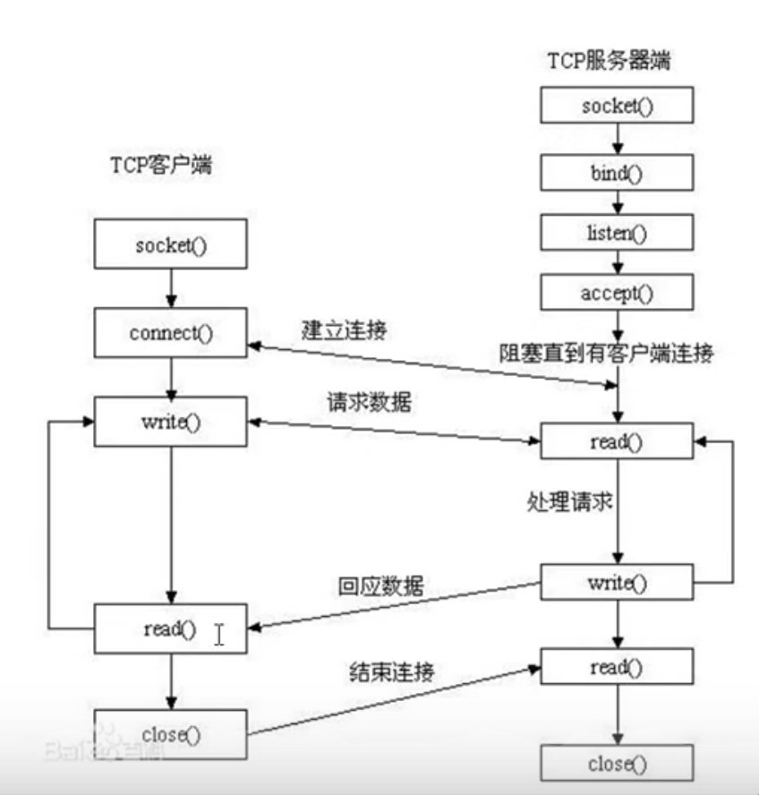

# VScode环境配置

1. 通过快捷键Ctrl+Shift+P打开搜索栏，搜索Edit configuration，打开“c_cpp_properties.json”文件

   ```c++
   {
       "configurations": [
           {
               "name": "Linux",
               "includePath": [
                   "${workspaceFolder}/**"
               ],
               "defines": [],
               "compilerPath": "/usr/bin/gcc",
               "cStandard": "gnu17",
               "cppStandard": "gnu++17",
               "intelliSenseMode": "linux-gcc-x64"
           }
       ],
       "version": 4
   }
   ```

2. 打开命令面板（Ctrl + Shift + P)， 搜索Configure Tasks命令，单击从模板创建tasks.json文件，您将看到任务运行模板列表,选择Others, 然后修改内容

   ```c++
   {
       "version": "2.0.0",
       "tasks": [
           {
               "label": "build",
               "type": "shell",
               "command": "g++",
               "args": [
                   "-g",
                   "main.cpp"
               ],
               "group": "build"
           },
           {
               "type": "cppbuild",
               "label": "C/C++: gcc 生成活动文件",
               "command": "/usr/bin/g++",
               "args": [
                   "-fdiagnostics-color=always",
                   "-g",
                   "${workspaceFolder}/*.cpp",
                   "-o",
                   "${fileDirname}/${fileBasenameNoExtension}"
               ],
               "options": {
                   "cwd": "${fileDirname}"
               },
               "problemMatcher": [
                   "$gcc"
               ],
               "group": {
                   "kind": "build",
                   "isDefault": true
               },
               "detail": "调试器生成的任务。"
           }
       ]
   }
   ```

**错误处理：**

出现

# 网络基础

##分层模型结构

分层模型结构：

OSI七层模型：物、数、网、传、会、表、应

TCP/IP模型：网络接口层、网络层、传输层、应用层

应用层：http、ftp、nfs、ssh、telnet

传输层：TCP、UDP、

网络层：IP、ICMP、IGMP

链路层：以太网帧协议、ARP

## 协议

### 以太帧协议

ARP协议：根据IP地址获取MAC地址

### IP协议

TTL：time to live。跳数

源IP/目的IP：32位，4字节

### TCP协议

源/目的端口号：16位

序号：32位

确认号：32位

标志位：6位

窗口大小：16位

## 网络套接字

socket：在通信过程中，socket是成对出现的

一个文件描述符指向一个套接字，该套接字内部由内核借助两个缓冲区实现。


## 半关闭

双方通信中，只有一端关闭通信。 FIN-WAIT2状态（主动关闭端）<---->CLOSE-WAIT状态（被动关闭端）

# Socket编程

## 网络字节序

小端法：高位高地址，低位低地址。

大端法：高位存低地址，低位存在高地址（**网络数据流采用大端字节序**）例如0x1234，高位12存在0号地址，低位34存在一号地址

##sock模型创建流程




##网络编程函数

### 网络套接字函数

**网络字节序**

```c
 #include <arpa/inet.h>
//h表示host，n表示network
uint32_t htonl(uint32_t hostlong);//针对IPv4   本地->网络

uint16_t htons(uint16_t hostshort);//针对端口port

uint32_t ntohl(uint32_t netlong);//本地IPv4

uint16_t ntohs(uint16_t netshort);//针对端口port
```


```c
int inet_pton(int af, const char *src, void *dst);//将IP字符串转化为网络字节序
af:AF_INET、AF_INET6
src：传入参数
dst：传出，转换后的网络字节序IP地址    

const char *inet_ntop(int af, const void *src,char *dst, socklen_t size); //将网络字节序转化为IP字符串
```

sockaddr数据结构

现在sockaddr退化成了(void*)的作用，最后强转成sockaddr_in还是sockaddr_in6，由地址族确定。

可参看`man 7 ip`


`#include<sys/socket.h>`

`int socket(int domain, int type, int protocol)`   创建一个套接字

domain：AF_INET、AF_INET6、AF_UNIX

type：SOCK_STREAM（代表TCP）、SOCK_DGRAM（代表UDP）

protocol：0   根据前面的协议选择

返回值：成功：新套接字对应的文件描述符

​				失败：-1，errno

`#include<arpa/inet.h>`

`int bind(int sockfd, const struct sockaddr *addr,socklen_t addrlen);` 给socket绑定一个地址结构（IP+port）

struct socket_in addr;

addr.sin_family = AF_INET;

addr.sin_port = htol(8888);

addr.sin_addr.s_addr = htol(INADDR_ANY);      //INADDR_ANY取出系统中有效的任意IP地址。二进制类型

addr： (struct sockaddr*)&addr

addrlen：sizeof（addr）  地址结构的大小

返回值：成功：0

​				失败：-1，errno

`int listen(int sockfd, int backlog)`   设置同时与服务器连接的上限数（同时进行三次握手的客户端数量）

backlog：上限数值，最大为128

`int accept(int sockfd, struct sockaddr *addr, socklen_t *addrlen)`  

阻塞等待客户端建立连接，成功后返回一个与客户端成功连接的socket文件描述符

addr：传出参数。成功与服务端建立连接的那个客户端的地址结构

addrlen：传入传出。传入addr的大小，传出客户端addr的实际大小

返回值：成功：能与服务器进行通信的socket对应的文件描述符

​				失败：-1，errno

` int connect(int sockfd, const struct sockaddr *addr,socklen_t addrlen)`   与服务器建立连接

addr：传入参数，服务器的地址结构

返回值：成功：0

​				失败：-1，errno

如果不使用bind绑定客户端地址结构，会采用**隐式绑定**

`read函数返回值`

\>0：实际读到的字节数

=0：已经读到结尾（对端已经关闭）

-1：应该进一步判断errno的值

​	errno = EAGAIN or EWOULDBLOCK，设置了阻塞方式读，数据没有到达

​	errno = EINTR 慢速系统调用被终端

​	errno = “其他情况” 异常


`netstat -apn`  查看网络编程中进程所处的状态。通常结合管道查询指定端口`| grep 8000`


### 端口复用函数

当服务端主动关闭时，会在TIME-WAIT状态持续2MSL(Maximum Segment Lifetime)的时间，来等待对端的ack，此时的端口依然被占用，无法重启服务器（因为端口被占用，无法bind）

`int setsockopt(int sockfd, int level, int optname, const void *optval, socklen_t optlen);`

```c
//一般在地址绑定前设置端口复用
int opt=1;//设置端口复用
int ret = setsockopt(sockfd,SOL_SOCKET,SO_REUSEADDR,(void*)&opt,sizeof(opt));
```

### 半关闭函数

一个套件字有读缓冲区和写缓冲区，通过下面的函数可以控制缓冲区的关闭，一般来说都直接用`close()`来关闭

**`shutdown()`和`close()`的区别：**

如果用多个进程共享一个文件描述符，`shutdown()`不考虑文件描述符的引用计数，直接关闭文件描述符，但是`close()`每一次调用，引用计数会减1，最后减到0后，文件描述符才会被释放。

`int shutdown(int sockfd, int how);`

how：SHUT_RD关读端	SHUT_WR关写端	SHUT_RDWR关读写端

### 多路IO转接

`int select(int nfds, fd_set *readfds, fd_set *writefds, fd_set *exceptfds, struct timeval *timeout);`

参数：

nfds：表示在所有需要监听的文件符中，最大的文件描述符再加1。

fd_set：传入传出参数。传入时是要监听的，传出时实际有事件发生的。读、写、异常的套接字集合，本质上是个位图。

timeout：定时阻塞监控时间。传NULL：永远等下去。传timeval：等待固定时间。传timeval都设置为0：检查描述字后立即返回，轮询

返回值：

返回所有文件描述符集合中，发生读写或异常事件的总个数。

```c
//操作fd_set的函数
void FD_CLR(int fd, fd_set *set);//将某一个文件描述符清除，一般在客户端关闭后移除。
int  FD_ISSET(int fd, fd_set *set);//判断文件描述符是否在集合中
void FD_SET(int fd, fd_set *set);//添加
void FD_ZERO(fd_set *set);//置0
```


##客户端/服务端Demo

```c
#include<stdio.h>
#include<string.h>
#include<stdlib.h>
#include<sys/socket.h>
#include<netinet/ip.h>
#include<unistd.h>
#include<arpa/inet.h>
/*客户端发送字符串给服务端*/
void sys_err(const char* str){
    perror(str);
    exit(1);
}
int main(){
    //创建socket
    int clientfd=socket(AF_INET,SOCK_STREAM,0);
    //发起与服务端的连接
    struct sockaddr_in server_addr;
    server_addr.sin_family=AF_INET;
    server_addr.sin_port=htons(6666);
    char* ipv4="0.0.0.0";
    inet_pton(AF_INET,ipv4,&server_addr.sin_addr.s_addr);
    int ret=connect(clientfd,(struct sockaddr*)&server_addr,sizeof(server_addr));
    if(ret==-1)
        sys_err("client connect error");
    int cnt=5;
    char buf[1024];
    char* str="hello";
    while(cnt--){
        printf("---rount-%d-----\n",cnt);
        //向服务端发送数据
        write(clientfd,str,strlen(str));
        //读取服务端发送来的数据
        sleep(1);
        int size=read(clientfd,buf,sizeof(buf));
    //  write(STDOUT_FILENO,buf,size);
        //主动加上字符串结尾\0，否则printf打印字符串会出现异常，因为搜索不到字符串结尾
        buf[size]='\0';
        printf("client receive %s from server! size:%d\n",buf,size);
    }
    //关闭服务端连接
    close(clientfd);
    return 0;
}
```

```c
#include<stdio.h>
#include<stdlib.h>
#include<sys/socket.h>
#include<ctype.h>
#include<unistd.h>
#include<netinet/ip.h>
#include<arpa/inet.h>
/*服务端将字符串转为大写并发送给客户端*/
void sys_err(const char* str){
    perror(str);
    exit(1);
}
int main(){
    //创建socket
    int sockfd = socket(AF_INET,SOCK_STREAM,0);
    //绑定ip+port
    struct sockaddr_in addr;
    addr.sin_family = AF_INET;
    addr.sin_port = htons(6666);
    addr.sin_addr.s_addr=htonl(INADDR_ANY);
    int ret=bind(sockfd,(struct sockaddr*)&addr,sizeof(addr));
    if(ret==-1)
        sys_err("server bind error");
    //打印服务器地址和端口号
    char serve_IP[1024];
    printf("server IP:%s,port:%d\n",
            inet_ntop(AF_INET,&addr.sin_addr.s_addr,serve_IP,sizeof(serve_IP)),
            ntohs(addr.sin_port));
    //设置服务器监听上限
    ret=listen(sockfd,20);
    if(ret==-1)
        sys_err("server listen error");
    //监听客户端连接
    struct sockaddr_in client_addr;
    socklen_t client_addr_len=sizeof(client_addr);
    int serverfd=accept(sockfd,(struct sockaddr*)&client_addr,&client_addr_len);
    if(serverfd==-1)
        sys_err("server accept error");
    //打印客户端ip地址和端口号
    char client_IP[1024];
    printf("client IP:%s,port:%d\n",
            inet_ntop(AF_INET,&client_addr.sin_addr.s_addr,client_IP,sizeof(client_IP)),
                ntohs(client_addr.sin_port));
    int cnt=5;
    char buf[1024];
    while(cnt--){
        //读取客户端内容
        sleep(1);
        int size=read(serverfd,buf,sizeof(buf));
        printf("size = %d\n",size);
        printf("------round%d-----\n",cnt);
        //主动加上字符串结尾\0，否则printf打印字符串会出现异常，因为搜索不到字符串结尾
        buf[size]='\0';
        printf("server receive \"%s\" from client\n",buf);
        //将小写转为大写
        for(int i=0;i<size;i++){
            buf[i]=toupper(buf[i]);
        }
        //发送回客户端
        write(serverfd,buf,size);
        printf("server send \"%s\" to client\n",buf);
    }
    //关闭连接
    close(serverfd);
    close(sockfd);
    return 0;
}
```

##错误处理函数封装

将系统调用+错误处理都封装到自定义的函数中，让代码逻辑性更强。

```c
#ifndef _WRAP_H_
#define _WRAP_H_
#include<stdio.h>
#include<stdlib.h>
#include<sys/socket.h>
#include<ctype.h>
#include<unistd.h>
#include<netinet/ip.h>
#include<arpa/inet.h>

void sys_err(char* str);
int Socket(int domain, int type, int protocol);
int Bind(int sockfd, const struct sockaddr *addr,socklen_t addrlen);
int Listen(int sockfd, int backlog);
int Accept(int sockfd, struct sockaddr *addr, socklen_t *addrlen);

#endif

```

```c
#include "wrap.h"

void sys_err(char* str){

    perror(str);
    exit(1);
}

int Socket(int domain, int type, int protocol){
    int sockfd=socket(domain,type,protocol);
    if(sockfd==-1){
        sys_err("socket error");
        return -1;
    }
    return sockfd;
}
int Bind(int sockfd, const struct sockaddr *addr,socklen_t addrlen){

    int ret=bind(sockfd,addr,addrlen);
    if(ret==-1){
        perror("bind error");
        return -1; 
    }   
    return 0;

}
```

#高性能服务器


## 多进程并发服务器

```c
#include "wrap.h"
#include<sys/wait.h>
/*多进程并发服务器*/
//父进程监听请求
//子进程建立连接
void wait_child(int signo){
    //注册信号回收子进程
    pid_t pid;
    int status;
    while((pid=wait(&status))!=-1){
        printf("the child process %d is recycled\n",pid);
        if(WIFEXITED(status)){
            printf("the child process exit normally\n");
        }else if(WIFSIGNALED(status)){
            printf("the child process is terminated by signal %d\n",WTERMSIG(status));
        }   
    }   
    
}
int main(){
    //创建监听socket
    int lfd=Socket(AF_INET,SOCK_STREAM,0);
    //绑定ip+port
    struct sockaddr_in addr;
    addr.sin_family=AF_INET;
    addr.sin_port=htons(6666);
    addr.sin_addr.s_addr=htonl(INADDR_ANY);
    Bind(lfd,(struct sockaddr*)&addr,sizeof(addr));
    //设置连接上限
    Listen(lfd,10);
    //注册信号用来回收子进程
    struct sigaction act;
    act.sa_handler=wait_child;
    sigemptyset(&act.sa_mask);
    act.sa_flags=0;
    sigaction(SIGCHLD,&act,NULL);
    while(1){
        struct sockaddr_in client_addr;
        socklen_t client_addr_len=sizeof(client_addr);
        //监听请求
        int serverfd=Accept(lfd,(struct sockaddr*)&client_addr,&client_addr_len);
        //创建子进程
        pid_t pid=fork();
        if(pid<0){
            perror("fork error");
            exit(1);
        }else if(pid==0){
            //子进程不需要用lfd，所以需要关闭	
            close(lfd);
            //读取客户端
            char client_IP[1024];
            printf("client initiates connection--ip:%s,port:%d\n",
                    inet_ntop(AF_INET,(void*)&client_addr.sin_addr.s_addr,client_IP,sizeof(client_IP)),
                    ntohs(client_addr.sin_port));
            char buf[1024];
            while(1){
                int size=read(serverfd,buf,sizeof(buf));
                buf[size]='\0';
                //转大写
                for(int i=0;i<size;i++){
                    buf[i]=toupper(buf[i]);
                }
                //发送回客户端
                write(serverfd,buf,size);
            }
            close(serverfd);
        }
    }
    close(lfd);
    return 0;
}
```

##多线程并发服务器

**Bug1：**

将socket文件描述符传入子线程时，`ret=pthread_create(&tid,&attr,pthread_func,(void*)(long)cfd);`上述这种方式将cfd作为参数传入子线程时，出现当多个客户端同时在对服务器进行读写操作时，此时向其中一个客户端进程发送信号终止，会导致所有客户端进程同时结束，服务端进程也因出现**段错误**被结束。

但是利用`ret=pthread_create(&tid,&attr,pthread_func,(void*)&s_in);`将socket文件描述符通过一个结构体指针的方式传入，就不会造成上述的错误。

**解决方式：**

还未解决！！

```c
#include "wrap.h"
#include<pthread.h>
#include<string.h>
/*多线程并发服务器*/
//主线程监听客户端连接
//子线程执行连接通信

//线程错误提示
void sys_perr(char* str,int num){
    fprintf(stderr,"%s error:%s\n",str,strerror(num));
    exit(1);
}
struct s_info{
    struct sockaddr_in client_addr;
    int cfd;
};
void* pthread_func(void* arg){

    struct s_info* s_in=(struct s_info*)arg;
    struct sockaddr_in addr=s_in->client_addr;
    int cfd=s_in->cfd;
   // int cfd=(long)arg;
    //读取数据
    char buf[1024];
    while(1){
        int size=read(cfd,buf,sizeof(buf));
        if(size==0){
            printf("the client %lu is closing....\n",pthread_self());
            break;
        }   
        buf[size]='\0';
        printf("server receive \"%s\" from client\n",buf);
        //转大写
        for(int i=0;i<size;i++){
            buf[i]=toupper(buf[i]);
        }
        //发送回客户端
        write(cfd,buf,size);
    }
    close(cfd);
    pthread_exit(0);
}
int main(){

    //创建socket
    int lfd=Socket(AF_INET,SOCK_STREAM,0);
    //绑定ip+port
    struct sockaddr_in addr;
    addr.sin_family=AF_INET;
    addr.sin_port=htons(6666);
    addr.sin_addr.s_addr=htonl(INADDR_ANY);
    Bind(lfd,(struct sockaddr*)&addr,sizeof(addr));
    //设置并发最大数量
    Listen(lfd,128);
    int cfd;
    struct sockaddr_in client_addr;
    socklen_t client_addr_len=sizeof(client_addr);
    while(1){

        //监听客户端连接
        cfd=Accept(lfd,(struct sockaddr*)&client_addr,&client_addr_len);
        //打印客户端ip和port
        char clientIP[1024];
        printf("the client has been connected--ip:%s port:%d\n",
                inet_ntop(AF_INET,(void*)&client_addr.sin_addr.s_addr,clientIP,sizeof(clientIP)),
                ntohs(addr.sin_port));
        //创建线程
        pthread_t tid;
        struct s_info s_in;//传入子线程的参数
        s_in.client_addr=client_addr;
        s_in.cfd=cfd;
        //设置线程为分离属性
        pthread_attr_t attr;
        int ret=pthread_attr_init(&attr);//初始化线程属性
        if(ret!=0)
            sys_perr("pthread_attr_init error",ret);
        ret=pthread_attr_setdetachstate(&attr,PTHREAD_CREATE_DETACHED);//设置分离属性
        if(ret!=0)
            sys_perr("pthread_attr_setdetachstate error",ret);
    	ret=pthread_create(&tid,&attr,pthread_func,(void*)&s_in);//创建线程
        //ret=pthread_create(&tid,&attr,pthread_func,(void*)(long)cfd);//创建线程
        if(ret!=0)
            sys_perr("pthread_attr_create error",ret);
        ret=pthread_attr_destroy(&attr);//销毁线程属性
        if(ret!=0)
            sys_perr("pthread_attr_destroy error",ret);

    }
    return 0;
```


##多路IO转接服务器

### 多路IO转接

不再由应用程序自己监听客户端的连接请求，取而代之由内核替应用程序监听，并报告应用程序，然后应用程序执行相应的动作。这样就将服务端进程解放了出来，不需要阻塞等待客户端的请求（**响应模式**）。

 